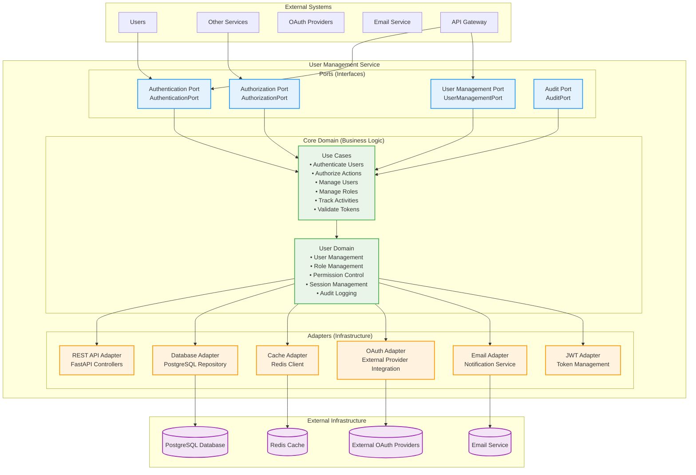
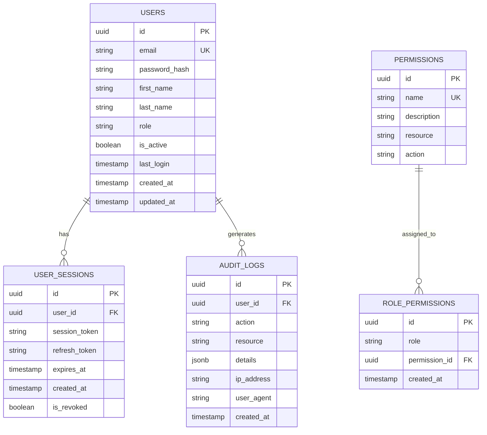

# User Management Service (UMS) - Detailed Architecture Design

**Document Version:** 1.1
**Date:** August 19, 2025
**Service:** User Management Service (UMS)
**Technology Stack:** Python + FastAPI + PostgreSQL + Redis + OAuth 2.0/OIDC
**Design Principles:** SOLID Principles + Hexagonal Architecture (Security-Focused)

---

## Table of Contents

1. [Service Overview](#service-overview)
2. [SOLID Principles for Authentication and Authorization](#solid-principles-for-authentication-and-authorization)
3. [Hexagonal Architecture Design](#hexagonal-architecture-design)
4. [API Specifications](#api-specifications)
5. [Database Schema Design](#database-schema-design)
6. [Integration Points](#integration-points)
7. [Error Handling Strategy](#error-handling-strategy)
8. [Technology Implementation](#technology-implementation)
9. [User Stories](#user-stories)

---

## 2. Test-Driven Development for Authentication and Authorization

### 2.1 TDD for Authentication Components

**Testing User Authentication:**
```python
class TestUserAuthentication:
    async def test_authenticates_valid_user_credentials(self):
        # Red: Define authentication behavior
        auth_service = UserAuthenticationService(mock_user_repository, mock_password_hasher)
        credentials = UserCredentials(username="testuser", password="validpassword")

        auth_result = await auth_service.authenticate(credentials)

        assert auth_result.is_authenticated is True
        assert auth_result.user_id is not None
        assert auth_result.access_token is not None
        assert auth_result.token_expires_at > datetime.now()

    async def test_rejects_invalid_credentials(self):
        # Red: Define authentication failure behavior
        auth_service = UserAuthenticationService(mock_user_repository, mock_password_hasher)
        credentials = UserCredentials(username="testuser", password="wrongpassword")

        auth_result = await auth_service.authenticate(credentials)

        assert auth_result.is_authenticated is False
        assert auth_result.user_id is None
        assert auth_result.access_token is None
```

### 2.2 TDD for Authorization Components

**Testing Role-Based Access Control:**
```python
class TestRoleBasedAuthorization:
    def test_authorizes_user_with_required_permission(self):
        # Red: Define authorization behavior
        authorizer = RoleBasedAuthorizer(mock_role_repository)
        user = User(id="user123", roles=["qa_personnel"])
        required_permission = Permission.SUBMIT_ERROR_REPORT

        is_authorized = authorizer.has_permission(user, required_permission)

        assert is_authorized is True

    def test_denies_user_without_required_permission(self):
        # Red: Define authorization denial behavior
        authorizer = RoleBasedAuthorizer(mock_role_repository)
        user = User(id="user123", roles=["viewer"])
        required_permission = Permission.DELETE_ERROR_REPORT

        is_authorized = authorizer.has_permission(user, required_permission)

        assert is_authorized is False
```

### 2.3 TDD for Security Components

**Testing JWT Token Management:**
```python
class TestJWTTokenManager:
    def test_generates_valid_jwt_token(self):
        # Red: Define token generation behavior
        token_manager = JWTTokenManager(secret_key="test_secret")
        user_claims = {"user_id": "123", "username": "testuser", "roles": ["qa_personnel"]}

        token = token_manager.generate_token(user_claims, expires_in=3600)

        assert token is not None
        assert isinstance(token, str)
        assert len(token) > 0

    def test_validates_authentic_jwt_token(self):
        # Red: Define token validation behavior
        token_manager = JWTTokenManager(secret_key="test_secret")
        user_claims = {"user_id": "123", "username": "testuser"}
        token = token_manager.generate_token(user_claims, expires_in=3600)

        validation_result = token_manager.validate_token(token)

        assert validation_result.is_valid is True
        assert validation_result.claims["user_id"] == "123"
        assert validation_result.claims["username"] == "testuser"
```

---

## 3. Service Overview

### 1.1 Service Responsibilities

The User Management Service (UMS) is the authentication and authorization foundation of the ASR Error Reporting System. It handles:

- **Authentication**: User login, logout, and session management
- **Authorization**: Role-based access control and permission management
- **User Management**: User lifecycle, profile management, and preferences
- **Role Management**: Define and manage user roles and permissions
- **Session Management**: JWT token generation, validation, and refresh
- **Audit Logging**: Track user activities and access patterns
- **Multi-tenant Support**: Support for multiple organizations and teams

### 1.2 Service Boundaries

**Inputs:**
- Authentication requests (login, logout, token refresh)
- User management requests (create, update, delete users)
- Authorization requests (permission checks, role assignments)
- Audit log queries and reports

**Outputs:**
- JWT tokens and authentication responses
- User profile and preference data
- Authorization decisions and permission lists
- Audit logs and security reports

**Dependencies:**
- PostgreSQL database (user data and audit logs)
- Redis cache (session management and performance)
- External OAuth providers (optional SSO integration)
- Email service (notifications and password reset)

### 1.3 Core Capabilities

- OAuth 2.0/OIDC compliant authentication
- Fine-grained role-based access control (RBAC)
- Multi-factor authentication (MFA) support
- Session management with automatic expiration
- Comprehensive audit logging and monitoring
- Self-service user management features
- Integration with external identity providers

### 1.4 Performance Requirements

- **Authentication**: < 500ms for login/logout operations
- **Authorization**: < 100ms for permission checks
- **Token Validation**: < 50ms for JWT validation
- **User Queries**: < 200ms for user data retrieval
- **Availability**: 99.9% uptime for authentication services
- **Scalability**: Support 1000+ concurrent users

---

## 2. Hexagonal Architecture Design

### 2.1 Architecture Overview



---

## 3. API Specifications

### 3.1 Authentication Endpoints

```python
from fastapi import APIRouter, Depends, HTTPException, status
from typing import Annotated

router = APIRouter(prefix="/api/v1", tags=["user-management"])

# POST /api/v1/auth/login
@router.post("/auth/login", response_model=AuthenticationResponse)
async def login(
    credentials: LoginRequest
) -> AuthenticationResponse:
    """Authenticate user and return JWT tokens"""

# POST /api/v1/auth/logout
@router.post("/auth/logout", status_code=204)
async def logout(
    token: str = Depends(get_current_token)
) -> None:
    """Logout user and invalidate token"""

# POST /api/v1/auth/refresh
@router.post("/auth/refresh", response_model=TokenResponse)
async def refresh_token(
    refresh_request: RefreshTokenRequest
) -> TokenResponse:
    """Refresh access token using refresh token"""

# POST /api/v1/auth/validate
@router.post("/auth/validate", response_model=TokenValidationResponse)
async def validate_token(
    token: str = Depends(get_bearer_token)
) -> TokenValidationResponse:
    """Validate JWT token and return user info"""
```

### 3.2 User Management Endpoints

```python
# GET /api/v1/users/me
@router.get("/users/me", response_model=UserResponse)
async def get_current_user(
    current_user: User = Depends(get_current_user)
) -> UserResponse:
    """Get current user profile"""

# PUT /api/v1/users/me
@router.put("/users/me", response_model=UserResponse)
async def update_current_user(
    updates: UserUpdateRequest,
    current_user: User = Depends(get_current_user)
) -> UserResponse:
    """Update current user profile"""

# GET /api/v1/users
@router.get("/users", response_model=PaginatedUsers)
async def list_users(
    filters: UserFilters = Depends(),
    pagination: PaginationParams = Depends(),
    current_user: User = Depends(require_admin)
) -> PaginatedUsers:
    """List users (admin only)"""

# POST /api/v1/users
@router.post("/users", response_model=UserResponse)
async def create_user(
    user_data: CreateUserRequest,
    current_user: User = Depends(require_admin)
) -> UserResponse:
    """Create new user (admin only)"""
```

### 3.3 Data Models

```python
from pydantic import BaseModel, Field, EmailStr
from typing import List, Optional
from enum import Enum
from datetime import datetime

class UserRole(str, Enum):
    ADMIN = "admin"
    QA_SUPERVISOR = "qa_supervisor"
    QA_PERSONNEL = "qa_personnel"
    MTS_PERSONNEL = "mts_personnel"
    VIEWER = "viewer"

class LoginRequest(BaseModel):
    email: EmailStr
    password: str = Field(..., min_length=8)
    remember_me: bool = False

class AuthenticationResponse(BaseModel):
    access_token: str
    refresh_token: str
    token_type: str = "bearer"
    expires_in: int
    user: "UserResponse"

class UserResponse(BaseModel):
    id: str
    email: EmailStr
    first_name: str
    last_name: str
    role: UserRole
    is_active: bool
    last_login: Optional[datetime]
    created_at: datetime
    updated_at: datetime

class CreateUserRequest(BaseModel):
    email: EmailStr
    first_name: str = Field(..., min_length=1, max_length=100)
    last_name: str = Field(..., min_length=1, max_length=100)
    role: UserRole
    password: str = Field(..., min_length=8)
    send_welcome_email: bool = True
```

---

## 4. Database Schema Design

### 4.1 Entity Relationship Diagram



### 4.2 Table Definitions

```sql
CREATE TABLE users (
    id UUID PRIMARY KEY DEFAULT gen_random_uuid(),
    email VARCHAR(255) UNIQUE NOT NULL,
    password_hash VARCHAR(255) NOT NULL,
    first_name VARCHAR(100) NOT NULL,
    last_name VARCHAR(100) NOT NULL,
    role VARCHAR(50) NOT NULL CHECK (role IN ('admin', 'qa_supervisor', 'qa_personnel', 'mts_personnel', 'viewer')),
    is_active BOOLEAN DEFAULT true,
    last_login TIMESTAMP WITH TIME ZONE,
    created_at TIMESTAMP WITH TIME ZONE DEFAULT NOW(),
    updated_at TIMESTAMP WITH TIME ZONE DEFAULT NOW()
);

CREATE INDEX idx_users_email ON users(email);
CREATE INDEX idx_users_role ON users(role);
CREATE INDEX idx_users_is_active ON users(is_active);
```

---

## 5. User Stories

### 5.1 Epic: Authentication and Authorization

#### 5.1.1 User Story: User Login
**As a** system user  
**I want to** log in with my credentials  
**So that** I can access the ASR error reporting system  

**Acceptance Criteria:**
- [ ] I can log in with email and password
- [ ] I receive a JWT token upon successful authentication
- [ ] Invalid credentials show appropriate error messages
- [ ] My login activity is logged for security
- [ ] I can choose to stay logged in (remember me)
- [ ] Login completes within 500ms

**Story Points:** 5

#### 5.1.2 User Story: Role-based Access Control
**As a** system administrator  
**I want to** control user access based on roles  
**So that** users only see features appropriate to their role  

**Acceptance Criteria:**
- [ ] QA personnel can submit and view error reports
- [ ] MTS personnel can verify corrections
- [ ] Supervisors can view analytics and manage teams
- [ ] Admins can manage users and system configuration
- [ ] Unauthorized access attempts are blocked and logged
- [ ] Permission checks complete within 100ms

**Story Points:** 8

### 5.2 Story Point Summary

| Epic | Stories | Total Story Points |
|------|---------|-------------------|
| Authentication and Authorization | 2 stories | 13 points |
| **Total** | **2 stories** | **13 points** |

**Estimated Development Time:** 4-6 weeks for 3-4 developers

---

**Document Status:** ✅ Complete  
**Next Steps:** Begin implementation with authentication and user management  
**Dependencies:** None (foundational service)  
**Integration Points:** All other services depend on UMS for authentication
