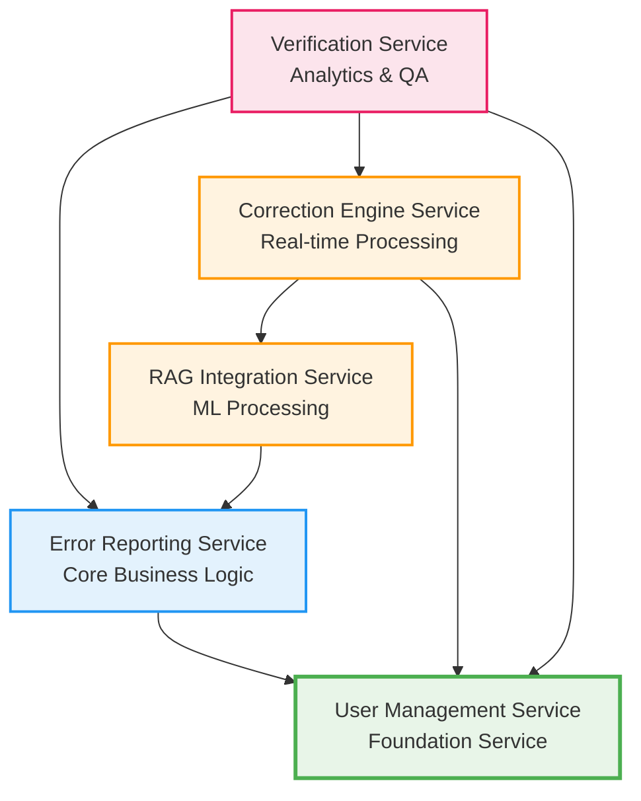

# Development Sequencing Plan and Integration Strategy

**Document Version:** 1.1
**Date:** August 19, 2025
**Purpose:** Define service dependencies, development order, and TDD-driven integration strategies
**Development Methodology:** Test-Driven Development (TDD) mandatory for all phases

---

## Table of Contents

1. [Service Dependency Analysis](#service-dependency-analysis)
2. [TDD-Driven Development Sequencing Plan](#tdd-driven-development-sequencing-plan)
3. [TDD Phase Structure](#tdd-phase-structure)
4. [Parallel Development Strategy](#parallel-development-strategy)
5. [TDD Integration Testing Strategy](#tdd-integration-testing-strategy)
6. [Definition of Done Criteria](#definition-of-done-criteria)
7. [Code Review Process](#code-review-process)
8. [Deployment Coordination](#deployment-coordination)
9. [Risk Mitigation](#risk-mitigation)

---

## 1. Service Dependency Analysis

### 1.1 Dependency Graph

### 1.2 Dependency Matrix

| Service | Depends On | Provides To | Critical Path |
|---------|------------|-------------|---------------|
| **UMS** | None | All Services | ✅ Foundation |
| **ERS** | UMS | RIS, VS | ✅ Core |
| **RIS** | ERS | CES | ✅ ML Pipeline |
| **CES** | UMS, RIS | VS | ✅ Real-time |
| **VS** | UMS, ERS, CES | None | Analytics |

### 1.3 Interface Dependencies

#### 1.3.1 Authentication Dependencies
- **All Services** → **UMS**: JWT token validation, user permissions
- **Critical**: UMS must be deployed first for any service to function

#### 1.3.2 Event Dependencies
- **ERS** → **RIS**: Error reported events trigger embedding generation
- **RIS** → **CES**: Pattern updated events trigger correction updates
- **CES** → **VS**: Correction applied events trigger verification workflows

#### 1.3.3 Data Dependencies
- **CES** → **RIS**: Similarity search for pattern matching
- **VS** → **ERS**: Error data for analytics
- **VS** → **CES**: Correction data for quality assessment

---

## 2. TDD-Driven Development Sequencing Plan

### 2.1 Phase 1: Foundation (Weeks 1-6) - TDD Approach
**Objective**: Establish authentication and core error management using Test-Driven Development

#### Week 1-2: User Management Service (UMS) - TDD Implementation
**Priority**: Critical Path
**Team**: Platform Team (3-4 developers)

**TDD Deliverables**:
- [ ] **Test Design Phase (Week 1, Days 1-2)**:
  - Write failing tests for authentication endpoints
  - Write failing tests for user management APIs
  - Write failing tests for role-based access control
  - Write failing tests for JWT token operations
- [ ] **Implementation Phase (Week 1, Days 3-5)**:
  - Implement minimal code to pass authentication tests
  - Implement minimal code to pass user management tests
  - Implement minimal code to pass RBAC tests
- [ ] **Refactor Phase (Week 2, Days 1-2)**:
  - Refactor authentication code for performance and maintainability
  - Optimize database operations while keeping tests green
- [ ] **Integration Test Phase (Week 2, Days 3-5)**:
  - Write and implement integration tests for database operations
  - Write and implement integration tests for external dependencies

**TDD Success Criteria**:
- All tests written before implementation (Red-Green-Refactor cycle followed)
- Test coverage ≥ 70% unit, ≥ 20% integration, ≥ 10% E2E
- All authentication endpoints functional with comprehensive test coverage
- Token validation working for other services with contract tests
- Admin can create and manage users with full workflow testing
- 99.9% uptime for authentication validated through load testing

#### Week 3-4: Error Reporting Service (ERS) - TDD Implementation
**Priority**: Critical Path
**Team**: Error Processing Team (3-4 developers)

**TDD Deliverables**:
- [ ] **Test Design Phase (Week 3, Days 1-2)**:
  - Write failing tests for error submission and validation
  - Write failing tests for CRUD operations
  - Write failing tests for event publishing
  - Write failing tests for search and filtering
- [ ] **Implementation Phase (Week 3, Days 3-5)**:
  - Implement minimal code to pass error submission tests
  - Implement minimal code to pass CRUD operation tests
  - Implement minimal code to pass event publishing tests
- [ ] **Refactor Phase (Week 4, Days 1-2)**:
  - Refactor error processing code for SOLID compliance
  - Optimize validation logic while keeping tests green
- [ ] **Integration Test Phase (Week 4, Days 3-5)**:
  - Write and implement integration tests with UMS
  - Write and implement integration tests with Kafka
  - Write and implement database integration tests

**TDD Success Criteria**:
- All tests written before implementation (Red-Green-Refactor cycle followed)
- Test coverage ≥ 70% unit, ≥ 20% integration, ≥ 10% E2E
- QA personnel can submit error reports with comprehensive workflow testing
- Error events are published reliably with event contract testing
- Search and filtering work correctly with edge case testing
- Sub-second error report validation verified through performance tests

### 2.2 Phase 2: Core Processing (Weeks 5-8)
**Objective**: Implement ML processing and pattern recognition

#### Week 5-6: RAG Integration Service (RIS) - Core
**Priority**: Critical Path
**Team**: Vector Processing Team (4-5 developers)
**Deliverables**:
- [ ] Embedding generation service
- [ ] Vector database integration
- [ ] Event consumer for error events
- [ ] Basic similarity search
- [ ] Caching layer with Redis
- [ ] ML model integration

**Success Criteria**:
- Error events trigger embedding generation
- Vector storage and retrieval working
- Sub-200ms similarity search
- Batch processing capabilities

#### Week 7-8: RAG Integration Service (RIS) - Advanced
**Team**: Vector Processing Team (4-5 developers)
**Deliverables**:
- [ ] Advanced pattern recognition
- [ ] Quality metrics calculation
- [ ] Performance optimization
- [ ] Pattern analysis APIs
- [ ] Comprehensive testing

**Success Criteria**:
- Pattern recognition accuracy > 90%
- Quality metrics calculation working
- Performance targets met

### 2.3 Phase 3: Real-time Processing (Weeks 9-12)
**Objective**: Implement real-time correction engine

#### Week 9-10: Correction Engine Service (CES) - Core
**Priority**: Critical Path
**Team**: Correction Engine Team (4-5 developers)
**Deliverables**:
- [ ] Pattern matching algorithms
- [ ] Confidence scoring system
- [ ] Basic correction application
- [ ] Integration with RIS for patterns
- [ ] WebSocket support for real-time

**Success Criteria**:
- Pattern matching working correctly
- Confidence scores calculated accurately
- Sub-5-second correction application
- Real-time WebSocket integration

#### Week 11-12: Correction Engine Service (CES) - Advanced
**Team**: Correction Engine Team (4-5 developers)
**Deliverables**:
- [ ] Advanced correction algorithms
- [ ] A/B testing framework
- [ ] Feedback processing
- [ ] Performance optimization
- [ ] Comprehensive testing

**Success Criteria**:
- 95%+ correction accuracy
- A/B testing framework operational
- Feedback loop working
- Performance targets met

### 2.4 Phase 4: Analytics and Verification (Weeks 13-16)
**Objective**: Complete the system with analytics and verification

#### Week 13-14: Verification Service (VS) - Core
**Team**: Verification Team (3-4 developers)
**Deliverables**:
- [ ] Verification workflow
- [ ] Quality assessment algorithms
- [ ] Basic analytics dashboard
- [ ] Event processing for corrections
- [ ] Database schema and repositories

**Success Criteria**:
- Verification workflow operational
- Quality assessments accurate
- Basic dashboard functional
- Real-time event processing

#### Week 15-16: Verification Service (VS) - Advanced
**Team**: Verification Team (3-4 developers)
**Deliverables**:
- [ ] Advanced analytics and reporting
- [ ] Export functionality
- [ ] InstaNote integration
- [ ] Performance optimization
- [ ] Comprehensive testing

**Success Criteria**:
- Advanced analytics working
- Export functionality complete
- External integrations operational
- Performance targets met

---

## 3. TDD Phase Structure

### 3.1 Standard TDD Workflow for Each Service

Every service development follows the same TDD phase structure:

**Phase A: Test Design (Days 1-2 of each week)**
- Write failing unit tests for core business logic
- Write failing integration tests for external dependencies
- Write failing contract tests for service interfaces
- Define test data and mock strategies
- Establish performance benchmarks through tests

**Phase B: Implementation (Days 3-5 of each week)**
- Implement minimal code to make unit tests pass (Green phase)
- Implement minimal code to make integration tests pass
- Focus on functionality over optimization
- Ensure all tests pass before proceeding

**Phase C: Refactor (Days 1-2 of following week)**
- Improve code design while keeping all tests green
- Apply SOLID principles and design patterns
- Optimize performance based on test benchmarks
- Enhance error handling and edge case coverage

**Phase D: Integration Testing (Days 3-5 of following week)**
- Write and implement cross-service integration tests
- Test service-to-service communication
- Validate event-driven workflows
- Perform end-to-end testing of complete user scenarios

### 3.2 TDD Quality Gates

Each phase has specific quality gates that must be met:

**Test Design Quality Gate:**
- [ ] All business requirements covered by tests
- [ ] Test scenarios include edge cases and error conditions
- [ ] Performance requirements defined as test assertions
- [ ] Mock strategies defined for external dependencies
- [ ] Test data generation strategies established

**Implementation Quality Gate:**
- [ ] All tests passing (Green phase achieved)
- [ ] Code coverage meets minimum requirements (70% unit, 20% integration)
- [ ] No production code without corresponding tests
- [ ] Basic functionality working as defined by tests

**Refactor Quality Gate:**
- [ ] All tests still passing after refactoring
- [ ] SOLID principles validated through test design
- [ ] Performance benchmarks met or exceeded
- [ ] Code quality metrics improved (complexity, maintainability)
- [ ] Documentation updated to reflect refactored design

**Integration Quality Gate:**
- [ ] Cross-service communication tested and working
- [ ] Event-driven workflows validated end-to-end
- [ ] Error handling tested across service boundaries
- [ ] Performance requirements met under realistic load
- [ ] Security requirements validated through tests

### 3.3 TDD Metrics and Monitoring

**Development Velocity Metrics:**
- Time spent in each TDD phase
- Test-to-code ratio (should be approximately 1:1 or higher)
- Defect density (bugs found post-implementation)
- Test coverage trends over time

**Quality Metrics:**
- Test pass rate (should be 100% before code merge)
- Code coverage by test type (unit/integration/E2E)
- Cyclomatic complexity trends
- Technical debt accumulation

**Team Productivity Metrics:**
- Red-Green-Refactor cycle time
- Time to implement features (from test design to completion)
- Code review feedback related to TDD compliance
- Rework required due to insufficient testing

---

## 4. Parallel Development Strategy

### 3.1 Interface-First Development

#### 3.1.1 API Contract Definition
**Week 1**: All teams collaborate to define:
- [ ] Complete OpenAPI specifications for all services
- [ ] Event schemas for Kafka topics
- [ ] Database schema contracts
- [ ] Error response formats
- [ ] Authentication/authorization interfaces

#### 3.1.2 Mock Services
**Week 2**: Each team creates:
- [ ] Mock implementations of their service APIs
- [ ] Stub responses for all endpoints
- [ ] Event simulators for testing
- [ ] Docker containers for local development

### 3.2 Parallel Development Tracks

#### Track A: Authentication & Core (Weeks 1-4)
- **UMS Team**: Full implementation
- **ERS Team**: Full implementation
- **Other Teams**: Integration testing with mocks

#### Track B: ML & Processing (Weeks 5-8)
- **RIS Team**: Full implementation
- **CES Team**: Core algorithm development
- **VS Team**: Analytics design and prototyping

#### Track C: Real-time & Analytics (Weeks 9-12)
- **CES Team**: Full implementation
- **VS Team**: Core implementation
- **All Teams**: Integration testing

#### Track D: Integration & Optimization (Weeks 13-16)
- **VS Team**: Advanced features
- **All Teams**: End-to-end integration
- **All Teams**: Performance optimization

### 3.3 Shared Development Resources

#### 3.3.1 Common Libraries
**Week 1**: Create shared libraries for:
- [ ] Authentication middleware
- [ ] Event schemas and serialization
- [ ] Database connection utilities
- [ ] Logging and monitoring
- [ ] Error handling patterns

#### 3.3.2 Development Infrastructure
**Week 1**: Set up shared:
- [ ] CI/CD pipelines
- [ ] Development environments
- [ ] Testing frameworks
- [ ] Code quality tools
- [ ] Documentation systems

---

## 6. Definition of Done Criteria

### 6.1 Feature-Level Definition of Done

Every feature must meet these TDD-specific criteria before being considered complete:

**Test Coverage Requirements:**
- [ ] Unit test coverage ≥ 70% for business logic
- [ ] Integration test coverage ≥ 20% for external dependencies
- [ ] End-to-end test coverage ≥ 10% for user workflows
- [ ] All edge cases and error conditions tested
- [ ] Performance requirements validated through automated tests

**TDD Process Compliance:**
- [ ] Evidence of Red-Green-Refactor cycle in commit history
- [ ] All tests written before corresponding implementation
- [ ] No production code exists without corresponding tests
- [ ] Refactoring completed while maintaining test coverage
- [ ] Test quality meets established standards

**Code Quality Requirements:**
- [ ] SOLID principles validated through test design
- [ ] Dependency injection used for testability
- [ ] Appropriate use of mocks for external dependencies
- [ ] Code complexity within acceptable limits
- [ ] Documentation updated to reflect current implementation

**Integration Requirements:**
- [ ] Service contracts tested and validated
- [ ] Event schemas tested for backward compatibility
- [ ] Database migrations tested with rollback scenarios
- [ ] API endpoints tested with various input scenarios
- [ ] Error handling tested across service boundaries

### 6.2 Sprint-Level Definition of Done

At the end of each sprint, the following criteria must be met:

**Technical Criteria:**
- [ ] All features meet feature-level Definition of Done
- [ ] Continuous integration pipeline passing
- [ ] Security scans completed with no critical issues
- [ ] Performance benchmarks met or exceeded
- [ ] Documentation updated and reviewed

**Quality Assurance:**
- [ ] Code reviews completed with TDD compliance verified
- [ ] Manual testing completed for user-facing features
- [ ] Accessibility requirements validated
- [ ] Cross-browser/cross-platform testing completed
- [ ] Load testing completed for performance-critical features

**Deployment Readiness:**
- [ ] Feature flags configured for gradual rollout
- [ ] Monitoring and alerting configured
- [ ] Rollback procedures tested and documented
- [ ] Database migrations tested in staging environment
- [ ] Infrastructure changes deployed and validated

---

## 7. Code Review Process

### 7.1 TDD-Focused Code Review Checklist

**TDD Process Verification:**
- [ ] **Red Phase Evidence**: Commit history shows failing tests written first
- [ ] **Green Phase Evidence**: Minimal implementation to make tests pass
- [ ] **Refactor Phase Evidence**: Code improvements while maintaining test coverage
- [ ] **Test Quality**: Tests are clear, focused, and maintainable
- [ ] **Test Coverage**: Adequate coverage of business logic and edge cases

**SOLID Principles Validation:**
- [ ] **Single Responsibility**: Each class/method has one reason to change
- [ ] **Open/Closed**: Code is extensible without modification
- [ ] **Liskov Substitution**: Implementations are truly substitutable
- [ ] **Interface Segregation**: Interfaces are focused and client-specific
- [ ] **Dependency Inversion**: Dependencies on abstractions, not concretions

**Test Design Review:**
- [ ] **Test Naming**: Tests clearly describe business scenarios
- [ ] **Test Structure**: Arrange-Act-Assert pattern followed
- [ ] **Mock Usage**: Appropriate mocking of external dependencies
- [ ] **Test Data**: Realistic test data that represents actual usage
- [ ] **Performance Tests**: Critical paths have performance validation

**Code Quality Review:**
- [ ] **Readability**: Code is self-documenting and easy to understand
- [ ] **Maintainability**: Code structure supports future changes
- [ ] **Error Handling**: Comprehensive error handling with appropriate tests
- [ ] **Security**: Security considerations addressed and tested
- [ ] **Performance**: Performance implications considered and tested

### 7.2 Code Review Process Flow

**Step 1: Automated Checks (Pre-Review)**
- Continuous integration pipeline must pass
- Code coverage thresholds must be met
- Static analysis tools must pass
- Security scans must complete without critical issues

**Step 2: TDD Compliance Review**
- Reviewer verifies TDD workflow evidence
- Test quality assessment completed
- SOLID principle compliance validated
- Mock usage appropriateness verified

**Step 3: Business Logic Review**
- Business requirements correctly implemented
- Edge cases and error conditions handled
- Performance requirements met
- User experience considerations addressed

**Step 4: Integration Review**
- Service contracts maintained
- Event schemas backward compatible
- Database changes properly migrated
- API changes properly versioned

**Step 5: Approval and Merge**
- All review criteria met
- Reviewer approval obtained
- Automated tests passing
- Ready for deployment

### 7.3 Review Metrics and Improvement

**Review Quality Metrics:**
- Time spent in code review
- Number of review iterations required
- Defects found in review vs. post-deployment
- TDD compliance score

**Continuous Improvement:**
- Weekly review retrospectives
- Review checklist updates based on findings
- Team training on TDD best practices
- Tool improvements to support TDD workflow

---

## 8. TDD Integration Testing Strategy

### 4.1 Testing Levels

#### 4.1.1 Unit Testing (70% coverage target)
- **Each Team**: Test business logic in isolation
- **Mock Dependencies**: Use mocks for external services
- **Fast Execution**: < 30 seconds for full test suite

#### 4.1.2 Integration Testing (20% coverage target)
- **Service Integration**: Test service-to-service communication
- **Database Integration**: Test with real databases
- **Event Integration**: Test Kafka event flows

#### 4.1.3 End-to-End Testing (10% coverage target)
- **User Workflows**: Test complete user journeys
- **Performance Testing**: Validate performance requirements
- **Security Testing**: Validate authentication and authorization

### 4.2 Testing Timeline

#### Week 2: Contract Testing Setup
- [ ] Pact contracts defined for all service interactions
- [ ] Consumer-driven contract tests implemented
- [ ] Contract verification in CI/CD

#### Week 4: Service Integration Testing
- [ ] UMS + ERS integration tests
- [ ] Authentication flow testing
- [ ] Error reporting workflow testing

#### Week 8: ML Pipeline Testing
- [ ] ERS → RIS event flow testing
- [ ] Embedding generation testing
- [ ] Pattern recognition accuracy testing

#### Week 12: Real-time Processing Testing
- [ ] RIS → CES integration testing
- [ ] Real-time correction testing
- [ ] WebSocket communication testing

#### Week 16: End-to-End Testing
- [ ] Complete user workflow testing
- [ ] Performance and load testing
- [ ] Security and penetration testing

### 4.3 Testing Infrastructure

#### 4.3.1 Test Environments
- **Local**: Docker Compose for individual development
- **Integration**: Kubernetes cluster for integration testing
- **Staging**: Production-like environment for E2E testing
- **Performance**: Dedicated environment for load testing

#### 4.3.2 Test Data Management
- [ ] Synthetic test data generation
- [ ] Data anonymization for production-like testing
- [ ] Test data versioning and management
- [ ] Automated test data cleanup

---

## 5. Deployment Coordination

### 5.1 Deployment Sequence

#### Phase 1: Foundation Deployment
1. **UMS Deployment** (Week 4)
   - Deploy to staging environment
   - Validate authentication endpoints
   - Performance and security testing
   - Production deployment

2. **ERS Deployment** (Week 4)
   - Deploy to staging environment
   - Integration testing with UMS
   - Event publishing validation
   - Production deployment

#### Phase 2: Processing Deployment
3. **RIS Deployment** (Week 8)
   - Deploy to staging environment
   - ML model deployment and validation
   - Vector database setup
   - Integration testing with ERS
   - Production deployment

#### Phase 3: Real-time Deployment
4. **CES Deployment** (Week 12)
   - Deploy to staging environment
   - Real-time processing validation
   - Integration testing with RIS
   - Performance testing
   - Production deployment

#### Phase 4: Analytics Deployment
5. **VS Deployment** (Week 16)
   - Deploy to staging environment
   - Analytics dashboard validation
   - Integration testing with all services
   - End-to-end testing
   - Production deployment

### 5.2 Deployment Strategy

#### 5.2.1 Blue-Green Deployment
- **Zero Downtime**: Switch traffic between blue and green environments
- **Quick Rollback**: Immediate rollback capability
- **Validation**: Comprehensive testing before traffic switch

#### 5.2.2 Database Migration Strategy
- **Backward Compatible**: All migrations must be backward compatible
- **Dual Write**: Write to both old and new schemas during transition
- **Gradual Migration**: Migrate data in batches
- **Rollback Plan**: Clear rollback procedures for each migration

### 5.3 Monitoring and Alerting

#### 5.3.1 Service Health Monitoring
- [ ] Health check endpoints for all services
- [ ] Dependency health monitoring
- [ ] Performance metrics collection
- [ ] Error rate and latency monitoring

#### 5.3.2 Business Metrics Monitoring
- [ ] Error submission rates
- [ ] Correction accuracy metrics
- [ ] User activity monitoring
- [ ] System performance KPIs

---

## 6. Risk Mitigation

### 6.1 Technical Risks

#### 6.1.1 Service Integration Complexity
**Risk**: Services may not integrate correctly despite contract testing
**Mitigation**:
- [ ] Comprehensive integration testing at each phase
- [ ] Regular cross-team integration sessions
- [ ] Shared integration environment for continuous testing
- [ ] Rollback procedures for failed integrations

#### 6.1.2 Performance Issues
**Risk**: System may not meet performance requirements under load
**Mitigation**:
- [ ] Performance testing at each development phase
- [ ] Load testing with realistic data volumes
- [ ] Performance monitoring and alerting
- [ ] Optimization sprints if needed

#### 6.1.3 Data Consistency Issues
**Risk**: Distributed system may have data consistency problems
**Mitigation**:
- [ ] Event sourcing for critical data flows
- [ ] Saga patterns for distributed transactions
- [ ] Comprehensive monitoring of data flows
- [ ] Data reconciliation procedures

### 6.2 Organizational Risks

#### 6.2.1 Team Coordination Challenges
**Risk**: Multiple teams may have coordination issues
**Mitigation**:
- [ ] Daily cross-team standups
- [ ] Weekly architecture review meetings
- [ ] Shared documentation and communication channels
- [ ] Clear escalation procedures

#### 6.2.2 Scope Creep
**Risk**: Requirements may change during development
**Mitigation**:
- [ ] Strict change control process
- [ ] Regular stakeholder reviews
- [ ] Clear acceptance criteria for each phase
- [ ] Buffer time in estimates

#### 6.2.3 Resource Constraints
**Risk**: Teams may not have sufficient resources
**Mitigation**:
- [ ] Cross-training between teams
- [ ] Flexible resource allocation
- [ ] External contractor backup plan
- [ ] Prioritized feature delivery

---

**Document Status:** ✅ Complete  
**Next Steps:** Begin Phase 1 development with UMS and ERS  
**Review Schedule:** Weekly progress reviews and monthly architecture reviews
