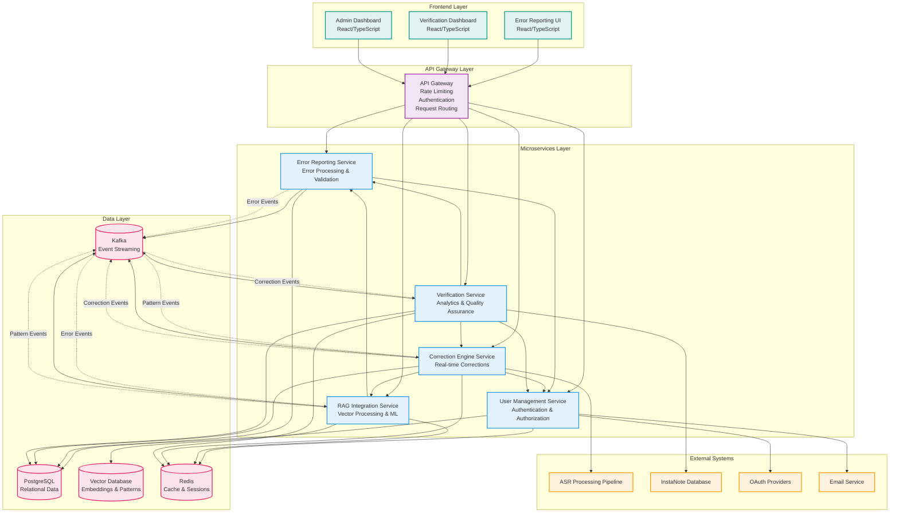
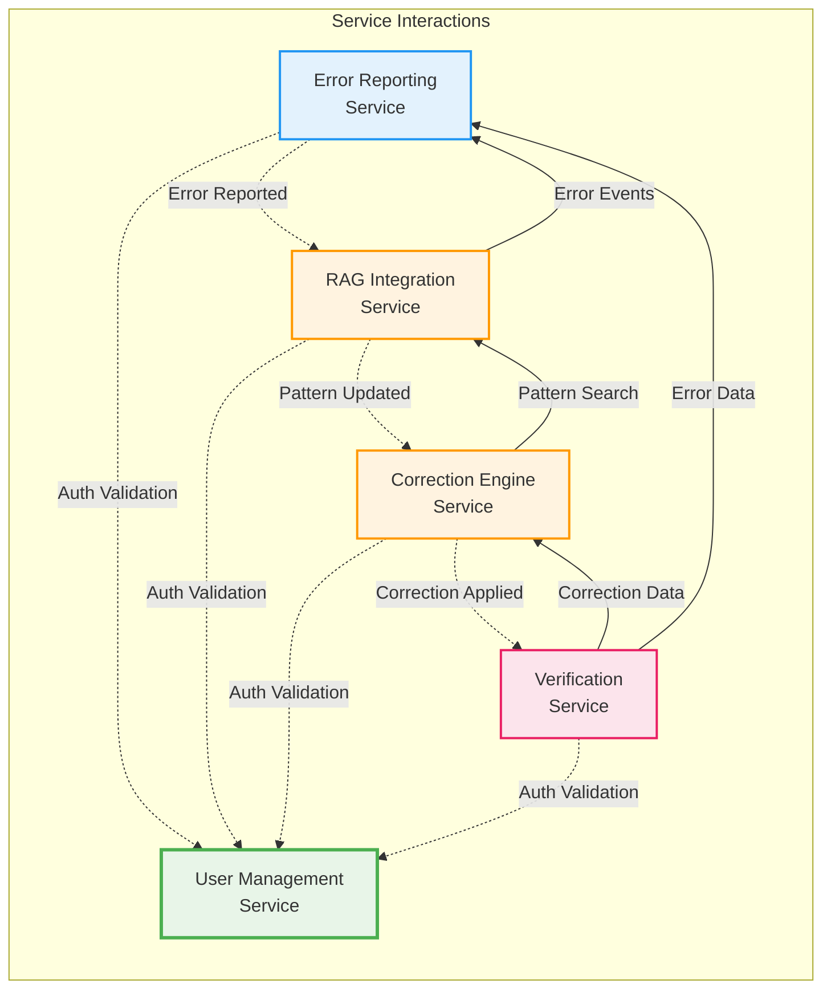
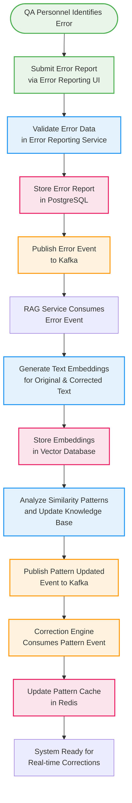
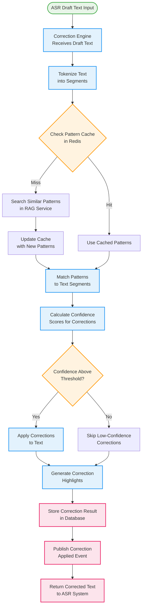
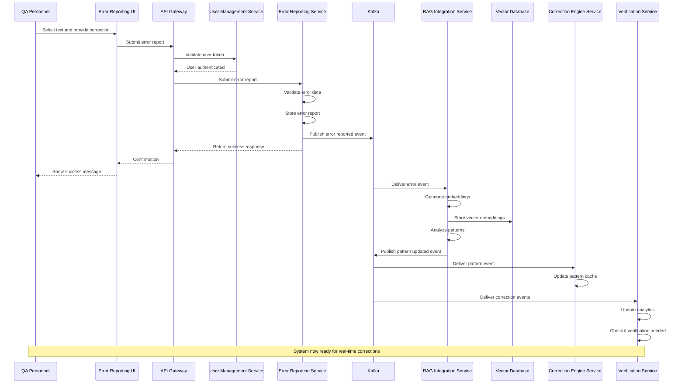
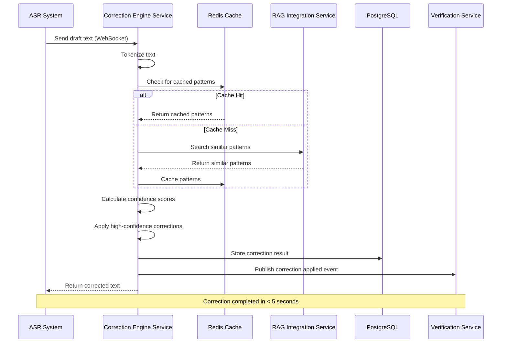
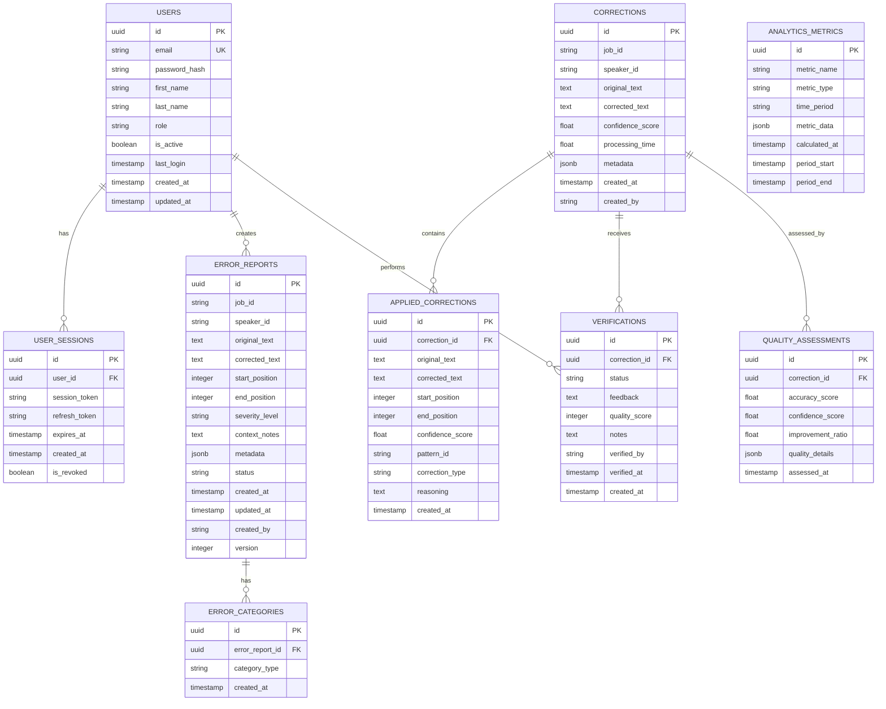

# Enhanced Documentation with Mermaid Diagrams and User Stories

**Document Version:** 1.0  
**Date:** August 19, 2025  
**Purpose:** Comprehensive visualization and user story documentation for the ASR Error Reporting System  

---

## Table of Contents

1. [System Architecture Visualization](#system-architecture-visualization)
2. [Data Flow Diagrams](#data-flow-diagrams)
3. [Sequence Diagrams](#sequence-diagrams)
4. [Entity Relationship Diagrams](#entity-relationship-diagrams)
5. [Comprehensive User Stories](#comprehensive-user-stories)
6. [Story Point Analysis](#story-point-analysis)

---

## 1. System Architecture Visualization

### 1.1 Complete System Overview

### 1.2 Service Interaction Matrix

---

## 2. Data Flow Diagrams

### 2.1 Error Processing Flow

### 2.2 Real-time Correction Flow

---

## 3. Sequence Diagrams

### 3.1 Complete Error Reporting Workflow

### 3.2 Real-time Correction Sequence

---

## 4. Entity Relationship Diagrams

### 4.1 Complete System ERD

---

## 5. Comprehensive User Stories

### 5.1 Error Reporting Epic (19 Story Points)

#### 5.1.1 Submit Error Report (8 points)
**As a** QA personnel  
**I want to** submit error reports for ASR transcription mistakes  
**So that** the system can learn and improve future transcriptions  

**Acceptance Criteria:**
- [ ] I can select text in the transcription interface
- [ ] I can provide corrected text for the selected error
- [ ] I can categorize the error type (substitution, insertion, deletion, etc.)
- [ ] I can set the severity level (low, medium, high, critical)
- [ ] I can add context notes explaining the error
- [ ] I can include metadata about audio quality and conditions
- [ ] The system validates my input before submission
- [ ] I receive confirmation when the error is successfully submitted
- [ ] The error is immediately available for search and analysis

**Technical Implementation:**
- FastAPI endpoint with comprehensive validation
- Pydantic models for request/response
- PostgreSQL storage with JSONB metadata
- Kafka event publishing for downstream processing
- Redis caching for performance optimization

#### 5.1.2 Search and Filter Errors (8 points)
**As a** QA personnel  
**I want to** search and filter error reports  
**So that** I can analyze patterns and find specific errors  

**Acceptance Criteria:**
- [ ] I can search errors by job ID, speaker ID, or text content
- [ ] I can filter by error categories, severity, and date range
- [ ] I can filter by error status (active, resolved, archived)
- [ ] I can sort results by various fields (date, severity, etc.)
- [ ] The search results are paginated for performance
- [ ] I can export search results for external analysis
- [ ] The search is fast and responsive (< 2 seconds)

**Technical Implementation:**
- Advanced search endpoint with multiple filters
- Database indexes for search performance
- Pagination and sorting capabilities
- Export functionality (CSV, Excel, JSON)
- Caching for common search queries

#### 5.1.3 Update Error Reports (3 points)
**As a** QA personnel  
**I want to** update error reports after submission  
**So that** I can correct mistakes or add additional information  

**Acceptance Criteria:**
- [ ] I can modify the corrected text of an error report
- [ ] I can update error categories and severity level
- [ ] I can add or modify context notes
- [ ] I can update metadata information
- [ ] The system tracks all changes with audit trail
- [ ] I cannot modify certain fields like original text or position
- [ ] The system prevents concurrent modifications with optimistic locking

**Technical Implementation:**
- PUT endpoint with field-level validation
- Optimistic locking with version control
- Audit logging for all changes
- Event publishing for updates

### 5.2 RAG Integration Epic (44 Story Points)

#### 5.2.1 Generate Text Embeddings (8 points)
**As a** system component  
**I want to** generate vector embeddings for error texts  
**So that** similar patterns can be identified and analyzed  

**Acceptance Criteria:**
- [ ] I can generate 1536-dimensional embeddings for any text input
- [ ] The embedding generation completes within 500ms for single texts
- [ ] I can specify the embedding type (error, correction, context)
- [ ] The system supports multiple embedding models (OpenAI, local models)
- [ ] Generated embeddings are automatically stored in the vector database
- [ ] The system handles text preprocessing and normalization
- [ ] Embedding metadata includes model version and generation timestamp

**Technical Implementation:**
- Integration with OpenAI API and local models
- Vector database storage (Pinecone/Weaviate)
- Async processing for performance
- Model versioning and management
- Comprehensive error handling

#### 5.2.2 Find Similar Error Patterns (8 points)
**As a** correction engine  
**I want to** find similar error patterns for a given text  
**So that** I can apply learned corrections to new errors  

**Acceptance Criteria:**
- [ ] I can search for similar patterns using text or vector input
- [ ] Search results are returned within 200ms
- [ ] Results include similarity scores and confidence levels
- [ ] I can filter results by speaker, category, or time period
- [ ] Results are ranked by similarity score in descending order
- [ ] I can specify the number of results to return (top-k)
- [ ] Search supports metadata filtering for precise targeting

**Technical Implementation:**
- Vector similarity search with cosine similarity
- Performance optimization for sub-200ms response
- Metadata filtering capabilities
- Result ranking and scoring
- Caching for frequent searches

### 5.3 Correction Engine Epic (47 Story Points)

#### 5.3.1 Apply Real-time Corrections (13 points)
**As an** ASR system  
**I want to** apply real-time corrections to draft transcription text  
**So that** the final output has improved accuracy based on learned patterns  

**Acceptance Criteria:**
- [ ] Corrections are applied within 5 seconds for typical text segments
- [ ] The system identifies and corrects common speaker-specific errors
- [ ] Confidence scores are provided for each applied correction
- [ ] Original text positions are preserved for highlighting
- [ ] The system handles concurrent correction requests efficiently
- [ ] Corrections are based on similar patterns from the knowledge base
- [ ] Failed corrections don't affect the overall process

**Technical Implementation:**
- Real-time correction algorithm with pattern matching
- WebSocket support for streaming corrections
- Confidence scoring with ML models
- Text segmentation and tokenization
- Concurrent request handling
- Performance optimization

### 5.4 Verification Service Epic (21 Story Points)

#### 5.4.1 Verify Corrections (8 points)
**As an** MTS personnel  
**I want to** verify the quality of applied corrections  
**So that** I can ensure correction accuracy and provide feedback  

**Acceptance Criteria:**
- [ ] I can see a list of corrections pending verification
- [ ] I can view original text, corrected text, and confidence scores
- [ ] I can approve, reject, or mark corrections as needing review
- [ ] I can provide feedback and quality ratings (1-5 scale)
- [ ] I can add notes explaining my verification decision
- [ ] The system tracks my verification history and performance
- [ ] Verified corrections are removed from my pending list

**Technical Implementation:**
- Verification workflow with status management
- Quality assessment algorithms
- Feedback collection and processing
- Performance tracking and analytics

#### 5.4.2 View Analytics Dashboard (13 points)
**As a** QA supervisor  
**I want to** view real-time analytics about correction performance  
**So that** I can monitor system effectiveness and identify trends  

**Acceptance Criteria:**
- [ ] Dashboard loads within 2 seconds with current data
- [ ] I can see key metrics: accuracy rates, error trends, speaker performance
- [ ] Data updates in real-time as new corrections are processed
- [ ] I can filter data by date range, speaker, error category
- [ ] I can drill down into specific metrics for detailed analysis
- [ ] Dashboard is responsive and works on mobile devices
- [ ] I can export dashboard data for external reporting

**Technical Implementation:**
- Real-time analytics with WebSocket updates
- Data aggregation and trend analysis
- Interactive dashboard with filtering
- Export functionality
- Mobile-responsive design

### 5.5 User Management Epic (13 Story Points)

#### 5.5.1 User Authentication (5 points)
**As a** system user  
**I want to** log in with my credentials  
**So that** I can access the ASR error reporting system  

**Acceptance Criteria:**
- [ ] I can log in with email and password
- [ ] I receive a JWT token upon successful authentication
- [ ] Invalid credentials show appropriate error messages
- [ ] My login activity is logged for security
- [ ] I can choose to stay logged in (remember me)
- [ ] Login completes within 500ms

**Technical Implementation:**
- OAuth 2.0/OIDC compliant authentication
- JWT token generation and validation
- Session management with Redis
- Security logging and monitoring

#### 5.5.2 Role-based Access Control (8 points)
**As a** system administrator  
**I want to** control user access based on roles  
**So that** users only see features appropriate to their role  

**Acceptance Criteria:**
- [ ] QA personnel can submit and view error reports
- [ ] MTS personnel can verify corrections
- [ ] Supervisors can view analytics and manage teams
- [ ] Admins can manage users and system configuration
- [ ] Unauthorized access attempts are blocked and logged
- [ ] Permission checks complete within 100ms

**Technical Implementation:**
- Role-based access control (RBAC)
- Permission management system
- Authorization middleware
- Audit logging for access attempts

---

## 6. Story Point Analysis

### 6.1 Epic Summary

| Epic | Stories | Story Points | Team Size | Duration |
|------|---------|--------------|-----------|----------|
| Error Reporting | 3 | 19 | 3-4 developers | 6-8 weeks |
| RAG Integration | 7 | 44 | 4-5 developers | 8-10 weeks |
| Correction Engine | 6 | 47 | 4-5 developers | 8-10 weeks |
| Verification Service | 2 | 21 | 3-4 developers | 6-8 weeks |
| User Management | 2 | 13 | 3-4 developers | 4-6 weeks |
| **Total** | **20** | **144** | **17-22 developers** | **16-20 weeks** |

### 6.2 Development Velocity Assumptions

- **Story Points per Developer per Week**: 2-3 points
- **Team Velocity**: 6-12 points per week (depending on team size)
- **Buffer for Integration**: 20% additional time
- **Total Project Duration**: 20-24 weeks including integration and testing

### 6.3 Critical Path Analysis

**Critical Path Services**: UMS → ERS → RIS → CES
**Total Critical Path Story Points**: 123 points
**Estimated Critical Path Duration**: 16-18 weeks

**Parallel Development Opportunity**: VS can be developed in parallel with CES
**Potential Time Savings**: 2-4 weeks through parallel development

---

**Document Status:** ✅ Complete  
**Next Steps:** Begin development following the sequencing plan  
**Review Schedule:** Weekly story point tracking and velocity analysis
