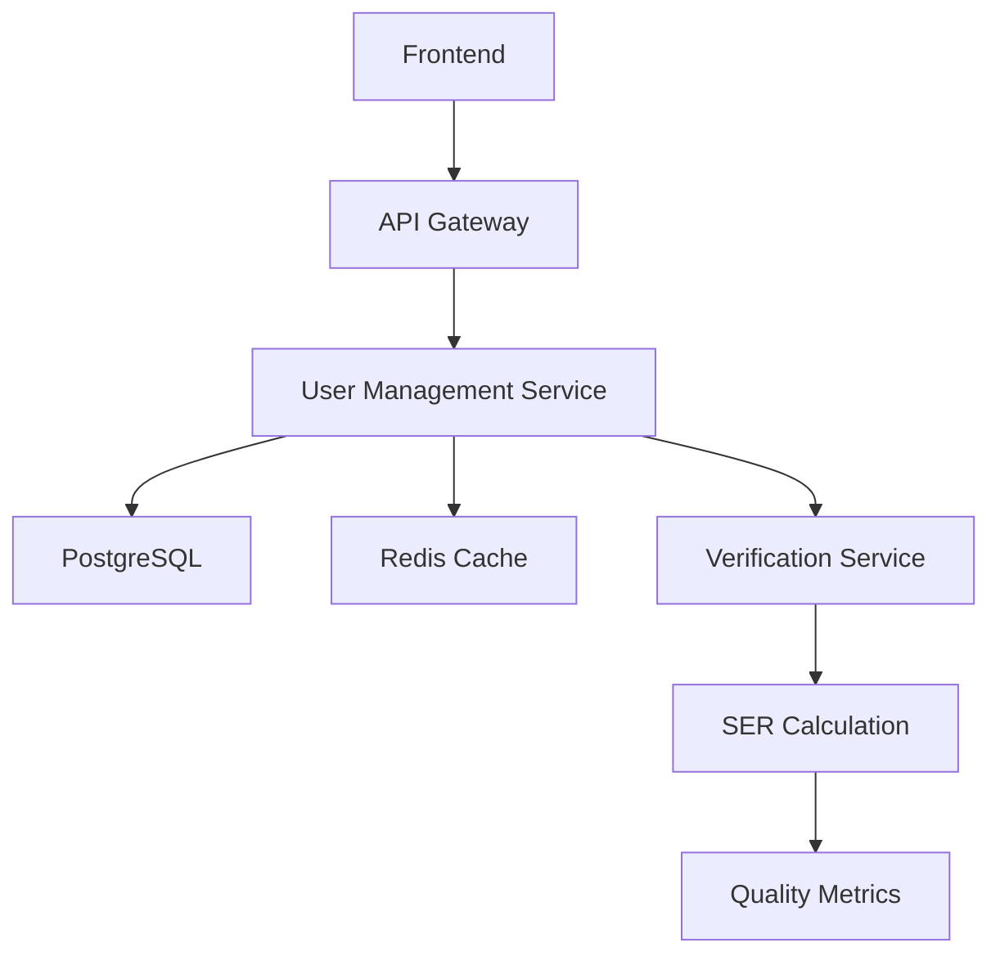
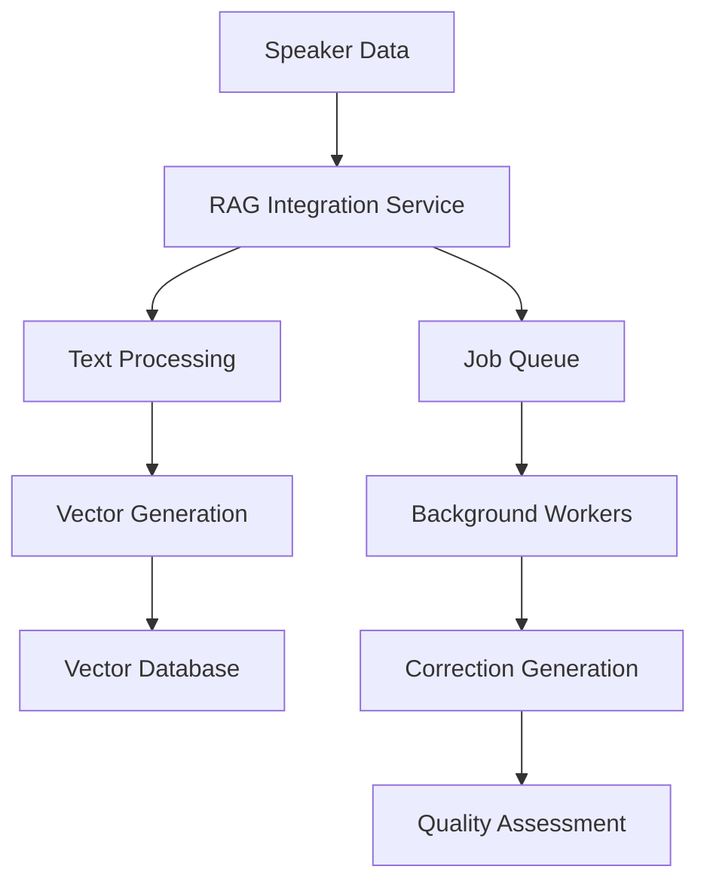
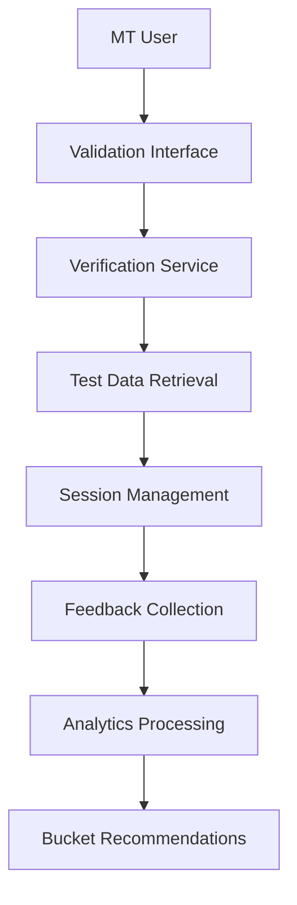

# Speaker Bucket Management System Architecture

## Overview

The Speaker Bucket Management System is a comprehensive platform designed to categorize speakers based on their speech recognition quality and facilitate continuous improvement through AI-powered corrections and medical transcriptionist validation. The system follows hexagonal architecture principles with clear separation of concerns and domain-driven design.

## Architecture Principles

### Hexagonal Architecture (Ports and Adapters)
- **Domain Core**: Business logic isolated from external concerns
- **Ports**: Interfaces defining how the domain interacts with external systems
- **Adapters**: Implementations that connect ports to specific technologies
- **Dependency Inversion**: Dependencies point inward toward the domain

### Domain-Driven Design
- **Bounded Contexts**: Clear boundaries between different business domains
- **Aggregates**: Consistency boundaries for related entities
- **Value Objects**: Immutable objects representing domain concepts
- **Domain Services**: Business logic that doesn't belong to specific entities

### Microservices Architecture
- **Service Autonomy**: Each service owns its data and business logic
- **Technology Diversity**: Services can use different technologies as appropriate
- **Independent Deployment**: Services can be deployed independently
- **Fault Isolation**: Failures in one service don't cascade to others

## System Components

### Core Services

#### 1. User Management Service
**Purpose**: Manages user authentication, authorization, and speaker entities

**Responsibilities**:
- User authentication and session management
- Role-based access control (RBAC)
- Speaker entity management (CRUD operations)
- Speaker search and filtering
- Bucket categorization and transitions

**Technology Stack**:
- **Framework**: FastAPI (Python)
- **Database**: PostgreSQL
- **Authentication**: JWT tokens
- **Caching**: Redis

**Key Entities**:
- `User`: System users (MT users, administrators)
- `Speaker`: Medical professionals being categorized
- `SpeakerBucket`: Categorization levels (NO_TOUCH, LOW_TOUCH, MEDIUM_TOUCH, HIGH_TOUCH)
- `BucketTransitionRequest`: Requests for bucket changes

#### 2. Verification Service
**Purpose**: Handles SER calculations, MT validation workflow, and quality assessments

**Responsibilities**:
- SER (Sentence Edit Rate) calculation and metrics
- Historical ASR data management
- MT validation session orchestration
- Feedback collection and analysis
- Quality trend analysis and reporting

**Technology Stack**:
- **Framework**: FastAPI (Python)
- **Database**: PostgreSQL
- **Processing**: Asyncio for concurrent operations
- **Metrics**: Custom SER calculation engine

**Key Entities**:
- `HistoricalASRData`: Original and corrected transcription data
- `SERValidationResult`: Quality metrics and calculations
- `MTValidationSession`: Validation workflow sessions
- `MTFeedback`: Medical transcriptionist feedback and ratings
- `ValidationTestData`: Curated data for validation testing

#### 3. RAG Integration Service
**Purpose**: Provides AI-powered text correction and similarity search capabilities

**Responsibilities**:
- Speaker-specific error-correction pair generation
- Vector embeddings and similarity search
- Text correction using retrieval-augmented generation
- Processing job management and queuing
- Quality assessment of corrections

**Technology Stack**:
- **Framework**: FastAPI (Python)
- **Vector Database**: Chroma/Pinecone for embeddings
- **ML Models**: Sentence Transformers, OpenAI GPT
- **Job Queue**: Celery with Redis broker
- **Storage**: PostgreSQL + Vector storage

**Key Entities**:
- `RAGProcessingJob`: Background processing jobs
- `ErrorCorrectionPair`: Training data for corrections
- `SpeakerEmbedding`: Vector representations of speaker data
- `CorrectionResult`: AI-generated correction results

#### 4. API Gateway
**Purpose**: Central entry point for all client requests with routing and cross-cutting concerns

**Responsibilities**:
- Request routing to appropriate services
- Authentication and authorization enforcement
- Rate limiting and throttling
- Request/response logging and monitoring
- API versioning and documentation

**Technology Stack**:
- **Framework**: FastAPI (Python) or Kong
- **Load Balancing**: Nginx or cloud load balancer
- **Monitoring**: Prometheus + Grafana
- **Documentation**: OpenAPI/Swagger

### Supporting Infrastructure

#### Database Layer
- **Primary Database**: PostgreSQL for transactional data
- **Vector Database**: Specialized storage for embeddings
- **Cache Layer**: Redis for session management and caching
- **Search Engine**: Elasticsearch for full-text search (optional)

#### Message Queue
- **Broker**: Redis or RabbitMQ
- **Worker Framework**: Celery for background job processing
- **Monitoring**: Flower for job monitoring

#### Monitoring and Observability
- **Metrics**: Prometheus for metrics collection
- **Visualization**: Grafana for dashboards
- **Logging**: Structured logging with ELK stack
- **Tracing**: Jaeger for distributed tracing
- **Health Checks**: Custom health check endpoints

## Data Flow Architecture

### Speaker Management Flow

### RAG Processing Flow

### MT Validation Flow

## Security Architecture

### Authentication and Authorization
- **JWT Tokens**: Stateless authentication with refresh tokens
- **Role-Based Access Control**: Granular permissions based on user roles
- **API Key Management**: Service-to-service authentication
- **Session Management**: Secure session handling with Redis

### Data Protection
- **Encryption at Rest**: Database encryption for sensitive data
- **Encryption in Transit**: TLS/SSL for all communications
- **Data Anonymization**: PII protection in logs and analytics
- **Audit Logging**: Comprehensive audit trail for all operations

### Network Security
- **API Gateway**: Single entry point with security controls
- **Rate Limiting**: Protection against abuse and DoS attacks
- **CORS Configuration**: Proper cross-origin resource sharing
- **Input Validation**: Comprehensive input sanitization

## Deployment Architecture

### Container Strategy
- **Docker Containers**: All services containerized for consistency
- **Multi-stage Builds**: Optimized container images
- **Health Checks**: Container health monitoring
- **Resource Limits**: CPU and memory constraints

### Orchestration
- **Kubernetes**: Container orchestration and management
- **Helm Charts**: Application packaging and deployment
- **Service Mesh**: Istio for service communication (optional)
- **Auto-scaling**: Horizontal pod autoscaling based on metrics

### Environment Strategy
- **Development**: Local development with Docker Compose
- **Staging**: Production-like environment for testing
- **Production**: High-availability deployment with redundancy
- **Disaster Recovery**: Backup and recovery procedures

## Scalability and Performance

### Horizontal Scaling
- **Stateless Services**: All services designed to be stateless
- **Load Balancing**: Distribute traffic across service instances
- **Database Sharding**: Partition data for improved performance
- **Caching Strategy**: Multi-level caching for frequently accessed data

### Performance Optimization
- **Connection Pooling**: Efficient database connection management
- **Async Processing**: Non-blocking I/O for better throughput
- **Background Jobs**: Offload heavy processing to background workers
- **CDN Integration**: Content delivery network for static assets

### Monitoring and Alerting
- **Real-time Metrics**: Continuous monitoring of system health
- **Performance Dashboards**: Visual representation of system metrics
- **Automated Alerting**: Proactive notification of issues
- **Capacity Planning**: Data-driven scaling decisions

## Data Architecture

### Database Design
- **Normalized Schema**: Proper normalization for data integrity
- **Indexing Strategy**: Optimized indexes for query performance
- **Partitioning**: Table partitioning for large datasets
- **Backup Strategy**: Regular backups with point-in-time recovery

### Data Flow
- **Event Sourcing**: Capture all changes as events (optional)
- **CQRS**: Separate read and write models for optimization
- **Data Synchronization**: Consistent data across services
- **ETL Processes**: Data transformation and analytics pipelines

### Analytics and Reporting
- **Data Warehouse**: Centralized analytics database
- **Real-time Analytics**: Stream processing for live insights
- **Business Intelligence**: Dashboards and reporting tools
- **Machine Learning**: Data pipeline for ML model training

## Integration Patterns

### Service Communication
- **Synchronous**: HTTP/REST for real-time operations
- **Asynchronous**: Message queues for background processing
- **Event-Driven**: Event publishing and subscription
- **Circuit Breaker**: Fault tolerance for service calls

### External Integrations
- **API Clients**: Standardized clients for external services
- **Webhook Handlers**: Incoming webhook processing
- **File Processing**: Batch file import and export
- **Third-party Services**: Integration with external APIs

## Quality Assurance

### Testing Strategy
- **Unit Tests**: Comprehensive unit test coverage
- **Integration Tests**: End-to-end workflow testing
- **Performance Tests**: Load and stress testing
- **Security Tests**: Vulnerability scanning and penetration testing

### Code Quality
- **Static Analysis**: Automated code quality checks
- **Code Reviews**: Peer review process for all changes
- **Documentation**: Comprehensive code and API documentation
- **Standards Compliance**: Adherence to coding standards

### Deployment Quality
- **Blue-Green Deployment**: Zero-downtime deployments
- **Canary Releases**: Gradual rollout of new features
- **Rollback Procedures**: Quick rollback for failed deployments
- **Health Checks**: Automated health verification

## Future Considerations

### Scalability Enhancements
- **Multi-region Deployment**: Geographic distribution for performance
- **Edge Computing**: Processing closer to users
- **Serverless Functions**: Event-driven serverless processing
- **Advanced Caching**: Distributed caching strategies

### Technology Evolution
- **Cloud-Native Services**: Leverage cloud provider services
- **AI/ML Integration**: Enhanced AI capabilities
- **Real-time Processing**: Stream processing for live data
- **Advanced Analytics**: Predictive analytics and insights

### Business Growth
- **Multi-tenancy**: Support for multiple organizations
- **API Ecosystem**: Public APIs for third-party integrations
- **Mobile Applications**: Native mobile app support
- **International Support**: Localization and internationalization

The Speaker Bucket Management System architecture is designed to be robust, scalable, and maintainable while providing excellent performance and user experience. The modular design allows for independent development and deployment of components while maintaining system coherence and data consistency.
