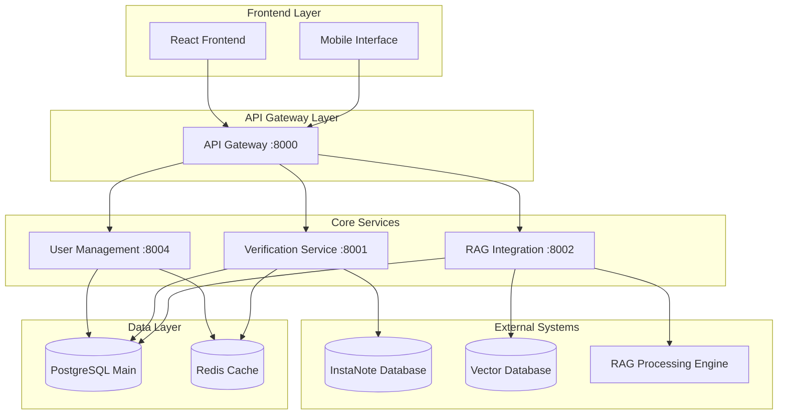
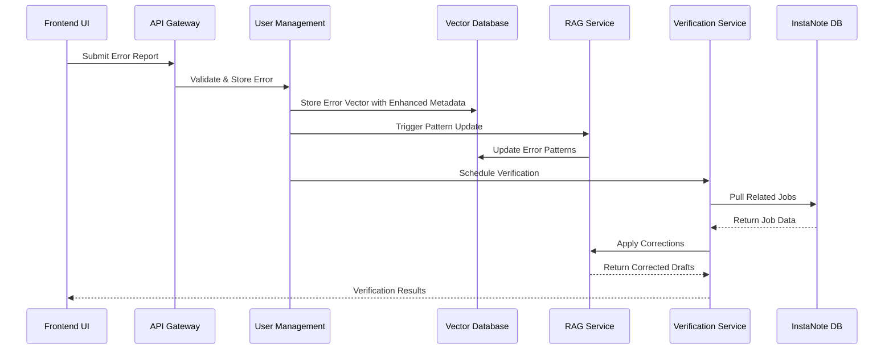
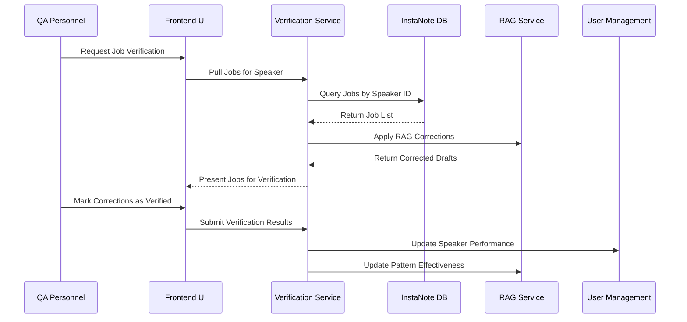

# System Integration Design - Quality-Based Speaker Bucket Management

**Date:** December 19, 2024  
**Version:** 2.0  
**Architecture:** Microservices with Hexagonal Architecture Pattern

---

## Table of Contents

1. [Integration Overview](#1-integration-overview)
2. [InstaNote Database Integration](#2-instanote-database-integration)
3. [RAG System Integration](#3-rag-system-integration)
4. [Vector Database Integration](#4-vector-database-integration)
5. [Service Communication Patterns](#5-service-communication-patterns)
6. [Data Flow Architecture](#6-data-flow-architecture)
7. [Security and Authentication](#7-security-and-authentication)
8. [Error Handling and Resilience](#8-error-handling-and-resilience)

---

## 1. Integration Overview

### 1.1 System Architecture Components



### 1.2 Integration Patterns
- **API Gateway Pattern**: Unified entry point for all client requests
- **Database per Service**: Each service owns its data
- **Event-Driven Architecture**: Asynchronous communication for non-critical operations
- **Circuit Breaker Pattern**: Resilience for external system failures
- **Saga Pattern**: Distributed transaction management

---

## 2. InstaNote Database Integration

### 2.1 Connection Architecture

```python
# InstaNote Database Adapter
class InstaNoteDatabaseAdapter:
    def __init__(self, connection_config: InstaNoteDatabaseConfig):
        self.connection_pool = create_connection_pool(
            host=connection_config.host,
            port=connection_config.port,
            database=connection_config.database,
            username=connection_config.username,
            password=connection_config.password,
            ssl_mode=connection_config.ssl_mode,
            max_connections=20,
            connection_timeout=30
        )
    
    async def pull_jobs_by_speaker(
        self, 
        speaker_id: str, 
        date_range: DateRange,
        error_types: List[str] = None,
        max_jobs: int = 10
    ) -> List[InstaNoteDraftJob]:
        """Pull jobs for specific speaker from InstaNote Database"""
        
    async def get_job_metadata(self, job_id: str) -> InstaNoteDraftMetadata:
        """Retrieve metadata for specific job"""
        
    async def check_connection_health(self) -> bool:
        """Health check for InstaNote Database connection"""
```

### 2.2 Data Mapping and Transformation

```python
# InstaNote to Internal Data Mapping
@dataclass
class InstaNoteDraftJob:
    job_id: str
    speaker_id: str
    original_draft: str
    audio_metadata: Dict[str, Any]
    creation_timestamp: datetime
    client_id: str
    
    def to_verification_job(self) -> VerificationJob:
        """Transform InstaNote job to internal verification job format"""
        return VerificationJob(
            job_id=self.job_id,
            speaker_id=self.speaker_id,
            original_draft=self.original_draft,
            job_metadata={
                "audio_quality": self.audio_metadata.get("quality", "unknown"),
                "duration": self.audio_metadata.get("duration"),
                "source_system": "instanote"
            },
            retrieval_timestamp=datetime.utcnow()
        )
```

### 2.3 Query Optimization and Caching

```python
# Optimized Query Strategy
class InstaNoteDraftQueryService:
    def __init__(self, db_adapter: InstaNoteDatabaseAdapter, cache: RedisCache):
        self.db_adapter = db_adapter
        self.cache = cache
    
    async def get_speaker_jobs(
        self, 
        speaker_id: str, 
        date_range: DateRange
    ) -> List[InstaNoteDraftJob]:
        # Check cache first
        cache_key = f"speaker_jobs:{speaker_id}:{date_range.hash()}"
        cached_jobs = await self.cache.get(cache_key)
        
        if cached_jobs:
            return cached_jobs
        
        # Query database with optimized indexes
        jobs = await self.db_adapter.execute_query(
            query="""
            SELECT job_id, speaker_id, draft_text, audio_metadata, created_at
            FROM draft_jobs 
            WHERE speaker_id = %s 
            AND created_at BETWEEN %s AND %s
            ORDER BY created_at DESC
            LIMIT %s
            """,
            params=[speaker_id, date_range.start, date_range.end, 50]
        )
        
        # Cache results for 1 hour
        await self.cache.set(cache_key, jobs, ttl=3600)
        return jobs
```

---

## 3. RAG System Integration

### 3.1 RAG Processing Pipeline

```python
# RAG Integration Service
class RAGIntegrationService:
    def __init__(
        self, 
        vector_db: VectorDatabaseAdapter,
        rag_engine: RAGProcessingEngine
    ):
        self.vector_db = vector_db
        self.rag_engine = rag_engine
    
    async def apply_corrections_to_draft(
        self, 
        draft_text: str, 
        speaker_id: str,
        error_history: List[ErrorReport]
    ) -> RAGCorrectedDraft:
        """Apply RAG-based corrections to draft text"""
        
        # 1. Retrieve relevant error patterns from vector database
        relevant_patterns = await self.vector_db.similarity_search(
            query_text=draft_text,
            filters={
                "speaker_id": speaker_id,
                "status": "rectified"
            },
            top_k=10
        )
        
        # 2. Apply corrections using RAG engine
        corrections = await self.rag_engine.generate_corrections(
            original_text=draft_text,
            error_patterns=relevant_patterns,
            speaker_context={
                "bucket_type": await self.get_speaker_bucket(speaker_id),
                "error_history": error_history
            }
        )
        
        # 3. Apply corrections to text
        corrected_text = await self.rag_engine.apply_corrections(
            original_text=draft_text,
            corrections=corrections
        )
        
        return RAGCorrectedDraft(
            original_text=draft_text,
            corrected_text=corrected_text,
            corrections_applied=corrections,
            confidence_scores=[c.confidence for c in corrections]
        )
```

### 3.2 Error Pattern Learning

```python
# Error Pattern Learning System
class ErrorPatternLearningService:
    async def update_patterns_from_verification(
        self, 
        verification_result: VerificationResult
    ):
        """Update RAG patterns based on verification feedback"""
        
        if verification_result.result == "rectified":
            # Positive feedback - strengthen pattern
            await self.vector_db.update_pattern_weight(
                pattern_id=verification_result.pattern_id,
                weight_adjustment=0.1
            )
        elif verification_result.result == "not_rectified":
            # Negative feedback - weaken pattern
            await self.vector_db.update_pattern_weight(
                pattern_id=verification_result.pattern_id,
                weight_adjustment=-0.1
            )
        
        # Update speaker-specific patterns
        await self.update_speaker_patterns(
            speaker_id=verification_result.speaker_id,
            verification_result=verification_result
        )
```

---

## 4. Vector Database Integration

### 4.1 Enhanced Metadata Storage

```python
# Vector Database Schema for Enhanced Metadata
@dataclass
class EnhancedErrorVector:
    id: str
    error_text: str
    corrected_text: str
    embedding: List[float]
    metadata: Dict[str, Any]
    
    @classmethod
    def from_error_report(cls, error_report: ErrorReport) -> 'EnhancedErrorVector':
        return cls(
            id=error_report.id,
            error_text=error_report.original_text,
            corrected_text=error_report.corrected_text,
            embedding=generate_embedding(error_report.original_text),
            metadata={
                # Core metadata
                "speaker_id": error_report.speaker_id,
                "client_id": error_report.client_id,
                "bucket_type": error_report.bucket_type,
                "error_categories": error_report.error_categories,
                
                # Audio quality metadata
                "audio_quality": error_report.metadata.audio_quality,
                "speaker_clarity": error_report.metadata.speaker_clarity,
                "background_noise": error_report.metadata.background_noise,
                
                # Enhanced metadata
                "number_of_speakers": error_report.metadata.number_of_speakers,
                "overlapping_speech": error_report.metadata.overlapping_speech,
                "requires_specialized_knowledge": error_report.metadata.requires_specialized_knowledge,
                "additional_notes": error_report.metadata.additional_notes,
                
                # System metadata
                "created_at": error_report.created_at.isoformat(),
                "status": error_report.status
            }
        )
```

### 4.2 Advanced Search and Filtering

```python
# Enhanced Vector Search
class EnhancedVectorSearchService:
    async def search_similar_errors(
        self, 
        query_text: str,
        filters: Dict[str, Any] = None,
        top_k: int = 10
    ) -> List[SimilarError]:
        """Search for similar errors with enhanced filtering"""
        
        # Generate embedding for query
        query_embedding = await self.embedding_service.generate_embedding(query_text)
        
        # Build filter conditions
        filter_conditions = []
        if filters:
            if "bucket_type" in filters:
                filter_conditions.append(f"metadata.bucket_type = '{filters['bucket_type']}'")
            if "speaker_id" in filters:
                filter_conditions.append(f"metadata.speaker_id = '{filters['speaker_id']}'")
            if "requires_specialized_knowledge" in filters:
                filter_conditions.append(
                    f"metadata.requires_specialized_knowledge = {filters['requires_specialized_knowledge']}"
                )
            if "audio_quality" in filters:
                filter_conditions.append(f"metadata.audio_quality = '{filters['audio_quality']}'")
        
        # Execute vector search with filters
        results = await self.vector_db.search(
            query_vector=query_embedding,
            filter_expression=" AND ".join(filter_conditions) if filter_conditions else None,
            top_k=top_k,
            include_metadata=True
        )
        
        return [
            SimilarError(
                id=result.id,
                original_text=result.metadata["error_text"],
                corrected_text=result.metadata["corrected_text"],
                similarity_score=result.score,
                metadata=result.metadata
            )
            for result in results
        ]
```

---

## 5. Service Communication Patterns

### 5.1 Event-Driven Architecture

```python
# Event Publishing for Bucket Changes
class BucketChangeEventPublisher:
    def __init__(self, event_bus: EventBus):
        self.event_bus = event_bus
    
    async def publish_bucket_change(
        self, 
        speaker_id: str, 
        previous_bucket: str, 
        new_bucket: str,
        reason: str
    ):
        event = BucketChangeEvent(
            speaker_id=speaker_id,
            previous_bucket=previous_bucket,
            new_bucket=new_bucket,
            reason=reason,
            timestamp=datetime.utcnow()
        )
        
        await self.event_bus.publish("speaker.bucket.changed", event)

# Event Handlers
class VerificationEventHandler:
    async def handle_bucket_change(self, event: BucketChangeEvent):
        """Trigger verification workflow when bucket changes"""
        if self.should_trigger_verification(event):
            await self.verification_service.schedule_verification(
                speaker_id=event.speaker_id,
                priority="high" if event.new_bucket == "no_touch" else "normal"
            )
```

### 5.2 Circuit Breaker Implementation

```python
# Circuit Breaker for External Services
class CircuitBreaker:
    def __init__(self, failure_threshold: int = 5, timeout: int = 60):
        self.failure_threshold = failure_threshold
        self.timeout = timeout
        self.failure_count = 0
        self.last_failure_time = None
        self.state = "CLOSED"  # CLOSED, OPEN, HALF_OPEN
    
    async def call(self, func, *args, **kwargs):
        if self.state == "OPEN":
            if self.should_attempt_reset():
                self.state = "HALF_OPEN"
            else:
                raise CircuitBreakerOpenException("Circuit breaker is OPEN")
        
        try:
            result = await func(*args, **kwargs)
            self.on_success()
            return result
        except Exception as e:
            self.on_failure()
            raise e
    
    def on_success(self):
        self.failure_count = 0
        self.state = "CLOSED"
    
    def on_failure(self):
        self.failure_count += 1
        self.last_failure_time = datetime.utcnow()
        if self.failure_count >= self.failure_threshold:
            self.state = "OPEN"

# Usage with InstaNote Database
class ResilientInstaNoteDraftService:
    def __init__(self, instanote_adapter: InstaNoteDatabaseAdapter):
        self.instanote_adapter = instanote_adapter
        self.circuit_breaker = CircuitBreaker(failure_threshold=3, timeout=30)
    
    async def pull_jobs(self, speaker_id: str, date_range: DateRange):
        try:
            return await self.circuit_breaker.call(
                self.instanote_adapter.pull_jobs_by_speaker,
                speaker_id,
                date_range
            )
        except CircuitBreakerOpenException:
            # Fallback to cached data or return empty result
            return await self.get_cached_jobs(speaker_id, date_range)
```

---

## 6. Data Flow Architecture

### 6.1 Error Reporting Data Flow



### 6.2 Verification Workflow Data Flow



---

## 7. Security and Authentication

### 7.1 Service-to-Service Authentication

```python
# JWT-based Service Authentication
class ServiceAuthenticationMiddleware:
    def __init__(self, jwt_secret: str, allowed_services: List[str]):
        self.jwt_secret = jwt_secret
        self.allowed_services = allowed_services
    
    async def authenticate_service(self, request: Request) -> ServiceIdentity:
        auth_header = request.headers.get("Authorization")
        if not auth_header or not auth_header.startswith("Bearer "):
            raise UnauthorizedException("Missing or invalid authorization header")
        
        token = auth_header[7:]  # Remove "Bearer " prefix
        
        try:
            payload = jwt.decode(token, self.jwt_secret, algorithms=["HS256"])
            service_id = payload.get("service_id")
            
            if service_id not in self.allowed_services:
                raise UnauthorizedException(f"Service {service_id} not authorized")
            
            return ServiceIdentity(
                service_id=service_id,
                permissions=payload.get("permissions", [])
            )
        except jwt.InvalidTokenException:
            raise UnauthorizedException("Invalid JWT token")
```

### 7.2 Data Encryption and Privacy

```python
# Sensitive Data Encryption
class DataEncryptionService:
    def __init__(self, encryption_key: bytes):
        self.cipher_suite = Fernet(encryption_key)
    
    def encrypt_sensitive_data(self, data: Dict[str, Any]) -> Dict[str, Any]:
        """Encrypt sensitive fields in error reports"""
        sensitive_fields = ["additional_notes", "context_notes"]
        
        encrypted_data = data.copy()
        for field in sensitive_fields:
            if field in encrypted_data and encrypted_data[field]:
                encrypted_data[field] = self.cipher_suite.encrypt(
                    encrypted_data[field].encode()
                ).decode()
        
        return encrypted_data
    
    def decrypt_sensitive_data(self, data: Dict[str, Any]) -> Dict[str, Any]:
        """Decrypt sensitive fields when retrieving data"""
        sensitive_fields = ["additional_notes", "context_notes"]
        
        decrypted_data = data.copy()
        for field in sensitive_fields:
            if field in decrypted_data and decrypted_data[field]:
                try:
                    decrypted_data[field] = self.cipher_suite.decrypt(
                        decrypted_data[field].encode()
                    ).decode()
                except Exception:
                    # Handle decryption errors gracefully
                    decrypted_data[field] = "[Encrypted Data]"
        
        return decrypted_data
```

---

## 8. Error Handling and Resilience

### 8.1 Retry Mechanisms

```python
# Exponential Backoff Retry
class RetryableOperation:
    def __init__(
        self, 
        max_retries: int = 3, 
        base_delay: float = 1.0,
        max_delay: float = 60.0
    ):
        self.max_retries = max_retries
        self.base_delay = base_delay
        self.max_delay = max_delay
    
    async def execute(self, operation: Callable, *args, **kwargs):
        last_exception = None
        
        for attempt in range(self.max_retries + 1):
            try:
                return await operation(*args, **kwargs)
            except Exception as e:
                last_exception = e
                
                if attempt == self.max_retries:
                    break
                
                delay = min(
                    self.base_delay * (2 ** attempt),
                    self.max_delay
                )
                await asyncio.sleep(delay)
        
        raise last_exception
```

### 8.2 Graceful Degradation

```python
# Graceful Degradation for External Service Failures
class GracefulDegradationService:
    async def get_speaker_history_with_fallback(
        self, 
        speaker_id: str
    ) -> SpeakerHistory:
        try:
            # Try to get complete history from all sources
            return await self.get_complete_speaker_history(speaker_id)
        except InstaNoteDatabaseException:
            # Fallback to local database only
            logger.warning(f"InstaNote DB unavailable, using local data for {speaker_id}")
            return await self.get_local_speaker_history(speaker_id)
        except Exception as e:
            # Ultimate fallback to cached data
            logger.error(f"All sources failed for {speaker_id}, using cache: {e}")
            return await self.get_cached_speaker_history(speaker_id)
```
