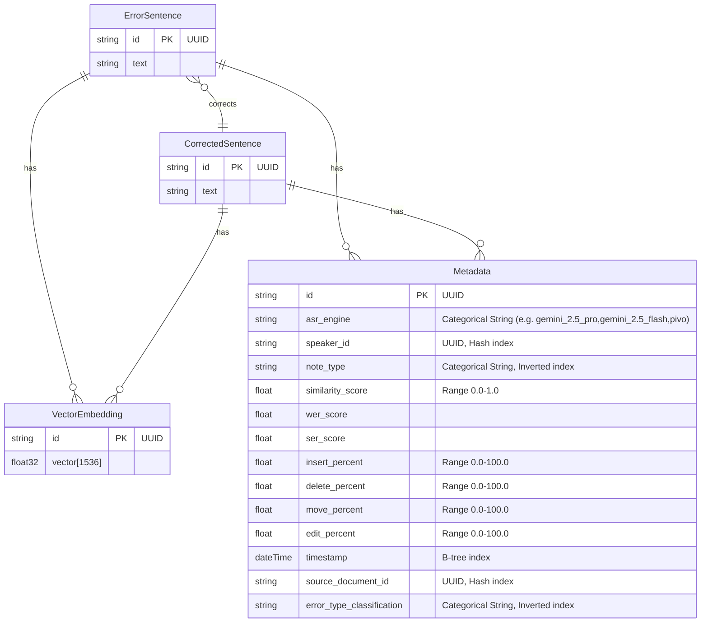

```mermaid
    erDiagram
        ErrorSentence {
            string id PK "UUID"
            string text
        }
        CorrectedSentence {
            string id PK "UUID"
            string text
        }
        VectorEmbedding {
            string id PK "UUID"
            float32 vector[1536]
        }
        Metadata {
            string id PK "UUID"
            string asr_engine "Categorical String (e.g. gemini_2.5_pro,gemini_2.5_flash,pivo)"
            string speaker_id "UUID, Hash index"
            string note_type "Categorical String, Inverted index"
            float similarity_score "Range 0.0-1.0"
            float wer_score
            float ser_score
            float insert_percent "Range 0.0-100.0"
            float delete_percent "Range 0.0-100.0"
            float move_percent "Range 0.0-100.0"
            float edit_percent "Range 0.0-100.0"
            dateTime timestamp "B-tree index"
            string source_document_id "UUID, Hash index"
            string error_type_classification "Categorical String, Inverted index"
        }

        ErrorSentence ||--o{ VectorEmbedding : has
        CorrectedSentence ||--o{ VectorEmbedding : has
        ErrorSentence ||--o{ Metadata : has
        CorrectedSentence ||--o{ Metadata : has
        ErrorSentence }o--|| CorrectedSentence : corrects
```
