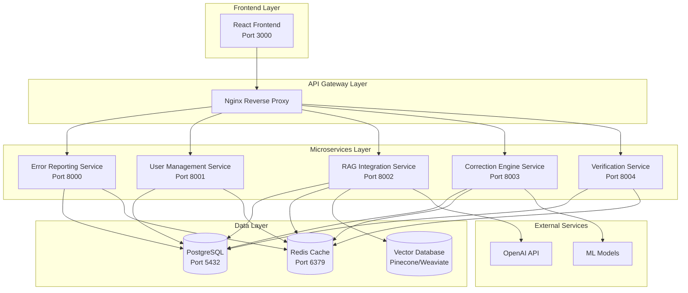

# RAG Interface System - Deployment Documentation

## 🎯 Overview

This directory contains comprehensive deployment and operational documentation for the RAG Interface System, a sophisticated platform for managing ASR (Automatic Speech Recognition) error reporting and correction using advanced AI/ML techniques.

## 📁 Documentation Structure

```
deployment/
├── README.md                    # This overview document
├── USER_MANUAL.md              # Complete user manual for non-technical users
├── TROUBLESHOOTING_GUIDE.md    # Detailed troubleshooting and diagnostics
├── MAINTENANCE_GUIDE.md        # Operations and maintenance procedures
├── database/                   # Database deployment scripts
│   ├── README.md              # Database documentation
│   ├── postgresql/            # PostgreSQL scripts
│   │   ├── 01_create_databases.sql
│   │   ├── 02_error_reporting_schema.sql
│   │   ├── 03_user_management_schema.sql
│   │   ├── 04_verification_service_schema.sql
│   │   ├── 05_correction_engine_schema.sql
│   │   ├── 06_rag_integration_schema.sql
│   │   └── 07_sample_data.sql
│   └── sqlserver/             # SQL Server scripts
│       ├── 01_create_databases.sql
│       ├── 02_error_reporting_schema.sql
│       └── 03_user_management_schema.sql
└── podman/                    # Container deployment
    ├── deploy.sh              # Automated deployment script
    ├── docker-compose.yml     # Service orchestration
    ├── .env.template          # Environment configuration template
    ├── Dockerfile.error-reporting-service
    ├── Dockerfile.user-management-service
    ├── Dockerfile.frontend
    ├── nginx.conf             # Nginx configuration
    └── default.conf           # Nginx server configuration
```

## 🚀 Quick Start

### Prerequisites
- **Container Runtime**: Podman 4.0+ or Docker 20.10+
- **Database**: PostgreSQL 12+ or SQL Server 2017+
- **System**: 8GB RAM, 4 CPU cores, 50GB storage
- **Network**: Internet access for AI/ML services

### 1-Minute Deployment

```bash
# Clone repository
git clone https://github.com/your-org/rag-interface.git
cd rag-interface/deployment/podman

# Configure environment
cp .env.template .env
# Edit .env with your settings (see Configuration section)

# Deploy system (Local Development Mode)
chmod +x deploy.sh
./deploy.sh --mode local --env development

# Or for Production Deployment
./deploy.sh --mode production --env production
```

### Enhanced Deployment Options

The deployment script now supports dual-mode operation with comprehensive validation:

```bash
# Show help and available options
./deploy.sh --help

# Local development deployment (default)
./deploy.sh --mode local --env development

# Production deployment with strict validation
./deploy.sh --mode production --env production

# Staging environment deployment
./deploy.sh --mode production --env staging
```

**Deployment Modes:**
- **Local Mode**: Optimized for development with debug logging, relaxed validation
- **Production Mode**: Strict security validation, optimized performance settings

**Environment Types:**
- **development**: Local development with hot reload and debug features
- **staging**: Pre-production testing environment
- **production**: Full production deployment with security hardening

### Access the System
- **Frontend Application**: http://localhost:3000
- **Default Login**: admin / AdminPassword123!

## 🏗️ System Architecture

### Microservices Architecture



### Database Architecture

The system uses a **single database with multiple schemas** approach for simplified administration while maintaining service isolation:

| Service | Schema | Purpose |
|---------|--------|---------|
| Error Reporting Service | `error_reporting` | Error reports, categories, audit logs |
| User Management Service | `user_management` | Users, sessions, permissions, roles |
| Verification Service | `verification` | Verifications, analytics, reports |
| Correction Engine Service | `correction_engine` | Corrections, patterns, feedback |
| RAG Integration Service | `rag_integration` | Metadata, cache, sync status |

**Database Name**: `rag_interface_db` (PostgreSQL) / `RAGInterfaceDB` (SQL Server)

## 📖 Documentation Guide

### For System Administrators

1. **Start Here**: [USER_MANUAL.md](USER_MANUAL.md)
   - Complete installation guide
   - System requirements
   - Configuration instructions
   - Basic operations

2. **Database Setup**: [database/README.md](database/README.md)
   - PostgreSQL and SQL Server scripts
   - Schema documentation
   - Sample data setup

3. **Container Deployment**: [podman/](podman/)
   - Dockerfiles for all services
   - Docker Compose configuration
   - Environment templates

### For Operations Teams

1. **Daily Operations**: [MAINTENANCE_GUIDE.md](MAINTENANCE_GUIDE.md)
   - Maintenance schedules
   - Backup procedures
   - Update processes
   - Performance monitoring

2. **Issue Resolution**: [TROUBLESHOOTING_GUIDE.md](TROUBLESHOOTING_GUIDE.md)
   - Common problems and solutions
   - Diagnostic procedures
   - Component-specific troubleshooting
   - Recovery procedures

### For End Users

1. **Application Usage**: [USER_MANUAL.md#using-the-application](USER_MANUAL.md#using-the-application)
   - Login procedures
   - Error reporting workflow
   - Verification processes
   - Analytics and reporting

## ⚙️ Configuration Overview

### Environment Configuration

The system uses a comprehensive `.env` file for configuration. Copy `.env.template` to `.env` and customize:

```bash
cp .env.template .env
```

### Critical Environment Variables

```bash
# Deployment Configuration
DEPLOYMENT_MODE=local          # 'local' or 'production'
ENVIRONMENT=development        # 'development', 'staging', 'production'

# Database Configuration (All services use single database with schemas)
POSTGRES_PASSWORD=your_secure_password
DATABASE_NAME=rag_interface_db
ERS_DB_PASSWORD=ers_password
UMS_DB_PASSWORD=ums_password
RIS_DB_PASSWORD=ris_password   # RAG Integration Service
CES_DB_PASSWORD=ces_password   # Correction Engine Service
VS_DB_PASSWORD=vs_password     # Verification Service

# Security
JWT_SECRET_KEY=your_very_long_random_secret_32_chars_minimum
REDIS_PASSWORD=redis_password

# AI/ML Services (Required for RAG functionality)
OPENAI_API_KEY=sk-your-openai-key
PINECONE_API_KEY=your-pinecone-key
PINECONE_ENVIRONMENT=us-west1-gcp

# Service Ports (Updated for all services)
FRONTEND_PORT=3000
ERS_PORT=8000
UMS_PORT=8001
RIS_PORT=8002
CES_PORT=8003
VS_PORT=8004
```

### Configuration Validation

The deployment script automatically validates configuration based on deployment mode:

**Local Mode Validation:**
- ✅ Basic password validation (warnings for defaults)
- ✅ Service connectivity checks
- ✅ Development-friendly settings

**Production Mode Validation:**
- ❗ Strict password requirements (no defaults allowed)
- ❗ API key validation (OpenAI, Pinecone required)
- ❗ JWT secret minimum 32 characters
- ❗ Resource availability checks (4GB RAM, 20GB disk)
- ❗ Security hardening verification

### Security Checklist

**Local Development:**
- [ ] Change default passwords (recommended)
- [ ] Configure API keys for RAG features
- [ ] Set basic JWT secret key

**Production Deployment:**
- [ ] Change ALL default passwords (required)
- [ ] Configure strong JWT secret key (32+ chars)
- [ ] Set up valid API keys (OpenAI, Pinecone)
- [ ] Configure SSL/TLS certificates
- [ ] Set up firewall rules
- [ ] Configure monitoring and alerting
- [ ] Set up backup procedures
- [ ] Review resource limits and scaling

## 🔧 Deployment Options

### Option 1: Single Server Deployment (Recommended for Testing)
- All services on one server
- Suitable for development and small teams
- Minimum requirements: 8GB RAM, 4 cores

### Option 2: Multi-Server Deployment (Production)
- Separate database server
- Load balancer for frontend
- Distributed microservices
- Recommended for production environments

### Option 3: Cloud Deployment
- Kubernetes orchestration
- Managed databases (RDS, Azure SQL)
- Auto-scaling capabilities
- High availability setup

## 📊 Monitoring and Observability

### Health Checks
All services provide health check endpoints:
- Frontend: `http://localhost:3000/health`
- Backend Services: `http://localhost:800X/health`
- Database: Built-in PostgreSQL health checks

### Metrics Collection
- **Application Metrics**: Response times, error rates, throughput
- **System Metrics**: CPU, memory, disk, network usage
- **Database Metrics**: Connection pools, query performance
- **Business Metrics**: Error reports, corrections, user activity

### Logging
- **Centralized Logging**: All services log to stdout/stderr
- **Log Aggregation**: Use tools like ELK stack or Grafana Loki
- **Log Retention**: Configurable retention policies
- **Structured Logging**: JSON format for easy parsing

## 🔒 Security Features

### Authentication & Authorization
- **JWT-based Authentication**: Secure token-based auth
- **Role-based Access Control**: Granular permissions
- **Session Management**: Secure session handling
- **Password Policies**: Configurable password requirements

### Data Protection
- **Encryption at Rest**: Database encryption
- **Encryption in Transit**: TLS for all communications
- **API Security**: Rate limiting, input validation
- **Audit Logging**: Complete audit trail

### Network Security
- **Container Isolation**: Network segmentation
- **Firewall Rules**: Minimal port exposure
- **Reverse Proxy**: Nginx for additional security
- **CORS Configuration**: Proper cross-origin policies

## 🚨 Support and Maintenance

### Support Channels
- **Documentation**: This comprehensive guide
- **Issue Tracking**: GitHub issues
- **Community**: Discussion forums
- **Professional Support**: Available for enterprise customers

### Maintenance Windows
- **Regular Updates**: Monthly security updates
- **Feature Releases**: Quarterly major releases
- **Emergency Patches**: As needed for critical issues
- **Maintenance Windows**: Scheduled during low-usage periods

### Backup Strategy
- **Automated Backups**: Daily database backups
- **Configuration Backups**: Environment and config files
- **Retention Policy**: 30 days local, 90 days offsite
- **Recovery Testing**: Monthly recovery drills

## 📈 Scaling Considerations

### Horizontal Scaling
- **Microservices**: Independent scaling per service
- **Load Balancing**: Multiple instances behind load balancer
- **Database Scaling**: Read replicas, connection pooling
- **Cache Scaling**: Redis clustering

### Vertical Scaling
- **Resource Allocation**: CPU and memory tuning
- **Database Optimization**: Query optimization, indexing
- **Container Limits**: Appropriate resource limits
- **Performance Monitoring**: Continuous optimization

## 🔄 Version History

| Version | Date | Changes |
|---------|------|---------|
| 1.0.0 | 2025-01-20 | Initial release with complete deployment documentation |

## 📞 Getting Help

### Documentation Issues
If you find errors or missing information in this documentation:
1. Check the latest version in the repository
2. Search existing issues
3. Create a new issue with details

### Technical Support
For technical issues:
1. Review the troubleshooting guide
2. Check service logs
3. Verify configuration
4. Contact support with detailed information

### Community Resources
- **GitHub Repository**: Source code and issues
- **Documentation Wiki**: Additional guides and tutorials
- **Discussion Forums**: Community support and best practices

---

**Document Version**: 1.0  
**Last Updated**: 2025-01-20  
**Next Review**: 2025-04-20

**Maintainers**: RAG Interface Deployment Team  
**Contact**: deployment@raginterface.com
