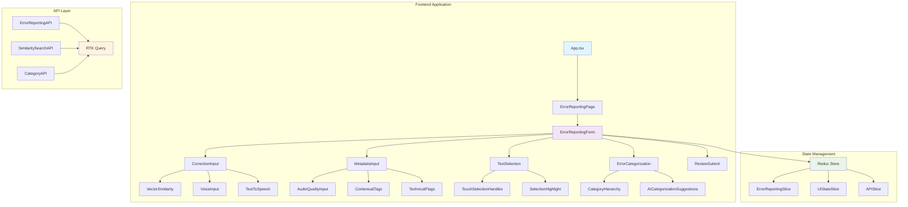
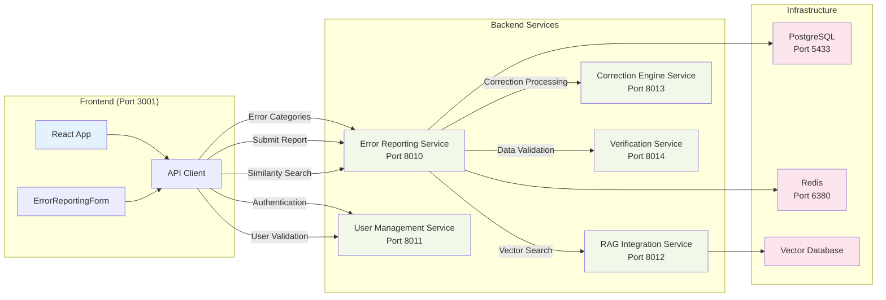
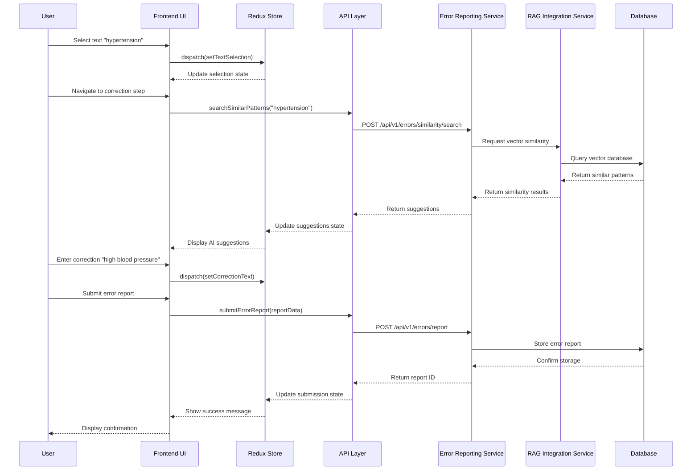
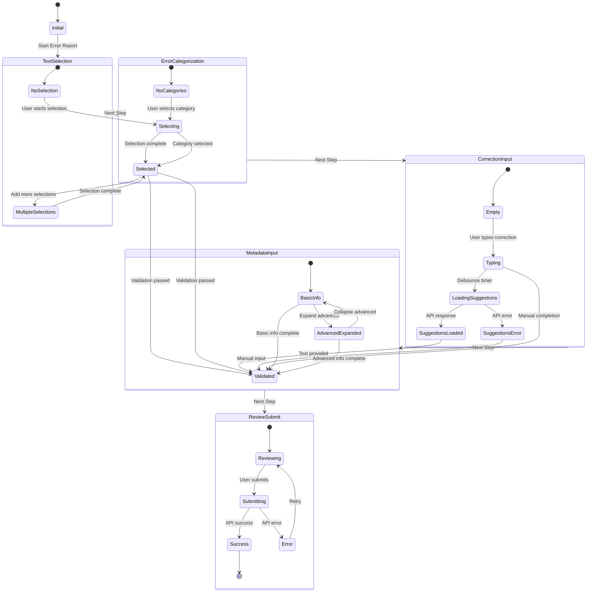
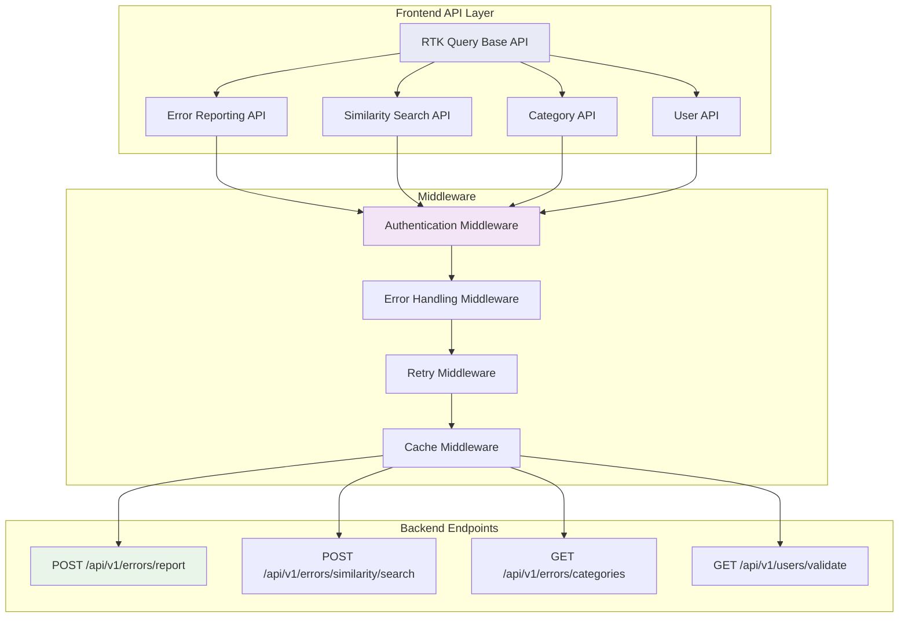
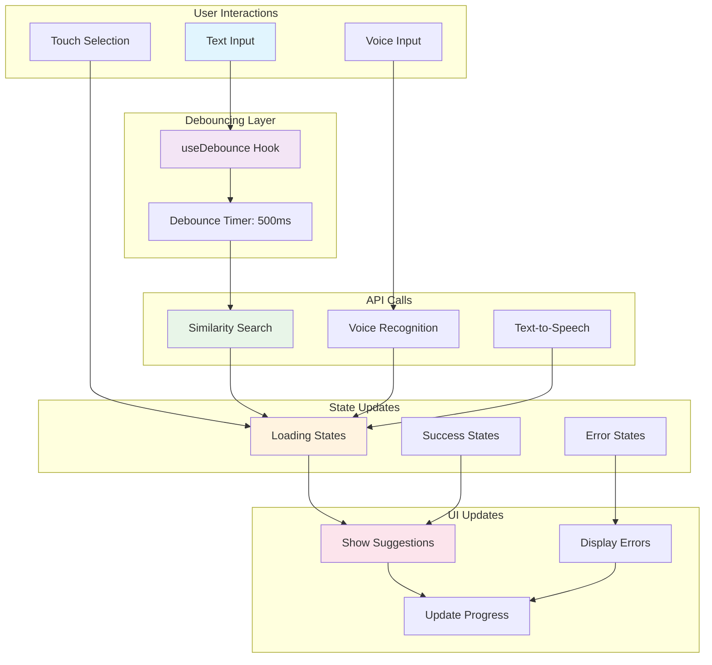
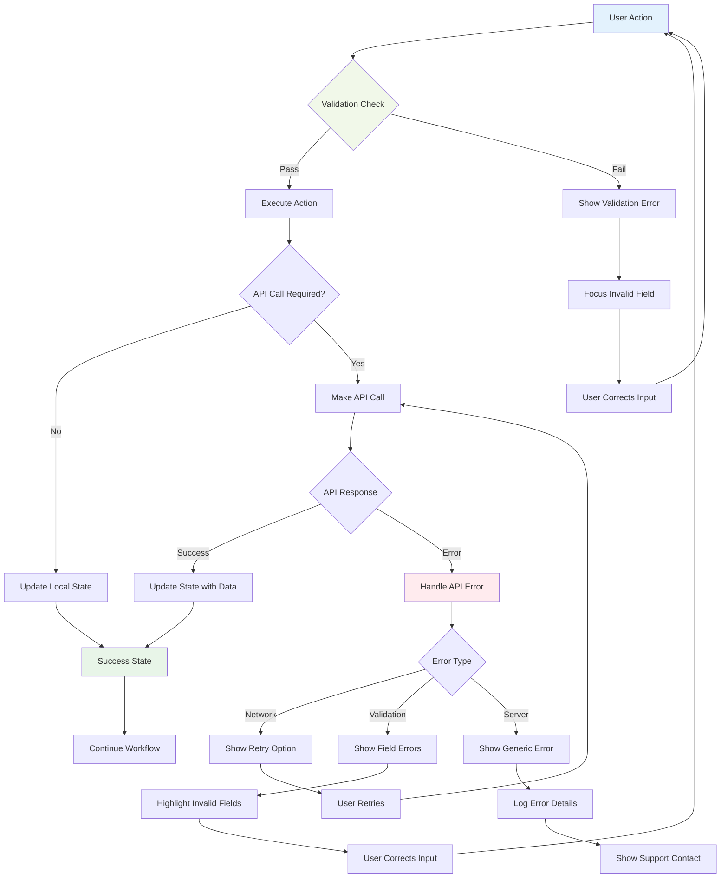
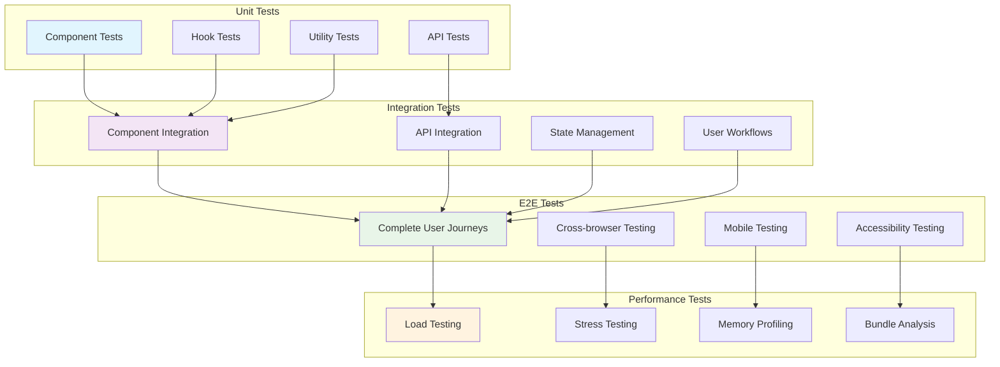

# Error Reporting Technical Architecture Diagrams

**Date:** December 19, 2024  
**Status:** Complete  
**Technology Stack:** React 18+ with TypeScript, Material-UI, FastAPI Backend  

---

## Component Architecture Diagram

## Backend Services Integration

## Data Flow Architecture

## Component State Management

## API Integration Patterns

## Real-time Features Architecture

## Error Handling Flow

## Performance Optimization Strategy

```mermaid
graph LR
    subgraph "Code Splitting"
        A[App Shell]
        B[Route-based Splitting]
        C[Component Lazy Loading]
    end
    
    subgraph "Caching Strategy"
        D[API Response Cache]
        E[Component Memoization]
        F[Static Asset Cache]
    end
    
    subgraph "Bundle Optimization"
        G[Tree Shaking]
        H[Minification]
        I[Compression]
    end
    
    subgraph "Runtime Optimization"
        J[Virtual Scrolling]
        K[Debounced API Calls]
        L[Progressive Loading]
    end
    
    A --> B
    B --> C
    
    D --> E
    E --> F
    
    G --> H
    H --> I
    
    J --> K
    K --> L
    
    C --> D
    F --> G
    I --> J
    
    style A fill:#e8eaf6
    style D fill:#f3e5f5
    style G fill:#e8f5e8
    style J fill:#fff3e0
```

## Testing Architecture

---

These technical diagrams provide a comprehensive view of the Error Reporting system architecture, showing component relationships, data flow, state management, API integration patterns, and testing strategies. They serve as a technical reference for developers and architects working on the system.
