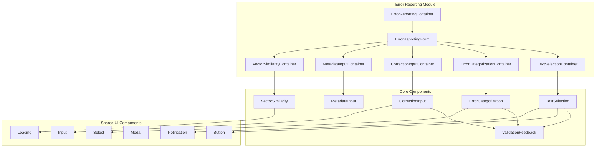
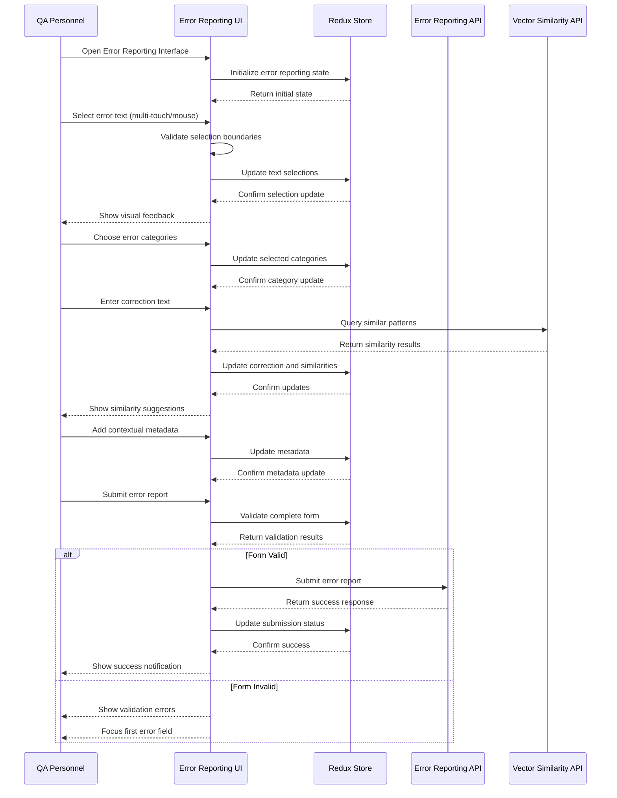

# Error Reporting UI/UX Implementation Design

**Document Version:** 1.0  
**Date:** December 19, 2024  
**Status:** Implementation Ready  
**Technology Stack:** React 18+ with TypeScript + Material-UI + Redux Toolkit  
**Architecture Pattern:** Hexagonal Architecture + Component-Based Design  

---

## Table of Contents

1. [Executive Summary](#executive-summary)
2. [Component Architecture](#component-architecture)
3. [User Interaction Flows](#user-interaction-flows)
4. [State Management Design](#state-management-design)
5. [API Integration Patterns](#api-integration-patterns)
6. [Responsive Design Implementation](#responsive-design-implementation)
7. [Accessibility Implementation](#accessibility-implementation)
8. [Testing Strategy](#testing-strategy)

---

## 1. Executive Summary

### 1.1 Implementation Overview

This document provides detailed UI/UX implementation specifications for the Error Reporting functionality based on the comprehensive requirements in the ASR Error Reporting PRD. The implementation follows Hexagonal Architecture principles with React 18+ and TypeScript, ensuring clean separation between UI components and business logic.

### 1.2 Key Features Implementation

- **Advanced Text Selection (US-1.1)**: Multi-touch and non-contiguous text selection with visual feedback
- **Speaker Association (US-1.2)**: Intelligent speaker identification and validation
- **Error Categorization (US-1.3)**: AI-assisted categorization with custom category support
- **Correction Provision (US-1.4)**: Voice input and real-time validation
- **Contextual Metadata (US-1.5)**: Rich metadata capture with audio quality indicators
- **Vector Similarity Analysis (US-1.6)**: Real-time similarity search and pattern recognition

### 1.3 Technology Integration

- **Frontend Framework**: React 18+ with Concurrent Features and Suspense
- **State Management**: Redux Toolkit with RTK Query for API integration
- **UI Library**: Material-UI v5+ with custom theming and responsive design
- **Backend Integration**: Python + FastAPI microservices via Hexagonal adapters
- **Testing**: Vitest + React Testing Library + Playwright for E2E

---

## 2. Component Architecture

### 2.1 Component Hierarchy



### 2.2 Container Components

#### 2.2.1 ErrorReportingContainer
```typescript
interface ErrorReportingContainerProps {
  jobId: string;
  speakerId: string;
  documentText: string;
  onSubmit: (report: SubmitErrorReportRequest) => Promise<void>;
  onCancel: () => void;
}

const ErrorReportingContainer: React.FC<ErrorReportingContainerProps> = ({
  jobId,
  speakerId,
  documentText,
  onSubmit,
  onCancel
}) => {
  // State management with Redux
  const dispatch = useAppDispatch();
  const { 
    textSelections, 
    selectedCategories, 
    correctionText, 
    metadata,
    similarPatterns,
    validationErrors,
    isSubmitting 
  } = useAppSelector(selectErrorReportingState);
  
  // Form validation
  const { isValid, errors } = useErrorReportValidation({
    textSelections,
    selectedCategories,
    correctionText,
    metadata
  });
  
  // API integration
  const [submitErrorReport] = useSubmitErrorReportMutation();
  const { data: similarityResults } = useVectorSimilarityQuery({
    text: correctionText,
    speakerId,
    threshold: 0.8
  });
  
  return (
    <ErrorReportingForm
      jobId={jobId}
      speakerId={speakerId}
      documentText={documentText}
      onSubmit={handleSubmit}
      onCancel={onCancel}
      isValid={isValid}
      errors={errors}
      isSubmitting={isSubmitting}
    />
  );
};
```

#### 2.2.2 TextSelectionContainer
```typescript
interface TextSelectionContainerProps {
  documentText: string;
  selections: TextSelection[];
  onSelectionChange: (selections: TextSelection[]) => void;
  maxSelections?: number;
  allowOverlapping?: boolean;
}

const TextSelectionContainer: React.FC<TextSelectionContainerProps> = ({
  documentText,
  selections,
  onSelectionChange,
  maxSelections = 10,
  allowOverlapping = false
}) => {
  // Touch and gesture handling
  const {
    handleTouchStart,
    handleTouchMove,
    handleTouchEnd,
    isSelecting
  } = useTouchTextSelection({
    onSelectionComplete: onSelectionChange,
    maxSelections,
    allowOverlapping
  });

  // Keyboard navigation
  const {
    focusedIndex,
    handleKeyDown
  } = useKeyboardNavigation(selections, onSelectionChange);

  // Accessibility announcements
  const { announce } = useScreenReaderAnnouncements();

  return (
    <TextSelection
      text={documentText}
      selections={selections}
      onSelectionChange={onSelectionChange}
      onTouchStart={handleTouchStart}
      onTouchMove={handleTouchMove}
      onTouchEnd={handleTouchEnd}
      onKeyDown={handleKeyDown}
      focusedIndex={focusedIndex}
      announce={announce}
      maxSelections={maxSelections}
      allowOverlapping={allowOverlapping}
    />
  );
};
```

### 2.3 Presentation Components

#### 2.3.1 Enhanced TextSelection Component
```typescript
interface TextSelectionProps {
  text: string;
  selections: TextSelection[];
  onSelectionChange: (selections: TextSelection[]) => void;
  onTouchStart?: (event: TouchEvent) => void;
  onTouchMove?: (event: TouchEvent) => void;
  onTouchEnd?: (event: TouchEvent) => void;
  onKeyDown?: (event: KeyboardEvent) => void;
  focusedIndex?: number;
  announce?: (message: string) => void;
  maxSelections?: number;
  allowOverlapping?: boolean;
  disabled?: boolean;
}

const TextSelection: React.FC<TextSelectionProps> = ({
  text,
  selections,
  onSelectionChange,
  onTouchStart,
  onTouchMove,
  onTouchEnd,
  onKeyDown,
  focusedIndex = 0,
  announce,
  maxSelections = 10,
  allowOverlapping = false,
  disabled = false
}) => {
  const theme = useTheme();
  const isMobile = useMediaQuery(theme.breakpoints.down('md'));
  const containerRef = useRef<HTMLDivElement>(null);

  // Selection state
  const [isSelecting, setIsSelecting] = useState(false);
  const [selectionStart, setSelectionStart] = useState<number | null>(null);
  const [selectionEnd, setSelectionEnd] = useState<number | null>(null);

  // Multi-touch gesture recognition
  const [touchPoints, setTouchPoints] = useState<TouchPoint[]>([]);
  const [gestureType, setGestureType] = useState<GestureType>('none');

  // Handle multi-touch selection
  const handleMultiTouchSelection = useCallback((touches: TouchList) => {
    if (touches.length === 2) {
      const touch1 = touches[0];
      const touch2 = touches[1];

      const startPos = getTextPositionFromPoint(touch1.clientX, touch1.clientY);
      const endPos = getTextPositionFromPoint(touch2.clientX, touch2.clientY);

      if (startPos !== null && endPos !== null) {
        const start = Math.min(startPos, endPos);
        const end = Math.max(startPos, endPos);

        const newSelection: TextSelection = {
          selectionId: generateSelectionId(),
          text: text.slice(start, end),
          startPosition: start,
          endPosition: end
        };

        handleNewSelection(newSelection);
      }
    }
  }, [text]);

  return (
    <Box
      ref={containerRef}
      role="textbox"
      aria-label="Document text for error selection"
      aria-describedby="selection-instructions"
      tabIndex={disabled ? -1 : 0}
      data-testid="text-selection-container"
      className={`text-selection-container ${disabled ? 'disabled' : ''}`}
      onKeyDown={onKeyDown}
      onTouchStart={onTouchStart}
      onTouchMove={onTouchMove}
      onTouchEnd={onTouchEnd}
      sx={{
        position: 'relative',
        padding: 2,
        border: `1px solid ${theme.palette.divider}`,
        borderRadius: 1,
        backgroundColor: disabled
          ? theme.palette.action.disabled
          : theme.palette.background.paper,
        cursor: disabled ? 'not-allowed' : 'text',
        userSelect: disabled ? 'none' : 'text',
        '&:focus': {
          outline: `2px solid ${theme.palette.primary.main}`,
          outlineOffset: 2,
        },
      }}
    >
      {/* Selection Instructions */}
      <Box id="selection-instructions" className="sr-only">
        Use mouse or touch to select text. Hold Ctrl/Cmd for multiple selections.
        Use arrow keys to navigate selections, Enter to remove focused selection.
        Maximum {maxSelections} selections allowed.
      </Box>

      {/* Selection Controls */}
      {selections.length > 0 && (
        <SelectionControls
          selections={selections}
          onClearAll={() => {
            onSelectionChange([]);
            announce?.('All selections cleared');
          }}
          disabled={disabled}
        />
      )}

      {/* Selectable Text */}
      <Box
        data-testid="selectable-text"
        className={isMobile ? 'touch-selectable' : ''}
        sx={{
          lineHeight: 1.6,
          fontSize: '1rem',
          fontFamily: 'inherit',
          whiteSpace: 'pre-wrap',
          wordBreak: 'break-word',
          minHeight: '200px',
        }}
      >
        {/* Text content with highlights will be rendered here */}
      </Box>

      {/* Touch Indicator */}
      {isMobile && !disabled && (
        <TouchIndicator />
      )}

      {/* Live Region for Announcements */}
      <Box
        role="status"
        aria-live="polite"
        aria-atomic="true"
        className="sr-only"
      >
        {/* Announcements will be inserted here */}
      </Box>
    </Box>
  );
};
```

---

## 3. User Interaction Flows

### 3.1 Error Reporting Workflow



### 3.2 Touch Interaction Patterns

#### 3.2.1 Multi-Touch Text Selection
- **Single Touch**: Standard text selection with drag handles
- **Two-Finger Touch**: Precise selection between two touch points
- **Long Press**: Context menu for selection options
- **Pinch Gesture**: Zoom in/out for better text visibility

---

## 4. State Management Design

### 4.1 Redux Store Structure

```typescript
interface ErrorReportingState {
  textSelections: TextSelection[];
  selectedCategories: ErrorCategory[];
  correctionText: string;
  metadata: ErrorMetadata;
  isSubmitting: boolean;
  validationErrors: ValidationError[];
  currentStep: ErrorReportingStep;
  similarPatterns: SimilarityResult[];
  speakerProfiles: SpeakerProfile[];
  categoryOptions: ErrorCategory[];
}
```

---

## 5. API Integration Patterns

### 5.1 RTK Query API Slice

```typescript
export const errorReportingApi = createApi({
  reducerPath: 'errorReportingApi',
  baseQuery: fetchBaseQuery({
    baseUrl: '/api/v1/errors',
    prepareHeaders: (headers, { getState }) => {
      const token = (getState() as RootState).auth.token;
      if (token) {
        headers.set('authorization', `Bearer ${token}`);
      }
      return headers;
    },
  }),
  tagTypes: ['ErrorReport', 'SimilarityPattern', 'ErrorCategory'],

  endpoints: (builder) => ({
    submitErrorReport: builder.mutation<
      SubmitErrorReportResponse,
      SubmitErrorReportRequest
    >({
      query: (errorReport) => ({
        url: '/report',
        method: 'POST',
        body: errorReport,
      }),
      invalidatesTags: ['ErrorReport'],
    }),

    searchSimilarPatterns: builder.query<
      SimilarityResult[],
      SimilaritySearchRequest
    >({
      query: ({ text, speakerId, threshold = 0.8 }) => ({
        url: '/similarity/search',
        params: { text, speakerId, threshold },
      }),
      providesTags: ['SimilarityPattern'],
    }),
  }),
});
```

---

## 6. Responsive Design Implementation

### 6.1 Breakpoint Strategy

```typescript
const theme = createTheme({
  breakpoints: {
    values: {
      xs: 0,     // Mobile portrait
      sm: 600,   // Mobile landscape
      md: 900,   // Tablet
      lg: 1200,  // Desktop
      xl: 1536,  // Large desktop
    },
  },
});

// Responsive component patterns
const useResponsiveLayout = () => {
  const theme = useTheme();
  const isMobile = useMediaQuery(theme.breakpoints.down('md'));
  const isTablet = useMediaQuery(theme.breakpoints.between('md', 'lg'));
  const isDesktop = useMediaQuery(theme.breakpoints.up('lg'));

  return {
    isMobile,
    isTablet,
    isDesktop,
    columns: isMobile ? 1 : isTablet ? 2 : 3,
    spacing: isMobile ? 1 : 2,
    fontSize: isMobile ? '0.875rem' : '1rem',
  };
};
```

---

## 7. Accessibility Implementation

### 7.1 WCAG 2.1 AA Compliance

```typescript
// Screen reader announcements
const useScreenReaderAnnouncements = () => {
  const [announcement, setAnnouncement] = useState('');

  const announce = useCallback((message: string) => {
    setAnnouncement(message);
    setTimeout(() => setAnnouncement(''), 1000);
  }, []);

  return { announcement, announce };
};

// Keyboard navigation
const useKeyboardNavigation = (
  selections: TextSelection[],
  onSelectionChange: (selections: TextSelection[]) => void
) => {
  const [focusedIndex, setFocusedIndex] = useState(0);

  const handleKeyDown = useCallback((event: KeyboardEvent) => {
    switch (event.key) {
      case 'ArrowLeft':
      case 'ArrowUp':
        event.preventDefault();
        setFocusedIndex(prev => Math.max(0, prev - 1));
        break;
      case 'ArrowRight':
      case 'ArrowDown':
        event.preventDefault();
        setFocusedIndex(prev => Math.min(selections.length - 1, prev + 1));
        break;
      case 'Enter':
      case ' ':
        event.preventDefault();
        if (selections[focusedIndex]) {
          const newSelections = selections.filter((_, index) => index !== focusedIndex);
          onSelectionChange(newSelections);
          setFocusedIndex(Math.min(focusedIndex, newSelections.length - 1));
        }
        break;
    }
  }, [selections, focusedIndex, onSelectionChange]);

  return { focusedIndex, handleKeyDown };
};
```

---

## 8. Testing Strategy

### 8.1 Component Testing Approach

```typescript
// Test utilities
export const renderWithProviders = (
  ui: React.ReactElement,
  {
    preloadedState = {},
    store = setupStore(preloadedState),
    ...renderOptions
  } = {}
) => {
  function Wrapper({ children }: { children: React.ReactNode }) {
    return (
      <Provider store={store}>
        <ThemeProvider theme={theme}>
          <BrowserRouter>
            {children}
          </BrowserRouter>
        </ThemeProvider>
      </Provider>
    );
  }

  return { store, ...render(ui, { wrapper: Wrapper, ...renderOptions }) };
};

// Mock data factories
export const createMockTextSelection = (overrides?: Partial<TextSelection>): TextSelection => ({
  selectionId: 'test-selection-1',
  text: 'sample error text',
  startPosition: 10,
  endPosition: 27,
  confidence: 0.95,
  timestamp: Date.now(),
  ...overrides,
});

export const createMockErrorReport = (overrides?: Partial<SubmitErrorReportRequest>): SubmitErrorReportRequest => ({
  jobId: 'test-job-1',
  speakerId: 'speaker-1',
  textSelections: [createMockTextSelection()],
  selectedCategories: [{ categoryId: 'pronunciation', name: 'Pronunciation' }],
  correctionText: 'sample corrected text',
  metadata: {
    audioQuality: 'good',
    backgroundNoise: 'low',
    speakerClarity: 'clear',
    contextualNotes: 'Test notes',
    urgencyLevel: 'medium'
  },
  ...overrides,
});
```

### 8.2 Test Coverage Requirements

- **Unit Tests**: 90%+ coverage for all components and hooks
- **Integration Tests**: Complete user workflows
- **E2E Tests**: Critical user journeys
- **Accessibility Tests**: WCAG 2.1 AA compliance
- **Performance Tests**: Interaction responsiveness
- **Cross-browser Tests**: Chrome, Firefox, Safari, Edge

---

## Implementation Checklist

### Phase 1: Core Components
- [ ] TextSelection component with multi-touch support
- [ ] ErrorCategorization component with AI assistance
- [ ] CorrectionInput component with voice input
- [ ] MetadataInput component with rich controls
- [ ] VectorSimilarity component with real-time search

### Phase 2: Integration
- [ ] Redux store setup and slices
- [ ] RTK Query API integration
- [ ] Form validation and error handling
- [ ] Responsive design implementation
- [ ] Accessibility features

### Phase 3: Testing
- [ ] Unit tests for all components
- [ ] Integration tests for workflows
- [ ] E2E tests for user journeys
- [ ] Performance optimization
- [ ] Cross-browser compatibility

### Phase 4: Documentation
- [ ] Component documentation
- [ ] API integration guide
- [ ] Accessibility compliance report
- [ ] Performance benchmarks

### 3.2 Touch Interaction Patterns

#### 3.2.1 Multi-Touch Text Selection
- **Single Touch**: Standard text selection with drag handles
- **Two-Finger Touch**: Precise selection between two touch points
- **Long Press**: Context menu for selection options
- **Pinch Gesture**: Zoom in/out for better text visibility

#### 3.2.2 Gesture Recognition
```typescript
interface TouchGesture {
  type: 'single' | 'multi' | 'long-press' | 'pinch';
  startTime: number;
  duration: number;
  touchPoints: TouchPoint[];
  velocity: number;
}

const useTouchGestureRecognition = () => {
  const [currentGesture, setCurrentGesture] = useState<TouchGesture | null>(null);

  const recognizeGesture = useCallback((touches: TouchList, timeStamp: number) => {
    if (touches.length === 1) {
      // Single touch - check for long press
      const touch = touches[0];
      const duration = timeStamp - (currentGesture?.startTime || timeStamp);

      if (duration > 500) { // 500ms for long press
        return { type: 'long-press', duration, touchPoints: [touch] };
      }

      return { type: 'single', duration, touchPoints: [touch] };
    } else if (touches.length === 2) {
      // Multi-touch - check for pinch or selection
      const touch1 = touches[0];
      const touch2 = touches[1];
      const distance = calculateDistance(touch1, touch2);

      if (currentGesture?.type === 'multi') {
        const previousDistance = calculateDistance(
          currentGesture.touchPoints[0],
          currentGesture.touchPoints[1]
        );

        if (Math.abs(distance - previousDistance) > 10) {
          return { type: 'pinch', touchPoints: [touch1, touch2] };
        }
      }

      return { type: 'multi', touchPoints: [touch1, touch2] };
    }

    return null;
  }, [currentGesture]);

  return { currentGesture, recognizeGesture };
};
```

---

## 4. State Management Design

### 4.1 Redux Store Structure

```typescript
interface ErrorReportingState {
  // Form data
  textSelections: TextSelection[];
  selectedCategories: ErrorCategory[];
  correctionText: string;
  metadata: ErrorMetadata;

  // UI state
  isSubmitting: boolean;
  validationErrors: ValidationError[];
  currentStep: ErrorReportingStep;

  // API data
  similarPatterns: SimilarityResult[];
  speakerProfiles: SpeakerProfile[];
  categoryOptions: ErrorCategory[];

  // Performance tracking
  selectionStartTime: number | null;
  interactionMetrics: InteractionMetric[];
}

interface TextSelection {
  selectionId: string;
  text: string;
  startPosition: number;
  endPosition: number;
  confidence?: number;
  timestamp: number;
}

interface ErrorMetadata {
  audioQuality: AudioQualityIndicator;
  backgroundNoise: NoiseLevel;
  speakerClarity: ClarityLevel;
  contextualNotes: string;
  urgencyLevel: UrgencyLevel;
}

interface SimilarityResult {
  patternId: string;
  similarText: string;
  confidence: number;
  frequency: number;
  suggestedCorrection: string;
  speakerIds: string[];
}
```

### 4.2 Redux Toolkit Slices

```typescript
const errorReportingSlice = createSlice({
  name: 'errorReporting',
  initialState,
  reducers: {
    // Text selection actions
    addTextSelection: (state, action: PayloadAction<TextSelection>) => {
      if (state.textSelections.length < 10) {
        state.textSelections.push(action.payload);
        state.selectionStartTime = Date.now();
      }
    },

    removeTextSelection: (state, action: PayloadAction<string>) => {
      state.textSelections = state.textSelections.filter(
        selection => selection.selectionId !== action.payload
      );
    },

    updateTextSelection: (state, action: PayloadAction<{
      selectionId: string;
      updates: Partial<TextSelection>;
    }>) => {
      const index = state.textSelections.findIndex(
        selection => selection.selectionId === action.payload.selectionId
      );
      if (index !== -1) {
        state.textSelections[index] = {
          ...state.textSelections[index],
          ...action.payload.updates
        };
      }
    },

    clearAllSelections: (state) => {
      state.textSelections = [];
      state.selectionStartTime = null;
    },

    // Category actions
    toggleCategory: (state, action: PayloadAction<ErrorCategory>) => {
      const index = state.selectedCategories.findIndex(
        cat => cat.categoryId === action.payload.categoryId
      );

      if (index !== -1) {
        state.selectedCategories.splice(index, 1);
      } else {
        state.selectedCategories.push(action.payload);
      }
    },

    // Correction actions
    updateCorrectionText: (state, action: PayloadAction<string>) => {
      state.correctionText = action.payload;
    },

    // Metadata actions
    updateMetadata: (state, action: PayloadAction<Partial<ErrorMetadata>>) => {
      state.metadata = { ...state.metadata, ...action.payload };
    },

    // Validation actions
    setValidationErrors: (state, action: PayloadAction<ValidationError[]>) => {
      state.validationErrors = action.payload;
    },

    clearValidationErrors: (state) => {
      state.validationErrors = [];
    },

    // Step navigation
    setCurrentStep: (state, action: PayloadAction<ErrorReportingStep>) => {
      state.currentStep = action.payload;
    },

    // Performance tracking
    addInteractionMetric: (state, action: PayloadAction<InteractionMetric>) => {
      state.interactionMetrics.push(action.payload);
    },

    // Reset form
    resetForm: (state) => {
      return {
        ...initialState,
        categoryOptions: state.categoryOptions,
        speakerProfiles: state.speakerProfiles
      };
    }
  },

  extraReducers: (builder) => {
    builder
      // Submit error report
      .addCase(submitErrorReport.pending, (state) => {
        state.isSubmitting = true;
        state.validationErrors = [];
      })
      .addCase(submitErrorReport.fulfilled, (state, action) => {
        state.isSubmitting = false;
        // Reset form after successful submission
        return {
          ...initialState,
          categoryOptions: state.categoryOptions,
          speakerProfiles: state.speakerProfiles
        };
      })
      .addCase(submitErrorReport.rejected, (state, action) => {
        state.isSubmitting = false;
        state.validationErrors = action.payload?.validationErrors || [];
      })

      // Vector similarity search
      .addCase(searchSimilarPatterns.fulfilled, (state, action) => {
        state.similarPatterns = action.payload;
      });
  }
});
```

---

## 5. API Integration Patterns

### 5.1 RTK Query API Slice

```typescript
export const errorReportingApi = createApi({
  reducerPath: 'errorReportingApi',
  baseQuery: fetchBaseQuery({
    baseUrl: '/api/v1/errors',
    prepareHeaders: (headers, { getState }) => {
      const token = (getState() as RootState).auth.token;
      if (token) {
        headers.set('authorization', `Bearer ${token}`);
      }
      return headers;
    },
  }),
  tagTypes: ['ErrorReport', 'SimilarityPattern', 'ErrorCategory'],

  endpoints: (builder) => ({
    // Submit error report
    submitErrorReport: builder.mutation<
      SubmitErrorReportResponse,
      SubmitErrorReportRequest
    >({
      query: (errorReport) => ({
        url: '/report',
        method: 'POST',
        body: errorReport,
      }),
      invalidatesTags: ['ErrorReport'],
    }),

    // Search similar patterns
    searchSimilarPatterns: builder.query<
      SimilarityResult[],
      SimilaritySearchRequest
    >({
      query: ({ text, speakerId, threshold = 0.8 }) => ({
        url: '/similarity/search',
        params: { text, speakerId, threshold },
      }),
      providesTags: ['SimilarityPattern'],
    }),

    // Get error categories
    getErrorCategories: builder.query<ErrorCategory[], void>({
      query: () => '/categories',
      providesTags: ['ErrorCategory'],
    }),

    // Get speaker profiles
    getSpeakerProfiles: builder.query<SpeakerProfile[], string>({
      query: (jobId) => `/speakers/${jobId}`,
    }),

    // Validate error report
    validateErrorReport: builder.mutation<
      ValidationResult,
      SubmitErrorReportRequest
    >({
      query: (errorReport) => ({
        url: '/validate',
        method: 'POST',
        body: errorReport,
      }),
    }),
  }),
});

export const {
  useSubmitErrorReportMutation,
  useSearchSimilarPatternsQuery,
  useGetErrorCategoriesQuery,
  useGetSpeakerProfilesQuery,
  useValidateErrorReportMutation,
} = errorReportingApi;
```
