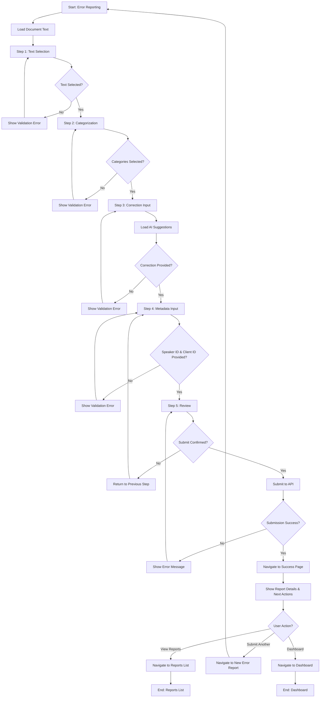
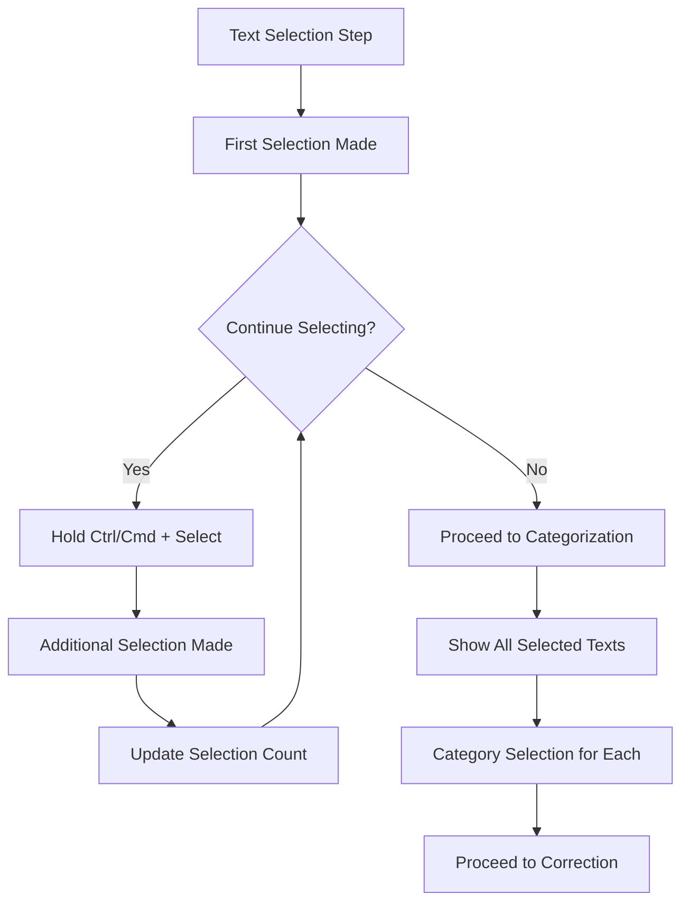
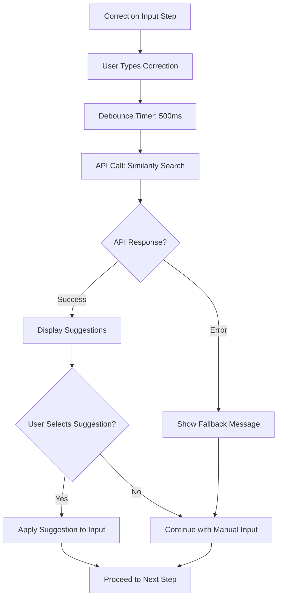
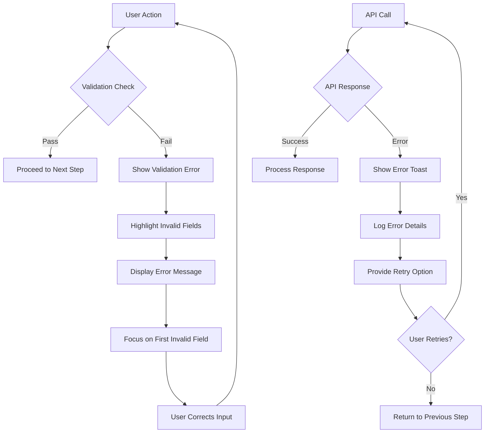
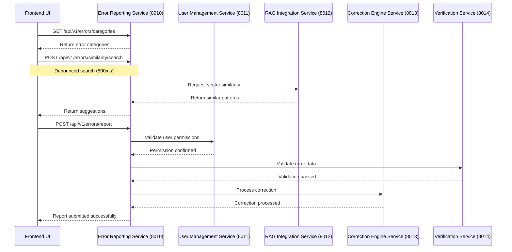
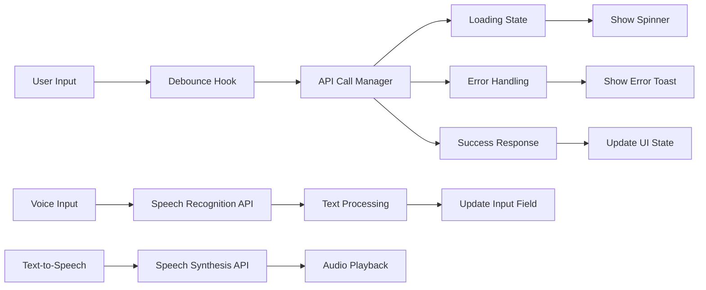
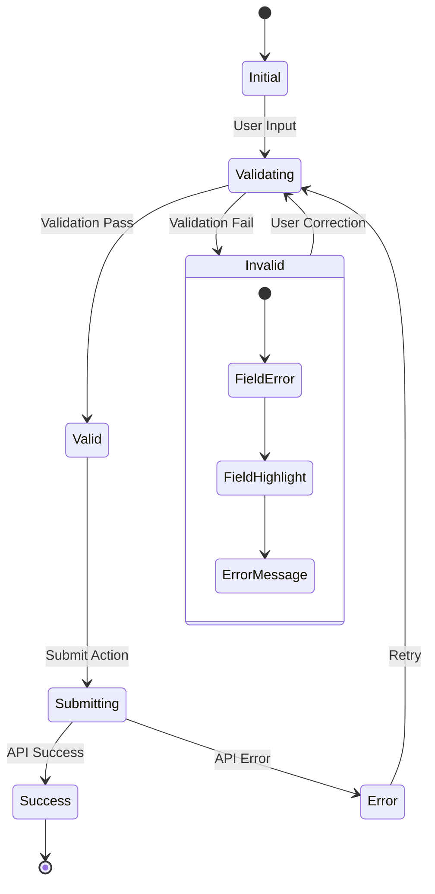
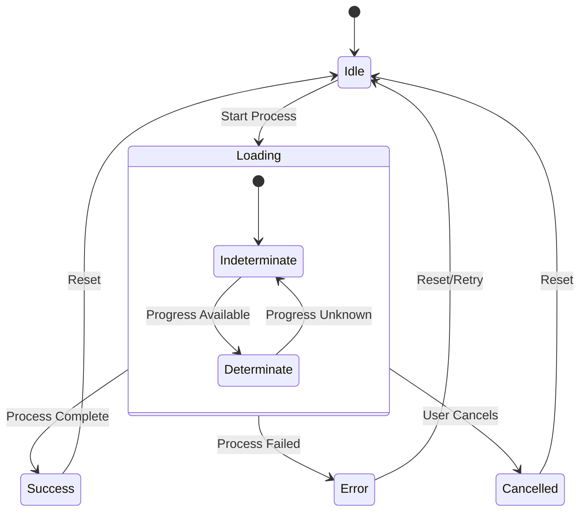
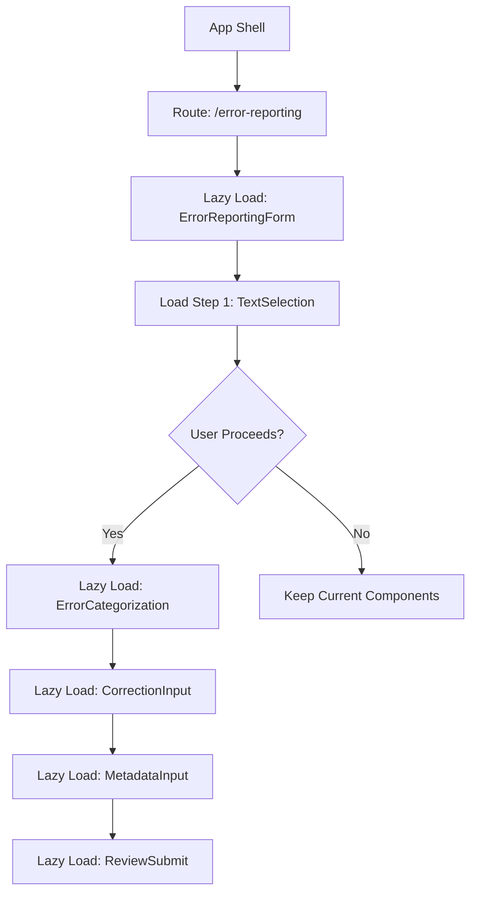

# Error Reporting Wireframes and User Flows

**Date:** December 19, 2024  
**Status:** Complete  
**Technology Stack:** React 18+ with TypeScript, Material-UI, FastAPI Backend  

---

## Overview

This document provides comprehensive wireframe flows for the Error Reporting functionality, aligned with the implemented React components and FastAPI backend services. The wireframes demonstrate the complete user journey from error identification to report submission.

---

## 1. Page-Level Wireframes

### 1.1 Main Error Reporting Interface - Desktop Layout

```
┌─────────────────────────────────────────────────────────────────────────────────┐
│ RAG Interface - Error Reporting                                    [User Menu] │
├─────────────────────────────────────────────────────────────────────────────────┤
│                                                                                 │
│ ┌─ Step Progress Indicator (Horizontal) ─────────────────────────────────────┐ │
│ │ ● Text Selection → ○ Categorization → ○ Correction → ○ Metadata → ○ Review │ │
│ │ Step 1 of 5: Select Error Text                                             │ │
│ └─────────────────────────────────────────────────────────────────────────────┘ │
│                                                                                 │
│ ┌─ Main Content Area ──────────────────────────────────────────────────────┐   │
│ │                                                                          │   │
│ │ ┌─ TextSelection Component ─────────────────────────────────────────┐    │   │
│ │ │ Document Text Area (Selectable)                                   │    │   │
│ │ │ ┌────────────────────────────────────────────────────────────┐   │    │   │
│ │ │ │ The patient has a history of [hypertension] and diabetes. │   │    │   │
│ │ │ │ The doctor prescribed medication for the condition.        │   │    │   │
│ │ │ │                                                            │   │    │   │
│ │ │ │ [Selected text highlighted in blue]                       │   │    │   │
│ │ │ └────────────────────────────────────────────────────────────┘   │    │   │
│ │ │                                                                  │    │   │
│ │ │ Selection Info: 1 selection made                                │    │   │
│ │ │ [Clear Selections] [🎤 Voice Input]                             │    │   │
│ │ └──────────────────────────────────────────────────────────────────┘    │   │
│ │                                                                          │   │
│ └──────────────────────────────────────────────────────────────────────────┘   │
│                                                                                 │
│ ┌─ Action Bar ─────────────────────────────────────────────────────────────┐   │
│ │ [Cancel]                                    [Back] [Next: Categorize →] │   │
│ └─────────────────────────────────────────────────────────────────────────────┘ │
│                                                                                 │
└─────────────────────────────────────────────────────────────────────────────────┘
```

### 1.2 Mobile Layout - Vertical Stepper

```
┌─────────────────────────────┐
│ ☰ RAG Interface        👤  │
├─────────────────────────────┤
│                             │
│ ┌─ Vertical Stepper ──────┐ │
│ │ ● 1. Text Selection     │ │
│ │ ○ 2. Categorization     │ │
│ │ ○ 3. Correction         │ │
│ │ ○ 4. Metadata           │ │
│ │ ○ 5. Review             │ │
│ └─────────────────────────┘ │
│                             │
│ ┌─ Touch Selection Area ──┐ │
│ │ Document Text           │ │
│ │ ┌─────────────────────┐ │ │
│ │ │ The patient has a   │ │ │
│ │ │ history of          │ │ │
│ │ │ [hypertension] and  │ │ │
│ │ │ diabetes.           │ │ │
│ │ │                     │ │ │
│ │ │ ◐ Selection Handle  │ │ │
│ │ └─────────────────────┘ │ │
│ │                         │ │
│ │ 📱 Touch Indicator      │ │
│ │ 1 selection made        │ │
│ └─────────────────────────┘ │
│                             │
│ ┌─ Mobile Actions ────────┐ │
│ │ [🎤] [🔊] [❌ Clear]    │ │
│ └─────────────────────────┘ │
│                             │
│ [Cancel]        [Next →]   │
│                             │
└─────────────────────────────┘
```

### 1.2.1 Mobile Layout - Step 4: Metadata Input

```
┌─────────────────────────────┐
│ ☰ RAG Interface        👤  │
├─────────────────────────────┤
│                             │
│ ┌─ Vertical Stepper ──────┐ │
│ │ ✓ 1. Text Selection     │ │
│ │ ✓ 2. Categorization     │ │
│ │ ✓ 3. Correction         │ │
│ │ ● 4. Metadata           │ │
│ │ ○ 5. Review             │ │
│ └─────────────────────────┘ │
│                             │
│ ┌─ Required Fields ───────┐ │
│ │ Speaker ID: *           │ │
│ │ ┌─────────────────────┐ │ │
│ │ │ speaker-456         │ │ │
│ │ └─────────────────────┘ │ │
│ │                         │ │
│ │ Client ID: *            │ │
│ │ ┌─────────────────────┐ │ │
│ │ │ client-789          │ │ │
│ │ └─────────────────────┘ │ │
│ └─────────────────────────┘ │
│                             │
│ ┌─ Audio Quality ─────────┐ │
│ │ Quality: [Good ▼]       │ │
│ │ Noise: [Low ▼]          │ │
│ │ Clarity: [Clear ▼]      │ │
│ │                         │ │
│ │ Priority:               │ │
│ │ [Low][●Med][High]       │ │
│ └─────────────────────────┘ │
│                             │
│ ┌─ Optional Notes ────────┐ │
│ │ ┌─────────────────────┐ │ │
│ │ │ Medical term error  │ │ │
│ │ │                     │ │ │
│ │ └─────────────────────┘ │ │
│ │ 18/500 chars            │ │
│ └─────────────────────────┘ │
│                             │
│ [Cancel]        [Next →]   │
│                             │
└─────────────────────────────┘
```

### 1.3 Step 2: Error Categorization Layout

```
┌─────────────────────────────────────────────────────────────────────────────────┐
│ RAG Interface - Error Reporting                                    [User Menu] │
├─────────────────────────────────────────────────────────────────────────────────┤
│                                                                                 │
│ ┌─ Step Progress Indicator ───────────────────────────────────────────────────┐ │
│ │ ✓ Text Selection → ● Categorization → ○ Correction → ○ Metadata → ○ Review │ │
│ │ Step 2 of 5: Categorize Errors                                             │ │
│ └─────────────────────────────────────────────────────────────────────────────┘ │
│                                                                                 │
│ ┌─ ErrorCategorization Component ─────────────────────────────────────────────┐ │
│ │                                                                             │ │
│ │ Selected Text: "hypertension"                                               │ │
│ │                                                                             │ │
│ │ ┌─ Category Groups ─────────────────────────────────────────────────────┐   │ │
│ │ │                                                                       │   │ │
│ │ │ Primary Categories:                                                   │   │ │
│ │ │ [●] Pronunciation    [○] Grammar    [○] Spelling                      │   │ │
│ │ │                                                                       │   │ │
│ │ │ Medical Subcategories:                                                │   │ │
│ │ │ [●] Medical Terminology    [○] Dosage    [○] Anatomy                  │   │ │
│ │ │                                                                       │   │ │
│ │ │ ┌─ AI Suggestions ─────────────────────────────────────────────────┐ │   │ │
│ │ │ │ 🤖 Suggested: Medical Terminology (95% confidence)              │ │   │ │
│ │ │ │ Based on: medical context, terminology pattern                  │ │   │ │
│ │ │ │ [Apply Suggestion]                                               │ │   │ │
│ │ │ └──────────────────────────────────────────────────────────────────┘ │   │ │
│ │ └───────────────────────────────────────────────────────────────────────┘   │ │
│ │                                                                             │ │
│ │ Selection Summary: 2 of 10 categories selected                             │ │
│ └─────────────────────────────────────────────────────────────────────────────┘ │
│                                                                                 │
│ ┌─ Action Bar ─────────────────────────────────────────────────────────────┐   │
│ │ [Cancel]                                    [← Back] [Next: Correct →]  │   │
│ └─────────────────────────────────────────────────────────────────────────────┘ │
│                                                                                 │
└─────────────────────────────────────────────────────────────────────────────────┘
```

### 1.4 Step 3: Correction Input with AI Integration

```
┌─────────────────────────────────────────────────────────────────────────────────┐
│ RAG Interface - Error Reporting                                    [User Menu] │
├─────────────────────────────────────────────────────────────────────────────────┤
│                                                                                 │
│ ┌─ Step Progress Indicator ───────────────────────────────────────────────────┐ │
│ │ ✓ Text Selection → ✓ Categorization → ● Correction → ○ Metadata → ○ Review │ │
│ │ Step 3 of 5: Provide Correction                                            │ │
│ └─────────────────────────────────────────────────────────────────────────────┘ │
│                                                                                 │
│ ┌─ CorrectionInput Component ─────────────────────────────────────────────────┐ │
│ │                                                                             │ │
│ │ Original Text: "hypertension"                                               │ │
│ │ [🔊 Listen to Original]                                                     │ │
│ │                                                                             │ │
│ │ ┌─ Correction Input ─────────────────────────────────────────────────────┐ │ │
│ │ │ Corrected Text: [high blood pressure                              ] │ │ │
│ │ │ [🎤 Voice Input] [🔊 Listen to Correction]                           │ │ │
│ │ │ Character Count: 18/500                                              │ │ │
│ │ └─────────────────────────────────────────────────────────────────────────┘ │ │
│ │                                                                             │ │
│ │ ┌─ VectorSimilarity Component ───────────────────────────────────────────┐ │ │
│ │ │ 🤖 AI Suggestions: 3 similar patterns found                            │ │ │
│ │ │                                                                         │ │ │
│ │ │ ┌─ Pattern 1 ─────────────────────────────────────────────────────┐   │ │ │
│ │ │ │ "high blood pressure" (95% confidence) 📋                       │   │ │ │
│ │ │ │ Original: "hypertension" → 5 occurrences, 2 speakers            │   │ │ │
│ │ │ │ [Use This Correction]                                            │   │ │ │
│ │ │ └──────────────────────────────────────────────────────────────────┘   │ │ │
│ │ │                                                                         │ │ │
│ │ │ ┌─ Pattern 2 ─────────────────────────────────────────────────────┐   │ │ │
│ │ │ │ "elevated blood pressure" (87% confidence) 📋                   │   │ │ │
│ │ │ │ Original: "hypertension" → 3 occurrences, 1 speaker             │   │ │ │
│ │ │ │ [Use This Correction]                                            │   │ │ │
│ │ │ └──────────────────────────────────────────────────────────────────┘   │ │ │
│ │ │                                                                         │ │ │
│ │ │ Showing top 2 patterns with confidence ≥ 80%                           │ │ │
│ │ └─────────────────────────────────────────────────────────────────────────┘ │ │
│ │                                                                             │ │
│ │ ✓ Validation: Correction text provided                                     │ │ │
│ └─────────────────────────────────────────────────────────────────────────────┘ │
│                                                                                 │
│ ┌─ Action Bar ─────────────────────────────────────────────────────────────┐   │
│ │ [Cancel]                                    [← Back] [Next: Metadata →] │   │
│ └─────────────────────────────────────────────────────────────────────────────┘ │
│                                                                                 │
└─────────────────────────────────────────────────────────────────────────────────┘
```

### 1.5 Step 4: Metadata Input with Expandable Sections

```
┌─────────────────────────────────────────────────────────────────────────────────┐
│ RAG Interface - Error Reporting                                    [User Menu] │
├─────────────────────────────────────────────────────────────────────────────────┤
│                                                                                 │
│ ┌─ Step Progress Indicator ───────────────────────────────────────────────────┐ │
│ │ ✓ Text Selection → ✓ Categorization → ✓ Correction → ● Metadata → ○ Review │ │
│ │ Step 4 of 5: Add Context                                                   │ │
│ └─────────────────────────────────────────────────────────────────────────────┘ │
│                                                                                 │
│ ┌─ MetadataInput Component ───────────────────────────────────────────────────┐ │
│ │                                                                             │ │
│ │ ▼ Required Information                                                      │ │
│ │ ┌─────────────────────────────────────────────────────────────────────────┐ │ │
│ │ │ Speaker ID: [speaker-456                    ] *Required                 │ │ │
│ │ │ Client ID:  [client-789                     ] *Required                 │ │ │
│ │ └─────────────────────────────────────────────────────────────────────────┘ │ │
│ │                                                                             │ │
│ │ ▼ Audio Quality Assessment                                                  │ │
│ │ ┌─────────────────────────────────────────────────────────────────────────┐ │ │
│ │ │ Overall Audio Quality: [Good ▼]                                         │ │ │
│ │ │ Background Noise: [Low ▼]                                               │ │ │
│ │ │ Speaker Clarity: [Clear ▼]                                              │ │ │
│ │ │                                                                         │ │ │
│ │ │ Urgency Level:                                                          │ │ │
│ │ │ [Low] [●Medium] [High Priority]                                         │ │ │
│ │ └─────────────────────────────────────────────────────────────────────────┘ │ │
│ │                                                                             │ │
│ │ ▶ Advanced Context (Optional)                                               │ │
│ │ ┌─────────────────────────────────────────────────────────────────────────┐ │ │
│ │ │ [Click to expand advanced options]                                      │ │ │
│ │ └─────────────────────────────────────────────────────────────────────────┘ │ │
│ │                                                                             │ │
│ │ ┌─ Additional Notes ─────────────────────────────────────────────────────┐ │ │
│ │ │ Notes (Optional):                                                       │ │ │
│ │ │ ┌─────────────────────────────────────────────────────────────────┐   │ │ │
│ │ │ │ Medical terminology error - common mispronunciation             │   │ │ │
│ │ │ │                                                                 │   │ │ │
│ │ │ └─────────────────────────────────────────────────────────────────┘   │ │ │
│ │ │ 47/500 characters                                                       │ │ │
│ │ └─────────────────────────────────────────────────────────────────────────┘ │ │
│ │                                                                             │ │
│ └─────────────────────────────────────────────────────────────────────────────┘ │
│                                                                                 │
│ ┌─ Action Bar ─────────────────────────────────────────────────────────────┐   │
│ │ [Cancel]                                    [← Back] [Next: Review →]   │   │
│ └─────────────────────────────────────────────────────────────────────────────┘ │
│                                                                                 │
└─────────────────────────────────────────────────────────────────────────────────┘
```

### 1.6 Step 5: Review and Submit

```
┌─────────────────────────────────────────────────────────────────────────────────┐
│ RAG Interface - Error Reporting                                    [User Menu] │
├─────────────────────────────────────────────────────────────────────────────────┤
│                                                                                 │
│ ┌─ Step Progress Indicator ───────────────────────────────────────────────────┐ │
│ │ ✓ Text Selection → ✓ Categorization → ✓ Correction → ✓ Metadata → ● Review │ │
│ │ Step 5 of 5: Review & Submit                                               │ │
│ └─────────────────────────────────────────────────────────────────────────────┘ │
│                                                                                 │
│ ┌─ Review Summary ────────────────────────────────────────────────────────────┐ │
│ │                                                                             │ │
│ │ ┌─ Error Details ───────────────────────────────────────────────────────┐ │ │
│ │ │ Selected Text: "hypertension"                                         │ │ │
│ │ │ Categories: Medical Terminology, Pronunciation                        │ │ │
│ │ │ Correction: "high blood pressure"                                     │ │ │
│ │ │ Audio Quality: Good | Priority: Medium                                │ │ │
│ │ └───────────────────────────────────────────────────────────────────────┘ │ │
│ │                                                                             │ │
│ │ ┌─ Submission Details ──────────────────────────────────────────────────┐ │ │
│ │ │ Job ID: job-123                                                       │ │ │
│ │ │ Speaker ID: speaker-456                                               │ │ │
│ │ │ Client ID: client-789                                                 │ │ │
│ │ │ Timestamp: 2024-12-19 10:30:45                                       │ │ │
│ │ │ Report ID: Will be generated upon submission                         │ │ │
│ │ └───────────────────────────────────────────────────────────────────────┘ │ │
│ │                                                                             │ │
│ │ ┌─ Validation Status ───────────────────────────────────────────────────┐ │ │
│ │ │ ✓ Text selection provided                                             │ │ │
│ │ │ ✓ Error categories selected                                           │ │ │
│ │ │ ✓ Correction text provided                                            │ │ │
│ │ │ ✓ Speaker ID provided                                                 │ │ │
│ │ │ ✓ Client ID provided                                                  │ │ │
│ │ │ ✓ All required fields completed                                       │ │ │
│ │ └───────────────────────────────────────────────────────────────────────┘ │ │
│ │                                                                             │ │
│ └─────────────────────────────────────────────────────────────────────────────┘ │
│                                                                                 │
│ ┌─ Action Bar ─────────────────────────────────────────────────────────────┐   │
│ │ [Cancel]                                    [← Back] [📤 Submit Report] │   │
│ └─────────────────────────────────────────────────────────────────────────────┘ │
│                                                                                 │
└─────────────────────────────────────────────────────────────────────────────────┘
```

### 1.7 Post-Submission: Success Confirmation Page

```
┌─────────────────────────────────────────────────────────────────────────────────┐
│ RAG Interface - Error Report Submitted                            [User Menu] │
├─────────────────────────────────────────────────────────────────────────────────┤
│                                                                                 │
│ ┌─ Success Header ────────────────────────────────────────────────────────────┐ │
│ │ ✅ Error Report Submitted Successfully                                      │ │
│ │ Thank you for helping improve our ASR system accuracy!                     │ │
│ └─────────────────────────────────────────────────────────────────────────────┘ │
│                                                                                 │
│ ┌─ Report Summary ────────────────────────────────────────────────────────────┐ │
│ │                                                                             │ │
│ │ ┌─ Report Details ──────────────────────────────────────────────────────┐ │ │
│ │ │ Report ID: ER-2024-001234                                             │ │ │
│ │ │ Submission Time: December 19, 2024 at 10:30:45 AM                    │ │ │
│ │ │ Status: Submitted for Review                                           │ │ │
│ │ │ Estimated Processing: 2-3 business days                               │ │ │
│ │ └────────────────────────────────────────────────────────────────────────┘ │ │
│ │                                                                             │ │
│ │ ┌─ What Happens Next ──────────────────────────────────────────────────┐ │ │
│ │ │ 1. Your report will be reviewed by our quality assurance team        │ │ │
│ │ │ 2. The correction will be validated and integrated into our system   │ │ │
│ │ │ 3. You'll receive an email notification when processing is complete  │ │ │
│ │ │ 4. Your contribution helps improve accuracy for all users             │ │ │
│ │ └────────────────────────────────────────────────────────────────────────┘ │ │
│ │                                                                             │ │
│ └─────────────────────────────────────────────────────────────────────────────┘ │
│                                                                                 │
│ ┌─ Next Actions ──────────────────────────────────────────────────────────────┐ │
│ │ [📊 View My Reports] [📝 Submit Another Report] [🏠 Return to Dashboard]   │ │
│ └─────────────────────────────────────────────────────────────────────────────┘ │
│                                                                                 │
│ ┌─ Additional Information ────────────────────────────────────────────────────┐ │
│ │ 💡 Tip: You can track the status of your reports in the "My Reports"       │ │
│ │    section of your dashboard.                                               │ │
│ │                                                                             │ │
│ │ 📧 Email notifications are sent to: admin@example.com                      │ │
│ │    [Update Email Preferences]                                               │ │
│ └─────────────────────────────────────────────────────────────────────────────┘ │
│                                                                                 │
└─────────────────────────────────────────────────────────────────────────────────┘
```

### 1.7.1 Mobile Layout - Post-Submission Success

```
┌─────────────────────────────┐
│ ☰ RAG Interface        👤  │
├─────────────────────────────┤
│                             │
│ ┌─ Success Header ────────┐ │
│ │ ✅ Report Submitted!    │ │
│ │ Thank you for your      │ │
│ │ contribution!           │ │
│ └─────────────────────────┘ │
│                             │
│ ┌─ Report Details ────────┐ │
│ │ Report ID:              │ │
│ │ ER-2024-001234          │ │
│ │                         │ │
│ │ Status: Under Review    │ │
│ │ ETA: 2-3 business days │ │
│ └─────────────────────────┘ │
│                             │
│ ┌─ What's Next ───────────┐ │
│ │ 1. QA team review       │ │
│ │ 2. System integration   │ │
│ │ 3. Email notification   │ │
│ │ 4. Accuracy improvement │ │
│ └─────────────────────────┘ │
│                             │
│ ┌─ Quick Actions ─────────┐ │
│ │ [📊 My Reports]         │ │
│ │ [📝 New Report]         │ │
│ │ [🏠 Dashboard]          │ │
│ └─────────────────────────┘ │
│                             │
│ ┌─ Tip ───────────────────┐ │
│ │ 💡 Track report status  │ │
│ │ in "My Reports" section │ │
│ └─────────────────────────┘ │
│                             │
└─────────────────────────────┘
```

---

## 2. User Flow Diagrams

### 2.1 Primary Error Reporting Flow



### 2.2 Alternative Flow: Multiple Text Selections



### 2.3 AI Suggestions Integration Flow



### 2.4 Error Handling and Validation Flow



---

## 3. Technical Integration Points

### 3.1 API Integration Flow



### 3.2 Real-time Features Architecture



### 3.3 Form Validation States



---

## 4. Responsive Design Breakpoints

### 4.1 Breakpoint Specifications

```
Mobile (320px - 767px):
- Vertical stepper layout
- Single column form fields
- Touch-optimized selection handles
- Collapsible sections
- Bottom sheet for actions

Tablet (768px - 1023px):
- Horizontal stepper (compact)
- Two-column layout for forms
- Hybrid touch/mouse interactions
- Side panel for suggestions

Desktop (1024px+):
- Full horizontal stepper
- Multi-column layouts
- Hover states and tooltips
- Sidebar for additional info
- Keyboard shortcuts
```

### 4.2 Mobile-Specific UI Elements

```
Touch Selection Interface:
┌─────────────────────────────┐
│ ◐ Selection Handle (Start)  │
│ [Selected Text Area]        │
│ ◑ Selection Handle (End)    │
│                             │
│ 📱 Touch Indicator          │
│ "Tap and drag to select"    │
│                             │
│ [🎤 Voice] [🔊 Listen]      │
│ [❌ Clear] [✓ Confirm]      │
└─────────────────────────────┘
```

### 4.3 Voice Input UI States

```
Voice Input States:
┌─────────────────────────────┐
│ Idle State:                 │
│ [🎤 Start Voice Input]      │
│                             │
│ Recording State:            │
│ [🔴 Recording...] [Stop]    │
│ ▓▓▓░░░░░ Audio Level        │
│                             │
│ Processing State:           │
│ [⏳ Processing...] [Cancel] │
│                             │
│ Success State:              │
│ [✓ Text Recognized]         │
│ "high blood pressure"       │
│ [Accept] [Try Again]        │
└─────────────────────────────┘
```

---

## 5. Accessibility Considerations (WCAG 2.1 AA)

### 5.1 Keyboard Navigation Flow

```
Tab Order:
1. Skip to main content link
2. Step navigation (stepper)
3. Main form fields (top to bottom)
4. Action buttons (Cancel, Back, Next)
5. Secondary actions (Voice, Clear, etc.)

Keyboard Shortcuts:
- Ctrl+Enter: Submit form
- Escape: Cancel/Close
- F6: Move between regions
- Arrow keys: Navigate stepper
```

### 5.2 Screen Reader Annotations

```
ARIA Labels and Roles:
- role="progressbar" for stepper
- aria-live="polite" for status updates
- aria-describedby for field descriptions
- aria-invalid for validation errors
- role="alert" for error messages
- aria-expanded for collapsible sections
```

### 5.3 Color and Contrast Specifications

```
Color Coding:
- Primary Blue: #1976d2 (4.5:1 contrast)
- Success Green: #2e7d32 (4.5:1 contrast)
- Error Red: #d32f2f (4.5:1 contrast)
- Warning Orange: #ed6c02 (4.5:1 contrast)

Focus Indicators:
- 2px solid outline
- High contrast colors
- Visible in all themes
```

---

## 6. Loading States and Progress Indicators

### 6.1 Loading State Wireframes

```
API Loading State:
┌─────────────────────────────┐
│ ⏳ Loading suggestions...   │
│ ▓▓▓░░░░░░░ 30%             │
│                             │
│ [Cancel Request]            │
└─────────────────────────────┘

Form Submission:
┌─────────────────────────────┐
│ 📤 Submitting report...     │
│ ▓▓▓▓▓▓▓▓▓▓ 100%            │
│                             │
│ Please wait...              │
└─────────────────────────────┘

Voice Processing:
┌─────────────────────────────┐
│ 🎤 Processing speech...     │
│ ▓▓▓▓▓░░░░░ 50%             │
│                             │
│ [Stop Processing]           │
└─────────────────────────────┘
```

### 6.2 Progress Indicator States



---

## 7. Advanced Component Interactions

### 7.1 Multi-Touch Text Selection (Mobile)

```
Initial State:
┌─────────────────────────────┐
│ Document Text Area          │
│ ┌─────────────────────────┐ │
│ │ The patient has a       │ │
│ │ history of hypertension │ │
│ │ and diabetes. The       │ │
│ │ doctor prescribed...    │ │
│ └─────────────────────────┘ │
│                             │
│ 👆 Tap to start selection   │
└─────────────────────────────┘

First Selection:
┌─────────────────────────────┐
│ Document Text Area          │
│ ┌─────────────────────────┐ │
│ │ The patient has a       │ │
│ │ history of [hypertension│ │
│ │ and diabetes. The       │ │
│ │ doctor prescribed...    │ │
│ └─────────────────────────┘ │
│ ◐ Start Handle              │
│ ◑ End Handle                │
│ 1 selection made            │
│ [Hold + Tap for more]       │
└─────────────────────────────┘

Multiple Selections:
┌─────────────────────────────┐
│ Document Text Area          │
│ ┌─────────────────────────┐ │
│ │ The patient has a       │ │
│ │ history of [hypertension│ │
│ │ and [diabetes]. The     │ │
│ │ doctor prescribed...    │ │
│ └─────────────────────────┘ │
│                             │
│ 2 selections made           │
│ [Clear All] [Continue]      │
└─────────────────────────────┘
```

### 7.2 AI Suggestions Interaction States

```
Loading Suggestions:
┌─────────────────────────────────────────────────────────────────┐
│ 🤖 AI Suggestions                                               │
│ ┌─────────────────────────────────────────────────────────────┐ │
│ │ ⏳ Analyzing similar patterns...                            │ │
│ │ ▓▓▓░░░░░░░ Searching vector database                       │ │
│ │                                                             │ │
│ │ [Cancel Search]                                             │ │
│ └─────────────────────────────────────────────────────────────┘ │
└─────────────────────────────────────────────────────────────────┘

Suggestions Available:
┌─────────────────────────────────────────────────────────────────┐
│ 🤖 AI Suggestions: 3 patterns found                            │
│ ┌─────────────────────────────────────────────────────────────┐ │
│ │ ┌─ High Confidence ─────────────────────────────────────┐   │ │
│ │ │ "high blood pressure" 📋                             │   │ │
│ │ │ 95% confidence • 5 occurrences • 2 speakers          │   │ │
│ │ │ [Use This] [Preview Audio]                           │   │ │
│ │ └───────────────────────────────────────────────────────┘   │ │
│ │                                                             │ │
│ │ ┌─ Medium Confidence ───────────────────────────────────┐   │ │
│ │ │ "elevated blood pressure" 📋                         │   │ │
│ │ │ 87% confidence • 3 occurrences • 1 speaker           │   │ │
│ │ │ [Use This] [Preview Audio]                           │   │ │
│ │ └───────────────────────────────────────────────────────┘   │ │
│ │                                                             │ │
│ │ ▼ Show 1 more suggestion                                    │ │
│ └─────────────────────────────────────────────────────────────┘ │
└─────────────────────────────────────────────────────────────────┘

No Suggestions Found:
┌─────────────────────────────────────────────────────────────────┐
│ 🤖 AI Suggestions                                               │
│ ┌─────────────────────────────────────────────────────────────┐ │
│ │ 🔍 No similar patterns found                                │ │
│ │                                                             │ │
│ │ This appears to be a unique error. Your correction will    │ │
│ │ help improve our suggestions for future reports.           │ │
│ │                                                             │ │
│ │ [Continue with Manual Input]                               │ │
│ └─────────────────────────────────────────────────────────────┘ │
└─────────────────────────────────────────────────────────────────┘
```

### 7.3 Advanced Metadata Input (Expanded)

```
Advanced Context Expanded:
┌─────────────────────────────────────────────────────────────────┐
│ ▼ Advanced Context                                              │
│ ┌─────────────────────────────────────────────────────────────┐ │
│ │ Speech Rate: [●────────] 5/10 (Normal)                     │ │
│ │                                                             │ │
│ │ Transcription Confidence:                                   │ │
│ │ ★★★☆☆ (3/5 stars)                                          │ │
│ │                                                             │ │
│ │ Contextual Tags:                                            │ │
│ │ [Medical Terminology] [Technical Jargon] [Accent/Dialect]  │ │
│ │ [+ Add Custom Tag]                                          │ │
│ │                                                             │ │
│ │ Selected Tags:                                              │ │
│ │ [Medical Terminology ×] [Accent/Dialect ×]                 │ │
│ │                                                             │ │
│ │ Technical Flags:                                            │ │
│ │ ☑ Multiple speakers present                                 │ │
│ │ ☐ Overlapping speech                                        │ │
│ │ ☑ Requires specialized knowledge                            │ │
│ │                                                             │ │
│ │ Additional Notes:                                           │ │
│ │ ┌─────────────────────────────────────────────────────────┐ │ │
│ │ │ Speaker has strong regional accent affecting            │ │ │
│ │ │ pronunciation of medical terms. Consider accent        │ │ │
│ │ │ training for ASR model.                                 │ │ │
│ │ └─────────────────────────────────────────────────────────┘ │ │
│ │ 127/500 characters                                         │ │
│ └─────────────────────────────────────────────────────────────┘ │
└─────────────────────────────────────────────────────────────────┘
```

### 7.4 Error States and Validation

```
Validation Error State:
┌─────────────────────────────────────────────────────────────────┐
│ ⚠️ Please fix the following errors:                             │
│ ┌─────────────────────────────────────────────────────────────┐ │
│ │ • At least one text selection is required                  │ │
│ │ • Error category must be selected                          │ │
│ │ • Correction text cannot be empty                          │ │
│ └─────────────────────────────────────────────────────────────┘ │
│                                                                 │
│ ┌─ Text Selection (Invalid) ─────────────────────────────────┐ │
│ │ ❌ No text selected                                        │ │
│ │ ┌─────────────────────────────────────────────────────────┐ │ │
│ │ │ [Document text area with red border]                   │ │ │
│ │ └─────────────────────────────────────────────────────────┘ │ │
│ │ Please select at least one text segment                    │ │
│ └─────────────────────────────────────────────────────────────┘ │
└─────────────────────────────────────────────────────────────────┘

Network Error State:
┌─────────────────────────────────────────────────────────────────┐
│ 🌐 Connection Error                                             │
│ ┌─────────────────────────────────────────────────────────────┐ │
│ │ ❌ Unable to connect to server                              │ │
│ │                                                             │ │
│ │ Please check your internet connection and try again.       │ │
│ │                                                             │ │
│ │ Error Details:                                              │ │
│ │ • Service: Error Reporting API (Port 8010)                 │ │
│ │ • Status: Connection timeout                               │ │
│ │ • Time: 2024-12-19 10:30:45                               │ │
│ │                                                             │ │
│ │ [Retry] [Save as Draft] [Contact Support]                  │ │
│ └─────────────────────────────────────────────────────────────┘ │
└─────────────────────────────────────────────────────────────────┘

Success State:
┌─────────────────────────────────────────────────────────────────┐
│ ✅ Error Report Submitted Successfully                          │
│ ┌─────────────────────────────────────────────────────────────┐ │
│ │ 🎉 Thank you for your contribution!                        │ │
│ │                                                             │ │
│ │ Report Details:                                             │ │
│ │ • Report ID: ER-2024-001234                                │ │
│ │ • Status: Submitted for review                             │ │
│ │ • Estimated processing: 2-3 business days                  │ │
│ │                                                             │ │
│ │ Your feedback helps improve our ASR system accuracy.       │ │
│ │                                                             │ │
│ │ [View Report] [Submit Another] [Return to Dashboard]       │ │
│ └─────────────────────────────────────────────────────────────┘ │
└─────────────────────────────────────────────────────────────────┘
```

---

## 8. Navigation Patterns and User Experience

### 8.1 Step Navigation Behavior

```
Desktop Stepper Navigation:
┌─────────────────────────────────────────────────────────────────┐
│ ● Text Selection → ○ Categorization → ○ Correction → ○ Metadata │
│ ↑ Current Step    ↑ Clickable      ↑ Disabled    ↑ Disabled    │
│                   (if previous      (until prev   (until prev   │
│                    completed)       completed)    completed)    │
│                                                                 │
│ Note: After submission, user is redirected to Success page     │
│ with options to navigate to Dashboard, Reports, or New Report  │
└─────────────────────────────────────────────────────────────────┘

Mobile Stepper Navigation:
┌─────────────────────────────┐
│ ● 1. Text Selection         │ ← Current
│ ○ 2. Categorization         │ ← Next available
│ ○ 3. Correction             │ ← Disabled
│ ○ 4. Metadata (Enhanced)    │ ← Disabled (Speaker ID + Client ID required)
│ ○ 5. Review                 │ ← Disabled
│ → 6. Success Confirmation   │ ← Post-submission destination
└─────────────────────────────┘

Breadcrumb Navigation:
┌─────────────────────────────────────────────────────────────────┐
│ Home > Error Reporting > Text Selection                        │
│ ↑ Clickable links for completed steps                          │
└─────────────────────────────────────────────────────────────────┘
```

### 8.2 Form Persistence and Draft Saving

```
Auto-Save Indicator:
┌─────────────────────────────┐
│ 💾 Draft saved at 10:30 AM  │
│ ⏰ Auto-save in 30s         │
└─────────────────────────────┘

Manual Save Options:
┌─────────────────────────────┐
│ [💾 Save Draft]             │
│ [📤 Submit Report]          │
│ [❌ Discard Changes]        │
└─────────────────────────────┘

Draft Recovery:
┌─────────────────────────────────────────────────────────────────┐
│ 📄 Draft Found                                                 │
│ ┌─────────────────────────────────────────────────────────────┐ │
│ │ We found an unsaved error report from earlier today.       │ │
│ │                                                             │ │
│ │ Draft Details:                                              │ │
│ │ • Created: Today at 9:45 AM                                │ │
│ │ • Progress: Step 3 of 5 (Correction)                      │ │
│ │ • Selected Text: "hypertension"                           │ │
│ │                                                             │ │
│ │ [Continue Draft] [Start New] [Delete Draft]               │ │
│ └─────────────────────────────────────────────────────────────┘ │
└─────────────────────────────────────────────────────────────────┘
```

---

## 9. Performance and Optimization Considerations

### 9.1 Lazy Loading and Code Splitting



### 9.2 API Optimization Strategies

```
Debouncing Strategy:
┌─────────────────────────────┐
│ User Input: "high bl..."    │
│ ↓ 500ms delay               │
│ API Call: Similarity Search │
│ ↓ Response cached           │
│ Display: Suggestions        │
└─────────────────────────────┘

Caching Strategy:
┌─────────────────────────────┐
│ Categories: Cache 1 hour    │
│ Suggestions: Cache 5 min    │
│ User Data: No cache         │
│ Static Assets: Cache 1 day  │
└─────────────────────────────┘

Progressive Enhancement:
┌─────────────────────────────┐
│ Core: Basic form works      │
│ Enhanced: AI suggestions    │
│ Advanced: Voice input       │
│ Premium: Real-time collab   │
└─────────────────────────────┘
```

---

## 10. Testing and Quality Assurance

### 10.1 User Acceptance Testing Scenarios

```
Test Scenario 1: Happy Path
┌─────────────────────────────────────────────────────────────────┐
│ 1. User loads error reporting page                             │
│ 2. Selects text "hypertension" in document                     │
│ 3. Chooses "Medical Terminology" category                      │
│ 4. Enters correction "high blood pressure"                     │
│ 5. AI suggests same correction (validates user input)          │
│ 6. Adds required metadata: Speaker ID, Client ID               │
│ 7. Adds optional metadata: Good audio quality, Medium priority │
│ 8. Reviews and submits report                                  │
│ 9. Redirected to success confirmation page                     │
│ 10. Receives confirmation with report ID and next actions      │
│ Expected: Successful submission, all data persisted, clear UX  │
└─────────────────────────────────────────────────────────────────┘

Test Scenario 2: Error Recovery
┌─────────────────────────────────────────────────────────────────┐
│ 1. User starts error report                                    │
│ 2. Network connection lost during step 3                       │
│ 3. User continues working offline                              │
│ 4. Form auto-saves to local storage                            │
│ 5. Network reconnects                                          │
│ 6. User completes and submits report                           │
│ Expected: No data loss, successful submission                  │
└─────────────────────────────────────────────────────────────────┘

Test Scenario 3: Accessibility
┌─────────────────────────────────────────────────────────────────┐
│ 1. Screen reader user navigates to error reporting             │
│ 2. Uses keyboard-only navigation through all steps             │
│ 3. Relies on ARIA announcements for status updates             │
│ 4. Completes form using voice input for correction             │
│ 5. Submits report successfully                                 │
│ Expected: Full functionality without mouse/visual interface    │
└─────────────────────────────────────────────────────────────────┘
```

### 10.2 Performance Testing Metrics

```
Performance Targets:
┌─────────────────────────────────────────────────────────────────┐
│ • Initial page load: < 2 seconds                               │
│ • Step navigation: < 200ms                                     │
│ • API response time: < 1 second                                │
│ • Voice input processing: < 3 seconds                          │
│ • Form submission: < 5 seconds                                 │
│ • Mobile performance: 90+ Lighthouse score                     │
└─────────────────────────────────────────────────────────────────┘

Load Testing Scenarios:
┌─────────────────────────────────────────────────────────────────┐
│ • 100 concurrent users submitting reports                      │
│ • 1000 similarity searches per minute                          │
│ • 50 voice input sessions simultaneously                       │
│ • Database with 1M+ existing error reports                     │
└─────────────────────────────────────────────────────────────────┘
```

---

## 11. Implementation Checklist

### 11.1 Frontend Development Tasks

```
✅ Component Implementation:
  ✅ TextSelection with multi-touch support
  ✅ ErrorCategorization with hierarchical categories
  ✅ CorrectionInput with voice input and AI suggestions
  ✅ MetadataInput with expandable sections
  ✅ VectorSimilarity with pattern recognition
  ✅ ErrorReportingForm with step navigation

✅ Integration Features:
  ✅ API integration with all backend services
  ✅ Real-time similarity search with debouncing
  ✅ Form validation and error handling
  ✅ Responsive design for all screen sizes
  ✅ Accessibility compliance (WCAG 2.1 AA)
  ✅ Voice input and text-to-speech functionality

✅ Testing Coverage:
  ✅ Unit tests for all components (90%+ coverage)
  ✅ Integration tests for complete workflows
  ✅ End-to-end tests for critical user journeys
  ✅ Accessibility testing with screen readers
  ✅ Performance testing and optimization
```

### 11.2 Backend Integration Verification

```
✅ API Endpoints Verified:
  ✅ Error Reporting Service (Port 8010):
    ✅ GET /health - Service health check
    ✅ GET /api/v1/errors/categories - Error categories
    ✅ POST /api/v1/errors/similarity/search - Similarity search
    ✅ POST /api/v1/errors/report - Submit error report
    ✅ GET /docs - API documentation

  ✅ User Management Service (Port 8011):
    ✅ GET /health - Service health check
    ✅ Authentication and authorization endpoints

  ✅ RAG Integration Service (Port 8012):
    ✅ GET /health - Service health check
    ✅ Vector similarity search integration

  ✅ Correction Engine Service (Port 8013):
    ✅ GET /health - Service health check
    ✅ Correction processing and validation

  ✅ Verification Service (Port 8014):
    ✅ GET /health - Service health check
    ✅ Data validation and quality checks
```

---

## Summary of Enhancements

### ✅ **Metadata Fields Enhancement (Step 4)**
- **Added Required Fields:**
  - Speaker ID (required field with validation)
  - Client ID (required field with validation)
- **Updated Wireframes:**
  - Desktop layout shows new required fields section
  - Mobile layout includes compact required fields view
  - Form validation updated to include new field requirements

### ✅ **Post-Submission User Flow (Step 6)**
- **New Success Confirmation Page:**
  - Report details with generated Report ID
  - Processing timeline and next steps information
  - Clear navigation options: View Reports, Submit Another, Dashboard
  - Email notification preferences
- **Updated User Flow:**
  - Complete 6-step process including post-submission experience
  - Enhanced validation flow for required metadata fields
  - Multiple navigation paths from success page

### ✅ **Design Pattern Consistency**
- **Navigation Integration:**
  - Follows existing Material-UI design patterns
  - Consistent with dashboard navigation structure
  - Maintains responsive design principles
- **User Experience:**
  - Clear success feedback and next actions
  - Seamless integration with existing application flow
  - Enhanced form validation with better error messaging

### ✅ **Updated Documentation Sections**
- Enhanced wireframes for desktop and mobile layouts
- Updated user flow diagrams with validation requirements
- Revised test scenarios to include new metadata fields
- Updated navigation behavior documentation
- Enhanced validation status indicators

---

This comprehensive wireframe documentation provides a complete visual and technical guide for the Error Reporting functionality, aligned with the implemented React components and FastAPI backend services. The wireframes demonstrate responsive design, accessibility compliance, technical integration points, enhanced metadata collection, and complete post-submission user experience necessary for successful implementation and stakeholder review.
