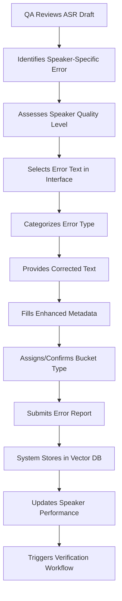
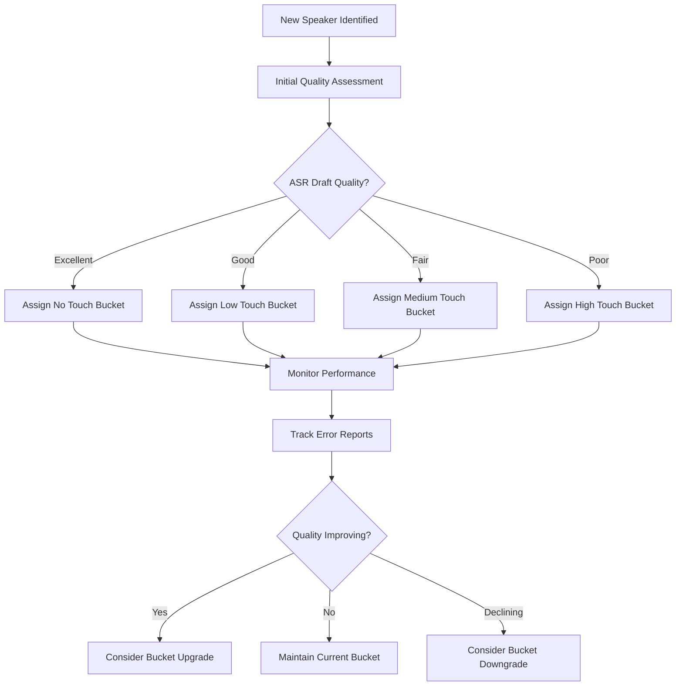

# User Experience and Workflows Design - Quality-Based Speaker Bucket Management

**Date:** December 19, 2024  
**Version:** 2.0  
**Target Users:** QA Personnel, Medical Transcriptionists, System Administrators

---

## Table of Contents

1. [User Personas and Roles](#1-user-personas-and-roles)
2. [Core User Workflows](#2-core-user-workflows)
3. [Enhanced Error Reporting Workflow](#3-enhanced-error-reporting-workflow)
4. [Speaker History and Performance Tracking](#4-speaker-history-and-performance-tracking)
5. [Verification Workflow](#5-verification-workflow)
6. [Dashboard and Analytics](#6-dashboard-and-analytics)
7. [User Interface Design Principles](#7-user-interface-design-principles)
8. [Accessibility and Usability](#8-accessibility-and-usability)

---

## 1. User Personas and Roles

### 1.1 Primary User: QA Personnel
**Role:** Quality Assurance Specialist  
**Responsibilities:**
- Identify speaker-specific errors in ASR drafts
- Classify speakers into quality-based buckets
- Submit error reports with comprehensive metadata
- Verify error rectification in subsequent drafts
- Monitor speaker performance improvements

**Key Goals:**
- Reduce feedback loop time for error correction
- Focus on important errors rather than repetitive ones
- Track ASR quality improvements over time
- Ensure systematic error rectification

**Pain Points:**
- Long feedback loops for error validation
- Repetitive error reporting for same issues
- Difficulty tracking speaker improvement
- Manual verification processes

### 1.2 Secondary User: Medical Transcriptionists (MTs)
**Role:** Medical Transcription Specialist  
**Responsibilities:**
- Post-process ASR drafts based on quality bucket classification
- Apply corrections to drafts based on bucket requirements
- Focus effort based on speaker quality levels

**Key Goals:**
- Efficient resource allocation based on quality levels
- Clear guidance on correction requirements
- Reduced time on high-quality drafts

### 1.3 Administrative User: System Administrator
**Role:** System Administrator  
**Responsibilities:**
- Monitor system performance and analytics
- Configure bucket thresholds and rules
- Manage user access and permissions
- Oversee verification workflows

---

## 2. Core User Workflows

### 2.1 QA Error Identification and Reporting Workflow



### 2.2 Speaker Quality Assessment Workflow



---

## 3. Enhanced Error Reporting Workflow

### 3.1 Step-by-Step User Journey

#### Step 1: Text Selection and Error Identification
**User Actions:**
- Navigate to Error Reporting interface
- View ASR draft text in selectable format
- Highlight specific error text segments
- Multiple selection support for complex errors

**UI Components:**
- Selectable text area with touch-optimized selection
- Selection counter and management tools
- Clear visual indicators for selected text
- Mobile-responsive selection interface

#### Step 2: Error Categorization
**User Actions:**
- Select from predefined error categories
- Search and filter categories
- Multiple category selection support
- Add custom category notes

**Enhanced Categories:**
- Medical Terminology
- Pronunciation Errors
- Grammar and Syntax
- Punctuation Issues
- Technical Terminology
- Contextual Misinterpretation
- Formatting Issues

#### Step 3: Correction Input
**User Actions:**
- Enter corrected text for each selected error
- Use voice input for complex corrections
- Preview original vs. corrected text
- Validate correction accuracy

**UI Features:**
- Side-by-side comparison view
- Voice input with speech recognition
- Auto-suggestion based on similar corrections
- Character count and validation

#### Step 4: Enhanced Metadata Capture
**User Actions:**
- Fill core metadata fields (Speaker ID, Client ID, Bucket Type)
- Complete audio quality assessment
- Provide enhanced metadata information
- Add contextual notes

**Enhanced Metadata Fields:**
```
Core Information:
├── Speaker ID (required)
├── Client ID (required)
└── Bucket Type (required dropdown)

Audio Quality Assessment:
├── Audio Quality (good/fair/poor)
├── Speaker Clarity (clear/somewhat clear/unclear/very unclear)
└── Background Noise (none/low/medium/high)

Enhanced Context:
├── Number of Speakers (one/two/three/four/five)
├── Overlapping Speech (yes/no)
├── Requires Specialized Knowledge (yes/no)
└── Additional Notes (free text, max 1000 chars)
```

#### Step 5: Review and Submission
**User Actions:**
- Review all entered information
- Validate required fields
- Submit error report
- Receive confirmation and tracking ID

**System Actions:**
- Store error report in database
- Submit to vector database with metadata
- Update speaker performance metrics
- Trigger verification workflow if applicable

### 3.2 Copy-Paste Restrictions Implementation
**Security Measures:**
- Disable copy-paste functionality in text areas
- Implement clipboard monitoring
- Show warning messages for attempted copy operations
- Audit trail for security compliance

---

## 4. Speaker History and Performance Tracking

### 4.1 Speaker Search and Selection
**User Interface:**
- Speaker ID search with autocomplete
- Recent speakers quick access
- Filter by bucket type and performance metrics
- Bulk speaker operations

### 4.2 Speaker History Dashboard
**Information Display:**
- Current bucket status with visual indicators
- Complete error history timeline
- Bucket transition history with reasons
- Performance metrics and trends

**Interactive Elements:**
- Expandable error details
- Filterable history by date range
- Sortable columns for different metrics
- Export functionality for reports

### 4.3 Performance Visualization
**Charts and Graphs:**
- Error count trends over time
- Bucket transition timeline
- Rectification rate improvements
- Quality score progression

---

## 5. Verification Workflow

### 5.1 Job Retrieval Process
**User Actions:**
- Select speaker for verification
- Specify date range for job retrieval
- Choose error types to verify
- Initiate job pull from InstaNote Database

**System Process:**
- Connect to InstaNote Database
- Query jobs by speaker ID and criteria
- Apply RAG-based corrections
- Present jobs for verification

### 5.2 Verification Interface
**Layout Design:**
- Split-screen comparison view
- Original draft on left side
- RAG-corrected draft on right side
- Highlighted differences and corrections
- Verification controls at bottom

**User Actions:**
- Review original vs. corrected text
- Mark corrections as verified/not verified
- Add verification comments
- Batch verify multiple corrections
- Submit verification results

### 5.3 Verification Results Processing
**System Actions:**
- Update error report status
- Update speaker performance metrics
- Trigger bucket reassessment if needed
- Schedule next verification cycle
- Generate verification reports

---

## 6. Dashboard and Analytics

### 6.1 Speaker Bucket Overview
**Visual Components:**
- Pie chart showing bucket distribution
- Trend indicators for each bucket
- Speaker count and percentages
- Quality improvement metrics

### 6.2 Performance Metrics Dashboard
**Key Metrics Display:**
- Total errors reported (last 30 days)
- Rectification rate percentage
- Average time to rectification
- System-wide improvement trends

### 6.3 Resource Allocation Analytics
**MT Workload Distribution:**
- Effort allocation across bucket types
- Estimated time savings
- Resource optimization recommendations
- Productivity metrics

---

## 7. User Interface Design Principles

### 7.1 Design System
**Color Coding for Bucket Types:**
- 🎯 No Touch: Green (#4CAF50) - Excellent quality
- 🔧 Low Touch: Blue (#2196F3) - Good quality  
- ⚙️ Medium Touch: Orange (#FF9800) - Fair quality
- 🛠️ High Touch: Red (#F44336) - Poor quality

**Typography:**
- Clear, readable fonts for medical terminology
- Consistent hierarchy for information organization
- Accessible contrast ratios for all text

### 7.2 Responsive Design
**Mobile Optimization:**
- Touch-friendly selection interface
- Optimized forms for mobile input
- Responsive charts and visualizations
- Offline capability for critical functions

### 7.3 Progressive Enhancement
**Feature Layers:**
- Core functionality works without JavaScript
- Enhanced features with progressive enhancement
- Graceful degradation for older browsers
- Performance optimization for all devices

---

## 8. Accessibility and Usability

### 8.1 WCAG 2.1 AA Compliance
**Accessibility Features:**
- Screen reader compatibility
- Keyboard navigation support
- High contrast mode
- Text scaling support
- Alternative text for all images

### 8.2 Usability Testing Requirements
**Test Scenarios:**
- Error reporting workflow completion time
- Speaker search and history navigation
- Verification workflow efficiency
- Mobile device usability
- Accessibility compliance validation

### 8.3 User Training and Support
**Documentation:**
- Step-by-step workflow guides
- Video tutorials for complex processes
- FAQ section for common issues
- Context-sensitive help system

**Training Materials:**
- QA personnel onboarding guide
- MT workflow integration training
- Administrator configuration guide
- Best practices documentation

---

## Implementation Considerations

### Phase 1: Core Workflow Enhancement
- Update error reporting interface with enhanced metadata
- Implement quality-based bucket system
- Create speaker history viewing functionality

### Phase 2: Verification Integration
- Integrate with InstaNote Database
- Implement RAG-based correction application
- Create verification interface and workflow

### Phase 3: Advanced Analytics
- Implement comprehensive dashboard analytics
- Add performance trend analysis
- Create resource allocation reporting

### Phase 4: Optimization and Enhancement
- Performance optimization based on user feedback
- Advanced search and filtering capabilities
- Automated workflow improvements

---

## User Stories and Acceptance Criteria

### Epic 1: Enhanced Error Reporting with Quality-Based Buckets

#### User Story 1.1: QA Error Reporting with Enhanced Metadata
**As a** QA personnel
**I want to** report speaker-specific errors with comprehensive metadata including speaker count, overlapping speech, and specialized knowledge requirements
**So that** I can provide detailed context for error correction and speaker quality assessment

**Acceptance Criteria:**
- [ ] I can select error text in ASR drafts using touch-optimized interface
- [ ] I can categorize errors using predefined categories
- [ ] I can assign speakers to quality-based buckets (No Touch, Low Touch, Medium Touch, High Touch)
- [ ] I can fill all enhanced metadata fields including number of speakers, overlapping speech, specialized knowledge
- [ ] I can add additional notes up to 1000 characters
- [ ] I cannot copy and paste any part of the draft text
- [ ] I receive confirmation when error report is successfully submitted
- [ ] Error report is stored in vector database with all metadata

#### User Story 1.2: Speaker Bucket Assignment and Management
**As a** QA personnel
**I want to** assign speakers to appropriate quality buckets based on ASR draft quality
**So that** MT resources can be allocated efficiently based on correction requirements

**Acceptance Criteria:**
- [ ] I can view bucket type descriptions and selection criteria
- [ ] I can assign speakers to No Touch, Low Touch, Medium Touch, or High Touch buckets
- [ ] I can see visual indicators for each bucket type with appropriate colors and icons
- [ ] I can change bucket assignments with reason documentation
- [ ] System tracks all bucket changes with timestamps and reasons
- [ ] Dashboard shows current bucket distribution across all speakers

### Epic 2: Speaker History and Performance Tracking

#### User Story 2.1: Speaker History Viewing
**As a** QA personnel
**I want to** view complete error history for specific speakers
**So that** I can track performance improvements and identify recurring issues

**Acceptance Criteria:**
- [ ] I can search for speakers by ID with autocomplete functionality
- [ ] I can view complete error history timeline for selected speaker
- [ ] I can see bucket transition history with dates and reasons
- [ ] I can filter history by date range and error types
- [ ] I can view performance metrics including rectification rate and quality trends
- [ ] I can export speaker history reports for documentation

#### User Story 2.2: Performance Trend Analysis
**As a** QA personnel
**I want to** monitor speaker performance trends over time
**So that** I can identify speakers who are improving or declining in quality

**Acceptance Criteria:**
- [ ] I can view visual charts showing error count trends over time
- [ ] I can see bucket transition timeline with improvement indicators
- [ ] I can view rectification rate improvements
- [ ] I can identify speakers ready for bucket upgrades or downgrades
- [ ] I can generate performance reports for management review

### Epic 3: Verification Workflow

#### User Story 3.1: Error Rectification Verification
**As a** QA personnel
**I want to** verify that reported errors have been rectified in subsequent drafts
**So that** I can confirm the effectiveness of the error correction process

**Acceptance Criteria:**
- [ ] I can pull jobs for specific speakers from InstaNote Database
- [ ] I can view original drafts side-by-side with RAG-corrected versions
- [ ] I can see highlighted corrections applied based on reported errors
- [ ] I can mark corrections as verified, not rectified, or partially rectified
- [ ] I can add verification comments for each correction
- [ ] I can batch verify multiple corrections simultaneously
- [ ] System updates speaker performance metrics based on verification results

#### User Story 3.2: RAG-Based Correction Application
**As a** system user
**I want** RAG-based corrections to be automatically applied to new drafts for speakers with reported errors
**So that** the same errors are rectified from next draft onwards

**Acceptance Criteria:**
- [ ] System automatically applies RAG corrections to new drafts for speakers with error history
- [ ] Corrections are based on previously reported and verified error patterns
- [ ] System tracks effectiveness of applied corrections
- [ ] QA can review and verify applied corrections
- [ ] System learns from verification feedback to improve future corrections

### Epic 4: Dashboard and Analytics

#### User Story 4.1: Speaker Bucket Overview Dashboard
**As a** QA supervisor
**I want to** view speaker distribution across quality buckets
**So that** I can monitor overall system performance and resource allocation

**Acceptance Criteria:**
- [ ] I can view pie chart showing current bucket distribution
- [ ] I can see trend indicators for each bucket type
- [ ] I can view speaker counts and percentages for each bucket
- [ ] I can monitor quality improvement metrics over time
- [ ] I can identify buckets that need attention or intervention

#### User Story 4.2: Performance Metrics Dashboard
**As a** system administrator
**I want to** monitor system-wide performance metrics
**So that** I can track the effectiveness of the quality improvement process

**Acceptance Criteria:**
- [ ] I can view total errors reported in configurable time periods
- [ ] I can see overall rectification rate percentages
- [ ] I can monitor average time to error rectification
- [ ] I can view system-wide improvement trends
- [ ] I can generate executive summary reports
- [ ] I can track resource allocation efficiency across bucket types
