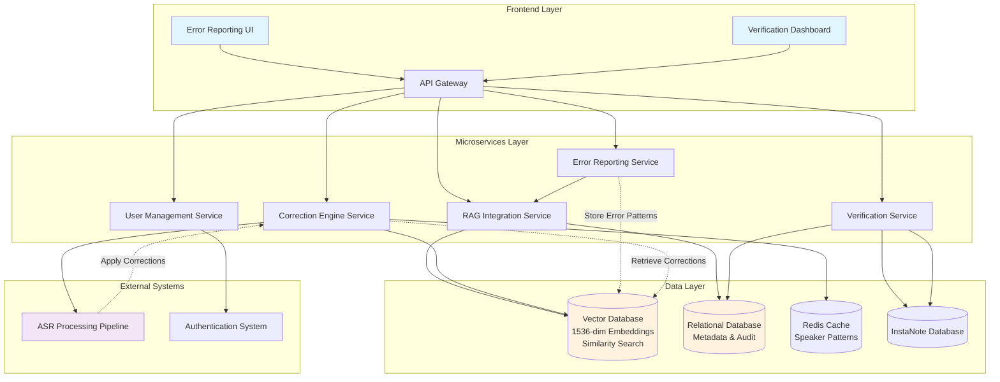
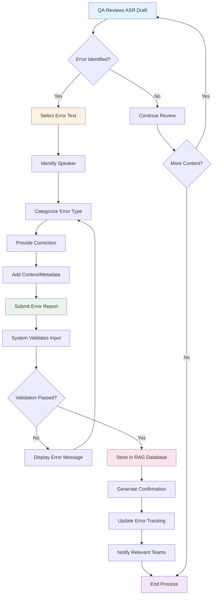
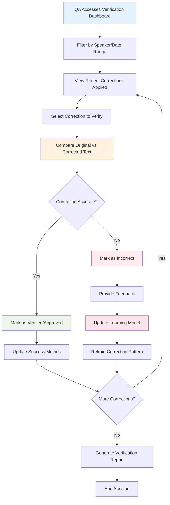
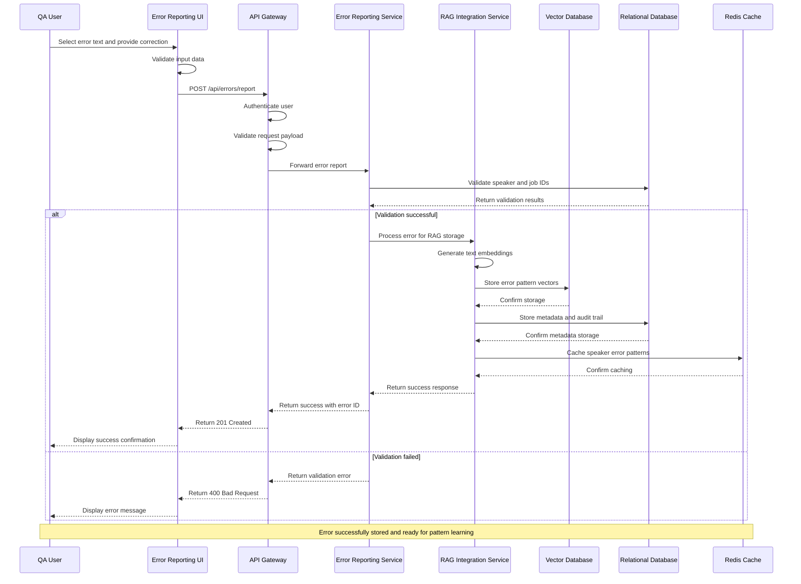
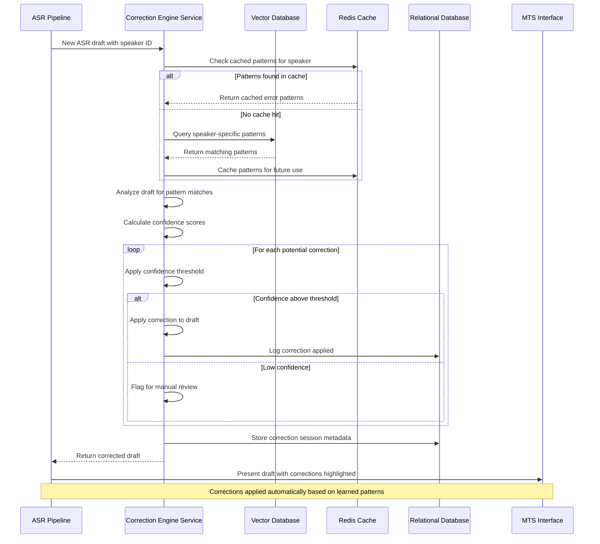
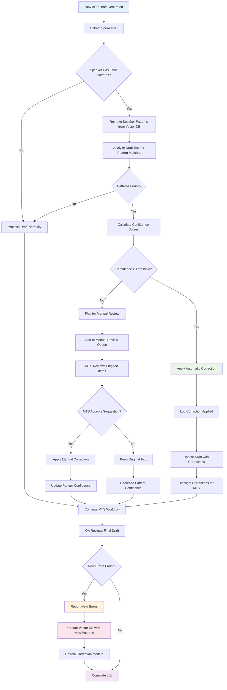
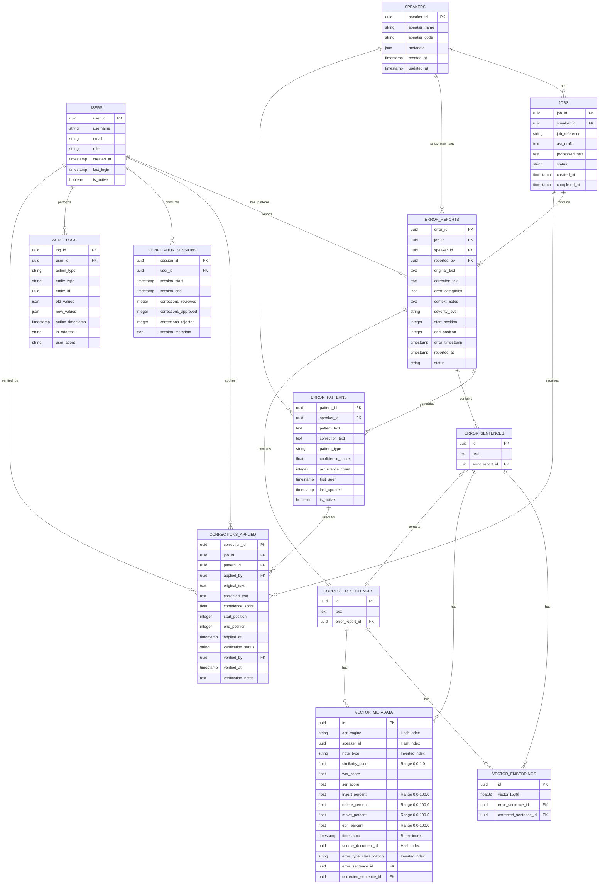

# Product Requirements Document (PRD)
## ASR Error Reporting and Correction System

**Document Version:** 1.0
**Date:** August 5, 2025
**Author:** Product Team
**Stakeholders:** QA Team, MTS Team, Engineering Team

---

## 1. Executive Summary

The ASR Error Reporting and Correction System is a value-added service designed to enhance the Medical Transcription Quality Assurance (QA) workflow by enabling systematic error reporting, correction learning, and automated improvement of ASR (Automatic Speech Recognition) drafts for specific speakers.

### 1.1 Key Benefits
- **Reduced Feedback Loop:** From days to real-time error correction validation
- **Improved QA Efficiency:** Focus on critical errors rather than repetitive issues
- **Enhanced Accuracy:** Speaker-specific error learning and correction
- **Time Savings:** Automated correction of known speaker-specific errors

---

## 2. Problem Statement

### 2.1 Current State
The existing medical transcription workflow involves a lengthy feedback loop where:
1. QA identifies errors in ASR drafts
2. Errors are manually corrected by MTS
3. QA waits days to validate if reported problems are resolved
4. Repetitive speaker-specific errors continue to occur without systematic learning

### 2.2 Pain Points
- **Long Feedback Cycles:** Days-long validation cycles for error corrections
- **Repetitive Error Handling:** Same speaker-specific errors recurring across multiple jobs
- **Limited QA Coverage:** QA resources spent on repetitive rather than critical errors
- **No Learning Mechanism:** ASR system doesn't learn from identified speaker-specific patterns

---

## 3. Solution Overview

### 3.1 Vision
Create an intelligent error reporting and correction system that enables QA personnel to report speaker-specific ASR errors, automatically learns from these reports, and proactively corrects similar errors in future transcriptions for the same speakers.

### 3.2 Core Components
1. **Error Reporting Interface:** Web-based UI for error identification and submission
2. **RAG Database Integration:** Vector database for storing error patterns and corrections
3. **Automated Correction Engine:** Real-time application of learned corrections
4. **Verification Dashboard:** Tools for validating error correction effectiveness

### 3.3 Technology Stack

The system will be implemented using the following technology stack:

- **Backend Framework:** Python with FastAPI for high-performance API development
- **Database Systems:**
  - PostgreSQL for relational data (metadata, audit trails, user management)
  - Vector Database (Pinecone/Weaviate/Qdrant) for 1536-dimensional embeddings
  - Redis for caching and session management
- **Message Queue:** Apache Kafka for event-driven communication between services
- **Frontend:** React 18+ with TypeScript for user interfaces
- **Infrastructure:** Kubernetes with Docker containers for scalable deployment
- **Monitoring:** Prometheus, Grafana, and distributed tracing for observability

### 3.4 System Architecture Overview

The following diagram illustrates the high-level architecture and data flow of the ASR Error Reporting and Correction System:



---

## 4. User Personas

### 4.1 Primary Users

#### 4.1.1 Quality Assurance (QA) Personnel
- **Role:** Review and validate transcription quality
- **Goals:** Efficiently identify and report errors, verify corrections
- **Pain Points:** Long feedback loops, repetitive error handling

#### 4.1.2 Medical Transcription Specialists (MTS)
- **Role:** Post-process ASR drafts to improve quality
- **Goals:** Focus on complex corrections rather than repetitive errors
- **Pain Points:** Handling same speaker errors repeatedly

### 4.2 Secondary Users

#### 4.2.1 System Administrators
- **Role:** Maintain and monitor system performance
- **Goals:** Ensure system reliability and data integrity

## 5. User Workflows

### 5.1 Error Reporting Workflow

The following diagram shows the complete workflow for QA personnel reporting errors:



### 5.2 Error Verification Workflow

The following diagram shows the verification process for applied corrections:



---

## 6. User Stories

### 6.1 Epic 1: Error Reporting and Submission

#### 6.1.1 US-1.1: Error Text Selection
**As a QA personnel**, I want to select specific text segments in ASR drafts that contain errors so that I can precisely identify problematic content for correction.

**Acceptance Criteria:**
- [ ] I can click and drag to select text in the ASR draft interface
- [ ] Selected text is highlighted with a distinct color
- [ ] I can select multiple non-contiguous text segments
- [ ] The system captures the exact position and timestamp of selected text
- [ ] I can deselect text by clicking outside the selection

**Story Points:** 5
**Priority:** High

#### 6.1.2 US-1.2: Speaker Association
**As a QA personnel**, I want to associate reported errors with specific speakers so that the system can learn speaker-specific error patterns.

**Acceptance Criteria:**
- [ ] I can identify the speaker from a dropdown list of available speakers
- [ ] The system auto-suggests the speaker based on the current job context
- [ ] I can search for speakers by name or ID
- [ ] Speaker information is mandatory for error submission
- [ ] The system validates speaker existence before submission

**Story Points:** 3
**Priority:** High

#### 6.1.3 US-1.3: Error Categorization
**As a QA personnel**, I want to categorize errors by type so that the system can apply appropriate correction strategies.

**Acceptance Criteria:**
- [ ] I can select from predefined error categories (pronunciation, medical terminology, grammar, etc.)
- [ ] I can select multiple categories for a single error
- [ ] I can add custom categories with proper justification
- [ ] Category selection is mandatory for error submission
- [ ] The system provides category descriptions and examples

**Story Points:** 5
**Priority:** Medium

#### 6.1.4 US-1.4: Correction Provision
**As a QA personnel**, I want to provide the correct text for identified errors so that the system can learn the appropriate corrections.

**Acceptance Criteria:**
- [ ] I can enter corrected text in a dedicated input field
- [ ] The system validates that correction text is different from original
- [ ] I can preview the correction before submission
- [ ] Character limits are enforced and displayed
- [ ] The system prevents submission of empty corrections

**Story Points:** 3
**Priority:** High

#### 6.1.5 US-1.5: Contextual Metadata
**As a QA personnel**, I want to provide contextual information about errors so that corrections can be applied more accurately.

**Acceptance Criteria:**
- [ ] I can add notes about the error context
- [ ] I can specify error severity level (low, medium, high, critical)
- [ ] I can indicate if the error affects medical accuracy
- [ ] Audio quality indicators are automatically captured
- [ ] I can add tags for better searchability

**Story Points:** 5
**Priority:** Medium

#### 6.1.6 US-1.6: Vector Similarity Analysis
**As a QA personnel**, I want the system to automatically find similar error patterns using vector similarity so that I can identify recurring issues across different speakers and contexts.

**Acceptance Criteria:**
- [ ] The system generates vector embeddings for all error and correction text
- [ ] I can view similarity scores for related error patterns
- [ ] The system suggests similar errors from other speakers with configurable similarity thresholds
- [ ] I can filter similarity results by ASR engine, note type, and error classification
- [ ] Quality metrics (WER, SER, edit percentages) are displayed for similar patterns

**Story Points:** 8
**Priority:** High

### 6.2 Epic 2: Error Verification and Validation

#### 6.2.1 US-2.1: Verification Dashboard Access
**As a QA personnel**, I want to access a verification dashboard so that I can review and validate applied corrections.

**Acceptance Criteria:**
- [ ] I can access the dashboard through the main navigation
- [ ] The dashboard loads within 3 seconds
- [ ] I can see a summary of recent corrections applied
- [ ] The interface is responsive and works on tablets
- [ ] I can bookmark specific dashboard views

**Story Points:** 3
**Priority:** High

#### 6.2.2 US-2.2: Correction Filtering and Search
**As a QA personnel**, I want to filter and search corrections so that I can efficiently find specific items to verify.

**Acceptance Criteria:**
- [ ] I can filter by speaker, date range, error type, and correction status
- [ ] I can search by keywords in original or corrected text
- [ ] I can sort results by date, speaker, or correction confidence
- [ ] Filter combinations work correctly together
- [ ] Search results are highlighted and paginated

**Story Points:** 8
**Priority:** Medium

#### 6.2.3 US-2.3: Before/After Comparison
**As a QA personnel**, I want to see before and after text comparison so that I can evaluate correction accuracy.

**Acceptance Criteria:**
- [ ] I can view original and corrected text side by side
- [ ] Differences are highlighted with color coding
- [ ] I can see the confidence score for each correction
- [ ] Context around the correction is provided
- [ ] I can expand/collapse the comparison view

**Story Points:** 5
**Priority:** High

#### 6.2.4 US-2.4: Correction Approval/Rejection
**As a QA personnel**, I want to approve or reject applied corrections so that the system can improve its learning accuracy.

**Acceptance Criteria:**
- [ ] I can mark corrections as approved or rejected with one click
- [ ] I can provide feedback comments for rejected corrections
- [ ] Bulk approval/rejection is available for multiple items
- [ ] My decisions are immediately reflected in the system
- [ ] I can undo recent approval/rejection actions

**Story Points:** 5
**Priority:** High

### 6.3 Epic 3: System Administration and Monitoring

#### 6.3.1 US-3.1: System Performance Monitoring
**As a System Administrator**, I want to monitor system performance so that I can ensure optimal operation and identify issues early.

**Acceptance Criteria:**
- [ ] I can view real-time system metrics (response times, error rates, throughput)
- [ ] I can set up alerts for performance thresholds
- [ ] Historical performance data is available for analysis
- [ ] I can drill down into specific service performance
- [ ] Dashboard auto-refreshes with configurable intervals

**Story Points:** 8
**Priority:** Medium

#### 6.3.2 US-3.2: User Activity Monitoring
**As a System Administrator**, I want to monitor user activity so that I can track system adoption and identify training needs.

**Acceptance Criteria:**
- [ ] I can view user login patterns and session durations
- [ ] I can see error reporting and verification activity by user
- [ ] Usage statistics are available in exportable formats
- [ ] I can identify inactive users and high-volume users
- [ ] Privacy controls ensure compliance with data protection policies

**Story Points:** 5
**Priority:** Low

### 6.4 Epic 4: MTS Integration and Workflow

#### 6.4.1 US-4.1: Automated Correction Notifications
**As an MTS**, I want to be notified when automated corrections are applied to my assigned jobs so that I can focus on remaining issues.

**Acceptance Criteria:**
- [ ] I receive notifications for jobs with applied corrections
- [ ] Notifications include summary of corrections made
- [ ] I can configure notification preferences (email, in-app, etc.)
- [ ] Notifications are grouped by job to avoid spam
- [ ] I can mark notifications as read/unread

**Story Points:** 5
**Priority:** Medium

#### 6.4.2 US-4.2: Correction Review Interface
**As an MTS**, I want to review automated corrections in my workflow so that I can validate them before final submission.

**Acceptance Criteria:**
- [ ] Automated corrections are clearly marked in the draft
- [ ] I can see the confidence score for each correction
- [ ] I can accept, modify, or reject individual corrections
- [ ] My decisions feed back into the learning system
- [ ] The interface integrates seamlessly with existing MTS tools

**Story Points:** 8
**Priority:** Medium

### 6.5 Epic 5: Error Handling and Edge Cases

#### 6.5.1 US-5.1: Network Connectivity Issues
**As a QA personnel**, I want the system to handle network issues gracefully so that I don't lose my work during error reporting.

**Acceptance Criteria:**
- [ ] The system saves draft error reports locally during network issues
- [ ] I receive clear notifications about connectivity status
- [ ] Saved drafts are automatically submitted when connectivity is restored
- [ ] I can continue working offline with limited functionality
- [ ] No data is lost during network interruptions

**Story Points:** 8
**Priority:** Medium

#### 6.5.2 US-5.2: Invalid Data Handling
**As a QA personnel**, I want clear error messages when I submit invalid data so that I can correct issues quickly.

**Acceptance Criteria:**
- [ ] Error messages are specific and actionable
- [ ] Invalid fields are clearly highlighted
- [ ] I can see all validation errors at once
- [ ] The system suggests corrections for common mistakes
- [ ] Form data is preserved when validation fails

**Story Points:** 5
**Priority:** Medium

#### 6.5.3 US-5.3: System Overload Management
**As any user**, I want the system to remain responsive during high load periods so that my productivity is not impacted.

**Acceptance Criteria:**
- [ ] The system provides graceful degradation during high load
- [ ] Users receive notifications about system status
- [ ] Critical functions remain available even under load
- [ ] Queue management prevents system crashes
- [ ] Load balancing distributes traffic effectively

**Story Points:** 13
**Priority:** High

---

## 7. Functional Requirements

### 7.1 FR-1: Error Reporting Interface

#### 7.1.1 FR-1.1: Error Identification
- **Requirement:** QA users must be able to select specific text segments in ASR drafts that contain errors
- **Acceptance Criteria:**
  - Text selection interface with highlighting capability
  - Error location tracking (timestamp, position)
  - Speaker identification for the error

#### 7.1.2 FR-1.2: Error Categorization
- **Requirement:** System must provide error classification options
- **Categories:**
  - Pronunciation errors
  - Medical terminology errors
  - Grammar/syntax errors
  - Speaker-specific patterns
  - Context-specific errors
- **Acceptance Criteria:**
  - Dropdown/checkbox interface for category selection
  - Ability to select multiple categories per error
  - Custom category creation capability

#### 7.1.3 FR-1.3: Correction Submission
- **Requirement:** QA users must provide correct text for identified errors
- **Acceptance Criteria:**
  - Text input field for correction
  - Character limit validation
  - Correction preview functionality
  - Mandatory correction field validation

#### 7.1.4 FR-1.4: Metadata Capture
- **Requirement:** System must capture relevant metadata for targeted search and correction
- **Metadata Fields:**
  - Speaker ID
  - Job ID
  - Timestamp
  - Audio quality indicators
  - Context information
  - Error severity level
- **Acceptance Criteria:**
  - Automatic metadata population where possible
  - Manual metadata entry interface
  - Metadata validation rules

### 7.2 FR-2: RAG Database Integration

#### 7.2.1 FR-2.1: Error Registration API
- **Requirement:** System must provide API endpoints for registering errors in the RAG database
- **Endpoints:**
  - `POST /api/errors/register` - Register new error
  - `GET /api/errors/speaker/{speakerId}` - Retrieve speaker-specific errors
  - `PUT /api/errors/{errorId}` - Update error information
  - `DELETE /api/errors/{errorId}` - Remove error entry
- **Acceptance Criteria:**
  - RESTful API design
  - JSON request/response format
  - Authentication and authorization
  - Rate limiting implementation

#### 7.2.2 FR-2.2: Vector Database Storage
- **Requirement:** Errors and corrections must be stored in vector format for similarity search
- **Acceptance Criteria:**
  - Text embedding generation for error sentences and corrected sentences using 1536-dimensional vectors
  - Speaker-specific vector clustering with hash indexing on speaker_id
  - Efficient similarity search capability with cosine similarity scoring
  - Metadata indexing for fast retrieval including:
    - ASR engine categorization (gemini_2.5_pro, gemini_2.5_flash, pivo)
    - Note type classification with inverted indexing
    - Error type classification with inverted indexing
    - B-tree indexing on timestamps
    - Hash indexing on source_document_id
  - Quality metrics storage including WER, SER, and edit operation percentages
  - Similarity score tracking (0.0-1.0 range)

#### 7.2.3 FR-2.3: Vector Similarity Search
- **Requirement:** System must provide efficient similarity search capabilities for error patterns
- **Acceptance Criteria:**
  - Cosine similarity search with configurable thresholds
  - Speaker-specific pattern filtering
  - Multi-dimensional filtering by ASR engine, note type, and error classification
  - Real-time similarity scoring and ranking
  - Support for batch similarity operations

#### 7.2.4 FR-2.4: Error Pattern Learning
- **Requirement:** System must identify and learn from error patterns for specific speakers
- **Acceptance Criteria:**
  - Pattern recognition algorithms using vector embeddings
  - Speaker-specific error profiling with quality metrics
  - Confidence scoring for corrections based on similarity scores
  - Continuous learning capability with feedback integration
  - Quality metrics tracking (WER, SER, edit operation percentages)

### 7.3 API Interaction Sequences

#### 7.3.1 Error Reporting API Sequence

The following sequence diagram shows the API interactions during error reporting:



#### 7.3.2 Automated Correction API Sequence

The following sequence diagram shows the API interactions during automated correction:



### 7.4 FR-3: Automated Correction Engine

#### 7.4.1 FR-3.1: Real-time Correction Application
- **Requirement:** System must automatically apply learned corrections to new ASR drafts for known speakers
- **Acceptance Criteria:**
  - Integration with ASR draft processing pipeline
  - Speaker identification and matching
  - Confidence-based correction application
  - Correction logging and tracking

#### 7.4.2 FR-3.2: Correction Confidence Scoring
- **Requirement:** System must provide confidence scores for applied corrections
- **Acceptance Criteria:**
  - Confidence threshold configuration
  - Score-based correction filtering
  - Manual review flagging for low-confidence corrections

### 7.5 FR-4: Verification System

#### 7.5.1 FR-4.1: Verification Dashboard
- **Requirement:** QA users must have access to a dashboard for verifying error corrections
- **Features:**
  - List of recent corrections applied
  - Before/after comparison view
  - Correction effectiveness metrics
  - Speaker-specific correction history
- **Acceptance Criteria:**
  - Intuitive dashboard interface
  - Real-time data updates
  - Export functionality for reports
  - Filter and search capabilities

#### 7.5.2 FR-4.2: Correction Validation
- **Requirement:** QA users must be able to validate the effectiveness of applied corrections
- **Acceptance Criteria:**
  - Approve/reject correction interface
  - Feedback submission for incorrect corrections
  - Correction quality scoring
  - Learning system feedback loop

### 7.6 Error Correction Pipeline

The following flowchart illustrates the complete error correction pipeline from pattern learning to application:



---

## 8. Technical Requirements

### 8.1 TR-1: System Architecture

#### 8.1.1 TR-1.1: Microservices Architecture
- **Requirement:** System must be built using microservices architecture for scalability
- **Backend Technology:** Python with FastAPI framework for high-performance API development
- **Components:**
  - Error Reporting Service (Python/FastAPI)
  - RAG Integration Service (Python/FastAPI)
  - Correction Engine Service (Python/FastAPI)
  - Verification Service (Python/FastAPI)
  - User Management Service (Python/FastAPI)

#### 8.1.2 TR-1.2: Database Requirements
- **Vector Database:** For storing 1536-dimensional embeddings and similarity search operations
  - Support for cosine similarity search
  - Hash indexing on speaker_id and source_document_id
  - Inverted indexing on categorical fields (note_type, error_type_classification)
  - B-tree indexing on timestamp fields
  - Storage for quality metrics (WER, SER, edit percentages)
- **Relational Database:** For metadata, user management, and audit trails
- **Cache Layer:** Redis for performance optimization and speaker pattern caching

#### 8.1.3 TR-1.3: Integration Points
- **InstaNote Database:** For retrieving speaker-specific jobs
- **ASR Processing Pipeline:** For real-time correction application
- **Authentication System:** SSO integration with existing systems
- **Vector Database Engine:** Integration with vector similarity search engine supporting:
  - 1536-dimensional embeddings (compatible with OpenAI text-embedding-3-large)
  - Cosine similarity calculations
  - Filtered search by metadata attributes
  - Real-time indexing and updates

#### 8.1.4 TR-1.4: Vector Database Specifications
- **Embedding Model:** Support for 1536-dimensional float32 vectors
- **Similarity Metrics:** Cosine similarity with configurable thresholds
- **Indexing Strategy:**
  - Hash indexes on speaker_id and source_document_id for O(1) lookups
  - Inverted indexes on categorical fields (note_type, error_type_classification)
  - B-tree indexes on timestamp fields for range queries
- **Metadata Storage:** Co-located metadata with vector embeddings for efficient filtering
- **Quality Metrics Integration:** Built-in support for WER, SER, and edit operation percentages

### 8.2 Database Schema Design

The following Entity Relationship Diagram shows the core data model for the system:



### 8.3 TR-2: Performance Requirements

#### 8.3.1 TR-2.1: Response Time
- **Error Submission:** < 2 seconds
- **Correction Application:** < 5 seconds
- **Dashboard Loading:** < 3 seconds
- **Search Operations:** < 1 second
- **Vector Embedding Generation:** < 500ms per text segment
- **Vector Similarity Search:** < 200ms for top-10 results
- **Batch Vector Operations:** < 5 seconds for 100 embeddings

#### 8.3.2 TR-2.2: Scalability
- **Concurrent Users:** Support 100+ concurrent QA users
- **Data Volume:** Handle 10,000+ errors per day
- **Vector Storage:** Scalable vector database supporting millions of 1536-dimensional embeddings
- **Similarity Search:** Support 1000+ concurrent similarity queries
- **Index Performance:** Maintain sub-200ms search times with 10M+ vectors

### 8.4 TR-3: Security Requirements

#### 8.4.1 TR-3.1: Data Protection
- **Encryption:** All data encrypted at rest and in transit
- **Access Control:** Role-based access control (RBAC)
- **Audit Logging:** Complete audit trail for all operations
- **Data Privacy:** Compliance with healthcare data regulations

#### 8.4.2 TR-3.2: Authentication
- **SSO Integration:** Single sign-on with existing systems
- **Session Management:** Secure session handling
- **API Security:** Token-based authentication for APIs

---

## 9. Non-Functional Requirements

### 9.1 NFR-1: Usability
- **Intuitive Interface:** Minimal training required for QA users
- **Accessibility:** WCAG 2.1 AA compliance
- **Mobile Responsive:** Support for tablet and mobile devices

### 9.2 NFR-2: Reliability
- **Uptime:** 99.9% system availability
- **Data Integrity:** Zero data loss tolerance
- **Backup:** Automated daily backups with point-in-time recovery

### 9.3 NFR-3: Compliance
- **HIPAA Compliance:** Full compliance with healthcare data regulations
- **SOC 2:** Security and availability compliance
- **Data Retention:** Configurable data retention policies

---

## 10. Success Metrics

### 10.1 Primary KPIs
1. **Error Reduction Rate:** 30% reduction in repetitive speaker-specific errors within 3 months
2. **QA Efficiency:** 25% reduction in time spent on repetitive error correction
3. **Feedback Loop Time:** Reduction from days to hours for error validation
4. **System Adoption:** 90% of QA personnel actively using the system within 6 months

### 10.2 Secondary Metrics
1. **Correction Accuracy:** 95% accuracy rate for automated corrections
2. **User Satisfaction:** 4.5/5 average user satisfaction score
3. **System Performance:** 99.9% uptime with < 3 second response times
4. **Error Pattern Learning:** 80% of reported errors successfully learned and applied

---

## 11. Implementation Timeline

### 11.1 Phase 1: Foundation (Months 1-2)
- [ ] System architecture design and setup
- [ ] Basic error reporting interface
- [ ] RAG database integration
- [ ] Core API development

### 11.2 Phase 2: Core Functionality (Months 3-4)
- [ ] Error categorization and submission
- [ ] Automated correction engine
- [ ] Speaker-specific error learning
- [ ] Basic verification dashboard

### 11.3 Phase 3: Enhancement (Months 5-6)
- [ ] Advanced verification features
- [ ] Performance optimization
- [ ] Comprehensive testing
- [ ] User training and documentation

### 11.4 Phase 4: Deployment (Month 7)
- [ ] Production deployment
- [ ] User onboarding
- [ ] Monitoring and support setup
- [ ] Success metrics tracking

---

## 12. Constraints and Assumptions

### 12.1 Constraints
1. **Copy-Paste Restriction:** MTSs and QAs cannot copy and paste any part of the drafts
2. **Integration Dependency:** Must integrate with existing InstaNote Database
3. **Compliance Requirements:** Must maintain HIPAA compliance throughout
4. **Performance Standards:** Must not impact existing transcription workflow performance

### 12.2 Assumptions
1. **Speaker Identification:** Reliable speaker identification is available in ASR system
2. **Data Quality:** ASR drafts contain sufficient quality for error pattern learning
3. **User Adoption:** QA and MTS teams will actively participate in error reporting
4. **Infrastructure:** Adequate infrastructure available for vector database and processing

---

## 13. Risk Assessment

### 13.1 High-Risk Items
1. **Integration Complexity:** Complex integration with existing systems
2. **Data Privacy:** Handling sensitive medical transcription data
3. **User Adoption:** Resistance to workflow changes

### 13.2 Mitigation Strategies
1. **Phased Implementation:** Gradual rollout with pilot groups
2. **Comprehensive Testing:** Extensive testing in staging environment
3. **User Training:** Comprehensive training and support programs
4. **Security Review:** Regular security audits and compliance checks

---

## 14. Appendices

### 14.1 Appendix A: API Specifications

#### 14.1.1 Core API Endpoints

##### 14.1.1.1 Error Reporting APIs

**POST /api/v1/errors/report**
```json
{
  "job_id": "uuid",
  "speaker_id": "uuid",
  "original_text": "string",
  "corrected_text": "string",
  "error_categories": ["pronunciation", "medical_terminology"],
  "severity_level": "high|medium|low|critical",
  "start_position": 150,
  "end_position": 165,
  "context_notes": "string",
  "metadata": {
    "audio_quality": "good|fair|poor",
    "background_noise": "low|medium|high"
  }
}
```

**GET /api/v1/errors/speaker/{speakerId}**
- Query Parameters: `page`, `limit`, `category`, `severity`, `date_from`, `date_to`
- Returns: Paginated list of errors for specific speaker

**PUT /api/v1/errors/{errorId}**
- Updates existing error report
- Requires appropriate permissions

**DELETE /api/v1/errors/{errorId}**
- Soft delete with audit trail
- Admin permissions required

##### 14.1.1.2 Correction Engine APIs

**POST /api/v1/corrections/apply**
```json
{
  "job_id": "uuid",
  "speaker_id": "uuid",
  "draft_text": "string",
  "confidence_threshold": 0.8
}
```

**GET /api/v1/corrections/patterns/{speakerId}**
- Returns learned patterns for speaker
- Includes confidence scores and usage statistics

**POST /api/v1/corrections/verify**
```json
{
  "correction_id": "uuid",
  "verification_status": "approved|rejected",
  "feedback_notes": "string"
}
```

##### 14.1.1.3 Vector Database APIs

**POST /api/v1/vectors/embeddings/generate**
```json
{
  "text": "string",
  "type": "error_sentence|corrected_sentence"
}
```

**POST /api/v1/vectors/similarity/search**
```json
{
  "query_vector": [1536 float values],
  "speaker_id": "uuid",
  "similarity_threshold": 0.8,
  "limit": 10,
  "filters": {
    "asr_engine": "gemini_2.5_pro",
    "note_type": "string",
    "error_type_classification": "string"
  }
}
```

**GET /api/v1/vectors/metadata/{vectorId}**
- Returns: Complete metadata for a specific vector embedding
- Includes: WER, SER, edit percentages, similarity scores

**POST /api/v1/vectors/metadata/update**
```json
{
  "vector_id": "uuid",
  "metadata": {
    "wer_score": 0.15,
    "ser_score": 0.08,
    "insert_percent": 5.2,
    "delete_percent": 3.1,
    "move_percent": 2.7,
    "edit_percent": 4.0,
    "similarity_score": 0.92
  }
}
```

##### 14.1.1.4 Verification APIs

**GET /api/v1/verification/dashboard**
- Query Parameters: `speaker_id`, `date_range`, `status`, `page`, `limit`
- Returns: Dashboard data with corrections to verify

**GET /api/v1/verification/sessions**
- Returns: User's verification session history

**POST /api/v1/verification/session/start**
- Initiates new verification session
- Returns session ID for tracking

##### 14.1.1.5 Analytics APIs

**GET /api/v1/analytics/error-trends**
- Query Parameters: `speaker_id`, `time_period`, `category`
- Returns: Error trend analysis

**GET /api/v1/analytics/correction-effectiveness**
- Returns: Metrics on correction accuracy and adoption

#### 14.1.2 API Response Formats

**Success Response (200/201)**
```json
{
  "success": true,
  "data": {},
  "message": "Operation completed successfully",
  "timestamp": "2025-08-05T10:30:00Z"
}
```

**Error Response (400/401/403/404/500)**
```json
{
  "success": false,
  "error": {
    "code": "VALIDATION_ERROR",
    "message": "Invalid input data",
    "details": [
      {
        "field": "speaker_id",
        "message": "Speaker ID is required"
      }
    ]
  },
  "timestamp": "2025-08-05T10:30:00Z"
}
```

### 14.2 Appendix B: Data Models

#### 14.2.1 Core Data Structures

**ErrorReport Model**
```python
from pydantic import BaseModel
from typing import List, Optional, Dict, Any
from datetime import datetime
from enum import Enum

class SeverityLevel(str, Enum):
    LOW = "low"
    MEDIUM = "medium"
    HIGH = "high"
    CRITICAL = "critical"

class ErrorStatus(str, Enum):
    PENDING = "pending"
    PROCESSED = "processed"
    ARCHIVED = "archived"

class AudioQuality(str, Enum):
    GOOD = "good"
    FAIR = "fair"
    POOR = "poor"

class NoiseLevel(str, Enum):
    LOW = "low"
    MEDIUM = "medium"
    HIGH = "high"

class ErrorMetadata(BaseModel):
    audio_quality: AudioQuality
    background_noise: NoiseLevel
    additional_data: Optional[Dict[str, Any]] = None

class ErrorReport(BaseModel):
    error_id: str
    job_id: str
    speaker_id: str
    reported_by: str
    original_text: str
    corrected_text: str
    error_categories: List[str]
    severity_level: SeverityLevel
    start_position: int
    end_position: int
    context_notes: Optional[str] = None
    error_timestamp: datetime
    reported_at: datetime
    status: ErrorStatus
    metadata: ErrorMetadata
```

**ErrorSentence Model**
```python
class ErrorSentence(BaseModel):
    id: str  # UUID
    text: str
    error_report_id: str  # FK to ERROR_REPORTS
```

**CorrectedSentence Model**
```python
class CorrectedSentence(BaseModel):
    id: str  # UUID
    text: str
    error_report_id: str  # FK to ERROR_REPORTS
```

**VectorEmbedding Model**
```python
from typing import List

class VectorEmbedding(BaseModel):
    id: str  # UUID
    vector: List[float]  # 1536-dimensional float32 array
    error_sentence_id: Optional[str] = None  # FK to ERROR_SENTENCES
    corrected_sentence_id: Optional[str] = None  # FK to CORRECTED_SENTENCES
```

**VectorMetadata Model**
```python
class ASREngine(str, Enum):
    GEMINI_2_5_PRO = "gemini_2.5_pro"
    GEMINI_2_5_FLASH = "gemini_2.5_flash"
    PIVO = "pivo"

class VectorMetadata(BaseModel):
    id: str  # UUID
    asr_engine: ASREngine  # Categorical with hash index
    speaker_id: str  # UUID with hash index
    note_type: str  # Categorical with inverted index
    similarity_score: float  # Range 0.0-1.0
    wer_score: float  # Word Error Rate
    ser_score: float  # Sentence Error Rate
    insert_percent: float  # Range 0.0-100.0
    delete_percent: float  # Range 0.0-100.0
    move_percent: float  # Range 0.0-100.0
    edit_percent: float  # Range 0.0-100.0
    timestamp: datetime  # B-tree index
    source_document_id: str  # UUID with hash index
    error_type_classification: str  # Categorical with inverted index
    error_sentence_id: Optional[str] = None  # FK to ERROR_SENTENCES
    corrected_sentence_id: Optional[str] = None  # FK to CORRECTED_SENTENCES
```

**ErrorPattern Model**
```python
class PatternType(str, Enum):
    PRONUNCIATION = "pronunciation"
    MEDICAL_TERMINOLOGY = "medical_terminology"
    GRAMMAR = "grammar"
    CONTEXT = "context"

class ErrorPattern(BaseModel):
    pattern_id: str
    speaker_id: str
    pattern_text: str
    correction_text: str
    pattern_type: PatternType
    confidence_score: float
    occurrence_count: int
    first_seen: datetime
    last_updated: datetime
    is_active: bool
    vector_embedding_id: Optional[str] = None  # FK to VECTOR_EMBEDDINGS
```

**CorrectionApplied Model**
```python
class VerificationStatus(str, Enum):
    PENDING = "pending"
    APPROVED = "approved"
    REJECTED = "rejected"

class CorrectionApplied(BaseModel):
    correction_id: str
    job_id: str
    pattern_id: str
    applied_by: str
    original_text: str
    corrected_text: str
    confidence_score: float
    start_position: int
    end_position: int
    applied_at: datetime
    verification_status: VerificationStatus
    verified_by: Optional[str] = None
    verified_at: Optional[datetime] = None
    verification_notes: Optional[str] = None
```

### 14.3 Appendix C: User Interface Specifications

#### 14.3.1 Error Reporting Interface Components

**Text Selection Component**
- Drag-to-select functionality with visual feedback
- Multi-selection support for non-contiguous text
- Position tracking and highlighting
- Context preservation around selected text

**Error Categorization Component**
- Multi-select dropdown with search functionality
- Category descriptions and examples
- Custom category creation with approval workflow
- Visual indicators for mandatory vs optional categories

**Correction Input Component**
- Rich text editor with spell-check
- Character count and validation
- Preview mode showing before/after comparison
- Auto-save functionality for draft corrections

#### 14.3.2 Verification Dashboard Components

**Correction Review Grid**
- Sortable and filterable data table
- Inline editing for quick approvals/rejections
- Bulk action support for multiple corrections
- Export functionality for reporting

**Before/After Comparison View**
- Side-by-side text comparison
- Diff highlighting with color coding
- Confidence score visualization
- Context expansion controls

### 14.4 Appendix D: Security Architecture

#### 14.4.1 Authentication and Authorization

**Role-Based Access Control (RBAC)**
- QA Personnel: Error reporting, verification, dashboard access
- MTS: Correction review, limited verification access
- System Admin: Full system access, user management
- Read-Only: Analytics and reporting access only

**API Security**
- JWT-based authentication with refresh tokens
- Rate limiting: 1000 requests/hour per user
- Request signing for sensitive operations
- IP whitelisting for admin functions

#### 14.4.2 Data Protection

**Encryption Standards**
- AES-256 encryption for data at rest
- TLS 1.3 for data in transit
- Field-level encryption for sensitive medical data
- Key rotation every 90 days

#### 14.4.3 Audit and Compliance
- Complete audit trail for all operations
- HIPAA compliance validation
- SOC 2 Type II certification
- Regular security assessments and penetration testing

#### 14.4.4 Privacy Controls

**Data Minimization**
- Only collect necessary data for functionality
- Automatic data anonymization after retention period
- User consent management for optional data collection
- Right to deletion compliance (GDPR/CCPA)

#### 14.4.5 Access Logging
- All data access logged with user identification
- Suspicious activity detection and alerting
- Regular access pattern analysis
- Automated compliance reporting
