# ASR Error Reporting System - Comprehensive Architecture Design

**Document Version:** 1.1
**Date:** August 19, 2025
**Author:** Architecture Team
**Based on:** ASR Error Reporting PRD - TR-1 Technical Requirements
**Design Principles:** SOLID Principles + Hexagonal Architecture

---

## Table of Contents

1. [Executive Summary](#executive-summary)
2. [Hexagonal Microservice Architecture](#hexagonal-microservice-architecture)
3. [Module Breakdown and Team Boundaries](#module-breakdown-and-team-boundaries)
4. [Interface Contracts and API Specifications](#interface-contracts-and-api-specifications)
5. [Development and Deployment Recommendations](#development-and-deployment-recommendations)
6. [Implementation Roadmap](#implementation-roadmap)
7. [Appendices](#appendices)

---

## 1. Executive Summary

### 1.1 Architecture Overview

The ASR Error Reporting System implements a **Hexagonal Microservice Architecture** (Ports and Adapters pattern) designed to enable independent team development, testing in isolation, and clear separation between business logic and external dependencies. The system is built around five core microservices, each implementing the hexagonal architecture pattern for maximum testability and maintainability.

### 1.2 Key Architecture Principles

1. **SOLID Principles**: Every module follows Single Responsibility, Open/Closed, Liskov Substitution, Interface Segregation, and Dependency Inversion principles
2. **Microservice Independence**: Each service can be developed, deployed, and scaled independently
3. **Hexagonal Architecture**: Clear separation between business logic (core), interfaces (ports), and external adapters
4. **Event-Driven Communication**: Loose coupling through asynchronous event messaging
5. **Domain-Driven Design**: Business logic organized around domain concepts
6. **API-First Development**: Well-defined contracts enable parallel development

### 1.3 SOLID Principles Integration

The system architecture is built on **SOLID principles** as the foundation for maintainable, extensible, and testable code:

- **Single Responsibility Principle (SRP)**: Each service, class, and method has one reason to change
- **Open/Closed Principle (OCP)**: Software entities are open for extension, closed for modification
- **Liskov Substitution Principle (LSP)**: Objects of a superclass are replaceable with objects of subclasses
- **Interface Segregation Principle (ISP)**: No client depends on methods it doesn't use
- **Dependency Inversion Principle (DIP)**: Depend on abstractions, not concretions

These principles are seamlessly integrated with the Hexagonal Architecture pattern to create a robust, maintainable system.

### 1.4 Core Services (SOLID-Compliant)

- **Error Reporting Service (ERS)**: Handles error submission, validation, and categorization
- **RAG Integration Service (RIS)**: Manages vector embeddings, similarity search, and pattern recognition
- **Correction Engine Service (CES)**: Applies real-time corrections based on learned patterns
- **Verification Service (VS)**: Manages correction verification and analytics
- **User Management Service (UMS)**: Handles authentication, authorization, and user management

### 1.5 Technology Stack (SOLID-Enabled)

- **Backend**: Python with FastAPI framework
- **Databases**: PostgreSQL/MongoDB/SQL Server (relational), Vector Database (Pinecone/Weaviate/Qdrant), Redis (cache)
- **Message Queue**: Apache Kafka for event-driven communication
- **Frontend**: React 18+ with TypeScript
- **Infrastructure**: Kubernetes with Istio service mesh
- **Monitoring**: Prometheus, Grafana, Jaeger for observability

---

## 2. Hexagonal Microservice Architecture

### 2.1 System Architecture Diagram

```mermaid
graph TB
    %% External Actors and Systems
    subgraph "External Actors"
        QA[QA Personnel]
        MTS[MTS Personnel]
        ADMIN[System Admin]
    end

    subgraph "External Systems"
        ASR_SYS[ASR Processing Pipeline]
        AUTH_SYS[Authentication System]
        INSTANOTE_SYS[InstaNote Database]
        NOTIFICATION_SYS[Notification System]
    end

    %% API Gateway and Load Balancer
    subgraph "Infrastructure Layer"
        LB[Load Balancer]
        API_GW[API Gateway<br/>Rate Limiting<br/>Authentication<br/>Request Routing]
    end

    %% Error Reporting Service - Hexagonal Architecture
    subgraph "Error Reporting Service"
        subgraph "ERS_PORTS [Ports]"
            ERS_HTTP_PORT[HTTP API Port]
            ERS_EVENT_PORT[Event Publishing Port]
            ERS_VALIDATION_PORT[Validation Port]
        end
        
        subgraph "ERS_CORE [Business Logic Core]"
            ERS_DOMAIN[Error Report Domain<br/>• Error Validation<br/>• Business Rules<br/>• Error Categorization]
            ERS_USE_CASES[Use Cases<br/>• Submit Error Report<br/>• Validate Error Data<br/>• Process Error Context]
        end
        
        subgraph "ERS_ADAPTERS [Adapters]"
            ERS_REST_ADAPTER[REST API Adapter]
            ERS_EVENT_ADAPTER[Event Bus Adapter]
            ERS_DB_ADAPTER[Database Adapter]
        end
    end

    %% RAG Integration Service - Hexagonal Architecture
    subgraph "RAG Integration Service"
        subgraph "RIS_PORTS [Ports]"
            RIS_EMBEDDING_PORT[Embedding Generation Port]
            RIS_VECTOR_PORT[Vector Storage Port]
            RIS_SIMILARITY_PORT[Similarity Search Port]
        end
        
        subgraph "RIS_CORE [Business Logic Core]"
            RIS_DOMAIN[Vector Processing Domain<br/>• Embedding Generation<br/>• Similarity Calculation<br/>• Pattern Recognition]
            RIS_USE_CASES[Use Cases<br/>• Generate Embeddings<br/>• Store Vector Data<br/>• Search Similar Patterns<br/>• Update Quality Metrics]
        end
        
        subgraph "RIS_ADAPTERS [Adapters]"
            RIS_VECTOR_ADAPTER[Vector DB Adapter]
            RIS_EMBEDDING_ADAPTER[Embedding Service Adapter]
            RIS_CACHE_ADAPTER[Cache Adapter]
        end
    end

    %% Correction Engine Service - Hexagonal Architecture
    subgraph "Correction Engine Service"
        subgraph "CES_PORTS [Ports]"
            CES_CORRECTION_PORT[Correction Application Port]
            CES_PATTERN_PORT[Pattern Matching Port]
            CES_CONFIDENCE_PORT[Confidence Scoring Port]
        end
        
        subgraph "CES_CORE [Business Logic Core]"
            CES_DOMAIN[Correction Domain<br/>• Pattern Matching<br/>• Confidence Scoring<br/>• Correction Logic]
            CES_USE_CASES[Use Cases<br/>• Apply Corrections<br/>• Calculate Confidence<br/>• Pattern Learning<br/>• Quality Assessment]
        end
        
        subgraph "CES_ADAPTERS [Adapters]"
            CES_ASR_ADAPTER[ASR Pipeline Adapter]
            CES_VECTOR_ADAPTER[Vector DB Adapter]
            CES_CACHE_ADAPTER[Cache Adapter]
        end
    end

    %% Verification Service - Hexagonal Architecture
    subgraph "Verification Service"
        subgraph "VS_PORTS [Ports]"
            VS_DASHBOARD_PORT[Dashboard Data Port]
            VS_VERIFICATION_PORT[Verification Process Port]
            VS_ANALYTICS_PORT[Analytics Port]
        end
        
        subgraph "VS_CORE [Business Logic Core]"
            VS_DOMAIN[Verification Domain<br/>• Correction Validation<br/>• Quality Assessment<br/>• Feedback Processing]
            VS_USE_CASES[Use Cases<br/>• Verify Corrections<br/>• Generate Analytics<br/>• Process Feedback<br/>• Update Patterns]
        end
        
        subgraph "VS_ADAPTERS [Adapters]"
            VS_DB_ADAPTER[Database Adapter]
            VS_INSTANOTE_ADAPTER[InstaNote Adapter]
            VS_ANALYTICS_ADAPTER[Analytics Adapter]
        end
    end

    %% User Management Service - Hexagonal Architecture
    subgraph "User Management Service"
        subgraph "UMS_PORTS [Ports]"
            UMS_AUTH_PORT[Authentication Port]
            UMS_AUTHZ_PORT[Authorization Port]
            UMS_USER_PORT[User Management Port]
        end
        
        subgraph "UMS_CORE [Business Logic Core]"
            UMS_DOMAIN[User Domain<br/>• User Management<br/>• Role Management<br/>• Permission Control]
            UMS_USE_CASES[Use Cases<br/>• Authenticate Users<br/>• Authorize Actions<br/>• Manage Roles<br/>• Audit Access]
        end
        
        subgraph "UMS_ADAPTERS [Adapters]"
            UMS_AUTH_ADAPTER[Auth System Adapter]
            UMS_DB_ADAPTER[Database Adapter]
            UMS_AUDIT_ADAPTER[Audit Log Adapter]
        end
    end

    %% Data Layer with Specialized Databases
    subgraph "Data Layer"
        subgraph "Vector Database Cluster"
            VDB_PRIMARY[(Vector Database Primary<br/>1536-dim Embeddings<br/>Cosine Similarity)]
            VDB_REPLICA[(Vector Database Replica<br/>Read Scaling)]
        end
        
        subgraph "Relational Database Cluster"
            RDB_PRIMARY[(PostgreSQL Primary<br/>Metadata & Audit<br/>ACID Transactions)]
            RDB_REPLICA[(PostgreSQL Replica<br/>Read Scaling)]
        end
        
        subgraph "Cache Layer"
            REDIS_CLUSTER[(Redis Cluster<br/>Speaker Patterns<br/>Session Data<br/>Query Cache)]
        end
        
        subgraph "Message Queue"
            EVENT_BUS[(Event Bus<br/>Async Processing<br/>Service Communication)]
        end
    end

    %% Frontend Applications
    subgraph "Frontend Layer"
        ERROR_UI[Error Reporting UI<br/>React/TypeScript<br/>Text Selection<br/>Error Categorization]
        VERIFY_UI[Verification Dashboard<br/>React/TypeScript<br/>Correction Review<br/>Analytics]
        ADMIN_UI[Admin Dashboard<br/>React/TypeScript<br/>System Monitoring<br/>User Management]
    end

    %% External Connections
    QA --> ERROR_UI
    MTS --> VERIFY_UI
    ADMIN --> ADMIN_UI
    
    ERROR_UI --> LB
    VERIFY_UI --> LB
    ADMIN_UI --> LB
    
    LB --> API_GW

    %% API Gateway to Services
    API_GW --> ERS_HTTP_PORT
    API_GW --> RIS_EMBEDDING_PORT
    API_GW --> CES_CORRECTION_PORT
    API_GW --> VS_DASHBOARD_PORT
    API_GW --> UMS_AUTH_PORT

    %% Port to Core connections
    ERS_HTTP_PORT --> ERS_USE_CASES
    ERS_EVENT_PORT --> ERS_USE_CASES
    ERS_VALIDATION_PORT --> ERS_USE_CASES
    ERS_USE_CASES --> ERS_DOMAIN

    RIS_EMBEDDING_PORT --> RIS_USE_CASES
    RIS_VECTOR_PORT --> RIS_USE_CASES
    RIS_SIMILARITY_PORT --> RIS_USE_CASES
    RIS_USE_CASES --> RIS_DOMAIN

    CES_CORRECTION_PORT --> CES_USE_CASES
    CES_PATTERN_PORT --> CES_USE_CASES
    CES_CONFIDENCE_PORT --> CES_USE_CASES
    CES_USE_CASES --> CES_DOMAIN

    VS_DASHBOARD_PORT --> VS_USE_CASES
    VS_VERIFICATION_PORT --> VS_USE_CASES
    VS_ANALYTICS_PORT --> VS_USE_CASES
    VS_USE_CASES --> VS_DOMAIN

    UMS_AUTH_PORT --> UMS_USE_CASES
    UMS_AUTHZ_PORT --> UMS_USE_CASES
    UMS_USER_PORT --> UMS_USE_CASES
    UMS_USE_CASES --> UMS_DOMAIN

    %% Core to Adapter connections
    ERS_DOMAIN --> ERS_REST_ADAPTER
    ERS_DOMAIN --> ERS_EVENT_ADAPTER
    ERS_DOMAIN --> ERS_DB_ADAPTER

    RIS_DOMAIN --> RIS_VECTOR_ADAPTER
    RIS_DOMAIN --> RIS_EMBEDDING_ADAPTER
    RIS_DOMAIN --> RIS_CACHE_ADAPTER

    CES_DOMAIN --> CES_ASR_ADAPTER
    CES_DOMAIN --> CES_VECTOR_ADAPTER
    CES_DOMAIN --> CES_CACHE_ADAPTER

    VS_DOMAIN --> VS_DB_ADAPTER
    VS_DOMAIN --> VS_INSTANOTE_ADAPTER
    VS_DOMAIN --> VS_ANALYTICS_ADAPTER

    UMS_DOMAIN --> UMS_AUTH_ADAPTER
    UMS_DOMAIN --> UMS_DB_ADAPTER
    UMS_DOMAIN --> UMS_AUDIT_ADAPTER

    %% Adapter to External System connections
    ERS_DB_ADAPTER --> RDB_PRIMARY
    ERS_EVENT_ADAPTER --> EVENT_BUS

    RIS_VECTOR_ADAPTER --> VDB_PRIMARY
    RIS_CACHE_ADAPTER --> REDIS_CLUSTER

    CES_ASR_ADAPTER --> ASR_SYS
    CES_VECTOR_ADAPTER --> VDB_PRIMARY
    CES_CACHE_ADAPTER --> REDIS_CLUSTER

    VS_DB_ADAPTER --> RDB_PRIMARY
    VS_INSTANOTE_ADAPTER --> INSTANOTE_SYS

    UMS_AUTH_ADAPTER --> AUTH_SYS
    UMS_DB_ADAPTER --> RDB_PRIMARY

    %% Inter-service communication through Event Bus
    ERS_EVENT_ADAPTER -.->|Error Reported Event| EVENT_BUS
    EVENT_BUS -.->|Process Error Event| RIS_EMBEDDING_PORT
    EVENT_BUS -.->|Pattern Updated Event| CES_PATTERN_PORT
    EVENT_BUS -.->|Correction Applied Event| VS_VERIFICATION_PORT

    %% Database replication
    RDB_PRIMARY -.->|Replication| RDB_REPLICA
    VDB_PRIMARY -.->|Replication| VDB_REPLICA

    %% Styling
    classDef coreLogic fill:#e8f5e8,stroke:#4caf50,stroke-width:2px
    classDef ports fill:#e3f2fd,stroke:#2196f3,stroke-width:2px
    classDef adapters fill:#fff3e0,stroke:#ff9800,stroke-width:2px
    classDef database fill:#fce4ec,stroke:#e91e63,stroke-width:2px
    classDef external fill:#f3e5f5,stroke:#9c27b0,stroke-width:2px
    classDef frontend fill:#e0f2f1,stroke:#009688,stroke-width:2px

    class ERS_CORE,RIS_CORE,CES_CORE,VS_CORE,UMS_CORE coreLogic
    class ERS_PORTS,RIS_PORTS,CES_PORTS,VS_PORTS,UMS_PORTS ports
    class ERS_ADAPTERS,RIS_ADAPTERS,CES_ADAPTERS,VS_ADAPTERS,UMS_ADAPTERS adapters
    class VDB_PRIMARY,VDB_REPLICA,RDB_PRIMARY,RDB_REPLICA,REDIS_CLUSTER,EVENT_BUS database
    class ASR_SYS,AUTH_SYS,INSTANOTE_SYS,NOTIFICATION_SYS external
    class ERROR_UI,VERIFY_UI,ADMIN_UI frontend
```



### 2.2 Architecture Benefits

1. **Independent Development**: Teams can work in parallel with minimal dependencies
2. **Testability**: Business logic is isolated and easily testable
3. **Scalability**: Each service can be scaled independently based on load
4. **Maintainability**: Clear separation of concerns and well-defined boundaries
5. **Flexibility**: Easy to swap out external dependencies without affecting business logic

---

## 3. Module Breakdown and Team Boundaries

### 3.1 Team Structure Overview

| Team | Service | Team Size | Timeline | Primary Focus |
|------|---------|-----------|----------|---------------|
| Team 1 | Error Reporting Service | 3-4 developers | 6-8 weeks | Error processing and validation |
| Team 2 | RAG Integration Service | 4-5 developers | 8-10 weeks | Vector processing and ML |
| Team 3 | Correction Engine Service | 4-5 developers | 8-10 weeks | Real-time corrections |
| Team 4 | Verification Service | 3-4 developers | 6-8 weeks | Analytics and verification |
| Team 5 | User Management + Infrastructure | 3-4 developers | 4-6 weeks | Platform and security |
| Team 6 | Frontend Development | 4-5 developers | 8-10 weeks | User interfaces |

### 3.2 Detailed Team Breakdown

#### 3.2.1 Team 1: Error Reporting Team
**Service**: Error Reporting Service (ERS)
**Estimated Team Size**: 3-4 developers
**Development Time**: 6-8 weeks

**Key Modules**:
1. **Error Report Domain Module** (2 weeks)
   - Error validation rules and business logic
   - Error categorization and severity assessment
   - Context processing and metadata handling

2. **HTTP API Port Module** (1 week)
   - REST API interface definitions
   - Request/response models and validation
   - API versioning strategy

3. **Database Adapter Module** (1 week)
   - Error persistence logic and transaction management
   - Data consistency rules and audit trails

4. **Event Publishing Adapter** (1 week)
   - Event schema definition and async publishing
   - Event ordering and reliability mechanisms

**Low-level Design Considerations**:
- Implement Command Query Responsibility Segregation (CQRS) using Python async patterns
- Use Domain-Driven Design (DDD) for error categorization with Pydantic models
- Design for eventual consistency with other services using FastAPI background tasks

#### 3.2.2 Team 2: Vector Processing Team
**Service**: RAG Integration Service (RIS)
**Estimated Team Size**: 4-5 developers (ML/AI expertise required)
**Development Time**: 8-10 weeks

**Key Modules**:
1. **Vector Processing Domain Module** (3 weeks)
   - Embedding generation algorithms and similarity calculation
   - Pattern recognition and quality metrics computation (WER, SER, edit percentages)

2. **Embedding Generation Port** (2 weeks)
   - Text preprocessing pipeline and embedding model integration
   - Batch processing capabilities for high throughput

3. **Vector Database Adapter** (2 weeks)
   - Vector storage optimization and similarity search implementation
   - Index management and metadata co-location

4. **Cache Adapter Module** (1 week)
   - Speaker pattern caching and cache invalidation strategies
   - Performance optimization for frequent queries

**Low-level Design Considerations**:
- Implement vector quantization for storage efficiency
- Design for horizontal scaling of embedding generation
- Optimize for sub-200ms similarity search performance

#### 3.2.3 Team 3: Correction Engine Team
**Service**: Correction Engine Service (CES)
**Estimated Team Size**: 4-5 developers
**Development Time**: 8-10 weeks

**Key Modules**:
1. **Correction Domain Module** (3 weeks)
   - Pattern matching algorithms and confidence scoring logic
   - Correction application rules and quality assessment metrics

2. **Pattern Matching Port** (2 weeks)
   - Real-time pattern detection and context-aware matching
   - Performance optimization for sub-5-second response times

3. **ASR Pipeline Adapter** (2 weeks)
   - Real-time ASR integration and draft text processing
   - Correction highlighting and performance monitoring

4. **Confidence Scoring Module** (1 week)
   - Machine learning model integration and threshold management
   - Feedback loop implementation for continuous learning

**Low-level Design Considerations**:
- Implement streaming processing for real-time corrections
- Use machine learning models for confidence scoring
- Implement A/B testing framework for correction algorithms

#### 3.2.4 Team 4: Verification and Analytics Team
**Service**: Verification Service (VS)
**Estimated Team Size**: 3-4 developers
**Development Time**: 6-8 weeks

**Key Modules**:
1. **Verification Domain Module** (2 weeks)
   - Verification workflow logic and quality assessment algorithms
   - Feedback processing rules and analytics computation

2. **Dashboard Data Port** (2 weeks)
   - Real-time dashboard APIs and data aggregation logic
   - Performance metrics and KPI calculations

3. **Analytics Adapter** (2 weeks)
   - Reporting engine integration and data visualization support
   - Export functionality for various formats

4. **InstaNote Integration Adapter** (1 week)
   - External system integration and data synchronization
   - Error handling and retry mechanisms

**Low-level Design Considerations**:
- Implement real-time analytics with stream processing
- Design for high-volume data aggregation
- Use materialized views for performance optimization

#### 3.2.5 Team 5: Platform and Infrastructure Team
**Services**: User Management Service (UMS) + Infrastructure
**Estimated Team Size**: 3-4 developers
**Development Time**: 4-6 weeks

**Key Modules**:
1. **User Domain Module** (2 weeks)
   - Role-based access control and user lifecycle management
   - Permission management and audit logging

2. **Authentication Adapter** (1 week)
   - SSO integration and token management
   - Session handling and security protocols

3. **Infrastructure Setup** (2-3 weeks)
   - Kubernetes deployment and database configuration
   - Monitoring, alerting, and CI/CD pipelines

**Low-level Design Considerations**:
- Implement OAuth 2.0/OIDC for authentication
- Design for multi-tenant architecture
- Use Infrastructure as Code (IaC) principles

#### 3.2.6 Team 6: Frontend Development Team
**Applications**: All Frontend Applications
**Estimated Team Size**: 4-5 developers
**Development Time**: 8-10 weeks

**Key Modules**:
1. **Error Reporting UI** (3 weeks)
   - Advanced text selection components with non-contiguous selection support
   - Error categorization interface with custom category management
   - Real-time validation and offline capability

2. **Verification Dashboard** (3 weeks)
   - Correction review interface and analytics visualization
   - Bulk operations and export functionality

3. **Admin Dashboard** (2 weeks)
   - System monitoring and user management
   - Configuration management interface

4. **Shared Components Library** (2 weeks)
   - Reusable UI components and design system implementation
   - Accessibility compliance (WCAG 2.1 AA)

**Low-level Design Considerations**:
- Implement Progressive Web App (PWA) features
- Use micro-frontend architecture for independent deployment
- Design for offline-first capability

#### 3.2.6.1 Non-Contiguous Text Selection Architecture

The Error Reporting UI implements advanced text selection capabilities that allow users to select multiple non-contiguous text segments for a single error report. This feature is critical for handling complex ASR errors that span multiple parts of a transcript.

**Core Features:**
- Multiple text segment selection within a single error report
- Visual indicators showing relationships between selected segments
- Position coordinate tracking for each segment
- Validation ensuring all segments belong to the same speaker context
- Undo/redo functionality for selection operations

**Technical Implementation:**

```typescript
interface TextSegment {
  id: string;
  startPosition: number;
  endPosition: number;
  text: string;
  speakerId: string;
  timestamp: number;
  coordinates: {
    x: number;
    y: number;
    width: number;
    height: number;
  };
}

interface NonContiguousSelection {
  selectionId: string;
  segments: TextSegment[];
  speakerId: string;
  createdAt: Date;
  lastModified: Date;
  isValid: boolean;
}

class TextSelectionManager {
  private selections: Map<string, NonContiguousSelection> = new Map();
  private activeSelection: string | null = null;

  // Add a new text segment to the current selection
  addSegment(segment: TextSegment): void {
    // Implementation for adding segments with validation
  }

  // Remove a specific segment from the selection
  removeSegment(segmentId: string): void {
    // Implementation for removing segments
  }

  // Validate that all segments belong to the same speaker
  validateSelection(selection: NonContiguousSelection): boolean {
    // Implementation for speaker context validation
  }

  // Get visual indicators for segment relationships
  getSegmentRelationships(selectionId: string): SegmentRelationship[] {
    // Implementation for visual relationship mapping
  }
}
```

**UI Components:**

1. **TextSelectionCanvas**: Main component for text display and selection
   - Handles mouse/touch events for text selection
   - Renders visual highlights for selected segments
   - Manages selection state and coordinates

2. **SegmentIndicator**: Visual component for individual text segments
   - Displays segment boundaries and metadata
   - Provides controls for segment manipulation
   - Shows relationship lines between segments

3. **SelectionToolbar**: Control panel for selection operations
   - Undo/redo functionality
   - Clear all selections
   - Segment validation status
   - Selection summary information

**Data Flow:**
1. User initiates text selection on transcript
2. TextSelectionManager captures selection coordinates
3. System validates speaker context consistency
4. Visual indicators update to show selected segments
5. Selection data is prepared for error report submission

**Validation Rules:**
- All segments must belong to the same speaker
- Segments cannot overlap with each other
- Minimum segment length of 1 character
- Maximum of 10 segments per error report
- Total selected text cannot exceed 1000 characters

**Accessibility Features:**
- Keyboard navigation support for text selection
- Screen reader compatibility with ARIA labels
- High contrast mode for visual indicators
- Voice commands for selection operations

---

## 4. Interface Contracts and API Specifications

### 4.1 Port Interface Definitions

Each service exposes well-defined ports that act as contracts between the business logic and external systems.

#### 4.1.1 Error Reporting Service (ERS) Ports

**HTTP API Port Interface**
```python
from abc import ABC, abstractmethod
from typing import List, Optional
from pydantic import BaseModel

class ErrorReportingPort(ABC):
    @abstractmethod
    async def submit_error_report(self, request: ErrorReportRequest) -> ErrorReportResponse:
        pass

    @abstractmethod
    async def get_error_report(self, error_id: str) -> ErrorReport:
        pass

    @abstractmethod
    async def update_error_report(self, error_id: str, updates: dict) -> ErrorReport:
        pass

    @abstractmethod
    async def delete_error_report(self, error_id: str) -> None:
        pass

    @abstractmethod
    async def get_errors_by_job(self, job_id: str, filters: Optional[ErrorFilters] = None) -> PaginatedErrorReports:
        pass

    @abstractmethod
    async def get_errors_by_speaker(self, speaker_id: str, filters: Optional[ErrorFilters] = None) -> PaginatedErrorReports:
        pass

    @abstractmethod
    async def search_errors(self, query: ErrorSearchQuery) -> PaginatedErrorReports:
        pass

class ErrorReportRequest(BaseModel):
    job_id: str
    speaker_id: str
    original_text: str
    corrected_text: str
    error_categories: List[str]
    severity_level: SeverityLevel
    start_position: int
    end_position: int
    context_notes: Optional[str] = None
    metadata: ErrorMetadata
```

**4.1.1.1 Event Publishing Port Interface**
```python
class EventPublishingPort(ABC):
    @abstractmethod
    async def publish_error_reported(self, event: ErrorReportedEvent) -> None:
        pass

    @abstractmethod
    async def publish_error_updated(self, event: ErrorUpdatedEvent) -> None:
        pass

    @abstractmethod
    async def publish_error_deleted(self, event: ErrorDeletedEvent) -> None:
        pass
```

#### 4.1.2 RAG Integration Service (RIS) Ports

**4.1.2.1 Embedding Generation Port Interface**
```python
from enum import Enum
from datetime import datetime

class EmbeddingType(str, Enum):
    ERROR = "error"
    CORRECTION = "correction"

class EmbeddingGenerationPort(ABC):
    @abstractmethod
    async def generate_embedding(self, text: str, embedding_type: EmbeddingType) -> VectorEmbedding:
        pass

    @abstractmethod
    async def generate_batch_embeddings(self, texts: List[TextBatch]) -> List[VectorEmbedding]:
        pass

    @abstractmethod
    async def validate_embedding(self, embedding: VectorEmbedding) -> ValidationResult:
        pass

class VectorEmbedding(BaseModel):
    id: str
    vector: List[float]  # 1536-dimensional array
    text_hash: str
    generated_at: datetime
    model_version: str
    metadata: EmbeddingMetadata
```

**4.1.2.2 Similarity Search Port Interface**
```python
class SimilaritySearchPort(ABC):
    @abstractmethod
    async def find_similar_patterns(
        self,
        query_vector: List[float],
        filters: SimilarityFilters,
        options: SearchOptions
    ) -> List[SimilarityResult]:
        pass

    @abstractmethod
    async def find_similar_by_speaker(
        self,
        speaker_id: str,
        query_vector: List[float],
        threshold: float
    ) -> List[SimilarityResult]:
        pass

class SimilarityResult(BaseModel):
    embedding_id: str
    similarity_score: float
    metadata: VectorMetadata
    original_text: str
    corrected_text: str
```

#### 4.1.3 Correction Engine Service (CES) Ports

**4.1.3.1 Correction Application Port Interface**
```python
class CorrectionApplicationPort(ABC):
    @abstractmethod
    async def apply_corrections(
        self,
        draft_text: str,
        speaker_id: str,
        options: CorrectionOptions
    ) -> CorrectionResult:
        pass

    @abstractmethod
    async def preview_corrections(
        self,
        draft_text: str,
        speaker_id: str
    ) -> List[CorrectionPreview]:
        pass

class CorrectionResult(BaseModel):
    corrected_text: str
    applied_corrections: List[AppliedCorrection]
    skipped_corrections: List[SkippedCorrection]
    processing_time: float
    quality_score: float
```

#### 4.1.4 Verification Service (VS) Ports

**4.1.4.1 Dashboard Data Port Interface**
```python
class DashboardDataPort(ABC):
    @abstractmethod
    async def get_dashboard_summary(
        self,
        user_id: str,
        filters: DashboardFilters
    ) -> DashboardSummary:
        pass

    @abstractmethod
    async def get_corrections_to_verify(
        self,
        user_id: str,
        pagination: PaginationOptions
    ) -> PaginatedCorrections:
        pass
```

#### 4.1.5 User Management Service (UMS) Ports

**4.1.5.1 Authentication Port Interface**
```python
class AuthenticationPort(ABC):
    @abstractmethod
    async def authenticate_user(self, credentials: UserCredentials) -> AuthenticationResult:
        pass

    @abstractmethod
    async def validate_token(self, token: str) -> TokenValidationResult:
        pass

    @abstractmethod
    async def refresh_token(self, refresh_token: str) -> TokenRefreshResult:
        pass

    @abstractmethod
    async def logout(self, user_id: str, token: str) -> None:
        pass
```

### 4.2 Event Schema Definitions

**Base Event Interface**
```python
from typing import Dict, Any, Optional

class BaseEvent(BaseModel):
    event_id: str
    event_type: str
    timestamp: datetime
    version: str
    source: str
    correlation_id: Optional[str] = None
    metadata: Dict[str, Any]

class ErrorReportedEventData(BaseModel):
    error_id: str
    speaker_id: str
    job_id: str
    original_text: str
    corrected_text: str
    categories: List[str]
    severity: str

class ErrorReportedEvent(BaseEvent):
    event_type: str = 'error.reported'
    data: ErrorReportedEventData
```

### 4.3 API Response Standards

**Success Response Format**
```python
from typing import TypeVar, Generic

T = TypeVar('T')

class SuccessResponse(BaseModel, Generic[T]):
    success: bool = True
    data: T
    message: Optional[str] = None
    timestamp: datetime
    request_id: str
    version: str
```

**Error Response Format**
```python
class ErrorDetail(BaseModel):
    field: str
    message: str

class ErrorInfo(BaseModel):
    code: str
    message: str
    details: Optional[List[ErrorDetail]] = None

class ErrorResponse(BaseModel):
    success: bool = False
    error: ErrorInfo
    timestamp: datetime
    request_id: str
    version: str
```

---

## 5. Development and Deployment Recommendations

### 5.1 Technology Stack

#### 5.1.1 Backend Services
- **Language**: Python 3.11+ for rapid development, extensive ML libraries, and type safety
- **Framework**: FastAPI (supports dependency injection, automatic API documentation, and async operations)
- **Database**:
  - Vector Database: Pinecone, Weaviate, or Qdrant for 1536-dimensional embeddings
  - Relational Database: PostgreSQL 15+ with JSONB support (primary)
  - Alternative Databases: MongoDB 4.4+ for document storage, SQL Server for enterprise environments
  - Cache: Redis 7+ with clustering for high availability
- **Message Queue**: Apache Kafka for event-driven communication
- **API Documentation**: Automatic OpenAPI 3.0 generation with FastAPI's built-in Swagger UI

#### 5.1.2 Frontend Applications
- **Framework**: React 18+ with TypeScript for type safety
- **State Management**: Redux Toolkit or Zustand for predictable state updates
- **UI Library**: Material-UI or Ant Design for consistent design
- **Build Tool**: Vite for fast development and hot module replacement
- **Testing**: Jest + React Testing Library for comprehensive testing
- **Offline Support**: Service Workers with IndexedDB for offline functionality

#### 5.1.2.1 Offline Support Architecture

The system implements comprehensive offline support to ensure data integrity and user productivity during network interruptions. This is critical for QA personnel working in environments with unreliable connectivity.

**Core Offline Capabilities:**
- Draft error report creation and editing
- Local validation and data integrity checks
- Automatic synchronization when connectivity is restored
- Conflict resolution for concurrent edits across devices
- Offline mode indicators and user feedback

**Technical Implementation:**

```typescript
interface OfflineDraft {
  draftId: string;
  errorReport: Partial<ErrorReport>;
  lastModified: Date;
  syncStatus: 'pending' | 'syncing' | 'synced' | 'conflict';
  version: number;
  deviceId: string;
}

class OfflineManager {
  private db: IDBDatabase;
  private syncQueue: OfflineDraft[] = [];
  private isOnline: boolean = navigator.onLine;

  // Store draft error report locally
  async saveDraft(draft: OfflineDraft): Promise<void> {
    // Implementation for IndexedDB storage
  }

  // Retrieve all pending drafts
  async getPendingDrafts(): Promise<OfflineDraft[]> {
    // Implementation for retrieving unsynchronized drafts
  }

  // Synchronize drafts when online
  async syncDrafts(): Promise<SyncResult[]> {
    // Implementation for background synchronization
  }

  // Handle conflict resolution
  async resolveConflicts(conflicts: ConflictData[]): Promise<void> {
    // Implementation for conflict resolution UI
  }
}
```

**Storage Strategy:**
- **IndexedDB**: Primary storage for draft error reports (up to 100 drafts)
- **LocalStorage**: User preferences and application state
- **Cache API**: Static assets and API response caching
- **Service Worker**: Background sync and offline functionality

**Synchronization Process:**
1. **Draft Creation**: Error reports saved locally with timestamp
2. **Connectivity Detection**: Monitor online/offline status
3. **Background Sync**: Automatic upload when connection restored
4. **Conflict Detection**: Compare timestamps and versions
5. **Conflict Resolution**: User-guided merge process
6. **Data Cleanup**: Remove synchronized drafts after confirmation

**Data Persistence Schema:**
```sql
-- IndexedDB Object Stores
CREATE OBJECT_STORE drafts (
  keyPath: 'draftId',
  indexes: [
    { name: 'lastModified', keyPath: 'lastModified' },
    { name: 'syncStatus', keyPath: 'syncStatus' },
    { name: 'deviceId', keyPath: 'deviceId' }
  ]
);

CREATE OBJECT_STORE syncQueue (
  keyPath: 'queueId',
  indexes: [
    { name: 'priority', keyPath: 'priority' },
    { name: 'createdAt', keyPath: 'createdAt' }
  ]
);
```

**Service Worker Implementation:**
```javascript
// Background sync for draft submission
self.addEventListener('sync', event => {
  if (event.tag === 'draft-sync') {
    event.waitUntil(syncDrafts());
  }
});

// Offline fallback for API requests
self.addEventListener('fetch', event => {
  if (event.request.url.includes('/api/')) {
    event.respondWith(
      fetch(event.request)
        .catch(() => handleOfflineRequest(event.request))
    );
  }
});
```

**User Experience Features:**
- **Offline Indicator**: Clear visual status of connectivity
- **Draft Counter**: Number of pending drafts awaiting sync
- **Sync Progress**: Real-time sync status and progress bars
- **Conflict Resolution UI**: Guided merge interface for conflicts
- **Data Recovery**: Automatic recovery of unsaved work

**Performance Considerations:**
- Maximum 100 draft error reports in local storage
- Automatic cleanup of drafts older than 30 days
- Compression of draft data to minimize storage usage
- Lazy loading of draft content for performance
- Background sync throttling to prevent network congestion

#### 5.1.3 Infrastructure
- **Container Orchestration**: Kubernetes 1.25+ for scalable deployments
- **Service Mesh**: Istio for advanced traffic management and security
- **Monitoring**: Prometheus + Grafana + Jaeger for observability
- **CI/CD**: GitLab CI or GitHub Actions for automated deployments
- **Infrastructure as Code**: Terraform + Helm charts for reproducible infrastructure

#### 5.1.4 Python Dependencies and Libraries
- **Core Framework**: FastAPI 0.104+ for high-performance async API development
- **Data Validation**: Pydantic 2.0+ for data modeling and validation
- **Database ORM**: SQLAlchemy 2.0+ with async support
- **Database Migrations**: Alembic for database schema management
- **HTTP Client**: httpx for async HTTP requests
- **Message Queue**: aiokafka for async Kafka integration
- **Vector Database**: pinecone-client, weaviate-client, or qdrant-client
- **Machine Learning**: scikit-learn, numpy, pandas for data processing
- **Monitoring**: prometheus-client, opentelemetry-api for observability
- **Testing**: pytest, pytest-asyncio, httpx for comprehensive testing
- **Security**: python-jose for JWT handling, passlib for password hashing

### 5.2 Code Organization (Hexagonal Architecture)

```
src/
├── domain/           # Business logic (pure, no dependencies)
│   ├── entities/     # Pydantic models and domain entities
│   ├── value_objects/
│   ├── repositories/ # Abstract base classes (interfaces)
│   └── services/     # Domain services
├── application/      # Use cases and application services
│   ├── use_cases/    # Business use cases
│   ├── dto/          # Pydantic request/response models
│   └── ports/        # Port interfaces (Abstract base classes)
├── infrastructure/   # Adapters and external concerns
│   ├── adapters/
│   │   ├── database/ # SQLAlchemy models and repositories
│   │   ├── http/     # FastAPI routers and controllers
│   │   ├── messaging/# Kafka producers/consumers
│   │   └── external/ # External service clients
│   ├── config/       # Settings and configuration
│   └── migrations/   # Alembic database migrations
└── main.py          # FastAPI app setup and dependency injection
```

### 5.3 Testing Strategy

#### 5.3.1 Unit Testing (70% coverage target)
- **Framework**: pytest with pytest-asyncio for async testing
- **Mocking**: pytest-mock and unittest.mock for dependency isolation
- Test business logic in isolation using mocks for dependencies
- Focus on domain services and use cases
- Use FastAPI's dependency injection for easy mocking

#### 5.3.2 Integration Testing (20% coverage target)
- **Framework**: pytest with httpx for API testing
- **Database**: pytest-postgresql and testcontainers for database isolation
- Test FastAPI endpoints with real database connections
- Verify service interactions and data persistence
- Use test containers for database isolation

#### 5.3.3 Contract Testing (10% coverage target)
- **Framework**: Pact Python for consumer-driven contract testing
- Ensure API compatibility between services
- Prevent breaking changes in service interfaces

### 5.4 Scalability Recommendations

#### 5.4.1 Horizontal Scaling Strategy
```yaml
# Kubernetes HPA configuration
apiVersion: autoscaling/v2
kind: HorizontalPodAutoscaler
metadata:
  name: error-reporting-service-hpa
spec:
  scaleTargetRef:
    apiVersion: apps/v1
    kind: Deployment
    name: error-reporting-service
  minReplicas: 2
  maxReplicas: 10
  metrics:
  - type: Resource
    resource:
      name: cpu
      target:
        type: Utilization
        averageUtilization: 70
```

#### 5.4.2 Database Scaling
- **PostgreSQL**: Implement read replicas and connection pooling
- **Vector Database**: Use sharding by speaker_id for even distribution
- **Redis**: Implement clustering for high availability and performance

#### 5.4.3 Caching Strategy
- **L1 Cache**: In-memory caching for frequently accessed data
- **L2 Cache**: Redis for shared caching across service instances
- **L3 Cache**: Database query result caching

### 5.5 Security Recommendations

#### 5.5.1 API Security
- Rate limiting: 1000 requests/hour per user
- JWT-based authentication with refresh tokens
- Request signing for sensitive operations
- IP whitelisting for admin functions

#### 5.5.2 Data Protection
- AES-256 encryption for data at rest
- TLS 1.3 for data in transit
- Field-level encryption for sensitive medical data
- Key rotation every 90 days

#### 5.5.3 Compliance
- HIPAA compliance for healthcare data
- SOC 2 Type II certification
- Regular security assessments and penetration testing
- Complete audit trail for all operations

### 5.6 Deployment Strategy

#### 5.6.1 Blue-Green Deployment
- Deploy to green environment while blue serves traffic
- Run comprehensive health checks on green environment
- Switch traffic to green after validation
- Keep blue environment for quick rollback if needed

#### 5.6.2 Database Migration Strategy
- **Migration Tool**: Alembic for SQLAlchemy-based database migrations
- Zero-downtime migrations using dual-write approach
- Create new table structure alongside existing
- Backfill data from old to new table
- Switch reads to new table gradually
- Clean up old structure after verification period

#### 5.6.3 Python-Specific Deployment Considerations
- **Container Base Image**: Python 3.11-slim for optimal size and security
- **Dependency Management**: Poetry for reproducible builds and dependency resolution
- **ASGI Server**: Uvicorn with Gunicorn for production deployment
- **Environment Management**: Pydantic Settings for configuration management
- **Health Checks**: FastAPI built-in health check endpoints
- **Graceful Shutdown**: Proper signal handling for container orchestration

### 5.7 Monitoring and Observability

#### 5.7.1 Application Metrics
- Custom business metrics (error submission rates, correction accuracy)
- Performance metrics (response times, throughput)
- Error rates and success rates by service

#### 5.7.2 Distributed Tracing
- OpenTelemetry for distributed tracing
- Jaeger for trace visualization and analysis
- Correlation IDs for request tracking across services

#### 5.7.3 Alerting
- Prometheus alerting rules for critical metrics
- PagerDuty integration for incident management
- Slack notifications for non-critical alerts

---

## 6. Implementation Roadmap

### 6.1 Phase 1: Foundation (Weeks 1-4)
**Objective**: Establish development infrastructure and core frameworks

**Deliverables**:
- [ ] Development environment setup for all teams
- [ ] CI/CD pipeline configuration
- [ ] Database schema design and initial setup
- [ ] API contract definitions and documentation
- [ ] Shared libraries for common DTOs and interfaces

**Critical Success Factors**:
- All teams have working development environments
- API contracts are agreed upon and documented
- Database schemas are reviewed and approved
- CI/CD pipelines are functional and tested

### 6.2 Phase 2: Core Service Development (Weeks 5-12)
**Objective**: Develop core business logic for each service

**Parallel Development Tracks**:

**6.2.1 Track A: Error Processing (Teams 1 & 2)**
- [ ] Error Reporting Service core functionality
- [ ] RAG Integration Service embedding generation
- [ ] Vector database integration and optimization
- [ ] Event-driven communication between services

**6.2.2 Track B: Correction Engine (Team 3)**
- [ ] Pattern matching algorithms implementation
- [ ] Confidence scoring system
- [ ] Real-time correction application
- [ ] ASR pipeline integration

**6.2.3 Track C: Verification & Platform (Teams 4 & 5)**
- [ ] Verification Service dashboard APIs
- [ ] User Management Service authentication
- [ ] Infrastructure monitoring setup
- [ ] Security implementation

**6.2.4 Track D: Frontend Development (Team 6)**
- [ ] Error Reporting UI components
- [ ] Verification Dashboard interface
- [ ] Admin Dashboard functionality
- [ ] Responsive design and accessibility

### 6.3 Phase 3: Integration and Testing (Weeks 13-16)
**Objective**: Integrate all services and conduct comprehensive testing

**Deliverables**:
- [ ] End-to-end integration testing
- [ ] Performance testing and optimization
- [ ] Security testing and vulnerability assessment
- [ ] User acceptance testing with QA and MTS teams
- [ ] Load testing and scalability validation

**Critical Success Factors**:
- All services communicate correctly through defined APIs
- Performance requirements are met (< 5 seconds for corrections)
- Security requirements are validated
- User feedback is incorporated

### 6.4 Phase 4: Production Deployment (Weeks 17-20)
**Objective**: Deploy to production and establish operational procedures

**Deliverables**:
- [ ] Production environment setup
- [ ] Blue-green deployment implementation
- [ ] Monitoring and alerting configuration
- [ ] Disaster recovery procedures
- [ ] User training and documentation
- [ ] Go-live support and monitoring

**Critical Success Factors**:
- Zero-downtime deployment achieved
- All monitoring and alerting systems operational
- Support team trained and ready
- Rollback procedures tested and documented

### 6.5 Success Metrics

#### 6.5.1 Technical Metrics
- **System Performance**: < 5 seconds for correction application
- **Availability**: 99.9% uptime
- **Scalability**: Support 100+ concurrent users
- **Test Coverage**: 70% unit test coverage, 20% integration test coverage

#### 6.5.2 Business Metrics
- **Error Reduction**: 30% reduction in repetitive speaker-specific errors
- **QA Efficiency**: 25% reduction in time spent on repetitive error correction
- **User Adoption**: 90% of QA personnel actively using the system
- **Correction Accuracy**: 95% accuracy rate for automated corrections

### 6.6 Risk Mitigation

#### 6.6.1 Technical Risks
- **Integration Complexity**: Mitigate with contract testing and API mocking
- **Performance Issues**: Address with comprehensive load testing and optimization
- **Data Consistency**: Implement saga patterns for distributed transactions
- **Security Vulnerabilities**: Regular security audits and penetration testing

#### 6.6.2 Organizational Risks
- **Team Coordination**: Weekly cross-team sync meetings and shared documentation
- **Scope Creep**: Strict change control process and regular stakeholder reviews
- **Resource Constraints**: Buffer time in estimates and cross-training team members
- **User Adoption**: Early user involvement and comprehensive training programs

### 6.7 Next Immediate Steps

1. **Week 1**: Set up development environments and establish team communication channels
2. **Week 1**: Finalize API contracts and create shared interface libraries
3. **Week 2**: Begin parallel development of core services
4. **Week 2**: Set up CI/CD pipelines and automated testing
5. **Week 3**: Implement basic service skeletons with health checks
6. **Week 4**: Establish monitoring and logging infrastructure

---

## 7. Appendices

### 7.1 Appendix A: Detailed API Specifications
*[Reference to complete API documentation with OpenAPI specifications]*

### 7.2 Appendix B: Database Schema Details
*[Reference to complete database schema with migration scripts]*

### 7.3 Appendix C: Security Architecture
*[Reference to detailed security implementation guide]*

### 7.4 Appendix D: Performance Benchmarks
*[Reference to performance testing results and optimization guidelines]*

### 7.5 Appendix E: Deployment Scripts
*[Reference to Kubernetes manifests, Helm charts, and deployment automation]*

---

**Document Status**: ✅ Complete
**Next Review Date**: August 20, 2025
**Approval Required**: Architecture Review Board, Technical Leads, Product Owner

