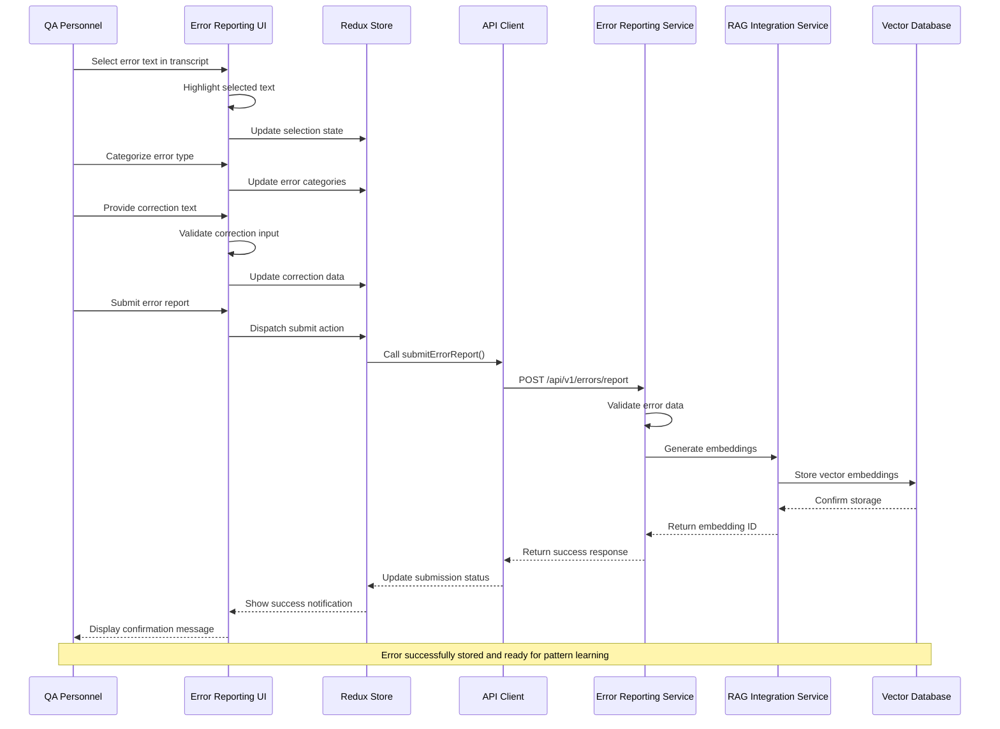
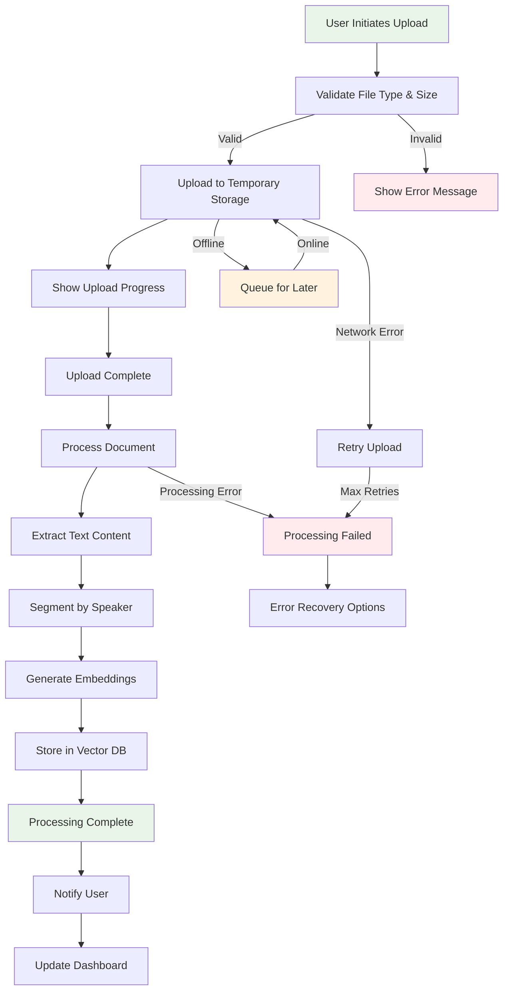
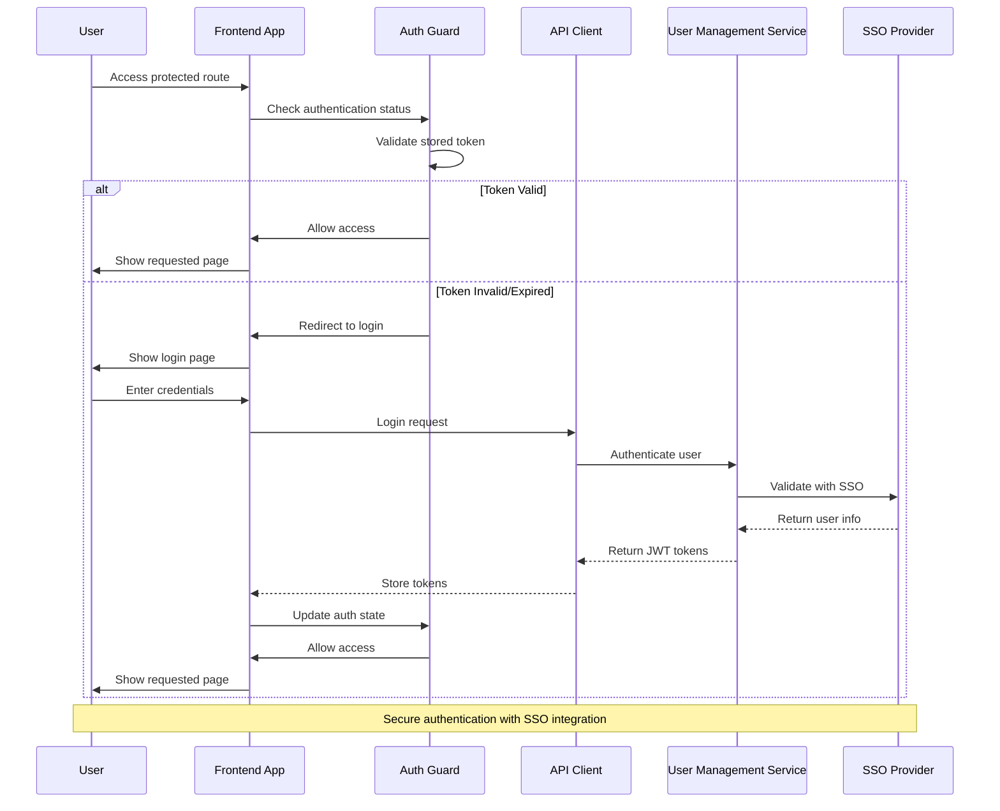
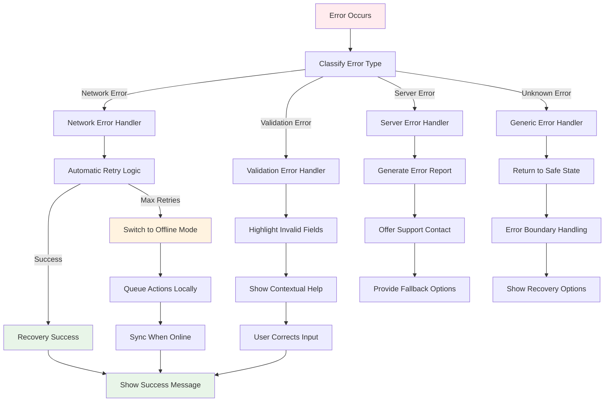
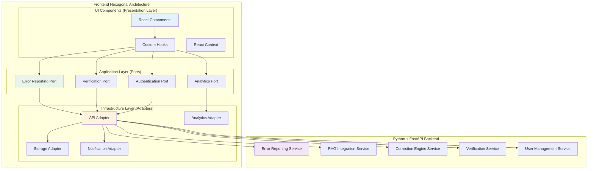

# RAG Interface Project - UI/UX Architecture Design

**Document Version:** 1.0  
**Date:** August 20, 2025  
**Status:** Implementation Ready  
**Architecture Pattern:** Hexagonal Architecture + Component-Based Design  
**Technology Stack:** React 18+ with TypeScript + Python FastAPI Backend  
**Design Principles:** Responsive Design + Accessibility + Offline-First  

---

## Table of Contents

1. [Executive Summary](#executive-summary)
2. [User Interface Architecture](#user-interface-architecture)
3. [User Experience Flows](#user-experience-flows)
4. [Detailed User Stories](#detailed-user-stories)
5. [Technical Specifications](#technical-specifications)
6. [Frontend Technology Stack Evaluation](#frontend-technology-stack-evaluation)
7. [API Integration Patterns](#api-integration-patterns)
8. [Responsive Design Requirements](#responsive-design-requirements)
9. [Accessibility Considerations](#accessibility-considerations)
10. [Implementation Roadmap](#implementation-roadmap)

---

## 1. Executive Summary

### 1.1 Overview

The RAG Interface Project frontend architecture is designed to provide an intuitive, accessible, and high-performance user interface for the ASR Error Reporting and Correction System. The frontend follows **Hexagonal Architecture principles** to ensure clean separation between UI components and business logic integration points, enabling independent development and testing while maintaining seamless integration with the existing **Python + FastAPI backend services**.

### 1.2 Key Architecture Principles

- **Component-Based Design**: Modular, reusable UI components following React best practices
- **Hexagonal Architecture Alignment**: Clear separation between UI components and backend integration
- **Responsive Design**: Mobile-first approach supporting desktop, tablet, and mobile devices
- **Accessibility-First**: WCAG 2.1 AA compliance for inclusive user experience
- **Offline-First**: Progressive Web App capabilities with offline functionality
- **Performance-Optimized**: Sub-3-second load times and smooth user interactions

### 1.3 Core Applications

1. **Error Reporting Interface**: Advanced text selection and error categorization
2. **Verification Dashboard**: Correction review and analytics visualization
3. **Admin Dashboard**: System monitoring and user management
4. **Mobile Companion App**: On-the-go access for QA personnel

### 1.4 Integration with Backend Services

The frontend integrates with five Python + FastAPI microservices:
- **Error Reporting Service (ERS)**: Error submission and validation
- **RAG Integration Service (RIS)**: Vector similarity search and pattern recognition
- **Correction Engine Service (CES)**: Real-time correction application
- **Verification Service (VS)**: Correction verification and analytics
- **User Management Service (UMS)**: Authentication and authorization

---

## 2. User Interface Architecture

### 2.1 Component Hierarchy and Relationships

```mermaid
graph TB
    subgraph "Frontend Application Layer"
        APP[Main Application Shell]
        ROUTER[React Router]
        AUTH_GUARD[Authentication Guard]
        LAYOUT[Layout Components]
    end

    subgraph "Feature Modules"
        subgraph "Error Reporting Module"
            ER_CONTAINER[Error Reporting Container]
            TEXT_SELECTOR[Text Selection Component]
            ERROR_FORM[Error Form Component]
            CATEGORY_SELECTOR[Category Selector]
            METADATA_INPUT[Metadata Input]
        end

        subgraph "Verification Module"
            VER_CONTAINER[Verification Container]
            DASHBOARD[Dashboard Component]
            CORRECTION_GRID[Correction Grid]
            COMPARISON_VIEW[Before/After Comparison]
            ANALYTICS_CHARTS[Analytics Charts]
        end

        subgraph "Admin Module"
            ADMIN_CONTAINER[Admin Container]
            USER_MANAGEMENT[User Management]
            SYSTEM_MONITOR[System Monitoring]
            CONFIG_PANEL[Configuration Panel]
        end
    end

    subgraph "Shared Components Library"
        UI_COMPONENTS[UI Components]
        DATA_GRID[Data Grid]
        CHARTS[Chart Components]
        FORMS[Form Components]
        MODALS[Modal Components]
        NOTIFICATIONS[Notification System]
    end

    subgraph "State Management Layer"
        REDUX_STORE[Redux Store]
        AUTH_SLICE[Authentication Slice]
        ERROR_SLICE[Error Reporting Slice]
        VERIFICATION_SLICE[Verification Slice]
        UI_SLICE[UI State Slice]
    end

    subgraph "API Integration Layer (Hexagonal Adapters)"
        API_CLIENT[API Client]
        ERS_ADAPTER[Error Reporting Adapter]
        RIS_ADAPTER[RAG Integration Adapter]
        CES_ADAPTER[Correction Engine Adapter]
        VS_ADAPTER[Verification Adapter]
        UMS_ADAPTER[User Management Adapter]
    end

    subgraph "Python + FastAPI Backend Services"
        ERS_SERVICE[Error Reporting Service]
        RIS_SERVICE[RAG Integration Service]
        CES_SERVICE[Correction Engine Service]
        VS_SERVICE[Verification Service]
        UMS_SERVICE[User Management Service]
    end

    %% Application Flow
    APP --> ROUTER
    ROUTER --> AUTH_GUARD
    AUTH_GUARD --> LAYOUT

    %% Feature Module Connections
    LAYOUT --> ER_CONTAINER
    LAYOUT --> VER_CONTAINER
    LAYOUT --> ADMIN_CONTAINER

    %% Error Reporting Module
    ER_CONTAINER --> TEXT_SELECTOR
    ER_CONTAINER --> ERROR_FORM
    ERROR_FORM --> CATEGORY_SELECTOR
    ERROR_FORM --> METADATA_INPUT

    %% Verification Module
    VER_CONTAINER --> DASHBOARD
    VER_CONTAINER --> CORRECTION_GRID
    VER_CONTAINER --> COMPARISON_VIEW
    VER_CONTAINER --> ANALYTICS_CHARTS

    %% Admin Module
    ADMIN_CONTAINER --> USER_MANAGEMENT
    ADMIN_CONTAINER --> SYSTEM_MONITOR
    ADMIN_CONTAINER --> CONFIG_PANEL

    %% Shared Components Usage
    ER_CONTAINER --> UI_COMPONENTS
    VER_CONTAINER --> UI_COMPONENTS
    ADMIN_CONTAINER --> UI_COMPONENTS
    
    CORRECTION_GRID --> DATA_GRID
    ANALYTICS_CHARTS --> CHARTS
    ERROR_FORM --> FORMS
    COMPARISON_VIEW --> MODALS
    
    %% State Management Connections
    ER_CONTAINER --> REDUX_STORE
    VER_CONTAINER --> REDUX_STORE
    ADMIN_CONTAINER --> REDUX_STORE
    
    REDUX_STORE --> AUTH_SLICE
    REDUX_STORE --> ERROR_SLICE
    REDUX_STORE --> VERIFICATION_SLICE
    REDUX_STORE --> UI_SLICE

    %% API Integration (Hexagonal Adapters)
    ER_CONTAINER --> API_CLIENT
    VER_CONTAINER --> API_CLIENT
    ADMIN_CONTAINER --> API_CLIENT
    
    API_CLIENT --> ERS_ADAPTER
    API_CLIENT --> RIS_ADAPTER
    API_CLIENT --> CES_ADAPTER
    API_CLIENT --> VS_ADAPTER
    API_CLIENT --> UMS_ADAPTER

    %% Backend Service Integration
    ERS_ADAPTER --> ERS_SERVICE
    RIS_ADAPTER --> RIS_SERVICE
    CES_ADAPTER --> CES_SERVICE
    VS_ADAPTER --> VS_SERVICE
    UMS_ADAPTER --> UMS_SERVICE

    %% Styling
    classDef frontend fill:#e3f2fd,stroke:#2196f3,stroke-width:2px
    classDef components fill:#e8f5e8,stroke:#4caf50,stroke-width:2px
    classDef state fill:#fff3e0,stroke:#ff9800,stroke-width:2px
    classDef adapters fill:#fce4ec,stroke:#e91e63,stroke-width:2px
    classDef backend fill:#f3e5f5,stroke:#9c27b0,stroke-width:2px

    class APP,ROUTER,AUTH_GUARD,LAYOUT frontend
    class ER_CONTAINER,VER_CONTAINER,ADMIN_CONTAINER,UI_COMPONENTS components
    class REDUX_STORE,AUTH_SLICE,ERROR_SLICE,VERIFICATION_SLICE,UI_SLICE state
    class API_CLIENT,ERS_ADAPTER,RIS_ADAPTER,CES_ADAPTER,VS_ADAPTER,UMS_ADAPTER adapters
    class ERS_SERVICE,RIS_SERVICE,CES_SERVICE,VS_SERVICE,UMS_SERVICE backend
```



### 2.2 Page Structure and Navigation Flow

```mermaid
flowchart TD
    LOGIN[Login Page] --> DASHBOARD[Main Dashboard]
    
    DASHBOARD --> ERROR_REPORTING[Error Reporting Interface]
    DASHBOARD --> VERIFICATION[Verification Dashboard]
    DASHBOARD --> ADMIN[Admin Dashboard]
    DASHBOARD --> PROFILE[User Profile]
    
    ERROR_REPORTING --> TEXT_SELECTION[Text Selection View]
    ERROR_REPORTING --> ERROR_FORM_VIEW[Error Form View]
    ERROR_REPORTING --> SUBMISSION_CONFIRM[Submission Confirmation]
    
    VERIFICATION --> CORRECTION_LIST[Correction List View]
    VERIFICATION --> CORRECTION_DETAIL[Correction Detail View]
    VERIFICATION --> ANALYTICS_VIEW[Analytics View]
    VERIFICATION --> BULK_ACTIONS[Bulk Actions View]
    
    ADMIN --> USER_MGMT[User Management]
    ADMIN --> SYSTEM_HEALTH[System Health Monitor]
    ADMIN --> CONFIG[System Configuration]
    ADMIN --> AUDIT_LOGS[Audit Logs]
    
    %% Navigation Patterns
    TEXT_SELECTION --> ERROR_FORM_VIEW
    ERROR_FORM_VIEW --> SUBMISSION_CONFIRM
    SUBMISSION_CONFIRM --> DASHBOARD
    
    CORRECTION_LIST --> CORRECTION_DETAIL
    CORRECTION_DETAIL --> CORRECTION_LIST
    
    %% Cross-Module Navigation
    ERROR_REPORTING -.->|Quick Access| VERIFICATION
    VERIFICATION -.->|Report New Error| ERROR_REPORTING
    
    %% Mobile Navigation
    DASHBOARD --> MOBILE_MENU[Mobile Menu]
    MOBILE_MENU --> ERROR_REPORTING
    MOBILE_MENU --> VERIFICATION
    
    style LOGIN fill:#ffebee
    style DASHBOARD fill:#e8f5e8
    style ERROR_REPORTING fill:#e3f2fd
    style VERIFICATION fill:#fff3e0
    style ADMIN fill:#f3e5f5

### 2.3 State Management Architecture

```mermaid
graph TB
    subgraph "Redux Store Architecture"
        STORE[Redux Store]

        subgraph "Authentication Slice"
            AUTH_STATE[Authentication State]
            AUTH_ACTIONS[Auth Actions]
            AUTH_REDUCERS[Auth Reducers]
        end

        subgraph "Error Reporting Slice"
            ERROR_STATE[Error State]
            ERROR_ACTIONS[Error Actions]
            ERROR_REDUCERS[Error Reducers]
        end

        subgraph "Verification Slice"
            VER_STATE[Verification State]
            VER_ACTIONS[Verification Actions]
            VER_REDUCERS[Verification Reducers]
        end

        subgraph "UI State Slice"
            UI_STATE[UI State]
            UI_ACTIONS[UI Actions]
            UI_REDUCERS[UI Reducers]
        end
    end

    subgraph "Middleware Layer"
        RTK_QUERY[RTK Query]
        PERSISTENCE[Redux Persist]
        OFFLINE_MIDDLEWARE[Offline Middleware]
        ANALYTICS_MIDDLEWARE[Analytics Middleware]
    end

    subgraph "Component Integration"
        HOOKS[Custom Hooks]
        SELECTORS[Memoized Selectors]
        THUNKS[Async Thunks]
    end

    %% Corrected Slice Logic
    AUTH_ACTIONS --> AUTH_REDUCERS
    AUTH_REDUCERS --> AUTH_STATE
    ERROR_ACTIONS --> ERROR_REDUCERS
    ERROR_REDUCERS --> ERROR_STATE
    VER_ACTIONS --> VER_REDUCERS
    VER_REDUCERS --> VER_STATE
    UI_ACTIONS --> UI_REDUCERS
    UI_REDUCERS --> UI_STATE

    %% Store Composition
    STORE --- AUTH_STATE
    STORE --- ERROR_STATE
    STORE --- VER_STATE
    STORE --- UI_STATE

    %% Middleware Integration
    STORE -- "applyMiddleware()" --> RTK_QUERY
    STORE -- "applyMiddleware()" --> PERSISTENCE
    STORE -- "applyMiddleware()" --> OFFLINE_MIDDLEWARE
    STORE -- "applyMiddleware()" --> ANALYTICS_MIDDLEWARE

    %% Component Integration
    HOOKS -- "useDispatch()" --> AUTH_ACTIONS
    HOOKS -- "useDispatch()" --> ERROR_ACTIONS
    HOOKS -- "useDispatch()" --> VER_ACTIONS
    HOOKS -- "useDispatch()" --> UI_ACTIONS
    HOOKS -- "useSelector()" --> SELECTORS
    
    SELECTORS --> AUTH_STATE
    SELECTORS --> ERROR_STATE
    SELECTORS --> VER_STATE
    SELECTORS --> UI_STATE

    THUNKS -- "dispatch()" --> AUTH_ACTIONS
    THUNKS -- "dispatch()" --> ERROR_ACTIONS
    
    RTK_QUERY -- "provides" --> HOOKS
```

---

## 3. User Experience Flows

### 3.1 RAG Query Submission and Response Handling



### 3.2 Document Upload and Processing Workflow



### 3.3 User Authentication and Authorization Flow



### 3.4 Error Handling and Feedback Mechanisms



---

## 4. Detailed User Stories

### 4.1 Epic 1: Advanced Text Selection Interface

#### 4.1.1 US-UI-1.1: Non-Contiguous Text Selection
**As a QA personnel**, I want to select multiple non-contiguous text segments in a single error report so that I can accurately identify complex errors that span different parts of the transcript.

**Frontend-Specific Acceptance Criteria:**
- [ ] I can click and drag to select text with visual highlighting
- [ ] I can hold Ctrl/Cmd and select additional non-contiguous segments
- [ ] Selected segments are numbered and color-coded for identification
- [ ] I can see visual connectors between related segments
- [ ] I can remove individual segments by clicking an 'X' button
- [ ] The interface shows a summary of all selected segments
- [ ] Selection data is preserved during form navigation
- [ ] Maximum of 10 segments per error report with clear indication

**Technical Implementation:**
- React component with custom text selection hooks
- Canvas overlay for visual indicators and connectors
- Redux state management for selection persistence
- Accessibility support with ARIA labels and keyboard navigation

**Story Points:** 8
**Priority:** High
**Dependencies:** Text rendering component, state management setup

#### 4.1.2 US-UI-1.2: Real-time Error Validation
**As a QA personnel**, I want immediate feedback on error report validation so that I can correct issues before submission.

**Frontend-Specific Acceptance Criteria:**
- [ ] Form fields show validation status in real-time
- [ ] Invalid fields are highlighted with red borders and error icons
- [ ] Validation messages appear below each field
- [ ] Submit button is disabled until all validations pass
- [ ] Progress indicator shows completion percentage
- [ ] Validation occurs on blur and on change events
- [ ] Custom validation rules for medical terminology
- [ ] Accessibility announcements for screen readers

**Story Points:** 5
**Priority:** High

### 4.2 Epic 2: Verification Dashboard Interface

#### 4.2.1 US-UI-2.1: Interactive Correction Grid
**As a QA personnel**, I want an interactive grid to review corrections so that I can efficiently verify multiple corrections.

**Frontend-Specific Acceptance Criteria:**
- [ ] Sortable columns with visual sort indicators
- [ ] Filterable columns with dropdown filters
- [ ] Inline editing for quick approve/reject actions
- [ ] Bulk selection with checkbox controls
- [ ] Pagination with configurable page sizes
- [ ] Export functionality for selected items
- [ ] Responsive design for tablet and mobile
- [ ] Keyboard navigation support

**Story Points:** 13
**Priority:** High

#### 4.2.2 US-UI-2.2: Before/After Comparison View
**As a QA personnel**, I want a side-by-side comparison view so that I can easily evaluate correction accuracy.

**Frontend-Specific Acceptance Criteria:**
- [ ] Split-pane layout with original and corrected text
- [ ] Diff highlighting with color-coded changes
- [ ] Confidence score visualization with progress bars
- [ ] Expandable context around corrections
- [ ] Zoom controls for better readability
- [ ] Print-friendly layout option
- [ ] Mobile-optimized stacked layout
- [ ] Audio playback integration (if available)

**Story Points:** 8
**Priority:** High

### 4.3 Epic 3: Responsive Design and Mobile Support

#### 4.3.1 US-UI-3.1: Mobile-First Error Reporting
**As a QA personnel using a tablet**, I want a touch-optimized error reporting interface so that I can work efficiently on mobile devices.

**Frontend-Specific Acceptance Criteria:**
- [ ] Touch-friendly text selection with haptic feedback
- [ ] Optimized form layouts for portrait and landscape
- [ ] Swipe gestures for navigation between form steps
- [ ] Voice input support for correction text
- [ ] Offline capability with local storage
- [ ] Progressive Web App installation
- [ ] Native-like navigation patterns
- [ ] Optimized performance on mobile networks

**Story Points:** 13
**Priority:** Medium

### 4.4 Epic 4: Accessibility and Inclusive Design

#### 4.4.1 US-UI-4.1: Screen Reader Compatibility
**As a QA personnel with visual impairments**, I want full screen reader support so that I can use the system effectively.

**Frontend-Specific Acceptance Criteria:**
- [ ] All interactive elements have proper ARIA labels
- [ ] Form validation errors are announced to screen readers
- [ ] Keyboard navigation follows logical tab order
- [ ] Skip links for main content areas
- [ ] High contrast mode support
- [ ] Text scaling up to 200% without horizontal scrolling
- [ ] Alternative text for all images and icons
- [ ] Focus indicators are clearly visible

**Story Points:** 8
**Priority:** High

---

## 5. Technical Specifications

### 5.1 Performance Requirements

#### 5.1.1 Load Time Targets
- **Initial Page Load**: < 3 seconds on 3G networks
- **Route Transitions**: < 500ms between pages
- **Form Interactions**: < 100ms response time
- **Data Grid Rendering**: < 2 seconds for 1000 rows
- **Text Selection**: < 50ms response time

#### 5.1.2 Bundle Size Optimization
- **Main Bundle**: < 250KB gzipped
- **Vendor Bundle**: < 500KB gzipped
- **Code Splitting**: Route-based and component-based
- **Tree Shaking**: Eliminate unused code
- **Image Optimization**: WebP format with fallbacks

### 5.2 Browser Support Matrix

| Browser | Version | Support Level |
|---------|---------|---------------|
| Chrome | 90+ | Full Support |
| Firefox | 88+ | Full Support |
| Safari | 14+ | Full Support |
| Edge | 90+ | Full Support |
| Mobile Safari | 14+ | Full Support |
| Chrome Mobile | 90+ | Full Support |

### 5.3 Security Requirements

#### 5.3.1 Client-Side Security
- **Content Security Policy**: Strict CSP headers
- **XSS Protection**: Input sanitization and output encoding
- **CSRF Protection**: Token-based protection
- **Secure Storage**: Encrypted local storage for sensitive data
- **Session Management**: Automatic logout on inactivity

#### 5.3.2 Data Protection
- **PII Handling**: Minimal client-side storage of personal data
- **Audit Logging**: User action tracking for compliance
- **Data Encryption**: Encrypt sensitive data in transit and at rest
- **Access Control**: Role-based UI element visibility

---

## 6. Frontend Technology Stack Evaluation

### 6.1 Primary Recommendation: React 18+ with TypeScript

**Rationale**: Aligns with existing Technology Stack Standards and provides mature ecosystem.

#### 6.1.1 Core Technologies
- **Framework**: React 18+ with Concurrent Features
- **Language**: TypeScript 4.9+ for type safety
- **State Management**: Redux Toolkit with RTK Query
- **Routing**: React Router v6+ with data loading
- **UI Library**: Material-UI v5+ with custom theming
- **Build Tool**: Vite for fast development and builds
- **Testing**: Jest + React Testing Library + Cypress

#### 6.1.2 Advantages
- **Mature Ecosystem**: Extensive library support and community
- **Team Expertise**: Existing team knowledge and skills
- **Backend Integration**: Seamless integration with FastAPI
- **Performance**: Excellent performance with proper optimization
- **Accessibility**: Strong accessibility tooling and patterns
- **Enterprise Ready**: Proven in large-scale applications

#### 6.1.3 Architecture Pattern
```typescript
// Hexagonal Architecture Implementation
interface ErrorReportingPort {
  submitError(request: ErrorReportRequest): Promise<ErrorReportResponse>;
  getErrors(filters: ErrorFilters): Promise<ErrorReport[]>;
}

class ErrorReportingAdapter implements ErrorReportingPort {
  constructor(private apiClient: ApiClient) {}

  async submitError(request: ErrorReportRequest): Promise<ErrorReportResponse> {
    return this.apiClient.post('/api/v1/errors/report', request);
  }
}

// React Component with Dependency Injection
const ErrorReportingContainer: React.FC = () => {
  const errorService = useErrorReportingService(); // Injected adapter
  const [state, dispatch] = useErrorReportingState();

  return <ErrorReportingView service={errorService} state={state} />;
};
```

### 6.2 Alternative Evaluation: Compose Multiplatform

**Evaluation**: Considered for cross-platform mobile development.

#### 6.2.1 Compose Multiplatform Analysis

**Advantages:**
- **Cross-Platform**: Single codebase for web, mobile, and desktop
- **Modern UI**: Declarative UI with Kotlin
- **Performance**: Native performance on mobile platforms
- **Type Safety**: Strong typing with Kotlin
- **Jetpack Integration**: Seamless Android integration

**Disadvantages:**
- **Learning Curve**: Team would need Kotlin expertise
- **Ecosystem Maturity**: Smaller ecosystem compared to React
- **Web Support**: Limited web platform maturity
- **Backend Integration**: Additional complexity with FastAPI integration
- **Tooling**: Less mature development tooling

#### 6.2.2 Recommendation Decision

**Decision**: **Stick with React 18+ with TypeScript**

**Justification:**
1. **Team Readiness**: Existing React expertise in team
2. **Technology Alignment**: Consistent with approved Technology Stack Standards
3. **Backend Integration**: Proven integration patterns with FastAPI
4. **Time to Market**: Faster development with known technologies
5. **Risk Mitigation**: Lower risk with mature, proven technology

**Future Consideration**: Evaluate Compose Multiplatform for mobile-specific features in Phase 2.

### 6.3 Progressive Web App (PWA) Implementation

#### 6.3.1 PWA Features
- **Offline Functionality**: Service worker with background sync
- **App-like Experience**: Native app feel on mobile devices
- **Push Notifications**: Real-time updates for corrections
- **Installation**: Add to home screen capability
- **Performance**: App shell architecture for fast loading

#### 6.3.2 Offline Strategy
```typescript
// Service Worker Implementation
self.addEventListener('sync', (event) => {
  if (event.tag === 'error-report-sync') {
    event.waitUntil(syncErrorReports());
  }
});

// Offline Storage Strategy
class OfflineStorageAdapter {
  async saveErrorReport(report: ErrorReport): Promise<void> {
    await this.indexedDB.put('errorReports', report);
    await this.registerBackgroundSync('error-report-sync');
  }

  async syncWhenOnline(): Promise<void> {
    const pendingReports = await this.indexedDB.getAll('errorReports');
    for (const report of pendingReports) {
      await this.apiClient.submitError(report);
      await this.indexedDB.delete('errorReports', report.id);
    }
  }
}
```

---

## 7. API Integration Patterns

### 7.1 Hexagonal Architecture Integration



### 7.2 API Client Architecture

#### 7.2.1 Base API Client
```typescript
interface ApiClientConfig {
  baseURL: string;
  timeout: number;
  retryAttempts: number;
  authTokenProvider: () => Promise<string>;
}

class ApiClient {
  constructor(private config: ApiClientConfig) {}

  async request<T>(options: RequestOptions): Promise<ApiResponse<T>> {
    const token = await this.config.authTokenProvider();
    const response = await this.httpClient.request({
      ...options,
      headers: {
        ...options.headers,
        'Authorization': `Bearer ${token}`,
        'Content-Type': 'application/json',
      },
    });

    return this.handleResponse<T>(response);
  }

  private async handleResponse<T>(response: Response): Promise<ApiResponse<T>> {
    if (!response.ok) {
      throw new ApiError(response.status, await response.text());
    }
    return response.json();
  }
}
```

#### 7.2.2 Service-Specific Adapters
```typescript
// Error Reporting Service Adapter
class ErrorReportingServiceAdapter {
  constructor(private apiClient: ApiClient) {}

  async submitErrorReport(request: ErrorReportRequest): Promise<ErrorReportResponse> {
    return this.apiClient.request({
      method: 'POST',
      url: '/api/v1/errors/report',
      data: request,
    });
  }

  async getErrorsByJob(jobId: string, filters?: ErrorFilters): Promise<ErrorReport[]> {
    return this.apiClient.request({
      method: 'GET',
      url: `/api/v1/errors/job/${jobId}`,
      params: filters,
    });
  }
}

// RAG Integration Service Adapter
class RAGIntegrationServiceAdapter {
  constructor(private apiClient: ApiClient) {}

  async findSimilarPatterns(query: SimilarityQuery): Promise<SimilarityResult[]> {
    return this.apiClient.request({
      method: 'POST',
      url: '/api/v1/vectors/similarity/search',
      data: query,
    });
  }
}
```

### 7.3 Real-time Communication

#### 7.3.1 WebSocket Integration
```typescript
class WebSocketAdapter {
  private ws: WebSocket | null = null;
  private eventHandlers: Map<string, Function[]> = new Map();

  connect(url: string): void {
    this.ws = new WebSocket(url);
    this.ws.onmessage = (event) => {
      const message = JSON.parse(event.data);
      this.handleMessage(message);
    };
  }

  subscribe(eventType: string, handler: Function): void {
    if (!this.eventHandlers.has(eventType)) {
      this.eventHandlers.set(eventType, []);
    }
    this.eventHandlers.get(eventType)!.push(handler);
  }

  private handleMessage(message: WebSocketMessage): void {
    const handlers = this.eventHandlers.get(message.type) || [];
    handlers.forEach(handler => handler(message.data));
  }
}

// Usage in React Component
const useRealTimeUpdates = () => {
  const wsAdapter = useWebSocketAdapter();

  useEffect(() => {
    wsAdapter.subscribe('correction_applied', (data) => {
      // Update UI with real-time correction
      dispatch(addCorrection(data));
    });

    wsAdapter.subscribe('verification_completed', (data) => {
      // Update verification status
      dispatch(updateVerificationStatus(data));
    });
  }, [wsAdapter, dispatch]);
};
```

### 7.4 Error Handling and Retry Logic

#### 7.4.1 Retry Strategy
```typescript
class RetryableApiClient extends ApiClient {
  async requestWithRetry<T>(
    options: RequestOptions,
    retryConfig: RetryConfig = DEFAULT_RETRY_CONFIG
  ): Promise<ApiResponse<T>> {
    let lastError: Error;

    for (let attempt = 0; attempt <= retryConfig.maxAttempts; attempt++) {
      try {
        return await this.request<T>(options);
      } catch (error) {
        lastError = error;

        if (!this.shouldRetry(error, attempt, retryConfig)) {
          throw error;
        }

        await this.delay(this.calculateBackoff(attempt, retryConfig));
      }
    }

    throw lastError!;
  }

  private shouldRetry(error: Error, attempt: number, config: RetryConfig): boolean {
    if (attempt >= config.maxAttempts) return false;
    if (error instanceof NetworkError) return true;
    if (error instanceof ApiError && error.status >= 500) return true;
    return false;
  }
}
```

---

## 8. Responsive Design Requirements

### 8.1 Breakpoint Strategy

#### 8.1.1 Responsive Breakpoints
```scss
// Mobile-first breakpoint system
$breakpoints: (
  'xs': 0,      // Extra small devices (phones)
  'sm': 576px,  // Small devices (landscape phones)
  'md': 768px,  // Medium devices (tablets)
  'lg': 992px,  // Large devices (desktops)
  'xl': 1200px, // Extra large devices (large desktops)
  'xxl': 1400px // Extra extra large devices
);

// Usage in components
.error-reporting-container {
  padding: 1rem;

  @media (min-width: map-get($breakpoints, 'md')) {
    padding: 2rem;
    display: grid;
    grid-template-columns: 1fr 300px;
    gap: 2rem;
  }

  @media (min-width: map-get($breakpoints, 'lg')) {
    max-width: 1200px;
    margin: 0 auto;
  }
}
```

#### 8.1.2 Component Responsive Behavior

| Component | Mobile (< 768px) | Tablet (768px - 1024px) | Desktop (> 1024px) |
|-----------|------------------|--------------------------|-------------------|
| Text Selection | Touch-optimized selection | Hybrid touch/mouse | Mouse-optimized |
| Error Form | Single column, stacked | Two columns | Three columns |
| Verification Grid | Card layout | Compact grid | Full-featured grid |
| Navigation | Hamburger menu | Tab bar | Sidebar navigation |
| Comparison View | Stacked layout | Side-by-side | Split pane |

### 8.2 Touch-Optimized Interactions

#### 8.2.1 Touch Targets
- **Minimum Size**: 44px × 44px for all interactive elements
- **Spacing**: 8px minimum between touch targets
- **Feedback**: Visual and haptic feedback for touch interactions
- **Gestures**: Swipe, pinch-to-zoom, long-press support

#### 8.2.2 Mobile-Specific Features
```typescript
// Touch-optimized text selection
const useTouchTextSelection = () => {
  const [isSelecting, setIsSelecting] = useState(false);
  const [selection, setSelection] = useState<TextSelection | null>(null);

  const handleTouchStart = (event: TouchEvent) => {
    setIsSelecting(true);
    const touch = event.touches[0];
    const startPosition = getTextPositionFromPoint(touch.clientX, touch.clientY);
    setSelection({ start: startPosition, end: startPosition });
  };

  const handleTouchMove = (event: TouchEvent) => {
    if (!isSelecting) return;

    const touch = event.touches[0];
    const endPosition = getTextPositionFromPoint(touch.clientX, touch.clientY);
    setSelection(prev => prev ? { ...prev, end: endPosition } : null);
  };

  const handleTouchEnd = () => {
    setIsSelecting(false);
    if (selection) {
      onSelectionComplete(selection);
    }
  };

  return { handleTouchStart, handleTouchMove, handleTouchEnd, selection };
};
```

### 8.3 Performance Optimization for Mobile

#### 8.3.1 Mobile Performance Targets
- **First Contentful Paint**: < 2 seconds on 3G
- **Largest Contentful Paint**: < 3 seconds on 3G
- **Cumulative Layout Shift**: < 0.1
- **First Input Delay**: < 100ms
- **Bundle Size**: < 150KB gzipped for mobile

#### 8.3.2 Optimization Strategies
```typescript
// Lazy loading for mobile
const LazyVerificationDashboard = lazy(() =>
  import('./VerificationDashboard').then(module => ({
    default: module.VerificationDashboard
  }))
);

// Image optimization
const OptimizedImage: React.FC<ImageProps> = ({ src, alt, ...props }) => {
  const isMobile = useMediaQuery('(max-width: 768px)');
  const optimizedSrc = isMobile ? `${src}?w=400&q=75` : `${src}?w=800&q=85`;

  return (
    
  );
};

// Virtual scrolling for large lists
const VirtualizedCorrectionGrid: React.FC = () => {
  const { height, width } = useWindowSize();

  return (
    <FixedSizeList
      height={height - 200}
      width={width}
      itemCount={corrections.length}
      itemSize={80}
      itemData={corrections}
    >
      {CorrectionRow}
    </FixedSizeList>
  );
};
```

---

## 9. Accessibility Considerations

### 9.1 WCAG 2.1 AA Compliance

#### 9.1.1 Core Accessibility Requirements

**Perceivable:**
- **Color Contrast**: Minimum 4.5:1 ratio for normal text, 3:1 for large text
- **Alternative Text**: Descriptive alt text for all images and icons
- **Captions**: Video content includes captions and transcripts
- **Scalable Text**: Support up to 200% zoom without horizontal scrolling

**Operable:**
- **Keyboard Navigation**: All functionality accessible via keyboard
- **Focus Management**: Visible focus indicators and logical tab order
- **Timing**: No time limits or user-controllable time limits
- **Seizures**: No content that flashes more than 3 times per second

**Understandable:**
- **Clear Language**: Simple, clear language and instructions
- **Predictable**: Consistent navigation and interaction patterns
- **Input Assistance**: Clear error messages and form validation

**Robust:**
- **Screen Reader Support**: Compatible with assistive technologies
- **Semantic HTML**: Proper use of HTML5 semantic elements
- **ARIA Labels**: Comprehensive ARIA labeling for complex interactions

#### 9.1.2 Implementation Examples

```typescript
// Accessible Text Selection Component
const AccessibleTextSelector: React.FC = () => {
  const [selectedText, setSelectedText] = useState('');
  const [announcement, setAnnouncement] = useState('');

  const handleTextSelection = (text: string) => {
    setSelectedText(text);
    setAnnouncement(`Selected text: ${text}`);
  };

  return (
    <div>
      <div
        role="textbox"
        aria-label="Document text for error selection"
        aria-describedby="selection-instructions"
        tabIndex={0}
        onKeyDown={handleKeyboardSelection}
      >
        {documentText}
      </div>

      <div id="selection-instructions" className="sr-only">
        Use arrow keys to navigate text. Press Space to start selection,
        arrow keys to extend selection, Enter to confirm selection.
      </div>

      <div
        role="status"
        aria-live="polite"
        aria-atomic="true"
        className="sr-only"
      >
        {announcement}
      </div>
    </div>
  );
};

// Accessible Form with Error Handling
const AccessibleErrorForm: React.FC = () => {
  const [errors, setErrors] = useState<FormErrors>({});
  const [touched, setTouched] = useState<FormTouched>({});

  return (
    <form role="form" aria-labelledby="error-form-title">
      <h2 id="error-form-title">Error Report Form</h2>

      <div className="form-group">
        <label htmlFor="error-category" className="required">
          Error Category
        </label>
        <select
          id="error-category"
          aria-describedby="error-category-error error-category-help"
          aria-invalid={errors.category ? 'true' : 'false'}
          aria-required="true"
        >
          <option value="">Select a category</option>
          <option value="pronunciation">Pronunciation Error</option>
          <option value="medical">Medical Terminology</option>
        </select>

        <div id="error-category-help" className="help-text">
          Choose the type of error you identified in the transcript
        </div>

        {errors.category && (
          <div
            id="error-category-error"
            role="alert"
            className="error-message"
          >
            {errors.category}
          </div>
        )}
      </div>
    </form>
  );
};
```

### 9.2 Assistive Technology Support

#### 9.2.1 Screen Reader Optimization
```typescript
// Screen Reader Announcements Hook
const useScreenReaderAnnouncements = () => {
  const [announcement, setAnnouncement] = useState('');

  const announce = (message: string, priority: 'polite' | 'assertive' = 'polite') => {
    setAnnouncement(''); // Clear previous announcement
    setTimeout(() => setAnnouncement(message), 100);
  };

  return { announcement, announce };
};

// Usage in components
const CorrectionGrid: React.FC = () => {
  const { announce } = useScreenReaderAnnouncements();

  const handleCorrectionApproval = (correctionId: string) => {
    approvCorrection(correctionId);
    announce(`Correction ${correctionId} approved successfully`);
  };

  return (
    <div role="grid" aria-label="Corrections awaiting verification">
      {/* Grid content */}
    </div>
  );
};
```

#### 9.2.2 Keyboard Navigation Patterns
```typescript
// Keyboard Navigation Hook
const useKeyboardNavigation = (items: any[], onSelect: (item: any) => void) => {
  const [focusedIndex, setFocusedIndex] = useState(0);

  const handleKeyDown = (event: KeyboardEvent) => {
    switch (event.key) {
      case 'ArrowDown':
        event.preventDefault();
        setFocusedIndex(prev => Math.min(prev + 1, items.length - 1));
        break;
      case 'ArrowUp':
        event.preventDefault();
        setFocusedIndex(prev => Math.max(prev - 1, 0));
        break;
      case 'Enter':
      case ' ':
        event.preventDefault();
        onSelect(items[focusedIndex]);
        break;
      case 'Home':
        event.preventDefault();
        setFocusedIndex(0);
        break;
      case 'End':
        event.preventDefault();
        setFocusedIndex(items.length - 1);
        break;
    }
  };

  return { focusedIndex, handleKeyDown };
};
```

### 9.3 Inclusive Design Patterns

#### 9.3.1 High Contrast Mode Support
```scss
// High contrast mode styles
@media (prefers-contrast: high) {
  .error-highlight {
    background-color: #ffff00;
    color: #000000;
    border: 2px solid #000000;
  }

  .correction-approved {
    background-color: #00ff00;
    color: #000000;
  }

  .correction-rejected {
    background-color: #ff0000;
    color: #ffffff;
  }
}

// Reduced motion support
@media (prefers-reduced-motion: reduce) {
  .animated-transition {
    animation: none;
    transition: none;
  }

  .loading-spinner {
    animation: none;
  }
}
```

#### 9.3.2 Cognitive Accessibility Features
```typescript
// Progress Indicator for Complex Forms
const FormProgressIndicator: React.FC<{ currentStep: number; totalSteps: number }> = ({
  currentStep,
  totalSteps
}) => {
  const progressPercentage = (currentStep / totalSteps) * 100;

  return (
    <div role="progressbar" aria-valuenow={currentStep} aria-valuemax={totalSteps}>
      <div className="progress-bar">
        <div
          className="progress-fill"
          style={{ width: `${progressPercentage}%` }}
        />
      </div>
      <div className="progress-text">
        Step {currentStep} of {totalSteps}
      </div>
    </div>
  );
};

// Clear Error Messages with Suggestions
const ErrorMessage: React.FC<{ error: string; suggestions?: string[] }> = ({
  error,
  suggestions = []
}) => {
  return (
    <div role="alert" className="error-container">
      <div className="error-message">{error}</div>
      {suggestions.length > 0 && (
        <div className="error-suggestions">
          <p>Suggestions:</p>
          <ul>
            {suggestions.map((suggestion, index) => (
              <li key={index}>{suggestion}</li>
            ))}
          </ul>
        </div>
      )}
    </div>
  );
};
```

---

## 10. Implementation Roadmap

### 10.1 Phase 1: Foundation and Core Components (Weeks 1-4)

#### 10.1.1 Week 1: Project Setup and Infrastructure
**Deliverables:**
- [ ] React 18+ project setup with TypeScript
- [ ] Vite build configuration with optimization
- [ ] ESLint, Prettier, and TypeScript configuration
- [ ] Redux Toolkit store setup with RTK Query
- [ ] Material-UI theme configuration
- [ ] Accessibility testing tools integration (axe-core, jest-axe)
- [ ] Storybook setup for component documentation

**Team Focus:** Frontend infrastructure team (2-3 developers)

#### 10.1.2 Week 2: Design System and Shared Components
**Deliverables:**
- [ ] Design system tokens (colors, typography, spacing)
- [ ] Base UI components (Button, Input, Modal, etc.)
- [ ] Layout components (Header, Sidebar, Footer)
- [ ] Responsive grid system implementation
- [ ] Accessibility-compliant form components
- [ ] Loading states and error boundary components

**Team Focus:** UI/UX team (3-4 developers)

#### 10.1.3 Week 3: Authentication and Navigation
**Deliverables:**
- [ ] Authentication flow implementation
- [ ] Route protection and role-based access
- [ ] Navigation components (desktop and mobile)
- [ ] User profile management interface
- [ ] Session management and token refresh
- [ ] Logout and security features

**Team Focus:** Authentication team (2-3 developers)

#### 10.1.4 Week 4: API Integration Foundation
**Deliverables:**
- [ ] API client architecture implementation
- [ ] Service adapters for all backend services
- [ ] Error handling and retry logic
- [ ] Request/response type definitions
- [ ] Mock API setup for development
- [ ] Integration testing framework

**Team Focus:** Integration team (3-4 developers)

### 10.2 Phase 2: Core Feature Development (Weeks 5-8)

#### 10.2.1 Week 5-6: Error Reporting Interface
**Deliverables:**
- [ ] Advanced text selection component
- [ ] Non-contiguous selection functionality
- [ ] Error categorization interface
- [ ] Real-time form validation
- [ ] Offline draft saving capability
- [ ] Mobile-optimized touch interactions

**Story Points:** 34 points
**Team Focus:** Error reporting team (4-5 developers)

#### 10.2.2 Week 7-8: Verification Dashboard
**Deliverables:**
- [ ] Interactive correction grid with sorting/filtering
- [ ] Before/after comparison view
- [ ] Bulk operations interface
- [ ] Analytics visualization components
- [ ] Export functionality
- [ ] Real-time updates via WebSocket

**Story Points:** 29 points
**Team Focus:** Verification team (4-5 developers)

### 10.3 Phase 3: Advanced Features and Optimization (Weeks 9-12)

#### 10.3.1 Week 9-10: Mobile and PWA Features
**Deliverables:**
- [ ] Progressive Web App implementation
- [ ] Offline functionality with background sync
- [ ] Push notification support
- [ ] Mobile-specific UI optimizations
- [ ] Touch gesture support
- [ ] App installation prompts

**Story Points:** 21 points
**Team Focus:** Mobile team (3-4 developers)

#### 10.3.2 Week 11-12: Performance and Accessibility
**Deliverables:**
- [ ] Performance optimization (code splitting, lazy loading)
- [ ] Accessibility audit and improvements
- [ ] Cross-browser testing and fixes
- [ ] Load testing and optimization
- [ ] Security testing and hardening
- [ ] Documentation completion

**Story Points:** 13 points
**Team Focus:** Quality assurance team (3-4 developers)

### 10.4 Phase 4: Testing and Deployment (Weeks 13-16)

#### 10.4.1 Week 13-14: Comprehensive Testing
**Deliverables:**
- [ ] Unit test coverage (target: 80%)
- [ ] Integration test suite
- [ ] End-to-end test automation
- [ ] Accessibility testing with real users
- [ ] Performance testing on various devices
- [ ] Security penetration testing

#### 10.4.2 Week 15-16: Production Deployment
**Deliverables:**
- [ ] Production build optimization
- [ ] CDN setup and configuration
- [ ] Monitoring and analytics integration
- [ ] Error tracking and reporting
- [ ] User training materials
- [ ] Go-live support and monitoring

### 10.5 Success Metrics and KPIs

#### 10.5.1 Technical Metrics
- **Performance**: < 3 second load time on 3G networks
- **Accessibility**: WCAG 2.1 AA compliance (100%)
- **Test Coverage**: 80% unit test coverage, 60% integration coverage
- **Browser Support**: 95% compatibility across target browsers
- **Mobile Performance**: < 2 second load time on mobile devices

#### 10.5.2 User Experience Metrics
- **User Adoption**: 90% of QA personnel actively using the system
- **Task Completion**: 95% success rate for error reporting tasks
- **User Satisfaction**: 4.5/5 average satisfaction score
- **Error Reduction**: 30% reduction in user-reported UI issues
- **Accessibility**: 100% of accessibility requirements met

#### 10.5.3 Business Impact Metrics
- **Efficiency Gain**: 25% reduction in error reporting time
- **Error Quality**: 95% accuracy in error categorization
- **System Reliability**: 99.9% uptime for frontend applications
- **Mobile Usage**: 40% of users accessing via mobile devices
- **Offline Usage**: 15% of error reports created offline

---

## Conclusion

This comprehensive UI/UX Architecture Design document provides the foundation for developing a modern, accessible, and high-performance frontend for the RAG Interface Project. The architecture aligns with the existing Python + FastAPI backend services while following Hexagonal Architecture principles to ensure clean separation of concerns and maintainable code.

The recommended React 18+ with TypeScript technology stack provides the best balance of team expertise, ecosystem maturity, and integration capabilities with the existing backend infrastructure. The detailed implementation roadmap ensures systematic development with clear milestones and success metrics.

**Next Steps:**
1. Review and approve this architecture design
2. Set up development environments and tooling
3. Begin Phase 1 implementation with foundation components
4. Establish regular review cycles and quality gates
5. Plan user testing and feedback integration

**Document Status:** ✅ Complete and Ready for Implementation
**Next Review Date:** August 27, 2025
**Approval Required:** Frontend Team Lead, UX Designer, Product Owner, Architecture Review Board
```
```

