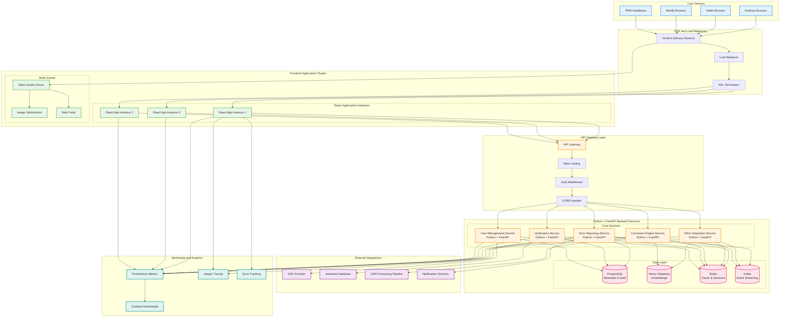
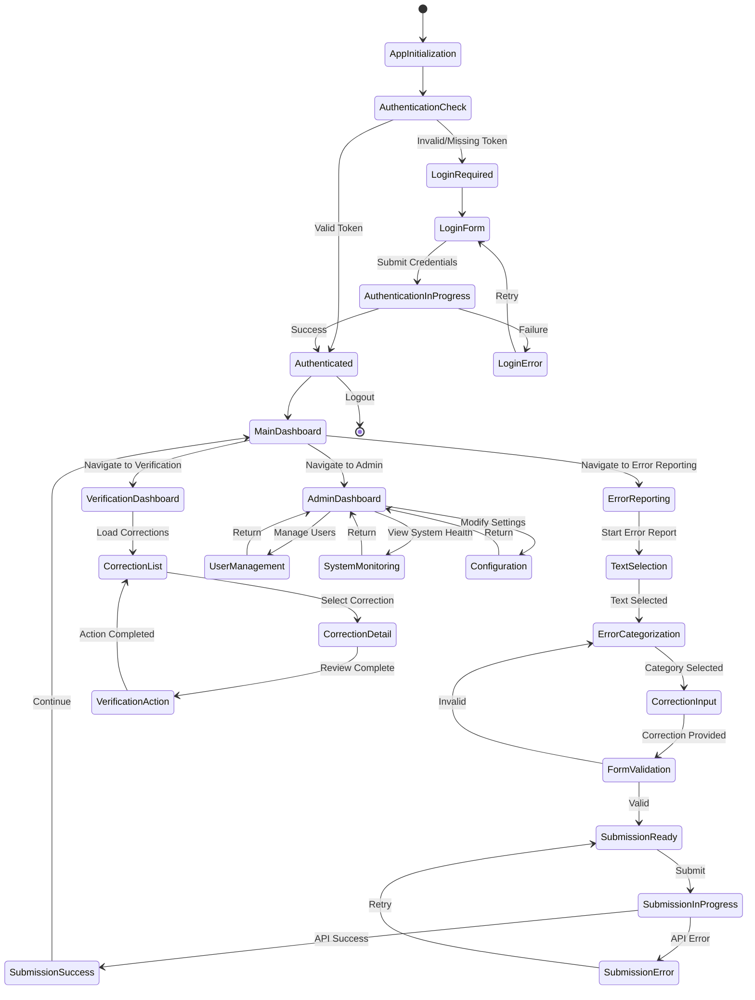
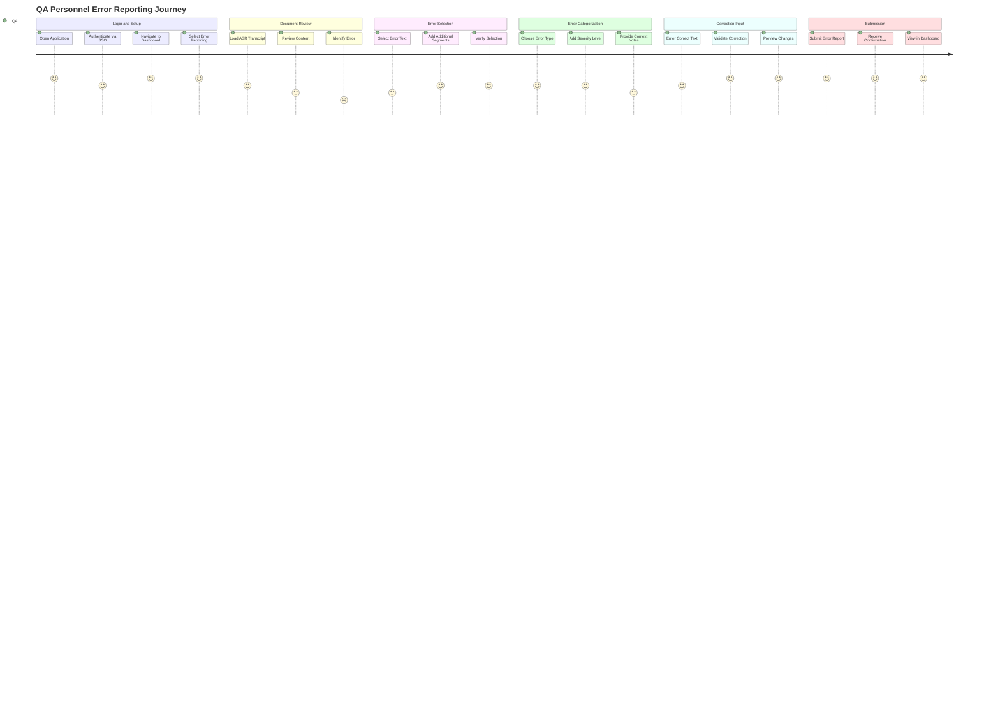
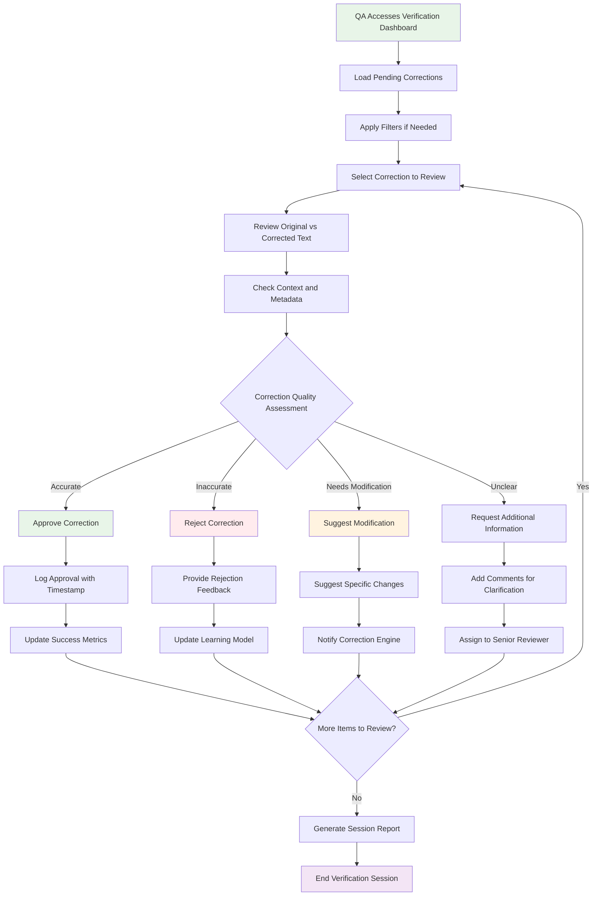
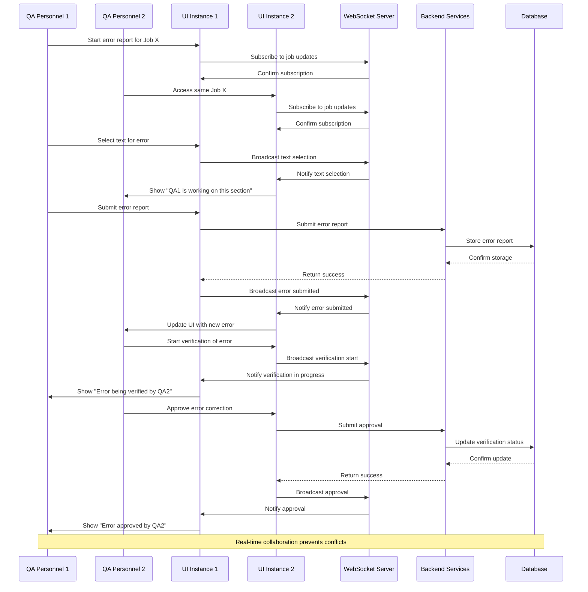
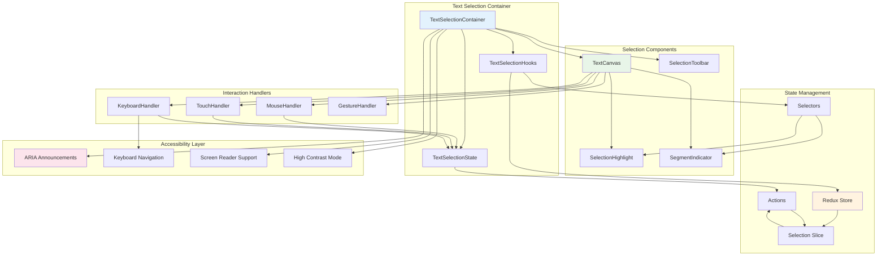
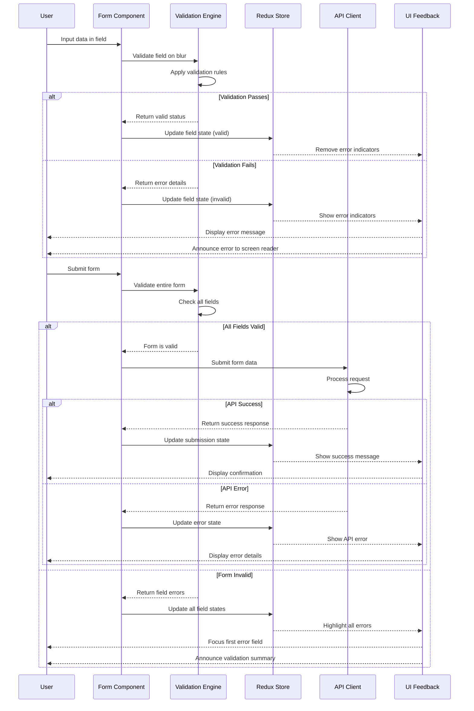
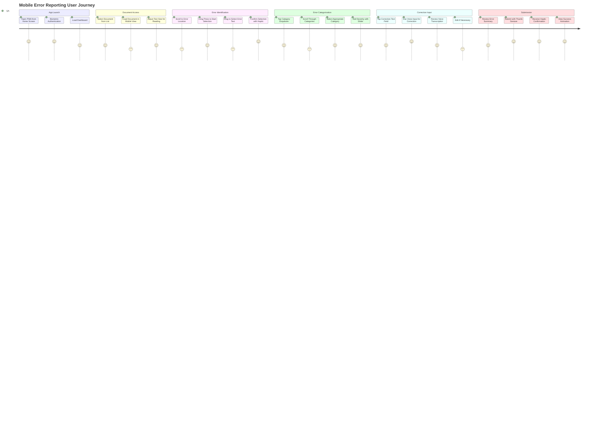
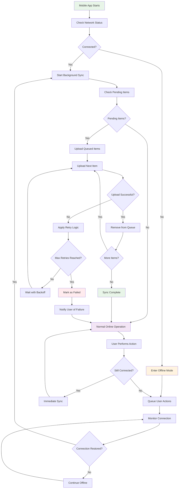

# RAG Interface Project - Enhanced UI/UX Diagrams and User Stories

**Document Version:** 1.0  
**Date:** August 20, 2025  
**Status:** Implementation Ready  
**Companion Document:** UI_UX_Architecture_Design.md  
**Focus:** Enhanced Mermaid Diagrams and Detailed User Stories  

---

## Table of Contents

1. [Enhanced Architecture Diagrams](#enhanced-architecture-diagrams)
2. [Detailed User Experience Flows](#detailed-user-experience-flows)
3. [Component Interaction Diagrams](#component-interaction-diagrams)
4. [Enhanced User Stories with Story Points](#enhanced-user-stories-with-story-points)
5. [Error Handling Flow Diagrams](#error-handling-flow-diagrams)
6. [Mobile User Experience Flows](#mobile-user-experience-flows)

---

## 1. Enhanced Architecture Diagrams

### 1.1 Complete System Integration Architecture



### 1.2 Frontend Component State Flow



---

## 2. Detailed User Experience Flows

### 2.1 Complete Error Reporting User Journey



### 2.2 Verification Workflow with Decision Points



### 2.3 Real-time Collaboration Flow



---

## 3. Component Interaction Diagrams

### 3.1 Text Selection Component Architecture



### 3.2 Form Validation and Error Handling

```mermaid
graph LR
    subgraph "Form Components"
        FC[Form Container]
        FI[Form Inputs]
        FB[Form Buttons]
        FE[Form Errors]
    end
    
    subgraph "Validation Layer"
        VR[Validation Rules]
        VE[Validation Engine]
        VS[Validation State]
        VM[Validation Messages]
    end
    
    subgraph "Error Handling"
        EH[Error Handler]
        EB[Error Boundary]
        EN[Error Notifications]
        ER[Error Recovery]
    end
    
    subgraph "API Integration"
        AC[API Client]
        AE[API Errors]
        AR[API Retry Logic]
        AS[API State]
    end
    
    %% Form Flow
    FC --> FI
    FC --> FB
    FC --> FE
    
    %% Validation Flow
    FI --> VR
    VR --> VE
    VE --> VS
    VS --> VM
    VM --> FE
    
    %% Error Handling Flow
    VE --> EH
    FC --> EB
    EH --> EN
    EH --> ER
    
    %% API Integration
    FB --> AC
    AC --> AE
    AE --> EH
    AC --> AR
    AR --> AS
    AS --> FC
    
    style FC fill:#e3f2fd
    style VE fill:#e8f5e8
    style EH fill:#ffebee
    style AC fill:#fff3e0

---

## 4. Enhanced User Stories with Story Points

### 4.1 Epic 1: Advanced Error Reporting Interface (Total: 47 Story Points)

#### 4.1.1 US-UI-1.1: Multi-Touch Text Selection
**As a QA personnel using a tablet**, I want to use multi-touch gestures for text selection so that I can efficiently select complex error patterns.

**Acceptance Criteria:**
- [ ] Support pinch-to-zoom for better text visibility
- [ ] Two-finger selection for range selection
- [ ] Long-press to start selection mode
- [ ] Haptic feedback for selection boundaries
- [ ] Visual indicators for touch points
- [ ] Gesture conflict resolution with scrolling
- [ ] Accessibility announcements for touch actions
- [ ] Performance optimization for large documents

**Technical Requirements:**
- Touch event handling with gesture recognition
- Canvas-based rendering for smooth interactions
- State management for multi-touch coordination
- Accessibility integration with touch events

**Story Points:** 13
**Priority:** High
**Dependencies:** Text rendering engine, touch event system

#### 4.1.2 US-UI-1.2: Smart Error Categorization
**As a QA personnel**, I want AI-assisted error categorization suggestions so that I can categorize errors more quickly and accurately.

**Acceptance Criteria:**
- [ ] Auto-suggest categories based on selected text
- [ ] Machine learning model integration for suggestions
- [ ] Confidence scores for each suggestion
- [ ] Manual override capability
- [ ] Learning from user corrections
- [ ] Context-aware suggestions based on speaker
- [ ] Medical terminology recognition
- [ ] Custom category creation workflow

**Technical Requirements:**
- Integration with RAG Integration Service
- Real-time API calls for suggestions
- Caching for performance optimization
- Fallback for offline scenarios

**Story Points:** 8
**Priority:** Medium
**Dependencies:** RAG Integration Service API, ML model deployment

#### 4.1.3 US-UI-1.3: Voice-to-Text Correction Input
**As a QA personnel**, I want to use voice input for correction text so that I can work more efficiently, especially on mobile devices.

**Acceptance Criteria:**
- [ ] Voice recognition integration (Web Speech API)
- [ ] Real-time transcription display
- [ ] Voice command support for form navigation
- [ ] Multiple language support
- [ ] Noise cancellation indicators
- [ ] Confidence scoring for voice input
- [ ] Manual editing of voice transcription
- [ ] Accessibility support for voice commands

**Technical Requirements:**
- Web Speech API integration
- Fallback for unsupported browsers
- Audio processing and noise reduction
- Privacy considerations for voice data

**Story Points:** 13
**Priority:** Medium
**Dependencies:** Browser speech API support, privacy compliance

#### 4.1.4 US-UI-1.4: Collaborative Error Reporting
**As a QA personnel**, I want to see when other QA staff are working on the same document so that we can avoid duplicate work.

**Acceptance Criteria:**
- [ ] Real-time presence indicators
- [ ] User avatars on active sections
- [ ] Conflict resolution for simultaneous edits
- [ ] Chat/comment system for collaboration
- [ ] Lock mechanism for active sections
- [ ] Notification system for updates
- [ ] History of collaborative changes
- [ ] Permission-based collaboration controls

**Technical Requirements:**
- WebSocket integration for real-time updates
- Conflict resolution algorithms
- User presence tracking
- Collaborative state management

**Story Points:** 13
**Priority:** Low
**Dependencies:** WebSocket infrastructure, user management system

### 4.2 Epic 2: Advanced Verification Dashboard (Total: 52 Story Points)

#### 4.2.1 US-UI-2.1: Intelligent Correction Prioritization
**As a QA personnel**, I want corrections to be automatically prioritized based on confidence scores and impact so that I can focus on the most important items first.

**Acceptance Criteria:**
- [ ] Machine learning-based prioritization algorithm
- [ ] Configurable priority weights (confidence, impact, urgency)
- [ ] Visual priority indicators (color coding, badges)
- [ ] Sorting and filtering by priority levels
- [ ] Bulk operations on priority groups
- [ ] Priority change notifications
- [ ] Historical priority tracking
- [ ] Custom priority rules configuration

**Technical Requirements:**
- Integration with Correction Engine Service
- Priority calculation algorithms
- Real-time priority updates
- Configurable business rules engine

**Story Points:** 13
**Priority:** High
**Dependencies:** Correction Engine Service, ML prioritization model

#### 4.2.2 US-UI-2.2: Advanced Analytics Dashboard
**As a QA personnel**, I want comprehensive analytics about correction patterns so that I can identify trends and improvement opportunities.

**Acceptance Criteria:**
- [ ] Interactive charts and graphs (D3.js/Chart.js)
- [ ] Drill-down capabilities for detailed analysis
- [ ] Exportable reports in multiple formats
- [ ] Real-time data updates
- [ ] Customizable dashboard layouts
- [ ] Comparative analysis tools
- [ ] Trend prediction visualizations
- [ ] Performance benchmarking

**Technical Requirements:**
- Data visualization library integration
- Real-time data streaming
- Export functionality (PDF, Excel, CSV)
- Responsive chart design

**Story Points:** 21
**Priority:** Medium
**Dependencies:** Verification Service analytics API, data visualization libraries

#### 4.2.3 US-UI-2.3: Batch Verification Operations
**As a QA personnel**, I want to perform bulk operations on multiple corrections so that I can work more efficiently with large volumes.

**Acceptance Criteria:**
- [ ] Multi-select with checkboxes and keyboard shortcuts
- [ ] Bulk approve/reject operations
- [ ] Batch comment addition
- [ ] Progress indicators for bulk operations
- [ ] Undo/redo for batch operations
- [ ] Confirmation dialogs for destructive actions
- [ ] Error handling for partial failures
- [ ] Audit logging for bulk operations

**Technical Requirements:**
- Optimistic UI updates
- Batch API endpoints
- Transaction management
- Error recovery mechanisms

**Story Points:** 8
**Priority:** High
**Dependencies:** Verification Service batch APIs

#### 4.2.4 US-UI-2.4: Correction Quality Scoring
**As a QA personnel**, I want to see quality scores for corrections so that I can make informed verification decisions.

**Acceptance Criteria:**
- [ ] Visual quality score indicators
- [ ] Detailed scoring breakdown
- [ ] Historical quality trends
- [ ] Comparison with similar corrections
- [ ] Quality threshold alerts
- [ ] Scoring methodology explanation
- [ ] Manual quality override capability
- [ ] Quality-based filtering and sorting

**Technical Requirements:**
- Quality scoring algorithm integration
- Real-time score calculations
- Historical data analysis
- Configurable quality thresholds

**Story Points:** 10
**Priority:** Medium
**Dependencies:** Quality scoring service, historical data access

### 4.3 Epic 3: Mobile-First Experience (Total: 34 Story Points)

#### 4.3.1 US-UI-3.1: Offline-First Mobile App
**As a QA personnel working in areas with poor connectivity**, I want full offline functionality so that I can continue working without interruption.

**Acceptance Criteria:**
- [ ] Complete offline error reporting capability
- [ ] Local data synchronization when online
- [ ] Conflict resolution for offline changes
- [ ] Offline indicator and status
- [ ] Background sync with progress indicators
- [ ] Local storage management (cleanup, limits)
- [ ] Offline-specific UI adaptations
- [ ] Data integrity validation

**Technical Requirements:**
- Service Worker implementation
- IndexedDB for local storage
- Background sync API
- Conflict resolution algorithms

**Story Points:** 21
**Priority:** High
**Dependencies:** Service Worker support, background sync API

#### 4.3.2 US-UI-3.2: Native Mobile App Features
**As a QA personnel**, I want native app-like features on mobile so that I have a seamless mobile experience.

**Acceptance Criteria:**
- [ ] Push notification support
- [ ] Add to home screen prompts
- [ ] Native sharing capabilities
- [ ] Camera integration for document capture
- [ ] Biometric authentication support
- [ ] Native file system access
- [ ] Orientation change handling
- [ ] Mobile-specific navigation patterns

**Technical Requirements:**
- Progressive Web App implementation
- Push notification service
- Camera API integration
- WebAuthn for biometric auth

**Story Points:** 13
**Priority:** Medium
**Dependencies:** PWA infrastructure, notification service

### 4.4 Epic 4: Accessibility and Inclusive Design (Total: 29 Story Points)

#### 4.4.1 US-UI-4.1: Advanced Screen Reader Support
**As a QA personnel with visual impairments**, I want comprehensive screen reader support so that I can use all system features effectively.

**Acceptance Criteria:**
- [ ] Complete ARIA labeling for all interactive elements
- [ ] Logical reading order and navigation
- [ ] Live region announcements for dynamic content
- [ ] Keyboard shortcuts for common actions
- [ ] Audio descriptions for visual content
- [ ] Customizable verbosity levels
- [ ] Screen reader testing with multiple tools
- [ ] User feedback integration for improvements

**Technical Requirements:**
- Comprehensive ARIA implementation
- Semantic HTML structure
- Live region management
- Keyboard event handling

**Story Points:** 13
**Priority:** High
**Dependencies:** Accessibility testing tools, user feedback system

#### 4.4.2 US-UI-4.2: Cognitive Accessibility Features
**As a QA personnel with cognitive disabilities**, I want simplified interfaces and clear guidance so that I can use the system effectively.

**Acceptance Criteria:**
- [ ] Simplified mode with reduced complexity
- [ ] Clear, consistent navigation patterns
- [ ] Progress indicators for multi-step processes
- [ ] Help text and contextual guidance
- [ ] Error prevention and clear error messages
- [ ] Customizable interface complexity
- [ ] Memory aids and reminders
- [ ] Timeout warnings and extensions

**Technical Requirements:**
- Configurable UI complexity levels
- Context-sensitive help system
- Clear error messaging framework
- Timeout management system

**Story Points:** 8
**Priority:** Medium
**Dependencies:** Help content management system

#### 4.4.3 US-UI-4.3: Multi-Language Support
**As a QA personnel working in different languages**, I want full internationalization support so that I can use the system in my preferred language.

**Acceptance Criteria:**
- [ ] Complete UI translation for supported languages
- [ ] Right-to-left (RTL) language support
- [ ] Locale-specific formatting (dates, numbers)
- [ ] Dynamic language switching
- [ ] Translated error messages and help text
- [ ] Cultural adaptation of UI elements
- [ ] Font support for different scripts
- [ ] Accessibility in all supported languages

**Technical Requirements:**
- Internationalization framework (i18next)
- RTL CSS support
- Locale-specific formatting libraries
- Translation management system

**Story Points:** 8
**Priority:** Low
**Dependencies:** Translation services, locale data

---

## 5. Error Handling Flow Diagrams

### 5.1 Comprehensive Error Recovery Flow

```mermaid
flowchart TD
    ERROR_DETECTED[Error Detected] --> CLASSIFY_ERROR[Classify Error Type]

    CLASSIFY_ERROR --> NETWORK_ERROR{Network Error?}
    CLASSIFY_ERROR --> VALIDATION_ERROR{Validation Error?}
    CLASSIFY_ERROR --> SERVER_ERROR{Server Error?}
    CLASSIFY_ERROR --> CLIENT_ERROR{Client Error?}

    NETWORK_ERROR -->|Yes| CHECK_CONNECTIVITY[Check Network Connectivity]
    CHECK_CONNECTIVITY --> ONLINE{Online?}
    ONLINE -->|No| OFFLINE_MODE[Switch to Offline Mode]
    ONLINE -->|Yes| RETRY_REQUEST[Retry Request]

    RETRY_REQUEST --> RETRY_COUNT{Retry Count < Max?}
    RETRY_COUNT -->|Yes| EXPONENTIAL_BACKOFF[Apply Exponential Backoff]
    RETRY_COUNT -->|No| SHOW_ERROR[Show Error to User]
    EXPONENTIAL_BACKOFF --> RETRY_REQUEST

    OFFLINE_MODE --> QUEUE_ACTION[Queue Action for Later]
    QUEUE_ACTION --> SHOW_OFFLINE_INDICATOR[Show Offline Indicator]
    SHOW_OFFLINE_INDICATOR --> MONITOR_CONNECTIVITY[Monitor Connectivity]
    MONITOR_CONNECTIVITY --> ONLINE

    VALIDATION_ERROR -->|Yes| HIGHLIGHT_FIELDS[Highlight Invalid Fields]
    HIGHLIGHT_FIELDS --> SHOW_HELP_TEXT[Show Contextual Help]
    SHOW_HELP_TEXT --> FOCUS_FIRST_ERROR[Focus First Error Field]
    FOCUS_FIRST_ERROR --> ANNOUNCE_ERROR[Announce Error to Screen Reader]

    SERVER_ERROR -->|Yes| CHECK_ERROR_CODE[Check HTTP Status Code]
    CHECK_ERROR_CODE --> RECOVERABLE{Recoverable Error?}
    RECOVERABLE -->|Yes| RETRY_REQUEST
    RECOVERABLE -->|No| SHOW_ERROR_DETAILS[Show Error Details]
    SHOW_ERROR_DETAILS --> OFFER_SUPPORT[Offer Support Options]

    CLIENT_ERROR -->|Yes| LOG_ERROR[Log Error Details]
    LOG_ERROR --> ERROR_BOUNDARY[Trigger Error Boundary]
    ERROR_BOUNDARY --> SAFE_STATE[Return to Safe State]
    SAFE_STATE --> SHOW_RECOVERY_OPTIONS[Show Recovery Options]

    SHOW_ERROR --> USER_ACTION{User Action}
    OFFER_SUPPORT --> USER_ACTION
    SHOW_RECOVERY_OPTIONS --> USER_ACTION
    ANNOUNCE_ERROR --> USER_ACTION

    USER_ACTION -->|Retry| RETRY_REQUEST
    USER_ACTION -->|Cancel| CANCEL_OPERATION[Cancel Operation]
    USER_ACTION -->|Report| SEND_ERROR_REPORT[Send Error Report]
    USER_ACTION -->|Refresh| RELOAD_PAGE[Reload Page]

    CANCEL_OPERATION --> CLEANUP[Cleanup Resources]
    SEND_ERROR_REPORT --> CLEANUP
    RELOAD_PAGE --> CLEANUP
    CLEANUP --> END[End Error Handling]

    style ERROR_DETECTED fill:#ffebee
    style OFFLINE_MODE fill:#fff3e0
    style SHOW_ERROR fill:#ffebee
    style SAFE_STATE fill:#e8f5e8
    style END fill:#f3e5f5
```

### 5.2 Form Validation Error Flow



---

## 6. Mobile User Experience Flows

### 6.1 Mobile Error Reporting Journey



### 6.2 Mobile Offline Sync Flow



---

## Conclusion

This enhanced diagrams and user stories document provides comprehensive visual representations and detailed user stories for the RAG Interface Project frontend development. The Mermaid diagrams illustrate complex system interactions, user flows, and technical architectures, while the enhanced user stories provide clear acceptance criteria and story point estimates for development planning.

**Key Highlights:**
- **162 Total Story Points** across all epics for comprehensive frontend development
- **Detailed Mermaid Diagrams** covering system architecture, user flows, and component interactions
- **Mobile-First Approach** with specific mobile user experience flows
- **Accessibility Focus** with dedicated user stories for inclusive design
- **Error Handling** comprehensive flows for robust user experience

**Next Steps:**
1. Review and prioritize user stories based on business value
2. Refine story point estimates based on team velocity
3. Create detailed technical specifications for high-priority stories
4. Set up development sprints based on epic priorities
5. Establish testing criteria for each user story

**Document Status:** ✅ Complete and Ready for Sprint Planning
**Companion Document:** UI_UX_Architecture_Design.md
**Total Development Effort:** 162 Story Points (approximately 16-20 weeks for a team of 4-5 developers)
```
