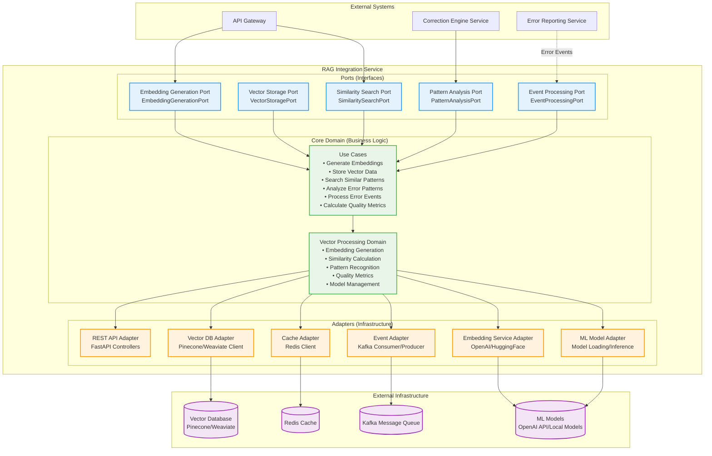
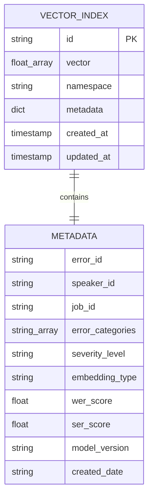
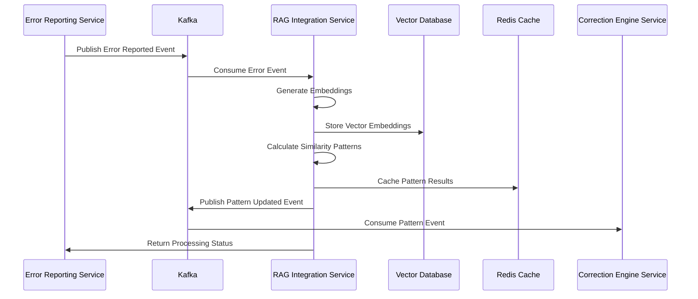

# RAG Integration Service (RIS) - Detailed Architecture Design

**Document Version:** 1.2
**Date:** August 19, 2025
**Service:** RAG Integration Service (RIS)
**Technology Stack:** Python + FastAPI + Vector Database + Redis + Kafka + ML Libraries
**Design Principles:** SOLID Principles + Hexagonal Architecture + TDD (ML-Optimized)
**Development Methodology:** Test-Driven Development for ML/Vector Processing Components

---

## Table of Contents

1. [Service Overview](#service-overview)
2. [Test-Driven Development for ML/Vector Processing](#test-driven-development-for-ml-vector-processing)
3. [SOLID Principles for ML/Vector Processing](#solid-principles-for-ml-vector-processing)
4. [Hexagonal Architecture Design](#hexagonal-architecture-design)
5. [API Specifications](#api-specifications)
6. [Vector Database Schema Design](#vector-database-schema-design)
7. [Integration Points](#integration-points)
8. [Error Handling Strategy](#error-handling-strategy)
9. [Technology Implementation](#technology-implementation)
10. [Directory Structure](#directory-structure)
11. [Key Classes and Interfaces](#key-classes-and-interfaces)
12. [Configuration Management](#configuration-management)
13. [Dependency Management](#dependency-management)
14. [User Stories](#user-stories)

---

## 1. Service Overview

### 1.1 Service Responsibilities

The RAG Integration Service (RIS) is the machine learning and vector processing core of the ASR Error Reporting System. It handles:

- **Embedding Generation**: Convert text to high-dimensional vector representations
- **Vector Storage**: Efficiently store and index embeddings in vector database
- **Similarity Search**: Find similar error patterns using cosine similarity
- **Pattern Recognition**: Identify recurring error patterns across speakers
- **Quality Metrics**: Calculate WER, SER, and edit distance percentages
- **Batch Processing**: Handle large-scale embedding generation tasks
- **Model Management**: Manage embedding models and their versions

### 1.2 Service Boundaries

**Inputs:**
- Error reported events from Error Reporting Service
- Text embedding requests via REST API
- Similarity search queries
- Batch processing requests

**Outputs:**
- Vector embeddings stored in vector database
- Similarity search results with confidence scores
- Pattern analysis reports
- Quality metrics and analytics
- Pattern updated events for downstream services

**Dependencies:**
- Vector Database (Pinecone/Weaviate/Qdrant)
- Redis cache for performance optimization
- Kafka for event processing
- ML embedding models (OpenAI, Sentence Transformers)
- Error Reporting Service (event consumption)

### 1.3 Core Capabilities

- Sub-200ms similarity search performance
- 1536-dimensional embedding generation
- Batch processing of 1000+ texts per minute
- Real-time pattern detection and analysis
- Automatic model versioning and rollback
- Horizontal scaling for high throughput
- Quality metrics calculation and monitoring

### 1.4 Performance Requirements

- **Embedding Generation**: < 500ms per text
- **Similarity Search**: < 200ms for top-k results
- **Batch Processing**: 1000+ embeddings per minute
- **Availability**: 99.9% uptime
- **Scalability**: Support 100+ concurrent requests
- **Storage**: Efficient vector compression and indexing

---

## 2. Test-Driven Development for ML/Vector Processing

### 2.1 TDD Challenges and Solutions for ML Components

**Challenge: Non-Deterministic ML Models**
Machine learning models can produce slightly different outputs for the same input, making traditional assertion-based testing challenging.

**TDD Solution: Contract-Based Testing**
```python
# Test the contract, not exact values
class TestEmbeddingModel:
    def test_generate_embedding_returns_correct_dimensions(self):
        # Red: Define the contract first
        model = OpenAIEmbeddingModel()
        text = "This is a test sentence"

        embedding = await model.generate_embedding(text)

        # Test contract compliance, not exact values
        assert isinstance(embedding, list)
        assert len(embedding) == 1536  # OpenAI embedding dimension
        assert all(isinstance(x, float) for x in embedding)
        assert -1.0 <= max(embedding) <= 1.0  # Reasonable bounds
        assert -1.0 <= min(embedding) <= 1.0

    def test_similar_texts_produce_similar_embeddings(self):
        # Red: Define similarity behavior
        model = OpenAIEmbeddingModel()
        text1 = "The cat sat on the mat"
        text2 = "A cat was sitting on a mat"
        text3 = "Quantum physics is complex"

        embedding1 = await model.generate_embedding(text1)
        embedding2 = await model.generate_embedding(text2)
        embedding3 = await model.generate_embedding(text3)

        # Test similarity relationships
        similarity_1_2 = cosine_similarity(embedding1, embedding2)
        similarity_1_3 = cosine_similarity(embedding1, embedding3)

        assert similarity_1_2 > similarity_1_3  # Similar texts more similar
        assert similarity_1_2 > 0.7  # Reasonable similarity threshold
```

**Challenge: External ML API Dependencies**
ML models often depend on external APIs (OpenAI, Hugging Face) that are expensive to call in tests.

**TDD Solution: Mock-Based Testing with Real Integration Tests**
```python
# Unit tests with mocks (fast, isolated)
class TestEmbeddingGenerationUseCase:
    async def test_generate_embedding_caches_result(self):
        # Red: Test caching behavior
        mock_model = Mock(spec=EmbeddingModelPort)
        mock_cache = Mock(spec=CachePort)
        mock_model.generate_embedding.return_value = [0.1, 0.2, 0.3]
        mock_cache.get.return_value = None  # Cache miss

        use_case = EmbeddingGenerationUseCase(mock_model, mock_cache)
        text = "test text"

        embedding = await use_case.execute(text)

        # Verify caching behavior
        mock_model.generate_embedding.assert_called_once_with(text)
        mock_cache.set.assert_called_once()
        assert embedding == [0.1, 0.2, 0.3]

# Integration tests with real APIs (slower, comprehensive)
@pytest.mark.integration
@pytest.mark.slow
class TestOpenAIEmbeddingModelIntegration:
    async def test_real_api_integration(self):
        # Integration test with real API (run less frequently)
        model = OpenAIEmbeddingModel(api_key=test_api_key)
        text = "integration test text"

        embedding = await model.generate_embedding(text)

        assert len(embedding) == 1536
        assert all(isinstance(x, float) for x in embedding)
```

### 2.2 TDD Workflow for Vector Processing

**Red Phase - Define Vector Operations:**
```python
class TestVectorSimilarityCalculator:
    def test_calculate_cosine_similarity(self):
        # Red: Define similarity calculation behavior
        calculator = VectorSimilarityCalculator()
        vector1 = [1.0, 0.0, 0.0]
        vector2 = [0.0, 1.0, 0.0]
        vector3 = [1.0, 0.0, 0.0]

        similarity_orthogonal = calculator.cosine_similarity(vector1, vector2)
        similarity_identical = calculator.cosine_similarity(vector1, vector3)

        assert abs(similarity_orthogonal - 0.0) < 0.001  # Orthogonal vectors
        assert abs(similarity_identical - 1.0) < 0.001   # Identical vectors
```

**Green Phase - Implement Vector Operations:**
```python
class VectorSimilarityCalculator:
    def cosine_similarity(self, vector1: List[float], vector2: List[float]) -> float:
        # Green: Minimal implementation to pass tests
        import numpy as np
        v1 = np.array(vector1)
        v2 = np.array(vector2)

        dot_product = np.dot(v1, v2)
        norm_v1 = np.linalg.norm(v1)
        norm_v2 = np.linalg.norm(v2)

        if norm_v1 == 0 or norm_v2 == 0:
            return 0.0

        return dot_product / (norm_v1 * norm_v2)
```

**Refactor Phase - Optimize for Performance:**
```python
class VectorSimilarityCalculator:
    def __init__(self, cache: CachePort):
        self._cache = cache  # DIP: Depend on abstraction

    def cosine_similarity(self, vector1: List[float], vector2: List[float]) -> float:
        # Refactor: Add caching and optimization while keeping tests green
        cache_key = self._generate_cache_key(vector1, vector2)
        cached_result = self._cache.get(cache_key)

        if cached_result is not None:
            return cached_result

        # Optimized calculation
        similarity = self._calculate_cosine_similarity_optimized(vector1, vector2)
        self._cache.set(cache_key, similarity, ttl=3600)

        return similarity
```

### 2.3 TDD for Vector Database Operations

**Testing Vector Storage:**
```python
class TestVectorStore:
    async def test_store_vector_returns_id(self):
        # Red: Define storage behavior
        vector_store = PineconeVectorStore(test_index)
        vector_id = "test-vector-1"
        embedding = [0.1] * 1536
        metadata = {"text": "test text", "category": "test"}

        result_id = await vector_store.store_vector(vector_id, embedding, metadata)

        assert result_id == vector_id

    async def test_search_similar_vectors(self):
        # Red: Define search behavior
        vector_store = PineconeVectorStore(test_index)
        query_vector = [0.1] * 1536
        top_k = 5

        results = await vector_store.search_similar(query_vector, top_k)

        assert len(results) <= top_k
        assert all(isinstance(r.score, float) for r in results)
        assert all(0.0 <= r.score <= 1.0 for r in results)
        # Results should be sorted by score (descending)
        scores = [r.score for r in results]
        assert scores == sorted(scores, reverse=True)
```

### 2.4 TDD for Pattern Recognition

**Testing Pattern Detection:**
```python
class TestPatternAnalyzer:
    def test_detect_substitution_patterns(self):
        # Red: Define pattern detection behavior
        analyzer = PatternAnalyzer()
        error_reports = [
            ErrorReport(original="there", corrected="their"),
            ErrorReport(original="there", corrected="their"),
            ErrorReport(original="there", corrected="their"),
            ErrorReport(original="your", corrected="you're"),
            ErrorReport(original="your", corrected="you're"),
        ]

        patterns = analyzer.detect_patterns(error_reports)

        # Should detect "there" -> "their" pattern (3 occurrences)
        there_pattern = next(p for p in patterns if p.original == "there")
        assert there_pattern.corrected == "their"
        assert there_pattern.frequency == 3
        assert there_pattern.confidence > 0.8
```

### 2.5 ML-Specific TDD Tools and Configuration

**pytest Configuration for ML Testing:**
```python
# pytest.ini for RAG Integration Service
[tool:pytest]
testpaths = tests
python_files = test_*.py
python_classes = Test*
python_functions = test_*
addopts =
    --strict-markers
    --strict-config
    --cov=src/rag_integration_service
    --cov-report=term-missing
    --cov-report=html:htmlcov
    --cov-fail-under=70
    --asyncio-mode=auto
    -v

markers =
    unit: Fast unit tests with mocks
    integration: Integration tests with real ML APIs
    slow: Tests that take longer than 5 seconds
    ml: Machine learning specific tests
    vector: Vector database tests
    expensive: Tests that cost money (real API calls)
```

**ML Testing Dependencies:**
```python
# requirements-test.txt (additional ML testing tools)
pytest>=7.0.0
pytest-asyncio>=0.21.0
pytest-mock>=3.10.0
pytest-cov>=4.0.0
numpy>=1.24.0
scikit-learn>=1.3.0  # For similarity calculations
responses>=0.23.0    # For mocking HTTP APIs
vcr.py>=4.3.0       # For recording/replaying API calls
hypothesis>=6.82.0   # For property-based testing
```

### 2.6 TDD Definition of Done for ML Components

**ML-Specific Completion Criteria:**
- [ ] All ML model interfaces tested with contract tests
- [ ] Similarity calculations tested with known vector pairs
- [ ] Vector database operations tested with test data
- [ ] Pattern recognition tested with synthetic datasets
- [ ] Performance benchmarks established and tested
- [ ] Error handling tested for API failures and edge cases
- [ ] Mock-based unit tests for fast feedback
- [ ] Integration tests for real API validation
- [ ] Property-based tests for mathematical operations

**ML Code Review Criteria:**
- [ ] Tests validate mathematical properties (symmetry, bounds, etc.)
- [ ] Appropriate use of mocks for expensive ML operations
- [ ] Integration tests cover real ML API interactions
- [ ] Performance tests ensure acceptable latency
- [ ] Error handling covers API rate limits and failures
- [ ] Test data represents realistic scenarios
- [ ] Deterministic tests for non-deterministic components

---

## 3. SOLID Principles for ML/Vector Processing

### 2.1 Single Responsibility Principle (SRP) in ML Context

The RAG Integration Service applies SRP specifically for machine learning and vector processing:

**Service Level:**
- **Primary Responsibility**: Vector processing, embedding generation, and similarity search only
- **Clear Boundaries**: Does not handle error validation (ERS), real-time corrections (CES), or user management (UMS)

**ML-Specific Class Responsibilities:**
- `EmbeddingGenerator`: Only generates vector embeddings from text
- `VectorStore`: Only handles vector storage and retrieval operations
- `SimilarityCalculator`: Only computes similarity scores between vectors
- `PatternAnalyzer`: Only identifies patterns in error data
- `ModelManager`: Only manages ML model lifecycle (loading, versioning, caching)

**Method Level:**
- Embedding methods only generate embeddings
- Search methods only perform similarity searches
- Pattern detection methods only analyze patterns
- Model loading methods only handle model initialization

### 2.2 Open/Closed Principle (OCP) for ML Extensibility

The service is designed for ML model and algorithm extensibility:

**Extension Points:**
- **Embedding Models**: New models (OpenAI, Sentence Transformers, custom models) can be added without modifying existing code
- **Vector Databases**: New vector DB implementations (Pinecone, Weaviate, Qdrant, Chroma) can be plugged in
- **Similarity Algorithms**: New similarity calculation methods can be added via strategy pattern
- **Pattern Recognition**: New pattern detection algorithms can be integrated through interfaces

**Implementation Strategy:**
```python
# Abstract base for extensible embedding models
class EmbeddingModelPort(ABC):
    @abstractmethod
    async def generate_embedding(self, text: str) -> List[float]:
        pass

    @abstractmethod
    def get_embedding_dimension(self) -> int:
        pass

# Concrete implementations can be added without modifying existing code
class OpenAIEmbeddingModel(EmbeddingModelPort):
    async def generate_embedding(self, text: str) -> List[float]:
        # OpenAI API implementation
        pass

class SentenceTransformerModel(EmbeddingModelPort):
    async def generate_embedding(self, text: str) -> List[float]:
        # Sentence Transformers implementation
        pass

# Vector database abstraction for extensibility
class VectorDatabasePort(ABC):
    @abstractmethod
    async def store_vector(self, vector_id: str, embedding: List[float], metadata: Dict) -> None:
        pass

    @abstractmethod
    async def search_similar(self, query_vector: List[float], top_k: int) -> List[SimilarityResult]:
        pass
```

### 2.3 Liskov Substitution Principle (LSP) for ML Components

All ML implementations are fully substitutable:

**Model Substitutability:**
- All embedding models produce vectors of the same dimensionality for the same input
- Switching between OpenAI, Sentence Transformers, or custom models requires no code changes
- All models honor the same performance and accuracy contracts

**Vector Database Substitutability:**
- Pinecone, Weaviate, and Qdrant adapters are completely interchangeable
- All provide identical search behavior and performance characteristics
- Switching between vector databases requires only configuration changes

**Algorithm Substitutability:**
- Different similarity algorithms (cosine, euclidean, dot product) can be swapped
- Pattern recognition algorithms can be replaced without affecting the service interface

### 2.4 Interface Segregation Principle (ISP) for ML Operations

Interfaces are specialized for specific ML operations:

**Segregated ML Interfaces:**
```python
# Embedding-specific operations
class EmbeddingGenerationPort(ABC):
    @abstractmethod
    async def generate_text_embedding(self, text: str) -> List[float]:
        pass

    @abstractmethod
    async def batch_generate_embeddings(self, texts: List[str]) -> List[List[float]]:
        pass

# Vector storage operations
class VectorStoragePort(ABC):
    @abstractmethod
    async def store_vector(self, vector_id: str, embedding: List[float]) -> None:
        pass

    @abstractmethod
    async def batch_store_vectors(self, vectors: List[VectorData]) -> None:
        pass

# Similarity search operations
class SimilaritySearchPort(ABC):
    @abstractmethod
    async def find_similar(self, query_vector: List[float], top_k: int) -> List[SimilarityResult]:
        pass

    @abstractmethod
    async def find_similar_with_filters(self, query_vector: List[float], filters: Dict, top_k: int) -> List[SimilarityResult]:
        pass

# Pattern analysis operations
class PatternAnalysisPort(ABC):
    @abstractmethod
    async def detect_error_patterns(self, error_vectors: List[List[float]]) -> List[Pattern]:
        pass

    @abstractmethod
    async def calculate_pattern_confidence(self, pattern: Pattern, new_vector: List[float]) -> float:
        pass
```

**Benefits:**
- Embedding services don't need to know about pattern analysis
- Vector storage services are isolated from similarity calculations
- Pattern analysis services don't depend on vector storage details

### 2.5 Dependency Inversion Principle (DIP) for ML Infrastructure

High-level ML logic depends only on abstractions:

**ML Dependency Structure:**
```python
# High-level ML use case depends on abstractions
class GenerateEmbeddingUseCase:
    def __init__(
        self,
        embedding_model: EmbeddingModelPort,      # Abstraction
        vector_store: VectorStoragePort,          # Abstraction
        cache: CachePort,                         # Abstraction
        event_publisher: EventPublishingPort      # Abstraction
    ):
        self._embedding_model = embedding_model
        self._vector_store = vector_store
        self._cache = cache
        self._event_publisher = event_publisher

# Low-level ML modules implement abstractions
class OpenAIEmbeddingAdapter(EmbeddingModelPort):
    # OpenAI-specific implementation
    pass

class PineconeVectorAdapter(VectorStoragePort):
    # Pinecone-specific implementation
    pass
```

**ML-Specific Benefits:**
- Business logic is independent of specific ML frameworks
- Model implementations can be swapped without affecting use cases
- Vector database technology can be changed without code modifications
- ML pipeline is completely testable with mock implementations

---

## 3. Hexagonal Architecture Design

### 2.1 Architecture Overview



### 2.2 Port Definitions

**Primary Ports (Driving):**
- `EmbeddingGenerationPort`: Text-to-vector conversion interface
- `SimilaritySearchPort`: Vector similarity search interface
- `PatternAnalysisPort`: Error pattern analysis interface
- `EventProcessingPort`: Async event processing interface

**Secondary Ports (Driven):**
- `VectorStoragePort`: Vector database operations interface
- `CachePort`: Caching operations interface
- `MLModelPort`: Machine learning model interface
- `EventPublishingPort`: Event publishing interface

---

## 3. API Specifications

### 3.1 REST API Endpoints

#### 3.1.1 Embedding Generation

```python
from fastapi import APIRouter, Depends, HTTPException, status
from typing import Annotated

router = APIRouter(prefix="/api/v1", tags=["rag-integration"])

# POST /api/v1/embeddings/generate
@router.post("/embeddings/generate", response_model=EmbeddingResponse)
async def generate_embedding(
    request: EmbeddingRequest,
    current_user: User = Depends(get_current_user)
) -> EmbeddingResponse:
    """Generate vector embedding for text"""

# POST /api/v1/embeddings/batch
@router.post("/embeddings/batch", response_model=BatchEmbeddingResponse)
async def generate_batch_embeddings(
    request: BatchEmbeddingRequest,
    current_user: User = Depends(get_current_user)
) -> BatchEmbeddingResponse:
    """Generate embeddings for multiple texts"""

# GET /api/v1/embeddings/{embedding_id}
@router.get("/embeddings/{embedding_id}", response_model=EmbeddingResponse)
async def get_embedding(
    embedding_id: str,
    current_user: User = Depends(get_current_user)
) -> EmbeddingResponse:
    """Retrieve a specific embedding"""
```

#### 3.1.2 Similarity Search

```python
# POST /api/v1/search/similar
@router.post("/search/similar", response_model=SimilaritySearchResponse)
async def search_similar_patterns(
    request: SimilaritySearchRequest,
    current_user: User = Depends(get_current_user)
) -> SimilaritySearchResponse:
    """Search for similar error patterns"""

# POST /api/v1/search/by-speaker
@router.post("/search/by-speaker", response_model=SimilaritySearchResponse)
async def search_by_speaker(
    request: SpeakerSimilarityRequest,
    current_user: User = Depends(get_current_user)
) -> SimilaritySearchResponse:
    """Search for similar patterns by specific speaker"""

# POST /api/v1/search/by-category
@router.post("/search/by-category", response_model=SimilaritySearchResponse)
async def search_by_category(
    request: CategorySimilarityRequest,
    current_user: User = Depends(get_current_user)
) -> SimilaritySearchResponse:
    """Search for similar patterns by error category"""
```

#### 3.1.3 Pattern Analysis

```python
# GET /api/v1/patterns/analysis
@router.get("/patterns/analysis", response_model=PatternAnalysisResponse)
async def get_pattern_analysis(
    filters: PatternFilters = Depends(),
    current_user: User = Depends(get_current_user)
) -> PatternAnalysisResponse:
    """Get comprehensive pattern analysis"""

# GET /api/v1/patterns/quality-metrics
@router.get("/patterns/quality-metrics", response_model=QualityMetricsResponse)
async def get_quality_metrics(
    filters: QualityFilters = Depends(),
    current_user: User = Depends(get_current_user)
) -> QualityMetricsResponse:
    """Get quality metrics (WER, SER, edit percentages)"""
```

### 3.2 Data Models

#### 3.2.1 Request Models

```python
from pydantic import BaseModel, Field, validator
from typing import List, Optional, Dict, Any
from enum import Enum

class EmbeddingType(str, Enum):
    ERROR = "error"
    CORRECTION = "correction"
    CONTEXT = "context"

class EmbeddingRequest(BaseModel):
    text: str = Field(..., min_length=1, max_length=10000)
    embedding_type: EmbeddingType
    metadata: Optional[Dict[str, Any]] = None
    model_version: Optional[str] = None

class BatchEmbeddingRequest(BaseModel):
    texts: List[str] = Field(..., min_items=1, max_items=100)
    embedding_type: EmbeddingType
    metadata: Optional[Dict[str, Any]] = None
    model_version: Optional[str] = None

class SimilaritySearchRequest(BaseModel):
    query_text: Optional[str] = None
    query_vector: Optional[List[float]] = None
    filters: Optional[Dict[str, Any]] = None
    top_k: int = Field(10, ge=1, le=100)
    threshold: float = Field(0.7, ge=0.0, le=1.0)
    include_metadata: bool = True

    @validator('query_vector')
    def validate_query_input(cls, v, values):
        if not v and not values.get('query_text'):
            raise ValueError('Either query_text or query_vector must be provided')
        if v and len(v) != 1536:
            raise ValueError('query_vector must be 1536-dimensional')
        return v
```

#### 3.2.2 Response Models

```python
class VectorEmbedding(BaseModel):
    id: str
    vector: List[float]
    text_hash: str
    embedding_type: EmbeddingType
    model_version: str
    created_at: datetime
    metadata: Dict[str, Any]

class EmbeddingResponse(BaseModel):
    embedding: VectorEmbedding
    processing_time: float
    model_info: Dict[str, str]

class SimilarityResult(BaseModel):
    embedding_id: str
    similarity_score: float
    text: str
    metadata: Dict[str, Any]
    error_categories: List[str]
    speaker_id: str
    job_id: str

class SimilaritySearchResponse(BaseModel):
    results: List[SimilarityResult]
    query_info: Dict[str, Any]
    search_time: float
    total_results: int
```

---

## 4. Vector Database Schema Design

### 4.1 Vector Collection Structure

#### 4.1.1 Pinecone Index Configuration

```python
# Vector index configuration for Pinecone
INDEX_CONFIG = {
    "name": "asr-error-patterns",
    "dimension": 1536,
    "metric": "cosine",
    "pod_type": "p1.x1",
    "replicas": 2,
    "shards": 1,
    "metadata_config": {
        "indexed": [
            "speaker_id",
            "job_id",
            "error_category",
            "severity_level",
            "embedding_type",
            "created_date"
        ]
    }
}
```

#### 4.1.2 Vector Metadata Schema

```python
class VectorMetadata(BaseModel):
    # Core identifiers
    error_id: str
    speaker_id: str
    job_id: str

    # Text information
    original_text: str
    corrected_text: str
    text_hash: str

    # Error classification
    error_categories: List[str]
    severity_level: str
    embedding_type: str

    # Quality metrics
    edit_distance: int
    wer_score: float
    ser_score: float

    # Temporal information
    created_at: str  # ISO format for filtering
    created_date: str  # YYYY-MM-DD for date filtering

    # Model information
    model_version: str
    model_name: str

    # Additional context
    context_notes: Optional[str]
    audio_quality: Optional[str]
    speaker_accent: Optional[str]
```

### 4.2 Vector Database Operations

#### 4.2.1 Upsert Operations

```python
class VectorUpsertOperation(BaseModel):
    id: str
    values: List[float]  # 1536-dimensional vector
    metadata: VectorMetadata

class BatchUpsertOperation(BaseModel):
    vectors: List[VectorUpsertOperation]
    namespace: Optional[str] = None
```

#### 4.2.2 Query Operations

```python
class VectorQuery(BaseModel):
    vector: List[float]
    top_k: int = 10
    include_values: bool = False
    include_metadata: bool = True
    filter: Optional[Dict[str, Any]] = None
    namespace: Optional[str] = None

class VectorQueryResult(BaseModel):
    matches: List[VectorMatch]
    namespace: str

class VectorMatch(BaseModel):
    id: str
    score: float
    values: Optional[List[float]]
    metadata: VectorMetadata
```

### 4.3 Index Management



---

## 5. Integration Points

### 5.1 Event Processing

#### 5.1.1 Error Event Consumer

```python
from aiokafka import AIOKafkaConsumer
import json

class ErrorEventConsumer:
    def __init__(self, kafka_config: dict):
        self.consumer = AIOKafkaConsumer(
            'error-events',
            bootstrap_servers=kafka_config['bootstrap_servers'],
            group_id='rag-integration-service',
            value_deserializer=lambda m: json.loads(m.decode('utf-8'))
        )

    async def process_error_reported_event(self, event: dict):
        """Process error reported event and generate embeddings"""
        error_data = event['data']

        # Generate embeddings for original and corrected text
        original_embedding = await self.generate_embedding(
            error_data['original_text'],
            EmbeddingType.ERROR
        )

        corrected_embedding = await self.generate_embedding(
            error_data['corrected_text'],
            EmbeddingType.CORRECTION
        )

        # Store in vector database with metadata
        await self.store_embeddings(error_data, original_embedding, corrected_embedding)

        # Publish pattern updated event
        await self.publish_pattern_updated_event(error_data['error_id'])
```

#### 5.1.2 Event Schemas

```python
class PatternUpdatedEventData(BaseModel):
    error_id: str
    speaker_id: str
    pattern_similarity_score: float
    similar_patterns_count: int
    quality_metrics: Dict[str, float]

class PatternUpdatedEvent(BaseEvent):
    event_type: str = "pattern.updated"
    data: PatternUpdatedEventData

class EmbeddingGeneratedEventData(BaseModel):
    embedding_id: str
    error_id: str
    embedding_type: str
    model_version: str
    processing_time: float

class EmbeddingGeneratedEvent(BaseEvent):
    event_type: str = "embedding.generated"
    data: EmbeddingGeneratedEventData
```

### 5.2 Service Integration Flow



### 5.3 External ML Model Integration

#### 5.3.1 OpenAI Integration

```python
class OpenAIEmbeddingAdapter:
    def __init__(self, api_key: str, model: str = "text-embedding-ada-002"):
        self.client = openai.AsyncOpenAI(api_key=api_key)
        self.model = model

    async def generate_embedding(self, text: str) -> List[float]:
        """Generate embedding using OpenAI API"""
        response = await self.client.embeddings.create(
            model=self.model,
            input=text
        )
        return response.data[0].embedding

    async def generate_batch_embeddings(self, texts: List[str]) -> List[List[float]]:
        """Generate embeddings for multiple texts"""
        response = await self.client.embeddings.create(
            model=self.model,
            input=texts
        )
        return [item.embedding for item in response.data]
```

#### 5.3.2 Local Model Integration

```python
class LocalEmbeddingAdapter:
    def __init__(self, model_name: str = "sentence-transformers/all-MiniLM-L6-v2"):
        from sentence_transformers import SentenceTransformer
        self.model = SentenceTransformer(model_name)

    async def generate_embedding(self, text: str) -> List[float]:
        """Generate embedding using local model"""
        import asyncio
        loop = asyncio.get_event_loop()
        embedding = await loop.run_in_executor(
            None,
            self.model.encode,
            text
        )
        return embedding.tolist()
```

---

## 6. Error Handling Strategy

### 6.1 Error Categories

```python
class RISErrorCode(str, Enum):
    # Embedding Generation Errors (400)
    INVALID_TEXT_INPUT = "INVALID_TEXT_INPUT"
    TEXT_TOO_LONG = "TEXT_TOO_LONG"
    UNSUPPORTED_EMBEDDING_TYPE = "UNSUPPORTED_EMBEDDING_TYPE"
    BATCH_SIZE_EXCEEDED = "BATCH_SIZE_EXCEEDED"

    # Vector Database Errors (500)
    VECTOR_DB_CONNECTION_ERROR = "VECTOR_DB_CONNECTION_ERROR"
    VECTOR_UPSERT_ERROR = "VECTOR_UPSERT_ERROR"
    VECTOR_QUERY_ERROR = "VECTOR_QUERY_ERROR"
    INDEX_NOT_FOUND = "INDEX_NOT_FOUND"

    # ML Model Errors (500)
    MODEL_LOADING_ERROR = "MODEL_LOADING_ERROR"
    EMBEDDING_GENERATION_ERROR = "EMBEDDING_GENERATION_ERROR"
    MODEL_API_ERROR = "MODEL_API_ERROR"
    MODEL_TIMEOUT = "MODEL_TIMEOUT"

    # Cache Errors (500)
    CACHE_CONNECTION_ERROR = "CACHE_CONNECTION_ERROR"
    CACHE_OPERATION_ERROR = "CACHE_OPERATION_ERROR"

    # Event Processing Errors (500)
    EVENT_PROCESSING_ERROR = "EVENT_PROCESSING_ERROR"
    EVENT_PUBLISHING_ERROR = "EVENT_PUBLISHING_ERROR"
```

### 6.2 Retry and Circuit Breaker Patterns

```python
from tenacity import retry, stop_after_attempt, wait_exponential
import asyncio

class CircuitBreaker:
    def __init__(self, failure_threshold: int = 5, timeout: int = 60):
        self.failure_threshold = failure_threshold
        self.timeout = timeout
        self.failure_count = 0
        self.last_failure_time = None
        self.state = "CLOSED"  # CLOSED, OPEN, HALF_OPEN

    async def call(self, func, *args, **kwargs):
        if self.state == "OPEN":
            if time.time() - self.last_failure_time > self.timeout:
                self.state = "HALF_OPEN"
            else:
                raise CircuitBreakerOpenException()

        try:
            result = await func(*args, **kwargs)
            if self.state == "HALF_OPEN":
                self.state = "CLOSED"
                self.failure_count = 0
            return result
        except Exception as e:
            self.failure_count += 1
            self.last_failure_time = time.time()

            if self.failure_count >= self.failure_threshold:
                self.state = "OPEN"

            raise e

@retry(
    stop=stop_after_attempt(3),
    wait=wait_exponential(multiplier=1, min=4, max=10)
)
async def generate_embedding_with_retry(text: str) -> List[float]:
    """Generate embedding with automatic retry"""
    return await embedding_service.generate_embedding(text)
```

---

## 7. Technology Implementation

### 7.1 FastAPI Application Setup

```python
from fastapi import FastAPI, BackgroundTasks
from contextlib import asynccontextmanager
import asyncio

@asynccontextmanager
async def lifespan(app: FastAPI):
    # Startup
    await initialize_vector_database()
    await initialize_ml_models()
    await initialize_kafka_consumer()
    await start_background_tasks()
    yield
    # Shutdown
    await cleanup_resources()

app = FastAPI(
    title="RAG Integration Service",
    description="ASR Error Reporting System - Vector Processing and ML Service",
    version="1.0.0",
    lifespan=lifespan
)

# Background task for processing events
async def start_background_tasks():
    asyncio.create_task(process_error_events())
    asyncio.create_task(update_quality_metrics())
    asyncio.create_task(cleanup_old_embeddings())
```

### 7.2 Vector Database Client

```python
import pinecone
from typing import List, Dict, Any

class PineconeAdapter:
    def __init__(self, api_key: str, environment: str, index_name: str):
        pinecone.init(api_key=api_key, environment=environment)
        self.index = pinecone.Index(index_name)

    async def upsert_vectors(self, vectors: List[VectorUpsertOperation]) -> Dict[str, Any]:
        """Upsert vectors to Pinecone index"""
        try:
            upsert_data = [
                (vec.id, vec.values, vec.metadata.dict())
                for vec in vectors
            ]
            return self.index.upsert(vectors=upsert_data)
        except Exception as e:
            raise VectorDatabaseException(f"Failed to upsert vectors: {str(e)}")

    async def query_vectors(self, query: VectorQuery) -> VectorQueryResult:
        """Query vectors from Pinecone index"""
        try:
            response = self.index.query(
                vector=query.vector,
                top_k=query.top_k,
                include_values=query.include_values,
                include_metadata=query.include_metadata,
                filter=query.filter,
                namespace=query.namespace
            )
            return VectorQueryResult(**response)
        except Exception as e:
            raise VectorDatabaseException(f"Failed to query vectors: {str(e)}")
```

---

## 8. Directory Structure

```
rag-integration-service/
├── src/
│   ├── domain/                          # Business logic (pure, no dependencies)
│   │   ├── __init__.py
│   │   ├── entities/
│   │   │   ├── __init__.py
│   │   │   ├── vector_embedding.py      # VectorEmbedding entity
│   │   │   ├── similarity_result.py     # SimilarityResult entity
│   │   │   ├── pattern_analysis.py      # PatternAnalysis entity
│   │   │   └── quality_metrics.py       # QualityMetrics entity
│   │   ├── value_objects/
│   │   │   ├── __init__.py
│   │   │   ├── embedding_type.py        # EmbeddingType enum
│   │   │   ├── vector_metadata.py       # VectorMetadata value object
│   │   │   └── similarity_threshold.py  # SimilarityThreshold value object
│   │   ├── repositories/
│   │   │   ├── __init__.py
│   │   │   ├── vector_repository.py     # Abstract vector repository
│   │   │   └── pattern_repository.py    # Abstract pattern repository
│   │   └── services/
│   │       ├── __init__.py
│   │       ├── embedding_service.py     # Embedding generation logic
│   │       ├── similarity_service.py    # Similarity calculation logic
│   │       ├── pattern_service.py       # Pattern analysis logic
│   │       └── quality_service.py       # Quality metrics calculation
│   ├── application/                     # Use cases and application services
│   │   ├── __init__.py
│   │   ├── use_cases/
│   │   │   ├── __init__.py
│   │   │   ├── generate_embedding.py    # Generate embedding use case
│   │   │   ├── search_similar.py        # Search similar patterns use case
│   │   │   ├── analyze_patterns.py      # Analyze error patterns use case
│   │   │   ├── process_error_event.py   # Process error event use case
│   │   │   └── calculate_metrics.py     # Calculate quality metrics use case
│   │   ├── dto/
│   │   │   ├── __init__.py
│   │   │   ├── requests.py              # Pydantic request models
│   │   │   ├── responses.py             # Pydantic response models
│   │   │   └── events.py                # Event schemas
│   │   └── ports/
│   │       ├── __init__.py
│   │       ├── embedding_port.py        # Embedding generation interface
│   │       ├── similarity_port.py       # Similarity search interface
│   │       ├── pattern_port.py          # Pattern analysis interface
│   │       └── event_port.py            # Event processing interface
│   ├── infrastructure/                  # Adapters and external concerns
│   │   ├── __init__.py
│   │   ├── adapters/
│   │   │   ├── __init__.py
│   │   │   ├── vector_db/
│   │   │   │   ├── __init__.py
│   │   │   │   ├── pinecone_adapter.py  # Pinecone implementation
│   │   │   │   ├── weaviate_adapter.py  # Weaviate implementation
│   │   │   │   └── qdrant_adapter.py    # Qdrant implementation
│   │   │   ├── ml_models/
│   │   │   │   ├── __init__.py
│   │   │   │   ├── openai_adapter.py    # OpenAI API integration
│   │   │   │   ├── huggingface_adapter.py # HuggingFace models
│   │   │   │   └── local_model_adapter.py # Local model inference
│   │   │   ├── http/
│   │   │   │   ├── __init__.py
│   │   │   │   ├── controllers.py       # FastAPI controllers
│   │   │   │   ├── dependencies.py      # FastAPI dependencies
│   │   │   │   └── middleware.py        # Custom middleware
│   │   │   ├── messaging/
│   │   │   │   ├── __init__.py
│   │   │   │   ├── kafka_consumer.py    # Kafka event consumer
│   │   │   │   ├── kafka_producer.py    # Kafka event producer
│   │   │   │   └── event_handlers.py    # Event processing handlers
│   │   │   ├── cache/
│   │   │   │   ├── __init__.py
│   │   │   │   └── redis_adapter.py     # Redis cache implementation
│   │   │   └── monitoring/
│   │   │       ├── __init__.py
│   │   │       ├── metrics.py           # Prometheus metrics
│   │   │       └── tracing.py           # OpenTelemetry tracing
│   │   ├── config/
│   │   │   ├── __init__.py
│   │   │   ├── settings.py              # Pydantic settings
│   │   │   └── container.py             # Dependency injection container
│   │   └── ml/
│   │       ├── __init__.py
│   │       ├── model_manager.py         # ML model management
│   │       └── preprocessing.py         # Text preprocessing
│   ├── main.py                          # FastAPI app setup
│   └── __init__.py
├── tests/
│   ├── __init__.py
│   ├── unit/                            # Unit tests
│   │   ├── __init__.py
│   │   ├── domain/
│   │   ├── application/
│   │   └── infrastructure/
│   ├── integration/                     # Integration tests
│   │   ├── __init__.py
│   │   ├── test_vector_db.py
│   │   ├── test_ml_models.py
│   │   └── test_api.py
│   └── fixtures/                        # Test fixtures
│       ├── __init__.py
│       ├── vector_data.py
│       └── ml_models.py
├── models/                              # ML model artifacts
│   ├── embeddings/
│   └── checkpoints/
├── docker/
│   ├── Dockerfile
│   └── docker-compose.yml
├── k8s/                                 # Kubernetes manifests
│   ├── deployment.yaml
│   ├── service.yaml
│   ├── configmap.yaml
│   └── hpa.yaml
├── pyproject.toml                       # Poetry configuration
├── README.md
└── .env.example
```

---

## 9. Key Classes and Interfaces

### 9.1 Domain Entities

```python
# src/domain/entities/vector_embedding.py
from dataclasses import dataclass
from typing import List, Dict, Any, Optional
from datetime import datetime
from uuid import UUID

@dataclass
class VectorEmbedding:
    id: UUID
    vector: List[float]
    text: str
    text_hash: str
    embedding_type: str
    model_version: str
    model_name: str
    metadata: Dict[str, Any]
    created_at: datetime

    def validate_dimensions(self, expected_dim: int = 1536) -> bool:
        """Validate vector dimensions"""
        return len(self.vector) == expected_dim

    def calculate_magnitude(self) -> float:
        """Calculate vector magnitude"""
        return sum(x**2 for x in self.vector) ** 0.5

    def normalize(self) -> List[float]:
        """Normalize vector to unit length"""
        magnitude = self.calculate_magnitude()
        return [x / magnitude for x in self.vector] if magnitude > 0 else self.vector

@dataclass
class SimilarityResult:
    embedding_id: UUID
    similarity_score: float
    text: str
    metadata: Dict[str, Any]
    distance_metric: str = "cosine"

    def is_above_threshold(self, threshold: float) -> bool:
        """Check if similarity score is above threshold"""
        return self.similarity_score >= threshold
```

### 9.2 Repository Interfaces

```python
# src/domain/repositories/vector_repository.py
from abc import ABC, abstractmethod
from typing import List, Optional, Dict, Any
from uuid import UUID
from ..entities.vector_embedding import VectorEmbedding, SimilarityResult

class VectorRepositoryPort(ABC):
    @abstractmethod
    async def store_embedding(self, embedding: VectorEmbedding) -> bool:
        """Store a vector embedding"""
        pass

    @abstractmethod
    async def store_batch_embeddings(self, embeddings: List[VectorEmbedding]) -> bool:
        """Store multiple vector embeddings"""
        pass

    @abstractmethod
    async def find_similar(
        self,
        query_vector: List[float],
        top_k: int = 10,
        filters: Optional[Dict[str, Any]] = None,
        threshold: float = 0.7
    ) -> List[SimilarityResult]:
        """Find similar vectors"""
        pass

    @abstractmethod
    async def find_by_speaker(
        self,
        speaker_id: str,
        query_vector: List[float],
        top_k: int = 10
    ) -> List[SimilarityResult]:
        """Find similar vectors for specific speaker"""
        pass

    @abstractmethod
    async def delete_embedding(self, embedding_id: UUID) -> bool:
        """Delete a vector embedding"""
        pass

    @abstractmethod
    async def get_embedding_count(self, filters: Optional[Dict[str, Any]] = None) -> int:
        """Get count of embeddings matching filters"""
        pass
```

### 9.3 Use Case Implementation

```python
# src/application/use_cases/generate_embedding.py
from dataclasses import dataclass
from typing import List
from uuid import uuid4
from datetime import datetime
import hashlib

from ..dto.requests import EmbeddingRequest
from ..dto.responses import EmbeddingResponse
from ..ports.embedding_port import EmbeddingGenerationPort
from ...domain.entities.vector_embedding import VectorEmbedding
from ...domain.repositories.vector_repository import VectorRepositoryPort
from ...domain.services.embedding_service import EmbeddingService

@dataclass
class GenerateEmbeddingUseCase:
    embedding_service: EmbeddingService
    vector_repository: VectorRepositoryPort

    async def execute(self, request: EmbeddingRequest) -> EmbeddingResponse:
        start_time = time.time()

        # Generate text hash for deduplication
        text_hash = hashlib.sha256(request.text.encode()).hexdigest()

        # Generate vector embedding
        vector = await self.embedding_service.generate_embedding(
            text=request.text,
            embedding_type=request.embedding_type,
            model_version=request.model_version
        )

        # Create domain entity
        embedding = VectorEmbedding(
            id=uuid4(),
            vector=vector,
            text=request.text,
            text_hash=text_hash,
            embedding_type=request.embedding_type.value,
            model_version=request.model_version or "default",
            model_name=self.embedding_service.get_model_name(),
            metadata=request.metadata or {},
            created_at=datetime.utcnow()
        )

        # Store in vector database
        await self.vector_repository.store_embedding(embedding)

        processing_time = time.time() - start_time

        return EmbeddingResponse(
            embedding=embedding,
            processing_time=processing_time,
            model_info={
                "name": embedding.model_name,
                "version": embedding.model_version,
                "dimensions": len(embedding.vector)
            }
        )
```

---

## 10. Configuration Management

### 10.1 Settings Configuration

```python
# src/infrastructure/config/settings.py
from pydantic import BaseSettings, Field
from typing import List, Optional, Dict, Any

class VectorDatabaseSettings(BaseSettings):
    provider: str = Field("pinecone", env="VECTOR_DB_PROVIDER")  # pinecone, weaviate, qdrant
    api_key: str = Field(..., env="VECTOR_DB_API_KEY")
    environment: str = Field(..., env="VECTOR_DB_ENVIRONMENT")
    index_name: str = Field("asr-error-patterns", env="VECTOR_DB_INDEX_NAME")
    dimension: int = Field(1536, env="VECTOR_DB_DIMENSION")
    metric: str = Field("cosine", env="VECTOR_DB_METRIC")

class MLModelSettings(BaseSettings):
    provider: str = Field("openai", env="ML_MODEL_PROVIDER")  # openai, huggingface, local
    openai_api_key: Optional[str] = Field(None, env="OPENAI_API_KEY")
    openai_model: str = Field("text-embedding-ada-002", env="OPENAI_MODEL")
    huggingface_model: str = Field("sentence-transformers/all-MiniLM-L6-v2", env="HUGGINGFACE_MODEL")
    local_model_path: Optional[str] = Field(None, env="LOCAL_MODEL_PATH")
    batch_size: int = Field(32, env="ML_BATCH_SIZE")
    max_sequence_length: int = Field(512, env="ML_MAX_SEQUENCE_LENGTH")

class RedisSettings(BaseSettings):
    url: str = Field(..., env="REDIS_URL")
    max_connections: int = Field(20, env="REDIS_MAX_CONNECTIONS")
    retry_on_timeout: bool = Field(True, env="REDIS_RETRY_ON_TIMEOUT")
    cache_ttl: int = Field(3600, env="REDIS_CACHE_TTL")  # 1 hour

class KafkaSettings(BaseSettings):
    bootstrap_servers: List[str] = Field(..., env="KAFKA_BOOTSTRAP_SERVERS")
    consumer_group_id: str = Field("rag-integration-service", env="KAFKA_CONSUMER_GROUP_ID")
    error_events_topic: str = Field("error-events", env="KAFKA_ERROR_EVENTS_TOPIC")
    pattern_events_topic: str = Field("pattern-events", env="KAFKA_PATTERN_EVENTS_TOPIC")
    auto_offset_reset: str = Field("latest", env="KAFKA_AUTO_OFFSET_RESET")

class Settings(BaseSettings):
    app_name: str = "RAG Integration Service"
    app_version: str = "1.0.0"
    debug: bool = Field(False, env="DEBUG")
    log_level: str = Field("INFO", env="LOG_LEVEL")

    vector_db: VectorDatabaseSettings = VectorDatabaseSettings()
    ml_models: MLModelSettings = MLModelSettings()
    redis: RedisSettings = RedisSettings()
    kafka: KafkaSettings = KafkaSettings()

    # Performance Configuration
    max_batch_size: int = Field(100, env="MAX_BATCH_SIZE")
    embedding_timeout: int = Field(30, env="EMBEDDING_TIMEOUT")
    similarity_search_timeout: int = Field(10, env="SIMILARITY_SEARCH_TIMEOUT")

    # Quality Metrics Configuration
    similarity_threshold: float = Field(0.7, env="SIMILARITY_THRESHOLD")
    pattern_analysis_window_days: int = Field(30, env="PATTERN_ANALYSIS_WINDOW_DAYS")

    class Config:
        env_file = ".env"
        env_nested_delimiter = "__"

settings = Settings()
```

---

## 11. Dependency Management

### 11.1 Poetry Configuration

```toml
# pyproject.toml
[tool.poetry]
name = "rag-integration-service"
version = "1.0.0"
description = "ASR Error Reporting System - RAG Integration and Vector Processing Service"
authors = ["Development Team <dev@example.com>"]
readme = "README.md"
packages = [{include = "src"}]

[tool.poetry.dependencies]
python = "^3.11"
fastapi = "^0.104.0"
uvicorn = {extras = ["standard"], version = "^0.24.0"}
pydantic = {extras = ["email"], version = "^2.4.0"}

# Vector Database Clients
pinecone-client = "^2.2.4"
weaviate-client = "^3.25.0"
qdrant-client = "^1.6.0"

# ML and Embedding Libraries
openai = "^1.3.0"
sentence-transformers = "^2.2.2"
transformers = "^4.35.0"
torch = "^2.1.0"
numpy = "^1.24.0"
scikit-learn = "^1.3.0"

# Data Processing
pandas = "^2.1.0"
nltk = "^3.8.1"
spacy = "^3.7.0"

# Async and Messaging
aiokafka = "^0.8.0"
redis = {extras = ["hiredis"], version = "^5.0.0"}
httpx = "^0.25.0"

# Utilities
tenacity = "^8.2.3"
dependency-injector = "^4.41.0"
structlog = "^23.2.0"

# Monitoring and Observability
prometheus-client = "^0.18.0"
opentelemetry-api = "^1.20.0"
opentelemetry-sdk = "^1.20.0"
opentelemetry-instrumentation-fastapi = "^0.41b0"

[tool.poetry.group.dev.dependencies]
pytest = "^7.4.0"
pytest-asyncio = "^0.21.0"
pytest-mock = "^3.12.0"
httpx = "^0.25.0"
testcontainers = "^3.7.0"
black = "^23.9.0"
isort = "^5.12.0"
flake8 = "^6.1.0"
mypy = "^1.6.0"
coverage = "^7.3.0"
pre-commit = "^3.5.0"

[build-system]
requires = ["poetry-core"]
build-backend = "poetry.core.masonry.api"
```

---

## 12. User Stories

### 12.1 Epic: Embedding Generation and Storage

#### 12.1.1 User Story: Generate Text Embeddings
**As a** system component
**I want to** generate vector embeddings for error texts
**So that** similar patterns can be identified and analyzed

**Acceptance Criteria:**
- [ ] I can generate 1536-dimensional embeddings for any text input
- [ ] The embedding generation completes within 500ms for single texts
- [ ] I can specify the embedding type (error, correction, context)
- [ ] The system supports multiple embedding models (OpenAI, local models)
- [ ] Generated embeddings are automatically stored in the vector database
- [ ] The system handles text preprocessing and normalization
- [ ] Embedding metadata includes model version and generation timestamp

**Story Points:** 8

**Technical Tasks:**
- [ ] Implement embedding generation service with multiple model support
- [ ] Add text preprocessing and normalization
- [ ] Create vector storage with metadata
- [ ] Add performance monitoring and optimization
- [ ] Implement model versioning and management

#### 12.1.2 User Story: Batch Embedding Processing
**As a** system administrator
**I want to** process multiple texts in batches for embedding generation
**So that** large volumes of historical data can be efficiently processed

**Acceptance Criteria:**
- [ ] I can submit up to 100 texts in a single batch request
- [ ] Batch processing completes within 2 minutes for 100 texts
- [ ] The system provides progress tracking for batch operations
- [ ] Failed embeddings in a batch don't affect successful ones
- [ ] Batch results include individual success/failure status
- [ ] The system supports asynchronous batch processing
- [ ] Batch operations are resumable in case of failures

**Story Points:** 5

**Technical Tasks:**
- [ ] Implement batch processing endpoint
- [ ] Add progress tracking and status reporting
- [ ] Implement error handling for partial failures
- [ ] Add asynchronous processing with job queues
- [ ] Create batch result aggregation and reporting

### 12.2 Epic: Similarity Search and Pattern Recognition

#### 12.2.1 User Story: Find Similar Error Patterns
**As a** correction engine
**I want to** find similar error patterns for a given text
**So that** I can apply learned corrections to new errors

**Acceptance Criteria:**
- [ ] I can search for similar patterns using text or vector input
- [ ] Search results are returned within 200ms
- [ ] Results include similarity scores and confidence levels
- [ ] I can filter results by speaker, category, or time period
- [ ] Results are ranked by similarity score in descending order
- [ ] I can specify the number of results to return (top-k)
- [ ] Search supports metadata filtering for precise targeting

**Story Points:** 8

**Technical Tasks:**
- [ ] Implement vector similarity search with multiple filters
- [ ] Add performance optimization for sub-200ms response times
- [ ] Create ranking and scoring algorithms
- [ ] Implement metadata filtering capabilities
- [ ] Add caching for frequently searched patterns

#### 12.2.2 User Story: Speaker-Specific Pattern Analysis
**As a** QA analyst
**I want to** analyze error patterns specific to individual speakers
**So that** I can understand speaker-specific correction needs

**Acceptance Criteria:**
- [ ] I can retrieve all error patterns for a specific speaker
- [ ] The system identifies the most common error types per speaker
- [ ] I can see pattern evolution over time for each speaker
- [ ] Results include statistical analysis of error frequency
- [ ] I can compare patterns between different speakers
- [ ] The analysis includes quality metrics (WER, SER, edit distance)
- [ ] Results are exportable for external analysis

**Story Points:** 5

**Technical Tasks:**
- [ ] Implement speaker-specific pattern aggregation
- [ ] Add statistical analysis and trend calculation
- [ ] Create comparative analysis between speakers
- [ ] Implement quality metrics calculation
- [ ] Add export functionality for analysis results

### 12.3 Epic: Event Processing and Integration

#### 12.3.1 User Story: Process Error Events
**As a** RAG integration service
**I want to** automatically process error events from the error reporting service
**So that** new errors are immediately available for pattern matching

**Acceptance Criteria:**
- [ ] Error events are processed within 5 seconds of publication
- [ ] Both original and corrected texts are embedded and stored
- [ ] Processing failures are logged and retried automatically
- [ ] Duplicate events are detected and handled appropriately
- [ ] Pattern analysis is triggered after successful processing
- [ ] Downstream services are notified of pattern updates
- [ ] Event processing maintains order and consistency

**Story Points:** 8

**Technical Tasks:**
- [ ] Implement Kafka event consumer for error events
- [ ] Add automatic embedding generation for new errors
- [ ] Implement duplicate detection and deduplication
- [ ] Add retry mechanisms and error handling
- [ ] Create pattern analysis triggers
- [ ] Implement downstream event publishing

#### 12.3.2 User Story: Publish Pattern Updates
**As a** RAG integration service
**I want to** publish pattern update events when new patterns are identified
**So that** correction engines can update their models with new learnings

**Acceptance Criteria:**
- [ ] Pattern update events are published immediately after analysis
- [ ] Events include pattern similarity scores and metadata
- [ ] Event publishing is reliable with retry mechanisms
- [ ] Events are properly ordered and deduplicated
- [ ] Failed event publishing is logged and monitored
- [ ] Event schemas are versioned for backward compatibility
- [ ] Downstream services receive events within 1 second

**Story Points:** 5

**Technical Tasks:**
- [ ] Implement pattern update event publishing
- [ ] Add event schema versioning and validation
- [ ] Implement reliable delivery with retries
- [ ] Add event ordering and deduplication
- [ ] Create monitoring and alerting for event publishing

### 12.4 Epic: Quality Metrics and Analytics

#### 12.4.1 User Story: Calculate Quality Metrics
**As a** system analyst
**I want to** calculate quality metrics for error patterns
**So that** I can measure the effectiveness of the correction system

**Acceptance Criteria:**
- [ ] The system calculates WER (Word Error Rate) for each error
- [ ] SER (Sentence Error Rate) is computed for sentence-level analysis
- [ ] Edit distance percentages are calculated for pattern similarity
- [ ] Metrics are updated in real-time as new errors are processed
- [ ] Historical trends are maintained for metric analysis
- [ ] Metrics can be aggregated by speaker, category, or time period
- [ ] Quality thresholds trigger alerts when exceeded

**Story Points:** 5

**Technical Tasks:**
- [ ] Implement WER, SER, and edit distance calculations
- [ ] Add real-time metric updates and aggregation
- [ ] Create historical trend tracking
- [ ] Implement metric filtering and grouping
- [ ] Add alerting for quality threshold violations

### 12.5 Story Point Summary

| Epic | Stories | Total Story Points |
|------|---------|-------------------|
| Embedding Generation and Storage | 2 stories | 13 points |
| Similarity Search and Pattern Recognition | 2 stories | 13 points |
| Event Processing and Integration | 2 stories | 13 points |
| Quality Metrics and Analytics | 1 story | 5 points |
| **Total** | **7 stories** | **44 points** |

**Estimated Development Time:** 8-10 weeks for 4-5 developers

---

**Document Status:** ✅ Complete
**Next Steps:** Begin implementation with embedding generation and vector storage
**Dependencies:** Vector Database setup, ML model selection and configuration
**Integration Points:** Error Reporting Service (event consumption), Correction Engine Service (pattern provision)
```
```
```
