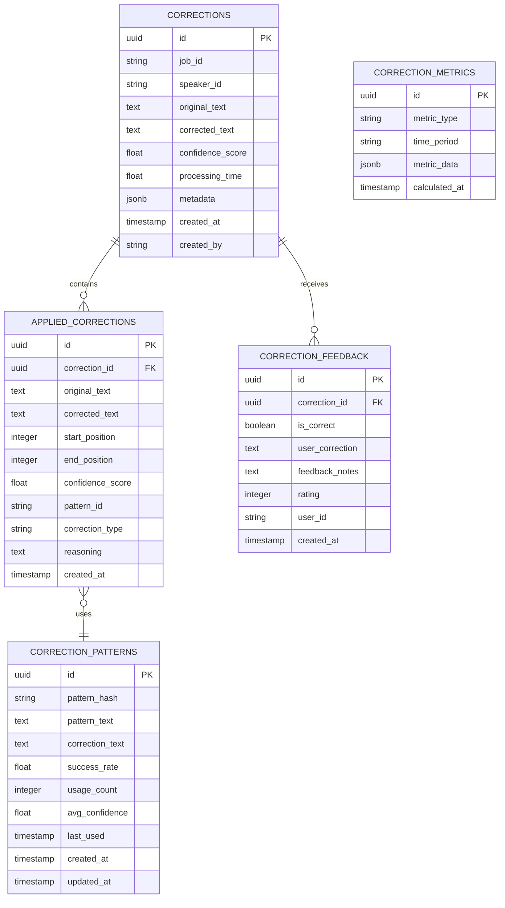
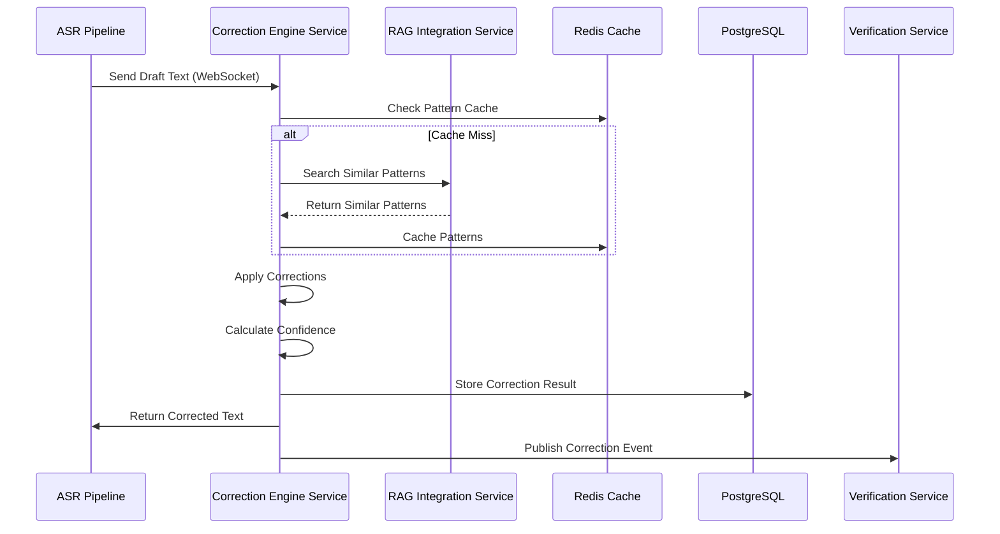

# Correction Engine Service (CES) - Detailed Architecture Design

**Document Version:** 1.2
**Date:** August 19, 2025
**Service:** Correction Engine Service (CES)
**Technology Stack:** Python + FastAPI + PostgreSQL + Redis + Kafka + ML Libraries
**Design Principles:** SOLID Principles + Hexagonal Architecture + TDD (Real-time Processing)
**Development Methodology:** Test-Driven Development for Real-time Correction Components

---

## Table of Contents

1. [Service Overview](#service-overview)
2. [Test-Driven Development for Real-time Processing](#test-driven-development-for-real-time-processing)
3. [SOLID Principles for Real-time Correction Processing](#solid-principles-for-real-time-correction-processing)
4. [Hexagonal Architecture Design](#hexagonal-architecture-design)
5. [API Specifications](#api-specifications)
6. [Database Schema Design](#database-schema-design)
7. [Integration Points](#integration-points)
8. [Error Handling Strategy](#error-handling-strategy)
9. [Technology Implementation](#technology-implementation)
10. [Directory Structure](#directory-structure)
11. [Key Classes and Interfaces](#key-classes-and-interfaces)
12. [Configuration Management](#configuration-management)
13. [Dependency Management](#dependency-management)
14. [User Stories](#user-stories)

---

## 1. Service Overview

### 1.1 Service Responsibilities

The Correction Engine Service (CES) is the real-time correction application component of the ASR Error Reporting System. It handles:

- **Real-time Corrections**: Apply learned corrections to ASR draft text in real-time
- **Pattern Matching**: Match current text against known error patterns
- **Confidence Scoring**: Calculate confidence levels for proposed corrections
- **Correction Highlighting**: Identify and highlight corrected sections
- **Performance Monitoring**: Track correction accuracy and system performance
- **A/B Testing**: Support experimental correction algorithms
- **Feedback Integration**: Incorporate user feedback to improve corrections

### 1.2 Service Boundaries

**Inputs:**
- ASR draft text for real-time correction
- Pattern update events from RAG Integration Service
- Correction feedback from users
- Configuration updates for correction algorithms

**Outputs:**
- Corrected text with highlighted changes
- Confidence scores for applied corrections
- Performance metrics and analytics
- Correction applied events for downstream services

**Dependencies:**
- RAG Integration Service (pattern data and similarity search)
- ASR Processing Pipeline (draft text input)
- PostgreSQL database (correction history and feedback)
- Redis cache (pattern caching and performance optimization)
- Kafka message queue (event processing and publishing)

### 1.3 Core Capabilities

- Sub-5-second correction application for real-time use
- Pattern-based correction with confidence scoring
- Streaming text processing for live transcription
- A/B testing framework for algorithm optimization
- Feedback loop integration for continuous learning
- Horizontal scaling for high-throughput processing
- Real-time performance monitoring and alerting

### 1.4 Performance Requirements

- **Correction Application**: < 5 seconds for typical text segments
- **Pattern Matching**: < 2 seconds for similarity search
- **Throughput**: 50+ concurrent correction requests
- **Availability**: 99.9% uptime for real-time operations
- **Accuracy**: 95%+ correction accuracy rate
- **Latency**: < 1 second for pattern cache hits

---

## 2. Test-Driven Development for Real-time Processing

### 2.1 TDD Challenges for Real-time Systems

**Challenge: Performance Requirements**
Real-time correction systems must meet strict latency requirements (< 5 seconds for correction application).

**TDD Solution: Performance-Driven Test Design**
```python
class TestCorrectionEnginePerformance:
    @pytest.mark.performance
    async def test_correction_application_meets_latency_requirement(self):
        # Red: Define performance requirement as test
        correction_engine = CorrectionEngine(mock_pattern_matcher, mock_confidence_calculator)
        text = "This is a sample text with potential errors"
        patterns = create_test_patterns()

        start_time = time.time()
        result = await correction_engine.apply_corrections(text, patterns)
        end_time = time.time()

        # Performance requirement: < 5 seconds
        assert (end_time - start_time) < 5.0
        assert result.corrected_text is not None
        assert result.confidence_score > 0.0

    async def test_pattern_matching_meets_latency_requirement(self):
        # Red: Define pattern matching performance
        pattern_matcher = PatternMatcher(mock_pattern_repository)
        text = "Sample text for pattern matching"

        start_time = time.time()
        matches = await pattern_matcher.find_matches(text)
        end_time = time.time()

        # Pattern matching should be fast (< 1 second)
        assert (end_time - start_time) < 1.0
        assert isinstance(matches, list)
```

**Challenge: Concurrent Processing**
Real-time systems must handle multiple concurrent correction requests.

**TDD Solution: Concurrency Testing**
```python
class TestCorrectionEngineConcurrency:
    @pytest.mark.asyncio
    async def test_handles_concurrent_correction_requests(self):
        # Red: Define concurrent processing behavior
        correction_engine = CorrectionEngine(mock_pattern_matcher, mock_confidence_calculator)
        texts = [f"Sample text {i}" for i in range(10)]
        patterns = create_test_patterns()

        # Execute corrections concurrently
        tasks = [
            correction_engine.apply_corrections(text, patterns)
            for text in texts
        ]
        results = await asyncio.gather(*tasks)

        # All corrections should complete successfully
        assert len(results) == 10
        assert all(r.corrected_text is not None for r in results)
        assert all(r.confidence_score > 0.0 for r in results)
```

### 2.2 TDD Workflow for Correction Algorithms

**Red Phase - Define Correction Behavior:**
```python
class TestCorrectionAlgorithm:
    def test_applies_simple_substitution_correction(self):
        # Red: Define basic correction behavior
        algorithm = RuleBasedCorrectionAlgorithm()
        text = "The cat sat on the mat"
        patterns = [
            Pattern(original="cat", corrected="dog", confidence=0.9)
        ]

        result = algorithm.apply_correction(text, patterns)

        assert result.corrected_text == "The dog sat on the mat"
        assert result.confidence_score == 0.9
        assert len(result.corrections) == 1
        assert result.corrections[0].start_position == 4
        assert result.corrections[0].end_position == 7

    def test_handles_multiple_corrections_in_text(self):
        # Red: Define multiple correction behavior
        algorithm = RuleBasedCorrectionAlgorithm()
        text = "The cat and the cat sat"
        patterns = [
            Pattern(original="cat", corrected="dog", confidence=0.9)
        ]

        result = algorithm.apply_correction(text, patterns)

        assert result.corrected_text == "The dog and the dog sat"
        assert len(result.corrections) == 2
```

**Green Phase - Minimal Implementation:**
```python
class RuleBasedCorrectionAlgorithm:
    def apply_correction(self, text: str, patterns: List[Pattern]) -> CorrectionResult:
        # Green: Minimal implementation to pass tests
        corrected_text = text
        corrections = []
        overall_confidence = 0.0

        for pattern in patterns:
            if pattern.original in text:
                corrected_text = corrected_text.replace(pattern.original, pattern.corrected)
                corrections.append(Correction(
                    original=pattern.original,
                    corrected=pattern.corrected,
                    start_position=text.find(pattern.original),
                    end_position=text.find(pattern.original) + len(pattern.original),
                    confidence=pattern.confidence
                ))
                overall_confidence = pattern.confidence

        return CorrectionResult(
            corrected_text=corrected_text,
            corrections=corrections,
            confidence_score=overall_confidence
        )
```

**Refactor Phase - Optimize for Real-time Performance:**
```python
class RuleBasedCorrectionAlgorithm:
    def __init__(self, cache: CachePort):
        self._cache = cache  # DIP: Depend on abstraction
        self._compiled_patterns = {}  # Performance optimization

    def apply_correction(self, text: str, patterns: List[Pattern]) -> CorrectionResult:
        # Refactor: Add caching and optimization while keeping tests green
        cache_key = self._generate_cache_key(text, patterns)
        cached_result = self._cache.get(cache_key)

        if cached_result:
            return cached_result

        # Optimized correction with compiled regex patterns
        result = self._apply_corrections_optimized(text, patterns)
        self._cache.set(cache_key, result, ttl=300)  # 5-minute cache

        return result

    def _apply_corrections_optimized(self, text: str, patterns: List[Pattern]) -> CorrectionResult:
        # Use compiled regex for better performance
        import re

        corrected_text = text
        corrections = []

        for pattern in patterns:
            if pattern.original not in self._compiled_patterns:
                self._compiled_patterns[pattern.original] = re.compile(
                    re.escape(pattern.original), re.IGNORECASE
                )

            regex = self._compiled_patterns[pattern.original]
            matches = list(regex.finditer(corrected_text))

            for match in reversed(matches):  # Reverse to maintain positions
                start, end = match.span()
                corrected_text = corrected_text[:start] + pattern.corrected + corrected_text[end:]
                corrections.append(Correction(
                    original=pattern.original,
                    corrected=pattern.corrected,
                    start_position=start,
                    end_position=end,
                    confidence=pattern.confidence
                ))

        overall_confidence = sum(c.confidence for c in corrections) / len(corrections) if corrections else 0.0

        return CorrectionResult(
            corrected_text=corrected_text,
            corrections=corrections,
            confidence_score=overall_confidence
        )
```

### 2.3 TDD for Pattern Matching

**Testing Pattern Recognition:**
```python
class TestPatternMatcher:
    async def test_finds_exact_pattern_matches(self):
        # Red: Define exact matching behavior
        pattern_matcher = PatternMatcher(mock_pattern_repository)
        text = "The quick brown fox jumps"
        patterns = [
            Pattern(original="quick", corrected="fast", confidence=0.8),
            Pattern(original="brown", corrected="red", confidence=0.7)
        ]
        mock_pattern_repository.get_patterns.return_value = patterns

        matches = await pattern_matcher.find_matches(text)

        assert len(matches) == 2
        assert matches[0].pattern.original == "quick"
        assert matches[0].start_position == 4
        assert matches[1].pattern.original == "brown"
        assert matches[1].start_position == 10

    async def test_finds_fuzzy_pattern_matches(self):
        # Red: Define fuzzy matching behavior
        pattern_matcher = FuzzyPatternMatcher(mock_pattern_repository)
        text = "The quik brown fox"  # Misspelled "quick"
        patterns = [
            Pattern(original="quick", corrected="fast", confidence=0.8)
        ]
        mock_pattern_repository.get_patterns.return_value = patterns

        matches = await pattern_matcher.find_matches(text, fuzzy_threshold=0.8)

        assert len(matches) == 1
        assert matches[0].pattern.original == "quick"
        assert matches[0].fuzzy_score > 0.8  # High similarity despite misspelling
```

### 2.4 TDD for Confidence Scoring

**Testing Confidence Calculations:**
```python
class TestConfidenceCalculator:
    def test_calculates_confidence_for_single_correction(self):
        # Red: Define confidence calculation behavior
        calculator = ConfidenceCalculator()
        correction = Correction(
            original="there",
            corrected="their",
            start_position=0,
            end_position=5,
            confidence=0.9
        )
        context = CorrectionContext(
            surrounding_text="there house is nice",
            pattern_frequency=10,
            user_feedback_score=0.8
        )

        confidence = calculator.calculate_confidence(correction, context)

        assert 0.0 <= confidence <= 1.0
        assert confidence > 0.7  # Should be high confidence

    def test_calculates_overall_confidence_for_multiple_corrections(self):
        # Red: Define overall confidence behavior
        calculator = ConfidenceCalculator()
        corrections = [
            Correction(original="there", corrected="their", confidence=0.9),
            Correction(original="your", corrected="you're", confidence=0.8),
            Correction(original="its", corrected="it's", confidence=0.7)
        ]

        overall_confidence = calculator.calculate_overall_confidence(corrections)

        assert 0.0 <= overall_confidence <= 1.0
        # Should be weighted average or similar calculation
        expected_confidence = (0.9 + 0.8 + 0.7) / 3
        assert abs(overall_confidence - expected_confidence) < 0.1
```

### 2.5 Real-time Testing Configuration

**pytest Configuration for Real-time Testing:**
```python
# pytest.ini for Correction Engine Service
[tool:pytest]
testpaths = tests
python_files = test_*.py
python_classes = Test*
python_functions = test_*
addopts =
    --strict-markers
    --strict-config
    --cov=src/correction_engine_service
    --cov-report=term-missing
    --cov-report=html:htmlcov
    --cov-fail-under=70
    --asyncio-mode=auto
    -v

markers =
    unit: Fast unit tests
    integration: Integration tests
    performance: Performance and latency tests
    concurrency: Concurrent processing tests
    slow: Tests that take longer than 1 second
    realtime: Real-time processing tests
```

**Performance Testing Dependencies:**
```python
# requirements-test.txt (additional performance testing tools)
pytest>=7.0.0
pytest-asyncio>=0.21.0
pytest-mock>=3.10.0
pytest-cov>=4.0.0
pytest-benchmark>=4.0.0  # For performance benchmarking
pytest-xdist>=3.3.0      # For parallel test execution
memory-profiler>=0.61.0  # For memory usage testing
```

### 2.6 TDD Definition of Done for Real-time Components

**Real-time Specific Completion Criteria:**
- [ ] All correction algorithms tested with performance benchmarks
- [ ] Pattern matching tested with various text patterns and edge cases
- [ ] Confidence scoring tested with different correction scenarios
- [ ] Concurrent processing tested with multiple simultaneous requests
- [ ] Cache behavior tested for performance optimization
- [ ] Error handling tested for real-time failure scenarios
- [ ] Memory usage tested to prevent memory leaks
- [ ] Latency requirements validated through automated tests

**Real-time Code Review Criteria:**
- [ ] Performance tests validate latency requirements
- [ ] Concurrency tests ensure thread safety
- [ ] Memory usage tests prevent resource leaks
- [ ] Cache invalidation strategies tested
- [ ] Error recovery mechanisms tested
- [ ] Graceful degradation tested under load
- [ ] Monitoring and alerting integration tested

---

## 3. SOLID Principles for Real-time Correction Processing

### 2.1 Single Responsibility Principle (SRP) in Real-time Context

The Correction Engine Service applies SRP for real-time processing components:

**Service Level:**
- **Primary Responsibility**: Real-time correction application and pattern matching only
- **Clear Boundaries**: Does not handle error reporting (ERS), vector processing (RIS), or verification (VS)

**Real-time Processing Class Responsibilities:**
- `CorrectionEngine`: Only applies corrections to text
- `PatternMatcher`: Only matches text patterns against known corrections
- `ConfidenceCalculator`: Only calculates confidence scores for corrections
- `CorrectionHighlighter`: Only highlights corrected sections in text
- `PerformanceMonitor`: Only tracks correction performance metrics
- `FeedbackProcessor`: Only processes user feedback on corrections

**Method Level:**
- Pattern matching methods only match patterns
- Correction application methods only apply corrections
- Confidence calculation methods only calculate confidence scores
- Highlighting methods only handle text highlighting

### 2.2 Open/Closed Principle (OCP) for Correction Algorithms

The service is designed for correction algorithm extensibility:

**Extension Points:**
- **Correction Algorithms**: New correction strategies can be added without modifying existing code
- **Pattern Matching**: New pattern matching algorithms can be integrated via strategy pattern
- **Confidence Scoring**: New confidence calculation methods can be plugged in
- **Highlighting Strategies**: New text highlighting approaches can be added through interfaces

**Implementation Strategy:**
```python
# Abstract base for extensible correction algorithms
class CorrectionAlgorithmPort(ABC):
    @abstractmethod
    async def apply_correction(self, text: str, patterns: List[Pattern]) -> CorrectionResult:
        pass

    @abstractmethod
    def calculate_confidence(self, correction: Correction) -> float:
        pass

# Concrete implementations can be added without modifying existing code
class RuleBased CorrectionAlgorithm(CorrectionAlgorithmPort):
    async def apply_correction(self, text: str, patterns: List[Pattern]) -> CorrectionResult:
        # Rule-based correction implementation
        pass

class MLBasedCorrectionAlgorithm(CorrectionAlgorithmPort):
    async def apply_correction(self, text: str, patterns: List[Pattern]) -> CorrectionResult:
        # ML-based correction implementation
        pass

# Pattern matching abstraction for extensibility
class PatternMatchingPort(ABC):
    @abstractmethod
    async def find_matches(self, text: str, patterns: List[Pattern]) -> List[Match]:
        pass

    @abstractmethod
    async def calculate_match_confidence(self, match: Match) -> float:
        pass
```

### 2.3 Liskov Substitution Principle (LSP) for Correction Components

All correction implementations are fully substitutable:

**Algorithm Substitutability:**
- All correction algorithms produce consistent output formats
- Switching between rule-based, ML-based, or hybrid algorithms requires no code changes
- All algorithms honor the same performance and accuracy contracts

**Pattern Matching Substitutability:**
- Different pattern matching strategies (exact match, fuzzy match, semantic match) are interchangeable
- All provide identical interface behavior and performance characteristics
- Switching between matching algorithms requires only configuration changes

**Confidence Scoring Substitutability:**
- Different confidence calculation methods can be swapped seamlessly
- All confidence scorers produce normalized scores between 0 and 1
- Scoring algorithms can be replaced without affecting the correction pipeline

### 2.4 Interface Segregation Principle (ISP) for Correction Operations

Interfaces are specialized for specific correction operations:

**Segregated Correction Interfaces:**
```python
# Pattern matching operations
class PatternMatchingPort(ABC):
    @abstractmethod
    async def find_pattern_matches(self, text: str) -> List[PatternMatch]:
        pass

    @abstractmethod
    async def validate_pattern_match(self, match: PatternMatch) -> bool:
        pass

# Correction application operations
class CorrectionApplicationPort(ABC):
    @abstractmethod
    async def apply_correction(self, text: str, correction: Correction) -> str:
        pass

    @abstractmethod
    async def batch_apply_corrections(self, text: str, corrections: List[Correction]) -> str:
        pass

# Confidence scoring operations
class ConfidenceScoringPort(ABC):
    @abstractmethod
    async def calculate_correction_confidence(self, correction: Correction) -> float:
        pass

    @abstractmethod
    async def calculate_overall_confidence(self, corrections: List[Correction]) -> float:
        pass

# Performance monitoring operations
class PerformanceMonitoringPort(ABC):
    @abstractmethod
    async def track_correction_performance(self, correction_result: CorrectionResult) -> None:
        pass

    @abstractmethod
    async def get_performance_metrics(self, time_range: TimeRange) -> PerformanceMetrics:
        pass
```

**Benefits:**
- Correction services don't need to know about performance monitoring
- Pattern matching services are isolated from confidence calculations
- Performance monitoring services don't depend on correction logic details

### 2.5 Dependency Inversion Principle (DIP) for Correction Infrastructure

High-level correction logic depends only on abstractions:

**Correction Dependency Structure:**
```python
# High-level correction use case depends on abstractions
class ApplyCorrectionUseCase:
    def __init__(
        self,
        pattern_matcher: PatternMatchingPort,           # Abstraction
        correction_algorithm: CorrectionAlgorithmPort,  # Abstraction
        confidence_scorer: ConfidenceScoringPort,       # Abstraction
        performance_monitor: PerformanceMonitoringPort, # Abstraction
        cache: CachePort,                               # Abstraction
        event_publisher: EventPublishingPort            # Abstraction
    ):
        self._pattern_matcher = pattern_matcher
        self._correction_algorithm = correction_algorithm
        self._confidence_scorer = confidence_scorer
        self._performance_monitor = performance_monitor
        self._cache = cache
        self._event_publisher = event_publisher

# Low-level correction modules implement abstractions
class FuzzyPatternMatcher(PatternMatchingPort):
    # Fuzzy matching implementation
    pass

class RuleBasedCorrectionEngine(CorrectionAlgorithmPort):
    # Rule-based correction implementation
    pass
```

**Real-time Processing Benefits:**
- Business logic is independent of specific correction algorithms
- Pattern matching implementations can be swapped without affecting use cases
- Correction strategies can be changed without code modifications
- Correction pipeline is completely testable with mock implementations
- Real-time performance requirements are met through abstracted optimizations

---

## 3. Hexagonal Architecture Design

### 2.1 Architecture Overview

```mermaid
graph TB
    subgraph "External Systems"
        ASR[ASR Processing Pipeline]
        RIS[RAG Integration Service]
        VS[Verification Service]
        API_GW[API Gateway]
    end

    subgraph "Correction Engine Service"
        subgraph "Ports (Interfaces)"
            CORRECTION_PORT[Correction Application Port<br/>CorrectionApplicationPort]
            PATTERN_PORT[Pattern Matching Port<br/>PatternMatchingPort]
            CONFIDENCE_PORT[Confidence Scoring Port<br/>ConfidenceScoringPort]
            FEEDBACK_PORT[Feedback Processing Port<br/>FeedbackProcessingPort]
            EVENT_PORT[Event Processing Port<br/>EventProcessingPort]
        end
        
        subgraph "Core Domain (Business Logic)"
            DOMAIN[Correction Domain<br/>• Pattern Matching Logic<br/>• Confidence Calculation<br/>• Correction Application<br/>• Quality Assessment<br/>• Feedback Processing]
            USE_CASES[Use Cases<br/>• Apply Corrections<br/>• Calculate Confidence<br/>• Process Patterns<br/>• Handle Feedback<br/>• Monitor Performance<br/>• A/B Test Algorithms]
        end
        
        subgraph "Adapters (Infrastructure)"
            REST_ADAPTER[REST API Adapter<br/>FastAPI Controllers]
            ASR_ADAPTER[ASR Pipeline Adapter<br/>Real-time Integration]
            VECTOR_ADAPTER[Vector Search Adapter<br/>RIS Client]
            CACHE_ADAPTER[Cache Adapter<br/>Redis Client]
            DB_ADAPTER[Database Adapter<br/>PostgreSQL Repository]
            EVENT_ADAPTER[Event Adapter<br/>Kafka Consumer/Producer]
            ML_ADAPTER[ML Model Adapter<br/>Confidence Models]
        end
    end

    subgraph "External Infrastructure"
        POSTGRES[(PostgreSQL Database)]
        REDIS[(Redis Cache)]
        KAFKA[(Kafka Message Queue)]
        ML_MODELS[(ML Models<br/>Confidence Scoring)]
    end

    %% External to Ports
    API_GW --> CORRECTION_PORT
    ASR --> CORRECTION_PORT
    RIS -.->|Pattern Events| EVENT_PORT
    VS --> FEEDBACK_PORT

    %% Ports to Core
    CORRECTION_PORT --> USE_CASES
    PATTERN_PORT --> USE_CASES
    CONFIDENCE_PORT --> USE_CASES
    FEEDBACK_PORT --> USE_CASES
    EVENT_PORT --> USE_CASES
    USE_CASES --> DOMAIN

    %% Core to Adapters
    DOMAIN --> REST_ADAPTER
    DOMAIN --> ASR_ADAPTER
    DOMAIN --> VECTOR_ADAPTER
    DOMAIN --> CACHE_ADAPTER
    DOMAIN --> DB_ADAPTER
    DOMAIN --> EVENT_ADAPTER
    DOMAIN --> ML_ADAPTER

    %% Adapters to External Infrastructure
    DB_ADAPTER --> POSTGRES
    CACHE_ADAPTER --> REDIS
    EVENT_ADAPTER --> KAFKA
    ML_ADAPTER --> ML_MODELS
    VECTOR_ADAPTER --> RIS

    %% Styling
    classDef coreLogic fill:#e8f5e8,stroke:#4caf50,stroke-width:2px
    classDef ports fill:#e3f2fd,stroke:#2196f3,stroke-width:2px
    classDef adapters fill:#fff3e0,stroke:#ff9800,stroke-width:2px
    classDef external fill:#f3e5f5,stroke:#9c27b0,stroke-width:2px

    class DOMAIN,USE_CASES coreLogic
    class CORRECTION_PORT,PATTERN_PORT,CONFIDENCE_PORT,FEEDBACK_PORT,EVENT_PORT ports
    class REST_ADAPTER,ASR_ADAPTER,VECTOR_ADAPTER,CACHE_ADAPTER,DB_ADAPTER,EVENT_ADAPTER,ML_ADAPTER adapters
    class POSTGRES,REDIS,KAFKA,ML_MODELS external
```



### 2.2 Port Definitions

**Primary Ports (Driving):**
- `CorrectionApplicationPort`: Main correction interface for real-time processing
- `PatternMatchingPort`: Pattern-based correction matching interface
- `ConfidenceScoringPort`: Confidence calculation interface
- `FeedbackProcessingPort`: User feedback integration interface

**Secondary Ports (Driven):**
- `EventProcessingPort`: Async event processing interface
- `CorrectionRepositoryPort`: Correction history persistence interface
- `CachePort`: Pattern and result caching interface
- `VectorSearchPort`: Similarity search interface to RIS

---

## 3. API Specifications

### 3.1 REST API Endpoints

#### 3.1.1 Real-time Correction

```python
from fastapi import APIRouter, Depends, HTTPException, status
from typing import Annotated

router = APIRouter(prefix="/api/v1/corrections", tags=["correction-engine"])

# POST /api/v1/corrections/apply
@router.post("/corrections/apply", response_model=CorrectionResponse)
async def apply_corrections(
    request: CorrectionRequest,
    current_user: User = Depends(get_current_user)
) -> CorrectionResponse:
    """Apply real-time corrections to draft text"""

# POST /api/v1/corrections/preview
@router.post("/corrections/preview", response_model=CorrectionPreviewResponse)
async def preview_corrections(
    request: CorrectionPreviewRequest,
    current_user: User = Depends(get_current_user)
) -> CorrectionPreviewResponse:
    """Preview corrections without applying them"""

# POST /api/v1/corrections/stream
@router.post("/corrections/stream")
async def stream_corrections(
    websocket: WebSocket,
    current_user: User = Depends(get_current_user_ws)
):
    """WebSocket endpoint for streaming corrections"""
```

#### 3.1.2 Correction Management

```python
# GET /api/v1/corrections/{correction_id}
@router.get("/corrections/{correction_id}", response_model=CorrectionResponse)
async def get_correction(
    correction_id: str,
    current_user: User = Depends(get_current_user)
) -> CorrectionResponse:
    """Retrieve a specific correction result"""

# POST /api/v1/corrections/{correction_id}/feedback
@router.post("/corrections/{correction_id}/feedback", status_code=204)
async def submit_feedback(
    correction_id: str,
    feedback: CorrectionFeedback,
    current_user: User = Depends(get_current_user)
) -> None:
    """Submit feedback on correction quality"""

# GET /api/v1/corrections/history
@router.get("/corrections/history", response_model=PaginatedCorrections)
async def get_correction_history(
    filters: CorrectionFilters = Depends(),
    pagination: PaginationParams = Depends(),
    current_user: User = Depends(get_current_user)
) -> PaginatedCorrections:
    """Get correction history with filters"""
```

#### 3.1.3 Performance and Analytics

```python
# GET /api/v1/corrections/metrics
@router.get("/corrections/metrics", response_model=CorrectionMetricsResponse)
async def get_correction_metrics(
    filters: MetricsFilters = Depends(),
    current_user: User = Depends(get_current_user)
) -> CorrectionMetricsResponse:
    """Get correction performance metrics"""

# GET /api/v1/corrections/patterns
@router.get("/corrections/patterns", response_model=PatternAnalysisResponse)
async def get_pattern_analysis(
    filters: PatternFilters = Depends(),
    current_user: User = Depends(get_current_user)
) -> PatternAnalysisResponse:
    """Get pattern analysis and effectiveness"""
```

### 3.2 Data Models

#### 3.2.1 Request Models

```python
from pydantic import BaseModel, Field, validator
from typing import List, Optional, Dict, Any
from enum import Enum

class CorrectionMode(str, Enum):
    CONSERVATIVE = "conservative"  # High confidence threshold
    BALANCED = "balanced"         # Medium confidence threshold
    AGGRESSIVE = "aggressive"     # Low confidence threshold

class CorrectionOptions(BaseModel):
    mode: CorrectionMode = CorrectionMode.BALANCED
    confidence_threshold: float = Field(0.8, ge=0.0, le=1.0)
    max_corrections: int = Field(10, ge=1, le=50)
    speaker_id: Optional[str] = None
    context_window: int = Field(5, ge=1, le=20)
    enable_highlighting: bool = True

class CorrectionRequest(BaseModel):
    text: str = Field(..., min_length=1, max_length=50000)
    speaker_id: Optional[str] = None
    job_id: Optional[str] = None
    options: CorrectionOptions = CorrectionOptions()
    metadata: Optional[Dict[str, Any]] = None

class CorrectionPreviewRequest(BaseModel):
    text: str = Field(..., min_length=1, max_length=50000)
    speaker_id: Optional[str] = None
    options: CorrectionOptions = CorrectionOptions()

class CorrectionFeedback(BaseModel):
    is_correct: bool
    user_correction: Optional[str] = None
    feedback_notes: Optional[str] = None
    rating: int = Field(..., ge=1, le=5)
```

#### 3.2.2 Response Models

```python
class AppliedCorrection(BaseModel):
    original_text: str
    corrected_text: str
    start_position: int
    end_position: int
    confidence_score: float
    pattern_id: str
    correction_type: str
    reasoning: str

class SkippedCorrection(BaseModel):
    text: str
    start_position: int
    end_position: int
    confidence_score: float
    skip_reason: str

class CorrectionResponse(BaseModel):
    id: str
    original_text: str
    corrected_text: str
    applied_corrections: List[AppliedCorrection]
    skipped_corrections: List[SkippedCorrection]
    processing_time: float
    confidence_score: float
    metadata: Dict[str, Any]
    created_at: datetime

class CorrectionPreview(BaseModel):
    text: str
    start_position: int
    end_position: int
    suggested_correction: str
    confidence_score: float
    pattern_match: str
    reasoning: str

class CorrectionPreviewResponse(BaseModel):
    original_text: str
    previews: List[CorrectionPreview]
    total_suggestions: int
    processing_time: float
```

---

## 4. Database Schema Design

### 4.1 Entity Relationship Diagram



### 4.2 Table Definitions

#### 4.2.1 corrections Table

```sql
CREATE TABLE corrections (
    id UUID PRIMARY KEY DEFAULT gen_random_uuid(),
    job_id VARCHAR(255),
    speaker_id VARCHAR(255),
    original_text TEXT NOT NULL,
    corrected_text TEXT NOT NULL,
    confidence_score DECIMAL(5,4) CHECK (confidence_score >= 0 AND confidence_score <= 1),
    processing_time DECIMAL(8,3) NOT NULL,
    metadata JSONB DEFAULT '{}',
    created_at TIMESTAMP WITH TIME ZONE DEFAULT NOW(),
    created_by VARCHAR(255) NOT NULL
);

-- Indexes for performance
CREATE INDEX idx_corrections_speaker_id ON corrections(speaker_id);
CREATE INDEX idx_corrections_job_id ON corrections(job_id);
CREATE INDEX idx_corrections_created_at ON corrections(created_at);
CREATE INDEX idx_corrections_confidence ON corrections(confidence_score);
```

#### 4.2.2 applied_corrections Table

```sql
CREATE TABLE applied_corrections (
    id UUID PRIMARY KEY DEFAULT gen_random_uuid(),
    correction_id UUID NOT NULL REFERENCES corrections(id) ON DELETE CASCADE,
    original_text TEXT NOT NULL,
    corrected_text TEXT NOT NULL,
    start_position INTEGER NOT NULL CHECK (start_position >= 0),
    end_position INTEGER NOT NULL CHECK (end_position > start_position),
    confidence_score DECIMAL(5,4) CHECK (confidence_score >= 0 AND confidence_score <= 1),
    pattern_id VARCHAR(255) NOT NULL,
    correction_type VARCHAR(50) NOT NULL,
    reasoning TEXT,
    created_at TIMESTAMP WITH TIME ZONE DEFAULT NOW()
);

CREATE INDEX idx_applied_corrections_correction_id ON applied_corrections(correction_id);
CREATE INDEX idx_applied_corrections_pattern_id ON applied_corrections(pattern_id);
CREATE INDEX idx_applied_corrections_type ON applied_corrections(correction_type);
```

#### 4.2.3 correction_patterns Table

```sql
CREATE TABLE correction_patterns (
    id UUID PRIMARY KEY DEFAULT gen_random_uuid(),
    pattern_hash VARCHAR(64) UNIQUE NOT NULL,
    pattern_text TEXT NOT NULL,
    correction_text TEXT NOT NULL,
    success_rate DECIMAL(5,4) DEFAULT 0.0 CHECK (success_rate >= 0 AND success_rate <= 1),
    usage_count INTEGER DEFAULT 0 CHECK (usage_count >= 0),
    avg_confidence DECIMAL(5,4) DEFAULT 0.0 CHECK (avg_confidence >= 0 AND avg_confidence <= 1),
    last_used TIMESTAMP WITH TIME ZONE,
    created_at TIMESTAMP WITH TIME ZONE DEFAULT NOW(),
    updated_at TIMESTAMP WITH TIME ZONE DEFAULT NOW()
);

CREATE INDEX idx_correction_patterns_hash ON correction_patterns(pattern_hash);
CREATE INDEX idx_correction_patterns_success_rate ON correction_patterns(success_rate);
CREATE INDEX idx_correction_patterns_usage_count ON correction_patterns(usage_count);
```

---

## 5. Integration Points

### 5.1 Real-time ASR Integration

#### 5.1.1 WebSocket Integration

```python
from fastapi import WebSocket, WebSocketDisconnect
import json

class ASRCorrectionWebSocket:
    def __init__(self):
        self.active_connections: List[WebSocket] = []

    async def connect(self, websocket: WebSocket):
        await websocket.accept()
        self.active_connections.append(websocket)

    def disconnect(self, websocket: WebSocket):
        self.active_connections.remove(websocket)

    async def process_asr_stream(self, websocket: WebSocket):
        try:
            while True:
                # Receive ASR draft text
                data = await websocket.receive_text()
                asr_data = json.loads(data)

                # Apply corrections
                correction_result = await self.apply_corrections(
                    text=asr_data['text'],
                    speaker_id=asr_data.get('speaker_id'),
                    options=asr_data.get('options', {})
                )

                # Send corrected text back
                await websocket.send_text(json.dumps({
                    'type': 'correction',
                    'data': correction_result.dict()
                }))

        except WebSocketDisconnect:
            self.disconnect(websocket)
```

#### 5.1.2 Pattern Event Processing

```python
class PatternEventProcessor:
    async def process_pattern_updated_event(self, event: dict):
        """Process pattern updated events from RIS"""
        pattern_data = event['data']

        # Update local pattern cache
        await self.update_pattern_cache(
            error_id=pattern_data['error_id'],
            speaker_id=pattern_data['speaker_id'],
            similarity_score=pattern_data['pattern_similarity_score']
        )

        # Trigger pattern retraining if needed
        if pattern_data['similar_patterns_count'] > 5:
            await self.trigger_pattern_retraining(pattern_data['speaker_id'])
```

### 5.2 Service Integration Flow



### 5.3 Event Schemas

#### 5.3.1 Correction Events

```python
class CorrectionAppliedEventData(BaseModel):
    correction_id: str
    job_id: Optional[str]
    speaker_id: Optional[str]
    original_text: str
    corrected_text: str
    applied_corrections: List[Dict[str, Any]]
    confidence_score: float
    processing_time: float

class CorrectionAppliedEvent(BaseEvent):
    event_type: str = "correction.applied"
    data: CorrectionAppliedEventData

class CorrectionFeedbackEventData(BaseModel):
    correction_id: str
    feedback_id: str
    is_correct: bool
    user_correction: Optional[str]
    rating: int
    user_id: str

class CorrectionFeedbackEvent(BaseEvent):
    event_type: str = "correction.feedback"
    data: CorrectionFeedbackEventData
```

---

## 6. Error Handling Strategy

### 6.1 Error Categories

```python
class CESErrorCode(str, Enum):
    # Input Validation Errors (400)
    INVALID_TEXT_INPUT = "INVALID_TEXT_INPUT"
    TEXT_TOO_LONG = "TEXT_TOO_LONG"
    INVALID_SPEAKER_ID = "INVALID_SPEAKER_ID"
    INVALID_CORRECTION_OPTIONS = "INVALID_CORRECTION_OPTIONS"

    # Pattern Matching Errors (500)
    PATTERN_SEARCH_ERROR = "PATTERN_SEARCH_ERROR"
    PATTERN_CACHE_ERROR = "PATTERN_CACHE_ERROR"
    SIMILARITY_CALCULATION_ERROR = "SIMILARITY_CALCULATION_ERROR"

    # Correction Application Errors (500)
    CORRECTION_APPLICATION_ERROR = "CORRECTION_APPLICATION_ERROR"
    CONFIDENCE_CALCULATION_ERROR = "CONFIDENCE_CALCULATION_ERROR"
    CORRECTION_TIMEOUT = "CORRECTION_TIMEOUT"

    # Database Errors (500)
    CORRECTION_STORAGE_ERROR = "CORRECTION_STORAGE_ERROR"
    FEEDBACK_STORAGE_ERROR = "FEEDBACK_STORAGE_ERROR"
    PATTERN_UPDATE_ERROR = "PATTERN_UPDATE_ERROR"

    # External Service Errors (500)
    RIS_CONNECTION_ERROR = "RIS_CONNECTION_ERROR"
    ASR_INTEGRATION_ERROR = "ASR_INTEGRATION_ERROR"
    EVENT_PUBLISHING_ERROR = "EVENT_PUBLISHING_ERROR"
```

### 6.2 Timeout and Circuit Breaker

```python
import asyncio
from contextlib import asynccontextmanager

class CorrectionTimeout:
    def __init__(self, timeout_seconds: int = 5):
        self.timeout_seconds = timeout_seconds

    @asynccontextmanager
    async def timeout_context(self):
        try:
            async with asyncio.timeout(self.timeout_seconds):
                yield
        except asyncio.TimeoutError:
            raise CorrectionTimeoutException(
                f"Correction processing exceeded {self.timeout_seconds} seconds"
            )

class PatternSearchCircuitBreaker:
    def __init__(self, failure_threshold: int = 3, timeout: int = 30):
        self.failure_threshold = failure_threshold
        self.timeout = timeout
        self.failure_count = 0
        self.last_failure_time = None
        self.state = "CLOSED"

    async def search_patterns(self, query: str) -> List[Pattern]:
        if self.state == "OPEN":
            if time.time() - self.last_failure_time > self.timeout:
                self.state = "HALF_OPEN"
            else:
                # Return cached patterns or fallback
                return await self.get_fallback_patterns(query)

        try:
            patterns = await self.ris_client.search_patterns(query)
            if self.state == "HALF_OPEN":
                self.state = "CLOSED"
                self.failure_count = 0
            return patterns
        except Exception as e:
            self.failure_count += 1
            self.last_failure_time = time.time()

            if self.failure_count >= self.failure_threshold:
                self.state = "OPEN"

            return await self.get_fallback_patterns(query)
```

---

## 7. Technology Implementation

### 7.1 Correction Algorithm Implementation

```python
from typing import List, Tuple
import difflib
import re

class CorrectionEngine:
    def __init__(self, confidence_threshold: float = 0.8):
        self.confidence_threshold = confidence_threshold
        self.pattern_matcher = PatternMatcher()
        self.confidence_calculator = ConfidenceCalculator()

    async def apply_corrections(
        self,
        text: str,
        speaker_id: Optional[str] = None,
        options: CorrectionOptions = None
    ) -> CorrectionResult:
        """Apply corrections to input text"""

        # Tokenize text into segments
        segments = self.tokenize_text(text)

        # Find potential corrections for each segment
        corrections = []
        for segment in segments:
            patterns = await self.find_matching_patterns(segment, speaker_id)

            for pattern in patterns:
                confidence = await self.calculate_confidence(segment, pattern)

                if confidence >= (options.confidence_threshold if options else self.confidence_threshold):
                    correction = self.create_correction(segment, pattern, confidence)
                    corrections.append(correction)

        # Apply corrections and generate result
        corrected_text = self.apply_correction_list(text, corrections)

        return CorrectionResult(
            original_text=text,
            corrected_text=corrected_text,
            applied_corrections=corrections,
            confidence_score=self.calculate_overall_confidence(corrections)
        )

    def tokenize_text(self, text: str) -> List[TextSegment]:
        """Tokenize text into meaningful segments"""
        # Split by sentences and phrases
        sentences = re.split(r'[.!?]+', text)
        segments = []

        for sentence in sentences:
            if sentence.strip():
                # Further split by commas and conjunctions
                phrases = re.split(r'[,;]|\band\b|\bor\b|\bbut\b', sentence)
                for phrase in phrases:
                    if phrase.strip():
                        segments.append(TextSegment(
                            text=phrase.strip(),
                            start_pos=text.find(phrase.strip()),
                            end_pos=text.find(phrase.strip()) + len(phrase.strip())
                        ))

        return segments
```

### 7.2 Pattern Matching Implementation

```python
class PatternMatcher:
    def __init__(self, similarity_threshold: float = 0.85):
        self.similarity_threshold = similarity_threshold
        self.cache = PatternCache()

    async def find_matching_patterns(
        self,
        segment: TextSegment,
        speaker_id: Optional[str] = None
    ) -> List[CorrectionPattern]:
        """Find patterns matching the text segment"""

        # Check cache first
        cache_key = f"{segment.text_hash}:{speaker_id or 'global'}"
        cached_patterns = await self.cache.get(cache_key)
        if cached_patterns:
            return cached_patterns

        # Search for similar patterns using RIS
        similar_patterns = await self.ris_client.search_similar_patterns(
            query_text=segment.text,
            speaker_id=speaker_id,
            threshold=self.similarity_threshold
        )

        # Convert to correction patterns
        correction_patterns = []
        for pattern in similar_patterns:
            if pattern.similarity_score >= self.similarity_threshold:
                correction_pattern = CorrectionPattern(
                    id=pattern.embedding_id,
                    original_text=pattern.text,
                    corrected_text=pattern.metadata.get('corrected_text'),
                    similarity_score=pattern.similarity_score,
                    pattern_type=pattern.metadata.get('error_categories', ['unknown'])[0]
                )
                correction_patterns.append(correction_pattern)

        # Cache results
        await self.cache.set(cache_key, correction_patterns, ttl=3600)

        return correction_patterns
```

### 7.3 Confidence Calculation

```python
class ConfidenceCalculator:
    def __init__(self):
        self.ml_model = self.load_confidence_model()

    async def calculate_confidence(
        self,
        segment: TextSegment,
        pattern: CorrectionPattern
    ) -> float:
        """Calculate confidence score for applying a correction"""

        features = self.extract_features(segment, pattern)

        # Use ML model for confidence prediction
        confidence = await self.ml_model.predict(features)

        # Apply business rules adjustments
        confidence = self.apply_business_rules(confidence, segment, pattern)

        return min(max(confidence, 0.0), 1.0)

    def extract_features(self, segment: TextSegment, pattern: CorrectionPattern) -> Dict[str, float]:
        """Extract features for confidence calculation"""
        return {
            'similarity_score': pattern.similarity_score,
            'text_length_ratio': len(pattern.corrected_text) / len(segment.text),
            'edit_distance': self.calculate_edit_distance(segment.text, pattern.original_text),
            'pattern_usage_count': pattern.usage_count,
            'pattern_success_rate': pattern.success_rate,
            'context_similarity': self.calculate_context_similarity(segment, pattern),
            'speaker_specificity': 1.0 if pattern.speaker_id else 0.5
        }

    def apply_business_rules(
        self,
        base_confidence: float,
        segment: TextSegment,
        pattern: CorrectionPattern
    ) -> float:
        """Apply business rules to adjust confidence"""

        # Reduce confidence for very short texts
        if len(segment.text) < 10:
            base_confidence *= 0.8

        # Increase confidence for high-usage patterns
        if pattern.usage_count > 100:
            base_confidence *= 1.1

        # Reduce confidence for low success rate patterns
        if pattern.success_rate < 0.7:
            base_confidence *= 0.9

        return base_confidence
```

---

## 8. Directory Structure

```
correction-engine-service/
├── src/
│   ├── domain/                          # Business logic (pure, no dependencies)
│   │   ├── __init__.py
│   │   ├── entities/
│   │   │   ├── __init__.py
│   │   │   ├── correction.py            # Correction entity
│   │   │   ├── correction_pattern.py    # CorrectionPattern entity
│   │   │   ├── text_segment.py          # TextSegment entity
│   │   │   └── feedback.py              # Feedback entity
│   │   ├── value_objects/
│   │   │   ├── __init__.py
│   │   │   ├── correction_mode.py       # CorrectionMode enum
│   │   │   ├── confidence_score.py      # ConfidenceScore value object
│   │   │   └── correction_options.py    # CorrectionOptions value object
│   │   ├── repositories/
│   │   │   ├── __init__.py
│   │   │   ├── correction_repository.py # Abstract correction repository
│   │   │   ├── pattern_repository.py    # Abstract pattern repository
│   │   │   └── feedback_repository.py   # Abstract feedback repository
│   │   └── services/
│   │       ├── __init__.py
│   │       ├── correction_service.py    # Correction application logic
│   │       ├── pattern_service.py       # Pattern matching logic
│   │       ├── confidence_service.py    # Confidence calculation logic
│   │       └── feedback_service.py      # Feedback processing logic
│   ├── application/                     # Use cases and application services
│   │   ├── __init__.py
│   │   ├── use_cases/
│   │   │   ├── __init__.py
│   │   │   ├── apply_corrections.py     # Apply corrections use case
│   │   │   ├── preview_corrections.py   # Preview corrections use case
│   │   │   ├── process_feedback.py      # Process feedback use case
│   │   │   ├── update_patterns.py       # Update patterns use case
│   │   │   └── calculate_metrics.py     # Calculate metrics use case
│   │   ├── dto/
│   │   │   ├── __init__.py
│   │   │   ├── requests.py              # Pydantic request models
│   │   │   ├── responses.py             # Pydantic response models
│   │   │   └── events.py                # Event schemas
│   │   └── ports/
│   │       ├── __init__.py
│   │       ├── correction_port.py       # Correction application interface
│   │       ├── pattern_port.py          # Pattern matching interface
│   │       ├── confidence_port.py       # Confidence scoring interface
│   │       └── feedback_port.py         # Feedback processing interface
│   ├── infrastructure/                  # Adapters and external concerns
│   │   ├── __init__.py
│   │   ├── adapters/
│   │   │   ├── __init__.py
│   │   │   ├── database/
│   │   │   │   ├── __init__.py
│   │   │   │   ├── models.py            # SQLAlchemy models
│   │   │   │   ├── repositories.py      # Repository implementations
│   │   │   │   └── migrations/          # Alembic migrations
│   │   │   ├── http/
│   │   │   │   ├── __init__.py
│   │   │   │   ├── controllers.py       # FastAPI controllers
│   │   │   │   ├── websocket.py         # WebSocket handlers
│   │   │   │   ├── dependencies.py      # FastAPI dependencies
│   │   │   │   └── middleware.py        # Custom middleware
│   │   │   ├── messaging/
│   │   │   │   ├── __init__.py
│   │   │   │   ├── kafka_consumer.py    # Kafka event consumer
│   │   │   │   ├── kafka_producer.py    # Kafka event producer
│   │   │   │   └── event_handlers.py    # Event processing handlers
│   │   │   ├── cache/
│   │   │   │   ├── __init__.py
│   │   │   │   └── redis_adapter.py     # Redis cache implementation
│   │   │   ├── external/
│   │   │   │   ├── __init__.py
│   │   │   │   ├── ris_client.py        # RAG Integration Service client
│   │   │   │   └── asr_client.py        # ASR Pipeline client
│   │   │   └── ml/
│   │   │       ├── __init__.py
│   │   │       ├── confidence_model.py  # ML confidence model
│   │   │       └── pattern_matcher.py   # Pattern matching algorithms
│   │   ├── config/
│   │   │   ├── __init__.py
│   │   │   ├── settings.py              # Pydantic settings
│   │   │   └── container.py             # Dependency injection container
│   │   └── monitoring/
│   │       ├── __init__.py
│   │       ├── metrics.py               # Prometheus metrics
│   │       └── tracing.py               # OpenTelemetry tracing
│   ├── main.py                          # FastAPI app setup
│   └── __init__.py
├── tests/
│   ├── __init__.py
│   ├── unit/                            # Unit tests
│   │   ├── __init__.py
│   │   ├── domain/
│   │   ├── application/
│   │   └── infrastructure/
│   ├── integration/                     # Integration tests
│   │   ├── __init__.py
│   │   ├── test_corrections.py
│   │   ├── test_patterns.py
│   │   └── test_websocket.py
│   └── fixtures/                        # Test fixtures
│       ├── __init__.py
│       ├── correction_data.py
│       └── pattern_data.py
├── models/                              # ML model artifacts
│   ├── confidence/
│   └── patterns/
├── docker/
│   ├── Dockerfile
│   └── docker-compose.yml
├── k8s/                                 # Kubernetes manifests
│   ├── deployment.yaml
│   ├── service.yaml
│   ├── configmap.yaml
│   └── hpa.yaml
├── pyproject.toml                       # Poetry configuration
├── README.md
└── .env.example
```

---

## 9. Key Classes and Interfaces

### 9.1 Domain Entities

```python
# src/domain/entities/correction.py
from dataclasses import dataclass
from typing import List, Dict, Any, Optional
from datetime import datetime
from uuid import UUID

@dataclass
class Correction:
    id: UUID
    original_text: str
    corrected_text: str
    applied_corrections: List['AppliedCorrection']
    skipped_corrections: List['SkippedCorrection']
    confidence_score: float
    processing_time: float
    speaker_id: Optional[str]
    job_id: Optional[str]
    metadata: Dict[str, Any]
    created_at: datetime
    created_by: str

    def calculate_improvement_ratio(self) -> float:
        """Calculate the ratio of text that was improved"""
        if not self.applied_corrections:
            return 0.0

        total_corrected_chars = sum(
            len(correction.corrected_text)
            for correction in self.applied_corrections
        )
        return total_corrected_chars / len(self.original_text)

    def get_correction_types(self) -> List[str]:
        """Get unique correction types applied"""
        return list(set(
            correction.correction_type
            for correction in self.applied_corrections
        ))

@dataclass
class AppliedCorrection:
    original_text: str
    corrected_text: str
    start_position: int
    end_position: int
    confidence_score: float
    pattern_id: str
    correction_type: str
    reasoning: str

    def calculate_edit_distance(self) -> int:
        """Calculate edit distance between original and corrected text"""
        import difflib
        return len(list(difflib.unified_diff(
            self.original_text.split(),
            self.corrected_text.split()
        )))
```

### 9.2 Use Case Implementation

```python
# src/application/use_cases/apply_corrections.py
from dataclasses import dataclass
from typing import Optional
from uuid import uuid4
from datetime import datetime

from ..dto.requests import CorrectionRequest
from ..dto.responses import CorrectionResponse
from ..ports.correction_port import CorrectionApplicationPort
from ...domain.entities.correction import Correction
from ...domain.repositories.correction_repository import CorrectionRepositoryPort
from ...domain.services.correction_service import CorrectionService

@dataclass
class ApplyCorrectionsUseCase:
    correction_service: CorrectionService
    correction_repository: CorrectionRepositoryPort

    async def execute(self, request: CorrectionRequest, user_id: str) -> CorrectionResponse:
        start_time = time.time()

        # Apply corrections using domain service
        correction_result = await self.correction_service.apply_corrections(
            text=request.text,
            speaker_id=request.speaker_id,
            options=request.options
        )

        processing_time = time.time() - start_time

        # Create domain entity
        correction = Correction(
            id=uuid4(),
            original_text=request.text,
            corrected_text=correction_result.corrected_text,
            applied_corrections=correction_result.applied_corrections,
            skipped_corrections=correction_result.skipped_corrections,
            confidence_score=correction_result.confidence_score,
            processing_time=processing_time,
            speaker_id=request.speaker_id,
            job_id=request.job_id,
            metadata=request.metadata or {},
            created_at=datetime.utcnow(),
            created_by=user_id
        )

        # Store correction
        saved_correction = await self.correction_repository.save(correction)

        # Publish correction applied event
        await self.event_publisher.publish_correction_applied(saved_correction)

        return CorrectionResponse.from_entity(saved_correction)
```

---

## 10. Configuration Management

### 10.1 Settings Configuration

```python
# src/infrastructure/config/settings.py
from pydantic import BaseSettings, Field
from typing import List, Optional

class CorrectionSettings(BaseSettings):
    default_confidence_threshold: float = Field(0.8, env="DEFAULT_CONFIDENCE_THRESHOLD")
    max_corrections_per_request: int = Field(50, env="MAX_CORRECTIONS_PER_REQUEST")
    correction_timeout_seconds: int = Field(5, env="CORRECTION_TIMEOUT_SECONDS")
    pattern_cache_ttl_seconds: int = Field(3600, env="PATTERN_CACHE_TTL_SECONDS")
    enable_a_b_testing: bool = Field(False, env="ENABLE_A_B_TESTING")

class RISIntegrationSettings(BaseSettings):
    base_url: str = Field(..., env="RIS_BASE_URL")
    api_key: Optional[str] = Field(None, env="RIS_API_KEY")
    timeout_seconds: int = Field(10, env="RIS_TIMEOUT_SECONDS")
    similarity_threshold: float = Field(0.85, env="RIS_SIMILARITY_THRESHOLD")
    max_patterns_per_search: int = Field(20, env="RIS_MAX_PATTERNS_PER_SEARCH")

class ASRIntegrationSettings(BaseSettings):
    websocket_url: str = Field(..., env="ASR_WEBSOCKET_URL")
    api_key: Optional[str] = Field(None, env="ASR_API_KEY")
    heartbeat_interval: int = Field(30, env="ASR_HEARTBEAT_INTERVAL")

class MLModelSettings(BaseSettings):
    confidence_model_path: str = Field("models/confidence/", env="CONFIDENCE_MODEL_PATH")
    model_version: str = Field("1.0", env="ML_MODEL_VERSION")
    batch_size: int = Field(32, env="ML_BATCH_SIZE")
    inference_timeout: int = Field(2, env="ML_INFERENCE_TIMEOUT")

class Settings(BaseSettings):
    app_name: str = "Correction Engine Service"
    app_version: str = "1.0.0"
    debug: bool = Field(False, env="DEBUG")
    log_level: str = Field("INFO", env="LOG_LEVEL")

    correction: CorrectionSettings = CorrectionSettings()
    ris_integration: RISIntegrationSettings = RISIntegrationSettings()
    asr_integration: ASRIntegrationSettings = ASRIntegrationSettings()
    ml_models: MLModelSettings = MLModelSettings()

    # Database Configuration
    database_url: str = Field(..., env="DATABASE_URL")
    redis_url: str = Field(..., env="REDIS_URL")

    # Kafka Configuration
    kafka_bootstrap_servers: List[str] = Field(..., env="KAFKA_BOOTSTRAP_SERVERS")
    kafka_consumer_group: str = Field("correction-engine-service", env="KAFKA_CONSUMER_GROUP")

    class Config:
        env_file = ".env"
        env_nested_delimiter = "__"

settings = Settings()
```

---

## 11. Dependency Management

### 11.1 Poetry Configuration

```toml
# pyproject.toml
[tool.poetry]
name = "correction-engine-service"
version = "1.0.0"
description = "ASR Error Reporting System - Real-time Correction Engine Service"
authors = ["Development Team <dev@example.com>"]
readme = "README.md"
packages = [{include = "src"}]

[tool.poetry.dependencies]
python = "^3.11"
fastapi = "^0.104.0"
uvicorn = {extras = ["standard"], version = "^0.24.0"}
pydantic = {extras = ["email"], version = "^2.4.0"}
sqlalchemy = {extras = ["asyncio"], version = "^2.0.0"}
asyncpg = "^0.29.0"
alembic = "^1.12.0"

# Real-time and WebSocket
websockets = "^12.0"
python-socketio = "^5.10.0"

# Text Processing and ML
nltk = "^3.8.1"
spacy = "^3.7.0"
scikit-learn = "^1.3.0"
numpy = "^1.24.0"
pandas = "^2.1.0"
torch = "^2.1.0"
transformers = "^4.35.0"

# Async and Messaging
aiokafka = "^0.8.0"
redis = {extras = ["hiredis"], version = "^5.0.0"}
httpx = "^0.25.0"

# Utilities
tenacity = "^8.2.3"
dependency-injector = "^4.41.0"
structlog = "^23.2.0"
python-multipart = "^0.0.6"

# Monitoring and Observability
prometheus-client = "^0.18.0"
opentelemetry-api = "^1.20.0"
opentelemetry-sdk = "^1.20.0"
opentelemetry-instrumentation-fastapi = "^0.41b0"

[tool.poetry.group.dev.dependencies]
pytest = "^7.4.0"
pytest-asyncio = "^0.21.0"
pytest-mock = "^3.12.0"
httpx = "^0.25.0"
pytest-postgresql = "^5.0.0"
testcontainers = "^3.7.0"
black = "^23.9.0"
isort = "^5.12.0"
flake8 = "^6.1.0"
mypy = "^1.6.0"
coverage = "^7.3.0"
pre-commit = "^3.5.0"

[build-system]
requires = ["poetry-core"]
build-backend = "poetry.core.masonry.api"
```

---

## 12. User Stories

### 12.1 Epic: Real-time Correction Application

#### 12.1.1 User Story: Apply Real-time Corrections
**As an** ASR system
**I want to** apply real-time corrections to draft transcription text
**So that** the final output has improved accuracy based on learned patterns

**Acceptance Criteria:**
- [ ] Corrections are applied within 5 seconds for typical text segments
- [ ] The system identifies and corrects common speaker-specific errors
- [ ] Confidence scores are provided for each applied correction
- [ ] Original text positions are preserved for highlighting
- [ ] The system handles concurrent correction requests efficiently
- [ ] Corrections are based on similar patterns from the knowledge base
- [ ] Failed corrections don't affect the overall process

**Story Points:** 13

**Technical Tasks:**
- [ ] Implement real-time correction algorithm
- [ ] Add pattern matching with similarity search
- [ ] Create confidence scoring system
- [ ] Implement text segmentation and tokenization
- [ ] Add concurrent request handling
- [ ] Create correction highlighting logic

#### 12.1.2 User Story: Preview Corrections
**As a** QA personnel
**I want to** preview potential corrections before applying them
**So that** I can review and approve corrections before they're applied

**Acceptance Criteria:**
- [ ] I can see all potential corrections with confidence scores
- [ ] Each correction shows the reasoning behind the suggestion
- [ ] I can filter corrections by confidence threshold
- [ ] The preview shows the exact text positions that would be changed
- [ ] I can see which patterns were used for each correction
- [ ] The preview is generated quickly (< 2 seconds)
- [ ] I can export the preview for review

**Story Points:** 5

**Technical Tasks:**
- [ ] Implement correction preview endpoint
- [ ] Add reasoning generation for corrections
- [ ] Create filtering by confidence threshold
- [ ] Add pattern information to preview results
- [ ] Implement export functionality

### 12.2 Epic: Pattern-based Correction

#### 12.2.1 User Story: Match Error Patterns
**As a** correction engine
**I want to** match current text against known error patterns
**So that** I can apply appropriate corrections based on historical data

**Acceptance Criteria:**
- [ ] Pattern matching completes within 2 seconds
- [ ] The system finds patterns with similarity scores above threshold
- [ ] Speaker-specific patterns are prioritized over general patterns
- [ ] Pattern matching handles variations in text formatting
- [ ] The system caches frequently used patterns for performance
- [ ] Pattern matching works for different error categories
- [ ] Failed pattern searches have fallback mechanisms

**Story Points:** 8

**Technical Tasks:**
- [ ] Implement pattern matching algorithm
- [ ] Add similarity threshold configuration
- [ ] Create speaker-specific pattern prioritization
- [ ] Implement pattern caching with Redis
- [ ] Add fallback mechanisms for failed searches
- [ ] Create pattern categorization support

#### 12.2.2 User Story: Calculate Correction Confidence
**As a** correction engine
**I want to** calculate confidence scores for potential corrections
**So that** only high-quality corrections are applied automatically

**Acceptance Criteria:**
- [ ] Confidence scores are calculated using multiple factors
- [ ] Scores range from 0.0 to 1.0 with clear interpretation
- [ ] The system considers pattern usage history and success rates
- [ ] Context similarity affects confidence calculation
- [ ] Speaker-specific patterns receive higher confidence
- [ ] Business rules can adjust confidence scores
- [ ] Confidence calculation is fast (< 500ms)

**Story Points:** 8

**Technical Tasks:**
- [ ] Implement ML-based confidence calculation
- [ ] Add feature extraction for confidence model
- [ ] Create business rules engine for confidence adjustment
- [ ] Implement context similarity calculation
- [ ] Add pattern success rate tracking
- [ ] Create confidence score interpretation guidelines

### 12.3 Epic: Feedback and Learning

#### 12.3.1 User Story: Process Correction Feedback
**As a** correction engine
**I want to** process user feedback on correction quality
**So that** the system can learn and improve future corrections

**Acceptance Criteria:**
- [ ] Users can mark corrections as correct or incorrect
- [ ] Users can provide alternative corrections
- [ ] Feedback is stored with correction context
- [ ] Feedback affects pattern success rates
- [ ] Negative feedback reduces pattern confidence
- [ ] Feedback triggers pattern retraining when needed
- [ ] Feedback processing is asynchronous and doesn't block users

**Story Points:** 5

**Technical Tasks:**
- [ ] Implement feedback collection endpoints
- [ ] Add feedback storage and processing
- [ ] Create pattern success rate updates
- [ ] Implement feedback-based confidence adjustment
- [ ] Add pattern retraining triggers
- [ ] Create asynchronous feedback processing

#### 12.3.2 User Story: A/B Test Correction Algorithms
**As a** system administrator
**I want to** A/B test different correction algorithms
**So that** I can optimize correction accuracy and performance

**Acceptance Criteria:**
- [ ] I can configure multiple correction algorithm variants
- [ ] Traffic is split between algorithm variants
- [ ] Performance metrics are tracked for each variant
- [ ] I can gradually shift traffic to better-performing variants
- [ ] A/B tests can be stopped and rolled back if needed
- [ ] Test results include accuracy, speed, and user satisfaction
- [ ] Configuration changes don't require service restarts

**Story Points:** 8

**Technical Tasks:**
- [ ] Implement A/B testing framework
- [ ] Add algorithm variant configuration
- [ ] Create traffic splitting logic
- [ ] Implement performance metrics collection
- [ ] Add gradual traffic shifting capabilities
- [ ] Create A/B test management interface

### 12.4 Story Point Summary

| Epic | Stories | Total Story Points |
|------|---------|-------------------|
| Real-time Correction Application | 2 stories | 18 points |
| Pattern-based Correction | 2 stories | 16 points |
| Feedback and Learning | 2 stories | 13 points |
| **Total** | **6 stories** | **47 points** |

**Estimated Development Time:** 8-10 weeks for 4-5 developers

---

**Document Status:** ✅ Complete
**Next Steps:** Begin implementation with real-time correction algorithms
**Dependencies:** RAG Integration Service (pattern data), ASR Pipeline (draft text)
**Integration Points:** RAG Integration Service, Verification Service, ASR Processing Pipeline
```
```
```
```
