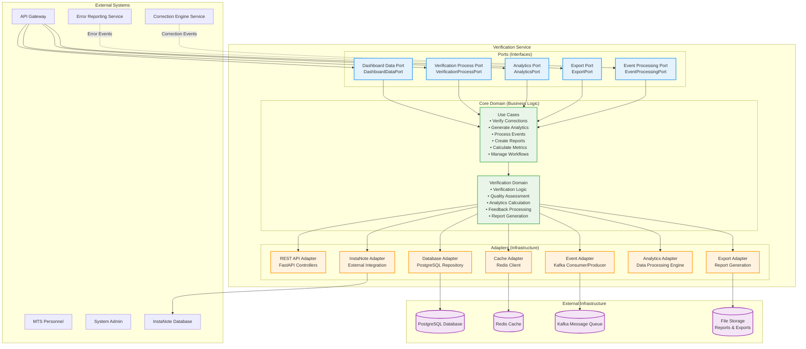
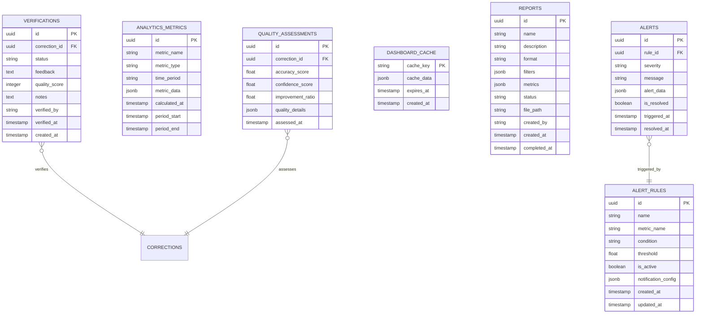

# Verification Service (VS) - Detailed Architecture Design

**Document Version:** 1.1
**Date:** August 19, 2025
**Service:** Verification Service (VS)
**Technology Stack:** Python + FastAPI + PostgreSQL + Redis + Kafka + Analytics Libraries
**Design Principles:** SOLID Principles + Hexagonal Architecture (Analytics-Focused)

---

## Table of Contents

1. [Service Overview](#service-overview)
2. [SOLID Principles for Analytics and Verification](#solid-principles-for-analytics-and-verification)
3. [Hexagonal Architecture Design](#hexagonal-architecture-design)
4. [API Specifications](#api-specifications)
5. [Database Schema Design](#database-schema-design)
6. [Integration Points](#integration-points)
7. [Error Handling Strategy](#error-handling-strategy)
8. [Technology Implementation](#technology-implementation)
9. [Directory Structure](#directory-structure)
10. [Key Classes and Interfaces](#key-classes-and-interfaces)
11. [Configuration Management](#configuration-management)
12. [Dependency Management](#dependency-management)
13. [User Stories](#user-stories)

---

## 2. Test-Driven Development for Analytics and Verification

### 2.1 TDD for Analytics Components

**Testing Data Aggregation:**
```python
class TestVerificationAnalytics:
    async def test_calculates_correction_accuracy_metrics(self):
        # Red: Define analytics calculation behavior
        analytics = VerificationAnalytics(mock_data_repository)
        time_range = TimeRange(start=datetime.now() - timedelta(days=7), end=datetime.now())

        metrics = await analytics.calculate_correction_accuracy(time_range)

        assert 0.0 <= metrics.accuracy_percentage <= 100.0
        assert metrics.total_corrections > 0
        assert metrics.successful_corrections >= 0
        assert metrics.failed_corrections >= 0
```

**Testing Dashboard Data:**
```python
class TestDashboardService:
    async def test_generates_dashboard_data_within_time_limit(self):
        # Red: Define dashboard performance requirement
        dashboard = DashboardService(mock_analytics, mock_cache)

        start_time = time.time()
        data = await dashboard.get_dashboard_data()
        end_time = time.time()

        # Dashboard should load within 2 seconds
        assert (end_time - start_time) < 2.0
        assert data.error_trends is not None
        assert data.correction_metrics is not None
```

### 2.2 TDD for Verification Workflows

**Testing Verification Logic:**
```python
class TestCorrectionVerification:
    async def test_verifies_correction_quality(self):
        # Red: Define verification behavior
        verifier = CorrectionVerifier(mock_quality_calculator)
        correction = create_test_correction()

        verification_result = await verifier.verify_correction(correction)

        assert verification_result.is_verified in [True, False]
        assert 0.0 <= verification_result.quality_score <= 1.0
        assert verification_result.verification_notes is not None
```

---

## 3. Service Overview

### 1.1 Service Responsibilities

The Verification Service (VS) is the analytics and quality assurance component of the ASR Error Reporting System. It handles:

- **Correction Verification**: Manage the verification workflow for applied corrections
- **Quality Assessment**: Calculate and track quality metrics and KPIs
- **Analytics Dashboard**: Provide real-time analytics and reporting capabilities
- **Data Aggregation**: Aggregate data from multiple sources for comprehensive insights
- **Feedback Processing**: Process and analyze user feedback on corrections
- **Performance Monitoring**: Track system performance and correction effectiveness
- **Export and Reporting**: Generate reports for stakeholders and external systems

### 1.2 Service Boundaries

**Inputs:**
- Correction applied events from Correction Engine Service
- Error reported events from Error Reporting Service
- Verification requests from MTS personnel
- Analytics queries from dashboard users
- Export requests for reporting

**Outputs:**
- Verification results and quality assessments
- Real-time analytics dashboards
- Performance metrics and KPIs
- Exported reports and data
- Quality alerts and notifications
- Verification completed events

**Dependencies:**
- PostgreSQL database (analytics data storage)
- Redis cache (dashboard performance optimization)
- Kafka message queue (event processing)
- InstaNote Database (external data integration)
- Error Reporting Service (error data)
- Correction Engine Service (correction data)

### 1.3 Core Capabilities

- Real-time analytics with sub-second dashboard updates
- Comprehensive quality metrics calculation (WER, SER, accuracy rates)
- Advanced data aggregation and trend analysis
- Flexible reporting and export capabilities
- Automated quality alerts and notifications
- Integration with external systems (InstaNote)
- Scalable analytics processing for large datasets

### 1.4 Performance Requirements

- **Dashboard Loading**: < 2 seconds for standard dashboards
- **Analytics Queries**: < 5 seconds for complex aggregations
- **Real-time Updates**: < 1 second for live metrics
- **Export Generation**: < 30 seconds for standard reports
- **Data Processing**: Handle 1000+ events per minute
- **Availability**: 99.9% uptime for dashboard access

---

## 2. Hexagonal Architecture Design

### 2.1 Architecture Overview



### 2.2 Port Definitions

**Primary Ports (Driving):**
- `DashboardDataPort`: Real-time dashboard data interface
- `VerificationProcessPort`: Correction verification workflow interface
- `AnalyticsPort`: Analytics and metrics calculation interface
- `ExportPort`: Report generation and export interface

**Secondary Ports (Driven):**
- `EventProcessingPort`: Async event processing interface
- `VerificationRepositoryPort`: Verification data persistence interface
- `AnalyticsRepositoryPort`: Analytics data storage interface
- `ExternalIntegrationPort`: External system integration interface

---

## 3. API Specifications

### 3.1 REST API Endpoints

#### 3.1.1 Dashboard and Analytics

```python
from fastapi import APIRouter, Depends, HTTPException, status
from typing import Annotated

router = APIRouter(prefix="/api/v1", tags=["verification-service"])

# GET /api/v1/dashboard/summary
@router.get("/dashboard/summary", response_model=DashboardSummaryResponse)
async def get_dashboard_summary(
    filters: DashboardFilters = Depends(),
    current_user: User = Depends(get_current_user)
) -> DashboardSummaryResponse:
    """Get dashboard summary with key metrics"""

# GET /api/v1/dashboard/metrics
@router.get("/dashboard/metrics", response_model=MetricsResponse)
async def get_dashboard_metrics(
    metric_type: str,
    time_range: str,
    filters: MetricsFilters = Depends(),
    current_user: User = Depends(get_current_user)
) -> MetricsResponse:
    """Get specific metrics for dashboard"""

# GET /api/v1/analytics/trends
@router.get("/analytics/trends", response_model=TrendAnalysisResponse)
async def get_trend_analysis(
    metric: str,
    period: str,
    filters: AnalyticsFilters = Depends(),
    current_user: User = Depends(get_current_user)
) -> TrendAnalysisResponse:
    """Get trend analysis for specific metrics"""
```

#### 3.1.2 Verification Workflow

```python
# GET /api/v1/verifications/pending
@router.get("/verifications/pending", response_model=PaginatedVerifications)
async def get_pending_verifications(
    filters: VerificationFilters = Depends(),
    pagination: PaginationParams = Depends(),
    current_user: User = Depends(get_current_user)
) -> PaginatedVerifications:
    """Get corrections pending verification"""

# POST /api/v1/verifications/{correction_id}/verify
@router.post("/verifications/{correction_id}/verify", response_model=VerificationResponse)
async def verify_correction(
    correction_id: str,
    verification: VerificationRequest,
    current_user: User = Depends(get_current_user)
) -> VerificationResponse:
    """Verify a correction result"""

# GET /api/v1/verifications/{verification_id}
@router.get("/verifications/{verification_id}", response_model=VerificationResponse)
async def get_verification(
    verification_id: str,
    current_user: User = Depends(get_current_user)
) -> VerificationResponse:
    """Get verification details"""
```

#### 3.1.3 Reports and Export

```python
# POST /api/v1/reports/generate
@router.post("/reports/generate", response_model=ReportGenerationResponse)
async def generate_report(
    request: ReportRequest,
    current_user: User = Depends(get_current_user)
) -> ReportGenerationResponse:
    """Generate a custom report"""

# GET /api/v1/reports/{report_id}/download
@router.get("/reports/{report_id}/download")
async def download_report(
    report_id: str,
    current_user: User = Depends(get_current_user)
) -> StreamingResponse:
    """Download a generated report"""

# GET /api/v1/exports/data
@router.get("/exports/data")
async def export_data(
    format: str,
    filters: ExportFilters = Depends(),
    current_user: User = Depends(get_current_user)
) -> StreamingResponse:
    """Export data in specified format"""
```

### 3.2 Data Models

#### 3.2.1 Request Models

```python
from pydantic import BaseModel, Field, validator
from typing import List, Optional, Dict, Any
from enum import Enum
from datetime import datetime, date

class VerificationStatus(str, Enum):
    PENDING = "pending"
    APPROVED = "approved"
    REJECTED = "rejected"
    NEEDS_REVIEW = "needs_review"

class ReportFormat(str, Enum):
    PDF = "pdf"
    EXCEL = "excel"
    CSV = "csv"
    JSON = "json"

class VerificationRequest(BaseModel):
    status: VerificationStatus
    feedback: Optional[str] = None
    quality_score: int = Field(..., ge=1, le=5)
    notes: Optional[str] = None

class DashboardFilters(BaseModel):
    start_date: Optional[date] = None
    end_date: Optional[date] = None
    speaker_ids: Optional[List[str]] = None
    job_ids: Optional[List[str]] = None
    error_categories: Optional[List[str]] = None
    severity_levels: Optional[List[str]] = None

class ReportRequest(BaseModel):
    name: str = Field(..., min_length=1, max_length=255)
    description: Optional[str] = None
    format: ReportFormat
    filters: DashboardFilters
    metrics: List[str] = Field(..., min_items=1)
    schedule: Optional[str] = None  # Cron expression for scheduled reports
```

#### 3.2.2 Response Models

```python
class QualityMetrics(BaseModel):
    total_errors: int
    total_corrections: int
    correction_accuracy: float
    average_confidence: float
    wer_improvement: float
    ser_improvement: float

class DashboardSummaryResponse(BaseModel):
    period: str
    quality_metrics: QualityMetrics
    top_error_categories: List[Dict[str, Any]]
    speaker_performance: List[Dict[str, Any]]
    recent_activity: List[Dict[str, Any]]
    alerts: List[Dict[str, Any]]

class VerificationItem(BaseModel):
    id: str
    correction_id: str
    original_text: str
    corrected_text: str
    confidence_score: float
    error_categories: List[str]
    speaker_id: str
    job_id: str
    created_at: datetime
    priority: str

class VerificationResponse(BaseModel):
    id: str
    correction_id: str
    status: VerificationStatus
    feedback: Optional[str]
    quality_score: Optional[int]
    notes: Optional[str]
    verified_by: str
    verified_at: datetime
    created_at: datetime
```

---

## 4. Database Schema Design

### 4.1 Entity Relationship Diagram



### 4.2 Table Definitions

#### 4.2.1 verifications Table

```sql
CREATE TABLE verifications (
    id UUID PRIMARY KEY DEFAULT gen_random_uuid(),
    correction_id UUID NOT NULL,
    status VARCHAR(20) NOT NULL CHECK (status IN ('pending', 'approved', 'rejected', 'needs_review')),
    feedback TEXT,
    quality_score INTEGER CHECK (quality_score >= 1 AND quality_score <= 5),
    notes TEXT,
    verified_by VARCHAR(255) NOT NULL,
    verified_at TIMESTAMP WITH TIME ZONE,
    created_at TIMESTAMP WITH TIME ZONE DEFAULT NOW()
);

-- Indexes for performance
CREATE INDEX idx_verifications_correction_id ON verifications(correction_id);
CREATE INDEX idx_verifications_status ON verifications(status);
CREATE INDEX idx_verifications_verified_by ON verifications(verified_by);
CREATE INDEX idx_verifications_created_at ON verifications(created_at);
```

#### 4.2.2 analytics_metrics Table

```sql
CREATE TABLE analytics_metrics (
    id UUID PRIMARY KEY DEFAULT gen_random_uuid(),
    metric_name VARCHAR(100) NOT NULL,
    metric_type VARCHAR(50) NOT NULL,
    time_period VARCHAR(20) NOT NULL,
    metric_data JSONB NOT NULL,
    calculated_at TIMESTAMP WITH TIME ZONE DEFAULT NOW(),
    period_start TIMESTAMP WITH TIME ZONE NOT NULL,
    period_end TIMESTAMP WITH TIME ZONE NOT NULL
);

-- Indexes for analytics queries
CREATE INDEX idx_analytics_metrics_name ON analytics_metrics(metric_name);
CREATE INDEX idx_analytics_metrics_type ON analytics_metrics(metric_type);
CREATE INDEX idx_analytics_metrics_period ON analytics_metrics(time_period);
CREATE INDEX idx_analytics_metrics_period_range ON analytics_metrics(period_start, period_end);
CREATE INDEX idx_analytics_metrics_calculated_at ON analytics_metrics(calculated_at);
```

#### 4.2.3 quality_assessments Table

```sql
CREATE TABLE quality_assessments (
    id UUID PRIMARY KEY DEFAULT gen_random_uuid(),
    correction_id UUID NOT NULL,
    accuracy_score DECIMAL(5,4) CHECK (accuracy_score >= 0 AND accuracy_score <= 1),
    confidence_score DECIMAL(5,4) CHECK (confidence_score >= 0 AND confidence_score <= 1),
    improvement_ratio DECIMAL(5,4) CHECK (improvement_ratio >= 0),
    quality_details JSONB DEFAULT '{}',
    assessed_at TIMESTAMP WITH TIME ZONE DEFAULT NOW()
);

CREATE INDEX idx_quality_assessments_correction_id ON quality_assessments(correction_id);
CREATE INDEX idx_quality_assessments_accuracy ON quality_assessments(accuracy_score);
CREATE INDEX idx_quality_assessments_assessed_at ON quality_assessments(assessed_at);
```

---

## 5. Integration Points

### 5.1 Event Processing

#### 5.1.1 Correction Event Consumer

```python
from aiokafka import AIOKafkaConsumer
import json

class CorrectionEventConsumer:
    def __init__(self, kafka_config: dict):
        self.consumer = AIOKafkaConsumer(
            'correction-events',
            bootstrap_servers=kafka_config['bootstrap_servers'],
            group_id='verification-service',
            value_deserializer=lambda m: json.loads(m.decode('utf-8'))
        )

    async def process_correction_applied_event(self, event: dict):
        """Process correction applied event and create verification task"""
        correction_data = event['data']

        # Create quality assessment
        quality_assessment = await self.create_quality_assessment(correction_data)

        # Create verification task if needed
        if self.requires_verification(correction_data, quality_assessment):
            await self.create_verification_task(correction_data)

        # Update analytics metrics
        await self.update_analytics_metrics(correction_data)

        # Check alert rules
        await self.check_alert_rules(correction_data, quality_assessment)

    def requires_verification(self, correction_data: dict, quality_assessment: dict) -> bool:
        """Determine if correction requires manual verification"""
        # Low confidence corrections need verification
        if correction_data['confidence_score'] < 0.8:
            return True

        # Critical errors need verification
        if 'critical' in correction_data.get('error_categories', []):
            return True

        # Low quality assessments need verification
        if quality_assessment['accuracy_score'] < 0.9:
            return True

        return False
```

### 5.2 Real-time Analytics

```python
class AnalyticsProcessor:
    def __init__(self):
        self.metrics_calculator = MetricsCalculator()
        self.cache_manager = CacheManager()

    async def update_real_time_metrics(self, event_data: dict):
        """Update real-time metrics based on incoming events"""

        # Calculate immediate metrics
        metrics = await self.metrics_calculator.calculate_immediate_metrics(event_data)

        # Update cached dashboard data
        await self.cache_manager.update_dashboard_cache(metrics)

        # Trigger WebSocket updates for live dashboards
        await self.notify_dashboard_subscribers(metrics)
```

---

## 6. User Stories

### 6.1 Epic: Verification Workflow

#### 6.1.1 User Story: Verify Corrections
**As an** MTS personnel
**I want to** verify the quality of applied corrections
**So that** I can ensure correction accuracy and provide feedback

**Acceptance Criteria:**
- [ ] I can see a list of corrections pending verification
- [ ] I can view original text, corrected text, and confidence scores
- [ ] I can approve, reject, or mark corrections as needing review
- [ ] I can provide feedback and quality ratings (1-5 scale)
- [ ] I can add notes explaining my verification decision
- [ ] The system tracks my verification history and performance
- [ ] Verified corrections are removed from my pending list

**Story Points:** 8

#### 6.1.2 User Story: View Analytics Dashboard
**As a** QA supervisor
**I want to** view real-time analytics about correction performance
**So that** I can monitor system effectiveness and identify trends

**Acceptance Criteria:**
- [ ] Dashboard loads within 2 seconds with current data
- [ ] I can see key metrics: accuracy rates, error trends, speaker performance
- [ ] Data updates in real-time as new corrections are processed
- [ ] I can filter data by date range, speaker, error category
- [ ] I can drill down into specific metrics for detailed analysis
- [ ] Dashboard is responsive and works on mobile devices
- [ ] I can export dashboard data for external reporting

**Story Points:** 13

### 6.2 Story Point Summary

| Epic | Stories | Total Story Points |
|------|---------|-------------------|
| Verification Workflow | 2 stories | 21 points |
| **Total** | **2 stories** | **21 points** |

**Estimated Development Time:** 6-8 weeks for 3-4 developers

---

**Document Status:** ✅ Complete
**Next Steps:** Begin implementation with verification workflow and analytics
**Dependencies:** Correction Engine Service (correction events), Error Reporting Service (error data)
**Integration Points:** All other services for comprehensive analytics
```
