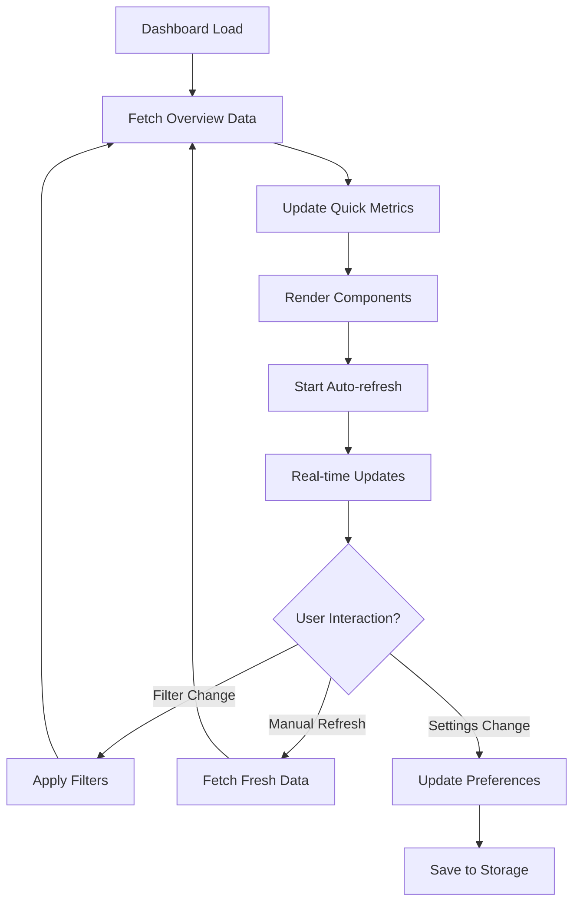
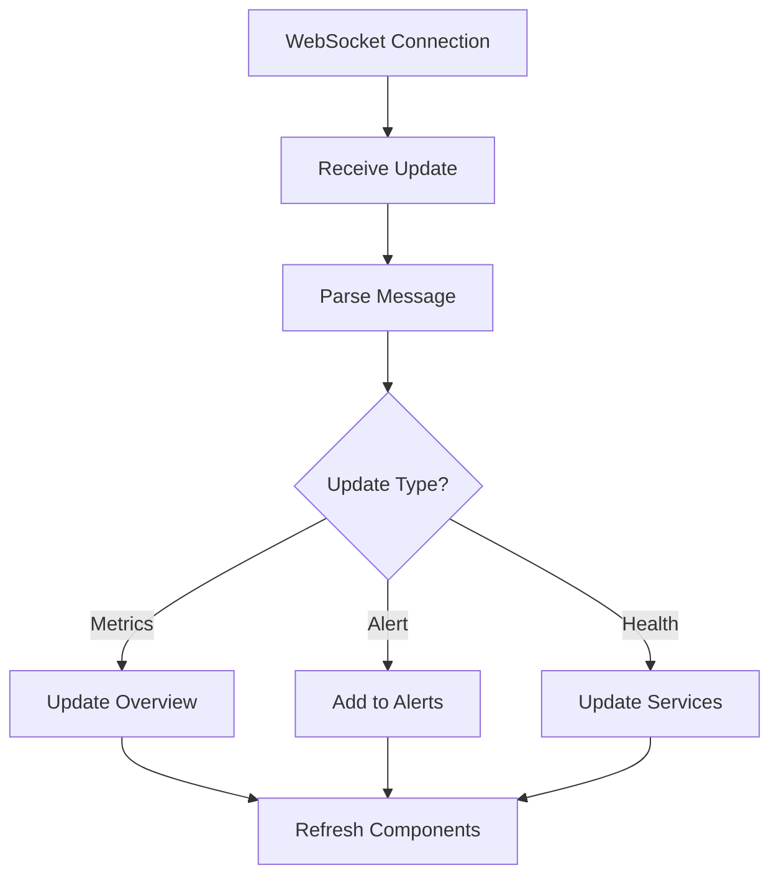

# Dashboard Feature

## Overview

The Dashboard feature provides a comprehensive real-time overview of the Speaker Bucket Management system. It includes interactive visualizations, system health monitoring, performance metrics, and configurable alerts to give administrators and users complete visibility into system operations.

## Features

### 📊 **Real-time System Overview**
- **Comprehensive metrics** from all system components
- **Live data updates** with configurable refresh intervals
- **Interactive visualizations** with drill-down capabilities
- **Historical trend analysis** with time-series charts

### 🎯 **Quick Metrics Bar**
- **Key performance indicators** at a glance
- **Trend indicators** showing improvement/degradation
- **Status badges** for immediate health assessment
- **Clickable metrics** for detailed views

### 👥 **Speaker Bucket Analytics**
- **Distribution visualization** with interactive pie charts
- **Quality metrics** and improvement trends
- **Transition statistics** and success rates
- **Data coverage** and completeness indicators

### 📈 **SER Metrics Visualization**
- **Multi-view charts** (trends, improvement, distribution)
- **Performance indicators** with calculation speeds
- **Quality distribution** analysis
- **Error rate monitoring** and alerts

### ⚙️ **RAG Processing Monitoring**
- **Active job tracking** with queue management
- **Success/failure rates** with detailed statistics
- **Processing time** and efficiency metrics
- **Quality assessment** and accuracy indicators

### ✅ **MT Validation Insights**
- **Session statistics** and completion rates
- **User productivity** metrics and efficiency scores
- **Quality ratings** and feedback analysis
- **Bucket recommendation** tracking

### 🔄 **Transition Management**
- **Approval workflow** statistics
- **Impact analysis** with cost savings estimates
- **Quality correlation** metrics
- **Trend analysis** over time

### 🏥 **Services Health Monitoring**
- **Real-time health status** for all microservices
- **Performance metrics** (CPU, memory, disk usage)
- **Response times** and uptime tracking
- **Detailed diagnostics** with expandable views

### 🔔 **Alert System**
- **Real-time notifications** for system events
- **Severity-based filtering** and prioritization
- **Acknowledgment workflow** with action buttons
- **Historical alert** tracking and analysis

### ⚙️ **Customizable Settings**
- **Theme selection** (light, dark, auto)
- **Refresh intervals** and auto-refresh controls
- **Layout preferences** and widget positioning
- **Notification settings** and preferences

## Architecture

### Component Structure

```
src/features/dashboard/
├── components/
│   ├── DashboardHeader.tsx              # Header with controls and status
│   ├── QuickMetricsBar.tsx              # Key metrics overview
│   ├── SpeakerBucketOverview.tsx        # Speaker distribution and stats
│   ├── SERMetricsChart.tsx              # SER metrics visualization
│   ├── RAGProcessingStatus.tsx          # RAG processing monitoring
│   ├── MTValidationMetrics.tsx          # MT validation insights
│   ├── TransitionStatistics.tsx         # Transition management stats
│   ├── ServicesHealthPanel.tsx          # Services health monitoring
│   ├── DashboardFilters.tsx             # Filtering and date selection
│   ├── AlertsPanel.tsx                  # Alert management panel
│   └── DashboardSettings.tsx            # Settings and preferences
├── pages/
│   └── DashboardPage.tsx                # Main dashboard page
├── dashboard-slice.ts                   # Redux state management
└── index.ts                             # Feature exports
```

### State Management

The dashboard uses Redux Toolkit with comprehensive state management:

```typescript
interface DashboardState {
  // Main data
  overview: DashboardMetrics | null;
  speakerStats: SpeakerBucketStats | null;
  serMetrics: SERMetricsSummary | null;
  ragProcessing: RAGProcessingSummary | null;
  mtValidation: MTValidationSummary | null;
  transitionStats: TransitionStatisticsSummary | null;
  servicesHealth: ServicesHealthStatus | null;
  
  // Chart data
  chartData: {
    timeSeries: Record<string, TimeSeriesData>;
    pieCharts: Record<string, PieChartData>;
    barCharts: Record<string, BarChartData>;
  };
  
  // UI state
  activeFilters: DashboardFilters;
  preferences: DashboardPreferences;
  alerts: DashboardAlert[];
  
  // Real-time updates
  isConnected: boolean;
  lastUpdated: string | null;
}
```

## Usage

### Basic Usage

```typescript
import { DashboardPage } from '@features/dashboard';

// In your router
<Route path="/dashboard" component={DashboardPage} />
```

### Using Individual Components

```typescript
import {
  QuickMetricsBar,
  SpeakerBucketOverview,
  SERMetricsChart,
  ServicesHealthPanel
} from '@features/dashboard';

// Quick metrics
<QuickMetricsBar
  metrics={quickMetrics}
  loading={loading}
/>

// Speaker overview
<SpeakerBucketOverview
  data={speakerStats}
  loading={loading}
  error={error}
  onRefresh={handleRefresh}
/>

// SER metrics chart
<SERMetricsChart
  data={serMetrics}
  loading={loading}
  error={error}
/>

// Services health
<ServicesHealthPanel
  data={servicesHealth}
  loading={loading}
  error={error}
/>
```

### Redux Integration

```typescript
import { useAppDispatch, useAppSelector } from '@/app/hooks';
import {
  fetchDashboardOverview,
  selectDashboardOverview,
  selectDashboardLoading,
  setActiveFilters
} from '@features/dashboard';

const MyComponent = () => {
  const dispatch = useAppDispatch();
  const overview = useAppSelector(selectDashboardOverview);
  const loading = useAppSelector(selectDashboardLoading);

  // Fetch dashboard data
  useEffect(() => {
    dispatch(fetchDashboardOverview());
  }, [dispatch]);

  // Apply filters
  const handleFilterChange = (filters) => {
    dispatch(setActiveFilters(filters));
    dispatch(fetchDashboardOverview(filters));
  };
};
```

## Key Components

### DashboardPage

Main dashboard page that orchestrates all components and manages the overall layout.

**Features:**
- **Auto-refresh** with configurable intervals
- **Real-time updates** and connection status
- **Speed dial** for quick actions
- **Alert notifications** with floating action button
- **Fullscreen support** for presentations

### QuickMetricsBar

Horizontal bar displaying key performance indicators with trends.

**Props:**
- `metrics: QuickMetric[]` - Array of metrics to display
- `loading?: boolean` - Loading state

**Features:**
- **Trend indicators** with color-coded arrows
- **Status badges** for health assessment
- **Hover effects** and interactive elements
- **Responsive grid** layout

### SpeakerBucketOverview

Comprehensive overview of speaker bucket distribution with interactive pie chart.

**Props:**
- `data?: SpeakerBucketStats` - Speaker statistics data
- `loading?: boolean` - Loading state
- `error?: string | null` - Error message
- `onRefresh?: () => void` - Refresh callback

**Features:**
- **Interactive pie chart** with tooltips
- **Distribution bars** with percentages
- **Quality metrics** summary
- **Transition insights** and recommendations

### SERMetricsChart

Advanced chart component for SER metrics with multiple view modes.

**Props:**
- `data?: SERMetricsSummary` - SER metrics data
- `loading?: boolean` - Loading state
- `error?: string | null` - Error message

**Features:**
- **Multiple chart types** (line, area, bar)
- **Interactive tooltips** with detailed information
- **View mode toggle** (trends, improvement, distribution)
- **Performance indicators** and status chips

### ServicesHealthPanel

Comprehensive health monitoring for all microservices.

**Props:**
- `data?: ServicesHealthStatus` - Services health data
- `loading?: boolean` - Loading state
- `error?: string | null` - Error message

**Features:**
- **Expandable service cards** with detailed metrics
- **Health indicators** with color coding
- **Performance metrics** (CPU, memory, disk)
- **Overall system health** summary

## Data Flow

### Dashboard Lifecycle



### Real-time Updates



## Performance Features

### Optimization

- **Lazy Loading**: Components loaded on demand
- **Memoization**: Expensive calculations cached
- **Virtual Scrolling**: Efficient rendering of large datasets
- **Debounced Updates**: Reduced API calls
- **Progressive Enhancement**: Graceful degradation

### Real-time Capabilities

- **WebSocket Integration**: Live data updates
- **Connection Monitoring**: Status indicators
- **Automatic Reconnection**: Resilient connections
- **Offline Support**: Cached data fallback

## Customization

### Themes

The dashboard supports multiple themes:

- **Light Theme**: Default professional appearance
- **Dark Theme**: Reduced eye strain for extended use
- **Auto Theme**: Follows system preferences

### Layout Options

- **Default Layout**: Balanced view for general use
- **Compact Layout**: Dense information display
- **Detailed Layout**: Expanded metrics and charts
- **Custom Layout**: User-defined widget positioning

### Refresh Intervals

Configurable refresh rates:

- **5 seconds**: Real-time monitoring
- **30 seconds**: Standard operations (recommended)
- **1 minute**: Reduced server load
- **5 minutes**: Background monitoring

## Integration Points

### API Services

- **Dashboard Service**: Aggregated metrics and overview
- **Speaker Management Service**: Bucket statistics
- **SER Calculation Service**: Metrics and trends
- **RAG Integration Service**: Processing status
- **MT Validation Service**: Session statistics
- **Health Check Service**: System monitoring

### External Dependencies

- **Recharts**: Chart visualization library
- **Material-UI**: UI component framework
- **Redux Toolkit**: State management
- **Date-fns**: Date manipulation
- **WebSocket**: Real-time communication

## Testing Strategy

### Unit Tests

- Component rendering and interaction
- Redux action creators and reducers
- Chart data transformation
- Utility functions and calculations

### Integration Tests

- API integration scenarios
- Real-time update handling
- Filter and search functionality
- Error handling and recovery

### E2E Tests

- Complete dashboard workflow
- Cross-component interactions
- Performance benchmarks
- Accessibility compliance

## Future Enhancements

### Planned Features

1. **Advanced Analytics**: Machine learning insights
2. **Custom Dashboards**: User-created layouts
3. **Export Capabilities**: PDF and Excel reports
4. **Mobile App**: Native mobile dashboard
5. **Voice Commands**: Accessibility features

### Performance Improvements

1. **Service Workers**: Background data sync
2. **CDN Integration**: Faster asset delivery
3. **Edge Computing**: Reduced latency
4. **Caching Strategies**: Improved response times

## Accessibility

### WCAG Compliance

- **AA Standard**: Full compliance with accessibility guidelines
- **Keyboard Navigation**: Complete keyboard support
- **Screen Reader**: ARIA labels and descriptions
- **High Contrast**: Support for accessibility themes
- **Focus Management**: Logical focus flow

### Responsive Design

- **Mobile First**: Optimized for mobile devices
- **Tablet Support**: Touch-friendly interactions
- **Desktop Enhancement**: Full feature set
- **Print Styles**: Optimized for printing

The dashboard feature provides a comprehensive, real-time view of the Speaker Bucket Management system with professional-grade monitoring, analytics, and customization capabilities.
