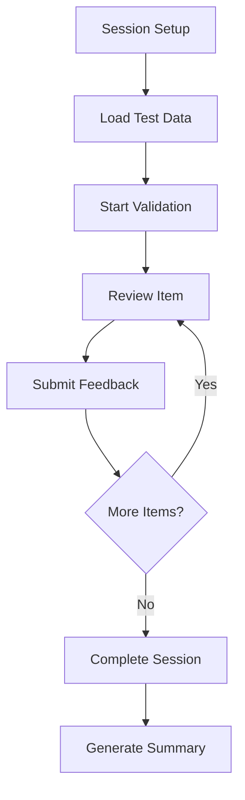
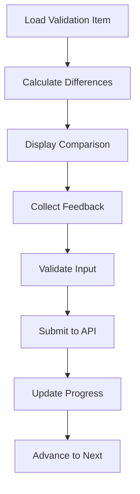

# MT Validation Feature

## Overview

The MT (Medical Transcriptionist) Validation feature provides a comprehensive interface for medical transcriptionists to review and validate RAG-corrected ASR drafts. It includes advanced text comparison, difference highlighting, SER metrics analysis, and structured feedback collection.

## Features

### 🔍 **Advanced Text Comparison**
- **Side-by-side comparison** of original ASR, RAG-corrected, and reference texts
- **Intelligent difference highlighting** with confidence scores
- **Multiple view modes** (side-by-side, unified, overlay)
- **Interactive text navigation** with zoom and copy functionality

### 📊 **SER Metrics Analysis**
- **Real-time SER calculation** for original and corrected texts
- **Improvement metrics** with statistical significance
- **Quality level assessment** (high, medium, low)
- **Visual progress indicators** and trend analysis

### ✅ **Structured Feedback Collection**
- **5-star rating system** for overall quality assessment
- **Improvement assessment** categories (significant, moderate, minimal, none, worse)
- **Bucket change recommendations** for speaker transitions
- **Free-text comments** for detailed feedback

### ⚡ **Workflow Optimization**
- **Keyboard shortcuts** for efficient navigation
- **Auto-advance** functionality after feedback submission
- **Progress tracking** with time estimates
- **Session management** with pause/resume capabilities

### 📈 **Analytics & Reporting**
- **Session summaries** with comprehensive statistics
- **Performance metrics** and quality insights
- **Export capabilities** for reporting and analysis
- **Real-time progress monitoring**

## Architecture

### Component Structure

```
src/features/mt-validation/
├── components/
│   ├── MTValidationInterface.tsx        # Main validation interface
│   ├── TextComparisonPanel.tsx          # Text comparison with highlighting
│   ├── SERMetricsPanel.tsx              # SER metrics visualization
│   ├── FeedbackPanel.tsx                # Feedback collection form
│   ├── ValidationProgress.tsx           # Progress tracking
│   ├── KeyboardShortcutsHelper.tsx      # Keyboard shortcuts guide
│   ├── SessionSetupDialog.tsx           # Session creation wizard
│   └── SessionSummaryDialog.tsx         # Session completion summary
├── pages/
│   └── MTValidationPage.tsx             # Main feature page
├── mt-validation-slice.ts               # Redux state management
└── index.ts                             # Feature exports
```

### State Management

The feature uses Redux Toolkit with comprehensive state management:

```typescript
interface MTValidationState {
  // Session and workflow
  currentSession: ValidationSession | null;
  testDataItems: ValidationTestData[];
  currentItemIndex: number;
  sessionProgress: number;
  
  // UI state
  comparisonMode: 'side-by-side' | 'unified' | 'overlay';
  showDifferences: boolean;
  showSERMetrics: boolean;
  
  // Feedback
  currentFeedback: Partial<SubmitMTFeedbackRequest>;
  submittedFeedback: MTFeedback[];
  
  // User preferences
  userPreferences: ValidationPreferences;
  
  // Loading and error states
  loading: { [key: string]: boolean };
  error: { [key: string]: string | null };
}
```

## Usage

### Basic Usage

```typescript
import { MTValidationPage } from '@features/mt-validation';

// In your router
<Route path="/mt-validation/:sessionId?" component={MTValidationPage} />
```

### Using Individual Components

```typescript
import {
  MTValidationInterface,
  TextComparisonPanel,
  SERMetricsPanel,
  FeedbackPanel
} from '@features/mt-validation';

// Main validation interface
<MTValidationInterface
  sessionId={sessionId}
  onComplete={handleComplete}
  onPause={handlePause}
/>

// Text comparison
<TextComparisonPanel
  originalText={originalText}
  correctedText={correctedText}
  referenceText={referenceText}
  differences={differences}
  comparisonMode="side-by-side"
  showDifferences={true}
/>

// SER metrics
<SERMetricsPanel
  originalMetrics={originalMetrics}
  correctedMetrics={correctedMetrics}
  improvementMetrics={improvementMetrics}
  compact={false}
/>

// Feedback collection
<FeedbackPanel
  sessionId={sessionId}
  currentItem={currentItem}
  onFeedbackSubmitted={handleFeedbackSubmitted}
  autoAdvance={true}
/>
```

### Redux Integration

```typescript
import { useAppDispatch, useAppSelector } from '@/app/hooks';
import {
  startValidationSession,
  submitMTFeedback,
  selectCurrentSession,
  selectCurrentItem,
  selectSessionProgress
} from '@features/mt-validation';

const MyComponent = () => {
  const dispatch = useAppDispatch();
  const currentSession = useAppSelector(selectCurrentSession);
  const currentItem = useAppSelector(selectCurrentItem);
  const progress = useAppSelector(selectSessionProgress);

  // Start validation session
  const handleStartSession = async (sessionData) => {
    await dispatch(startValidationSession(sessionData));
  };

  // Submit feedback
  const handleSubmitFeedback = async (feedback) => {
    await dispatch(submitMTFeedback({ sessionId, feedback }));
  };
};
```

## Key Components

### MTValidationInterface

Main interface component that orchestrates the entire validation workflow.

**Props:**
- `sessionId: string` - Validation session identifier
- `onComplete?: () => void` - Callback when session is completed
- `onPause?: () => void` - Callback when session is paused
- `compact?: boolean` - Compact mode for smaller screens

### TextComparisonPanel

Advanced text comparison with intelligent difference highlighting.

**Props:**
- `originalText: string` - Original ASR text
- `correctedText: string` - RAG-corrected text
- `referenceText: string` - Final reference text
- `differences: TextDifference[]` - Calculated text differences
- `comparisonMode: 'side-by-side' | 'unified' | 'overlay'` - Display mode
- `showDifferences: boolean` - Whether to highlight differences

### SERMetricsPanel

Comprehensive SER metrics visualization with improvement analysis.

**Props:**
- `originalMetrics: SERMetrics` - Original text SER metrics
- `correctedMetrics: SERMetrics` - Corrected text SER metrics
- `improvementMetrics: SERComparison` - Improvement comparison
- `compact?: boolean` - Compact display mode

### FeedbackPanel

Interactive feedback collection with validation and auto-save.

**Props:**
- `sessionId: string` - Session identifier
- `currentItem: ValidationTestData` - Current validation item
- `onFeedbackSubmitted?: () => void` - Callback after feedback submission
- `autoAdvance?: boolean` - Auto-advance to next item

## Keyboard Shortcuts

The interface supports comprehensive keyboard shortcuts for efficient workflow:

| Shortcut | Action |
|----------|--------|
| `→` or `N` | Next item |
| `←` or `P` | Previous item |
| `D` | Toggle differences highlighting |
| `M` | Toggle SER metrics panel |
| `F` | Toggle fullscreen mode |
| `1-5` | Set rating (1-5 stars) |
| `Ctrl+Enter` | Submit feedback and advance |
| `Ctrl+S` | Save current feedback |
| `?` | Show keyboard shortcuts help |
| `Esc` | Close dialogs/cancel actions |

## Workflow

### Session Creation

1. **Speaker Selection**: Choose speaker for validation
2. **Test Data Configuration**: Set number of items and priority
3. **Settings**: Configure auto-advance, SER metrics, etc.

### Validation Process

1. **Text Review**: Compare original, corrected, and reference texts
2. **Difference Analysis**: Review highlighted changes and improvements
3. **SER Assessment**: Analyze quality metrics and improvements
4. **Feedback Collection**: Provide rating, assessment, and comments
5. **Progress Tracking**: Monitor session completion and time

### Session Completion

1. **Summary Generation**: Comprehensive session statistics
2. **Quality Insights**: Areas for improvement and recommendations
3. **Export Options**: Generate reports for analysis
4. **Bucket Recommendations**: Speaker transition suggestions

## Performance Features

### Optimization

- **Lazy Loading**: Components loaded on demand
- **Memoization**: Expensive calculations cached
- **Virtual Scrolling**: Efficient handling of large text
- **Debounced Updates**: Reduced API calls
- **Progressive Enhancement**: Graceful degradation

### Accessibility

- **Keyboard Navigation**: Full keyboard support
- **Screen Reader Support**: ARIA labels and descriptions
- **High Contrast**: Support for accessibility themes
- **Focus Management**: Logical focus flow
- **Text Scaling**: Responsive font sizing

## Data Flow

### Session Lifecycle



### Feedback Collection



## Integration Points

### API Services

- **MT Validation Service**: Session and feedback management
- **SER Calculation Service**: Real-time metrics calculation
- **Speaker Management Service**: Speaker data and transitions
- **RAG Integration Service**: Corrected text processing

### External Dependencies

- **Material-UI**: UI component library
- **Redux Toolkit**: State management
- **React Router**: Navigation and routing
- **WebSocket**: Real-time updates (planned)

## Testing Strategy

### Unit Tests

- Component rendering and interaction
- Redux action creators and reducers
- Utility functions and calculations
- API client methods

### Integration Tests

- Complete validation workflow
- Cross-component communication
- API integration scenarios
- Error handling and recovery

### E2E Tests

- Full session lifecycle
- Keyboard navigation
- Accessibility compliance
- Performance benchmarks

## Future Enhancements

### Planned Features

1. **Real-time Collaboration**: Multi-user validation sessions
2. **Advanced Analytics**: Machine learning insights
3. **Voice Integration**: Audio playback and annotation
4. **Mobile Support**: Responsive mobile interface
5. **Offline Capability**: Progressive Web App features

### Performance Improvements

1. **WebSocket Integration**: Real-time updates
2. **Service Worker**: Background sync and caching
3. **Code Splitting**: Further bundle optimization
4. **CDN Integration**: Static asset optimization
