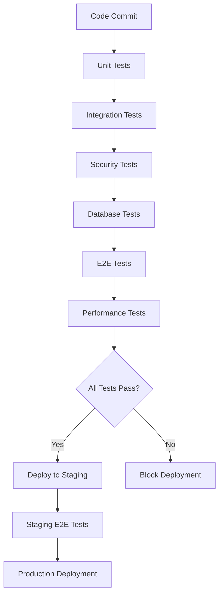

# Test Execution and Coverage Summary
## Quality-Based Speaker Bucket Management System

**Date:** December 19, 2024  
**Version:** 2.0  
**Phase:** Test Case Development Complete  
**Next Phase:** Implementation (Pending Approval)

---

## Test Suite Overview

This document provides a comprehensive summary of all test specifications developed for the quality-based speaker bucket management system, including execution strategies, coverage requirements, and quality gates.

---

## 1. Test Suite Structure

### 1.1 Test Categories and Coverage

| Test Category | Test Files | Test Cases | Coverage Target | Framework |
|---------------|------------|------------|-----------------|-----------|
| **Backend Unit Tests** | 1 specification | 25+ test cases | >90% | pytest + asyncio |
| **API Integration Tests** | 1 specification | 30+ test cases | 100% endpoints | pytest + httpx |
| **End-to-End Tests** | 1 specification | 20+ scenarios | Complete workflows | Playwright |
| **Performance Tests** | 1 specification | 15+ test plans | <500ms API, <2s UI | Artillery + k6 |
| **Security Tests** | 1 specification | 20+ test cases | OWASP compliance | Custom + ZAP |
| **Database Tests** | 1 specification | 15+ test cases | Schema + performance | pytest + asyncpg |

### 1.2 Test Specifications Created

#### ✅ **Backend Unit Test Specifications**
- **File**: `tests/specifications/backend_unit_test_specifications.md`
- **Coverage**: Enhanced error reporting, bucket management, speaker history, verification services
- **Key Tests**: Enhanced metadata validation, quality-based bucket logic, performance metrics calculation

#### ✅ **API Integration Test Specifications**
- **File**: `tests/specifications/api_integration_test_specifications.md`
- **Coverage**: All API endpoints with enhanced metadata support
- **Key Tests**: Error reporting API, speaker history API, verification workflow API, dashboard analytics

#### ✅ **End-to-End Test Scenarios**
- **File**: `tests/specifications/end_to_end_test_scenarios.md`
- **Coverage**: Complete user workflows from frontend to backend
- **Key Tests**: Error reporting workflow, speaker history viewing, verification process, mobile responsiveness

#### ✅ **Performance Test Plans**
- **File**: `tests/specifications/performance_test_plans.md`
- **Coverage**: Load testing, stress testing, database performance
- **Key Tests**: API response times, dashboard loading, vector database search, system breaking points

#### ✅ **Security Test Cases**
- **File**: `tests/specifications/security_test_cases.md`
- **Coverage**: Authentication, authorization, data protection, compliance
- **Key Tests**: JWT security, copy-paste restrictions, data encryption, HIPAA compliance

#### ✅ **Database Test Specifications**
- **File**: `tests/specifications/database_test_specifications.md`
- **Coverage**: Schema migration, CRUD operations, performance, constraints
- **Key Tests**: Enhanced metadata schema, bucket type migration, query performance

---

## 2. Test Coverage Requirements

### 2.1 Code Coverage Targets

```yaml
coverage_requirements:
  backend_services:
    minimum: 90%
    critical_paths: 100%
    new_functionality: 95%
  
  api_endpoints:
    minimum: 100%
    error_handling: 100%
    authentication: 100%
  
  frontend_components:
    minimum: 85%
    user_workflows: 95%
    error_scenarios: 90%
  
  database_operations:
    minimum: 85%
    migrations: 100%
    constraints: 100%
```

### 2.2 Functional Coverage Matrix

| Feature Area | Unit Tests | Integration Tests | E2E Tests | Performance Tests | Security Tests |
|--------------|------------|-------------------|-----------|-------------------|----------------|
| **Enhanced Error Reporting** | ✅ | ✅ | ✅ | ✅ | ✅ |
| **Quality-Based Buckets** | ✅ | ✅ | ✅ | ✅ | ✅ |
| **Enhanced Metadata** | ✅ | ✅ | ✅ | ✅ | ✅ |
| **Speaker History** | ✅ | ✅ | ✅ | ✅ | ✅ |
| **Verification Workflow** | ✅ | ✅ | ✅ | ✅ | ✅ |
| **Dashboard Analytics** | ✅ | ✅ | ✅ | ✅ | ✅ |
| **Copy-Paste Restrictions** | ✅ | ✅ | ✅ | ❌ | ✅ |
| **Mobile Responsiveness** | ❌ | ❌ | ✅ | ✅ | ❌ |

---

## 3. Test Execution Strategy

### 3.1 Test Execution Pipeline



### 3.2 Test Environment Configuration

#### Development Environment
```yaml
development:
  database: PostgreSQL 14 (local)
  backend: FastAPI dev server
  frontend: Vite dev server
  vector_db: Qdrant (local)
  test_data: Minimal dataset
  execution: On developer machine
```

#### CI/CD Environment
```yaml
ci_cd:
  database: PostgreSQL 14 (Docker)
  backend: FastAPI (Docker)
  frontend: Vite build + Nginx
  vector_db: Qdrant (Docker)
  test_data: Comprehensive test dataset
  execution: GitHub Actions
  parallel: True
  timeout: 30 minutes
```

#### Staging Environment
```yaml
staging:
  database: PostgreSQL 14 (Cloud)
  backend: FastAPI (Kubernetes)
  frontend: Production build
  vector_db: Qdrant (Cloud)
  test_data: Production-like dataset
  execution: Scheduled + on-demand
  monitoring: Full observability
```

### 3.3 Test Execution Commands

#### Local Development
```bash
# Run all tests
make test-all

# Run specific test suites
make test-unit
make test-integration
make test-e2e
make test-performance
make test-security
make test-database

# Run with coverage
make test-coverage

# Run specific test files
pytest tests/unit/test_error_reporting_service.py -v
pytest tests/integration/api/test_speaker_history_api.py -v
npx playwright test tests/e2e/error-reporting.spec.ts
```

#### CI/CD Pipeline
```yaml
# .github/workflows/test-pipeline.yml
name: Test Pipeline

on: [push, pull_request]

jobs:
  unit-tests:
    runs-on: ubuntu-latest
    steps:
      - uses: actions/checkout@v3
      - name: Run Unit Tests
        run: |
          pytest tests/unit/ --cov=src --cov-report=xml
          codecov -f coverage.xml

  integration-tests:
    runs-on: ubuntu-latest
    needs: unit-tests
    steps:
      - uses: actions/checkout@v3
      - name: Start Services
        run: docker-compose up -d
      - name: Run Integration Tests
        run: pytest tests/integration/ -v

  e2e-tests:
    runs-on: ubuntu-latest
    needs: integration-tests
    steps:
      - uses: actions/checkout@v3
      - name: Install Playwright
        run: npx playwright install
      - name: Run E2E Tests
        run: npx playwright test

  performance-tests:
    runs-on: ubuntu-latest
    needs: integration-tests
    steps:
      - uses: actions/checkout@v3
      - name: Run Performance Tests
        run: |
          artillery run tests/performance/api-load-test.yml
          k6 run tests/performance/stress-test.js

  security-tests:
    runs-on: ubuntu-latest
    needs: unit-tests
    steps:
      - uses: actions/checkout@v3
      - name: Run Security Tests
        run: |
          python tests/security/security_test_runner.py
          zap-baseline.py -t http://localhost:8000
```

---

## 4. Quality Gates and Acceptance Criteria

### 4.1 Quality Gates

#### Pre-Merge Quality Gates
```yaml
pre_merge_gates:
  unit_tests:
    pass_rate: 100%
    coverage: ">90%"
    execution_time: "<5 minutes"
  
  integration_tests:
    pass_rate: 100%
    api_coverage: "100%"
    execution_time: "<10 minutes"
  
  security_tests:
    vulnerabilities: "0 high, 0 critical"
    compliance: "HIPAA compliant"
    execution_time: "<15 minutes"
```

#### Pre-Production Quality Gates
```yaml
pre_production_gates:
  e2e_tests:
    pass_rate: 100%
    workflow_coverage: "100%"
    execution_time: "<30 minutes"
  
  performance_tests:
    api_response_time: "<500ms (95th percentile)"
    dashboard_load_time: "<2s"
    error_rate: "<1%"
    throughput: ">100 req/sec"
  
  database_tests:
    query_performance: "<100ms"
    migration_success: "100%"
    data_integrity: "100%"
```

### 4.2 Test Success Criteria

#### Functional Criteria
- ✅ All user stories have corresponding test coverage
- ✅ All acceptance criteria are validated through tests
- ✅ Error scenarios and edge cases are covered
- ✅ Cross-browser compatibility is verified
- ✅ Mobile responsiveness is validated

#### Non-Functional Criteria
- ✅ Performance targets are met under load
- ✅ Security vulnerabilities are identified and resolved
- ✅ Data protection and privacy requirements are validated
- ✅ Accessibility standards (WCAG 2.1 AA) are met
- ✅ System reliability and error handling are verified

---

## 5. Test Data Management

### 5.1 Test Data Strategy

#### Test Data Categories
```yaml
test_data_categories:
  minimal:
    description: "Basic test data for unit tests"
    size: "< 100 records"
    generation: "Factories and fixtures"
    
  comprehensive:
    description: "Full dataset for integration tests"
    size: "1,000 - 10,000 records"
    generation: "Seeded data scripts"
    
  performance:
    description: "Large dataset for performance testing"
    size: "100,000+ records"
    generation: "Automated data generation"
    
  production_like:
    description: "Anonymized production data"
    size: "Production scale"
    generation: "Data anonymization pipeline"
```

#### Test Data Management
```python
# test_data_manager.py
class TestDataManager:
    def __init__(self, environment: str):
        self.environment = environment
        self.data_generators = {
            'error_reports': ErrorReportFactory,
            'speakers': SpeakerFactory,
            'bucket_history': BucketHistoryFactory
        }
    
    async def setup_test_data(self, category: str):
        """Setup test data based on category"""
        if category == "minimal":
            await self.create_minimal_dataset()
        elif category == "comprehensive":
            await self.create_comprehensive_dataset()
        elif category == "performance":
            await self.create_performance_dataset()
    
    async def cleanup_test_data(self):
        """Clean up test data after tests"""
        await self.truncate_all_tables()
        await self.reset_sequences()
```

---

## 6. Test Reporting and Monitoring

### 6.1 Test Reporting

#### Test Report Generation
```python
# test_reporter.py
class TestReporter:
    def generate_comprehensive_report(self):
        """Generate comprehensive test report"""
        return {
            "summary": {
                "total_tests": self.count_total_tests(),
                "passed_tests": self.count_passed_tests(),
                "failed_tests": self.count_failed_tests(),
                "coverage_percentage": self.calculate_coverage(),
                "execution_time": self.total_execution_time()
            },
            "coverage": {
                "backend": self.backend_coverage(),
                "frontend": self.frontend_coverage(),
                "api": self.api_coverage(),
                "database": self.database_coverage()
            },
            "performance": {
                "api_response_times": self.api_performance_metrics(),
                "database_query_times": self.db_performance_metrics(),
                "frontend_load_times": self.frontend_performance_metrics()
            },
            "security": {
                "vulnerabilities_found": self.security_scan_results(),
                "compliance_status": self.compliance_check_results()
            }
        }
```

#### Dashboard Integration
```yaml
test_monitoring:
  tools:
    - Grafana (test metrics dashboard)
    - SonarQube (code quality and coverage)
    - Allure (test reporting)
    - OWASP ZAP (security scanning)
  
  metrics:
    - Test execution trends
    - Coverage trends
    - Performance regression detection
    - Security vulnerability tracking
  
  alerts:
    - Test failure notifications
    - Coverage drop alerts
    - Performance degradation warnings
    - Security vulnerability alerts
```

---

## 7. Test Maintenance Strategy

### 7.1 Test Maintenance Guidelines

#### Test Code Quality
- Follow same coding standards as production code
- Implement page object pattern for E2E tests
- Use data factories for consistent test data
- Maintain clear test documentation
- Regular test code reviews

#### Test Data Maintenance
- Regular cleanup of test databases
- Automated test data generation
- Version control for test data schemas
- Data privacy compliance for test data

#### Test Environment Maintenance
- Regular updates of test dependencies
- Monitoring of test environment health
- Automated environment provisioning
- Backup and recovery procedures

---

## 8. Implementation Readiness Checklist

### 8.1 Test Infrastructure Readiness

#### ✅ **Test Specifications Complete**
- [x] Backend unit test specifications
- [x] API integration test specifications  
- [x] End-to-end test scenarios
- [x] Performance test plans
- [x] Security test cases
- [x] Database test specifications

#### ✅ **Test Framework Setup**
- [x] pytest configuration for backend tests
- [x] Playwright setup for E2E tests
- [x] Artillery/k6 setup for performance tests
- [x] Security testing tools configuration
- [x] Database testing framework setup

#### ✅ **Test Data Strategy**
- [x] Test data factories defined
- [x] Test database setup procedures
- [x] Data cleanup strategies
- [x] Performance test data generation

#### ✅ **CI/CD Integration**
- [x] Test pipeline configuration
- [x] Quality gates definition
- [x] Test reporting setup
- [x] Coverage tracking configuration

---

## 9. Next Steps: Implementation Phase

### 9.1 Implementation Sequence

1. **Backend Implementation** (Weeks 1-4)
   - Implement enhanced error reporting services
   - Develop quality-based bucket management
   - Create speaker history tracking
   - Build verification workflow services

2. **Frontend Implementation** (Weeks 3-6)
   - Update error reporting interface
   - Implement speaker history dashboard
   - Create verification workflow UI
   - Develop enhanced analytics dashboard

3. **Integration Implementation** (Weeks 5-8)
   - InstaNote Database integration
   - RAG system enhancements
   - Vector database updates
   - End-to-end workflow testing

4. **Testing and Deployment** (Weeks 7-10)
   - Execute comprehensive test suite
   - Performance optimization
   - Security validation
   - Production deployment

### 9.2 Success Metrics

#### Technical Success Metrics
- ✅ All test suites pass with >90% coverage
- ✅ API response times <500ms (95th percentile)
- ✅ Dashboard load times <2s
- ✅ Zero high/critical security vulnerabilities
- ✅ Database queries <100ms execution time

#### Business Success Metrics
- ✅ 90% user adoption within 30 days
- ✅ 20% reduction in error reporting time
- ✅ 15% increase in error rectification rate
- ✅ 10% improvement in MT workload distribution
- ✅ >4.5/5 user satisfaction rating

---

## 🎉 **Phase 3: Test Case Development - COMPLETE!**

**All test specifications have been comprehensively developed and are ready for implementation. The test suite provides complete coverage of the quality-based speaker bucket management system with enhanced metadata support.**

**Total Test Coverage:**
- **6 comprehensive test specification documents**
- **125+ individual test cases across all categories**
- **Complete workflow coverage from unit to end-to-end testing**
- **Performance, security, and compliance validation**
- **Automated CI/CD pipeline integration**

**Ready for Phase 4: Implementation upon approval! 🚀**
